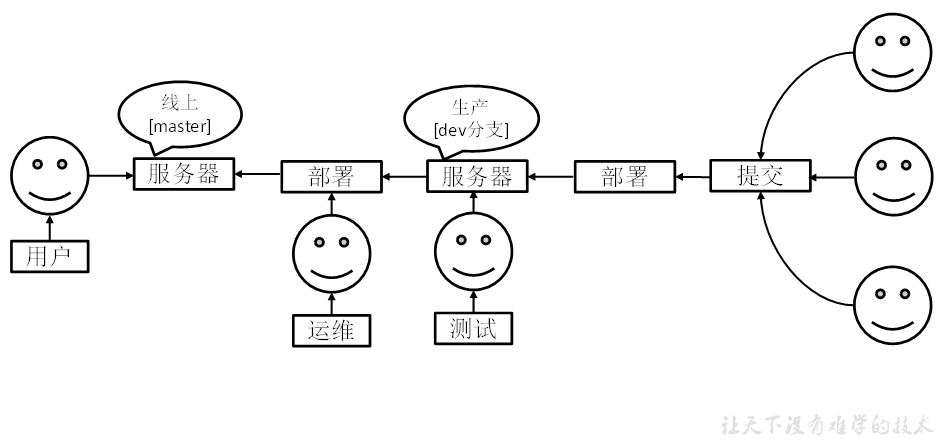
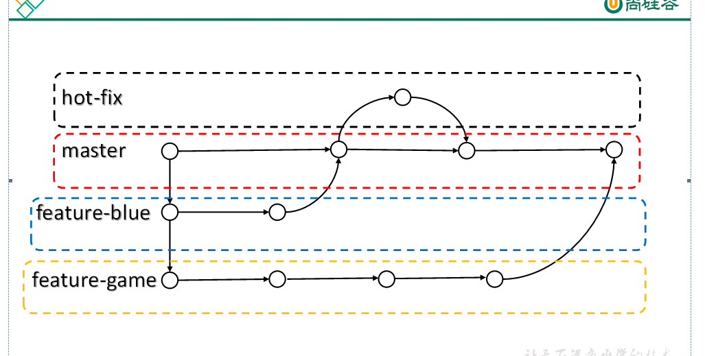
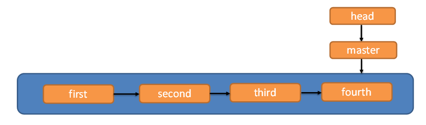

# 第四章 Git分支操作

## 4.1 什么是分支

在版本控制过程中，同时推进多个任务，为每个任务，我们就可以创建每个任务的单独分支。使用分支意味着程序员可以把自己的工作从开发主线上分离开来，开发自己分支的时候，不会影响主线分支的运行。对于初学者而言，分支可以简单理解为副本，一个分支就是一个单独的副本。（分支底层其实也是指针的引用）

## 4.2 分支的好处

同时并行推进多个功能开发，提高开发效率。

各个分支在开发过程中，如果某一个分支开发失败，不会对其他分支有任何影响。失败的分支删除重新开始即可。

## 4.3 分支的操作

| **命令名称**              | **作用**              |
| --------------------- | ------------------- |
| git branch 分支名&#xA;   | 创建分支&#xA;           |
| git branch -v&#xA;    | 查看分支&#xA;           |
| git checkout 分支名&#xA; | 切换分支&#xA;           |
| git merge 分支名&#xA;    | 把指定的分支合并到当前分支上&#xA; |

### 4.3.1 查看分支

**1）基本语法**

**git branch -v**

**2）案例实操**

Layne\@LAPTOP-Layne MINGW64 /d/Git-Space/SH0720 (master)

\$ **git branch -v**

-   master 087a1a7 my third commit  （\* 代表当前所在的分区）

### 4.3.2 创建分支

**1）基本语法**

**git branch 分支名**

**2）案例实操**

Layne\@LAPTOP-Layne MINGW64 /d/Git-Space/SH0720 (master)

\$  **git branch hot-fix**

Layne\@LAPTOP-Layne MINGW64 /d/Git-Space/SH0720 (master)

\$ **git branch -v**

&#x20; hot-fix 087a1a7 my third commit  （刚创建的新的分支，并将主分支master的内容复制了一份）

\* master  087a1a7 my third commit

### 4.3.3 修改分支

\--在maste分支上做修改

Layne\@LAPTOP-Layne MINGW64 /d/Git-Space/SH0720 (master)

\$ **vim hello.txt**

\--添加暂存区

Layne\@LAPTOP-Layne MINGW64 /d/Git-Space/SH0720 (master)

\$ **git add hello.txt**

\--提交本地库

Layne\@LAPTOP-Layne MINGW64 /d/Git-Space/SH0720 (master)

\$ **git commit -m "my forth commit" hello.txt**

\[master f363b4c] my forth commit

&#x20;1 file changed, 1 insertion(+), 1 deletion(-)

\--查看分支

Layne\@LAPTOP-Layne MINGW64 /d/Git-Space/SH0720 (master)

\$ **git branch -v**

&#x20; hot-fix 087a1a7 my third commit  （hot-fix分支并未做任何改变）

\* master  f363b4c my forth commit （当前master分支已更新为最新一次提交的版本）

\--查看master分支上的文件内容

Layne\@LAPTOP-Layne MINGW64 /d/Git-Space/SH0720 (master)

\$ cat hello.txt

hello git! hello atguigu! 2222222222222

hello git! hello atguigu! 3333333333333

hello git! hello atguigu!

hello git! hello atguigu!

hello git! hello atguigu!

hello git! hello atguigu!

hello git! hello atguigu!

hello git! hello atguigu!

hello git! hello atguigu!

hello git! hello atguigu!

hello git! hello atguigu!

hello git! hello atguigu!

hello git! hello atguigu!

hello git! hello atguigu!

hello git! hello atguigu! master test

hello git! hello atguigu!

### 4.3.4 切换分支

**1）基本语法**

**git checkout 分支名**

**2）案例实操**

Layne\@LAPTOP-Layne MINGW64 /d/Git-Space/SH0720 **(master)**

\$ **git checkout hot-fix**

Switched to branch 'hot-fix'

\--发现当先分支已由master改为hot-fix

Layne\@LAPTOP-Layne MINGW64 /d/Git-Space/SH0720 **(hot-fix)**

\$

\--查看hot-fix分支上的文件内容发现与master分支上的内容不同

Layne\@LAPTOP-Layne MINGW64 /d/Git-Space/SH0720 **(hot-fix)**

\$ cat hello.txt

hello git! hello atguigu! 2222222222222

hello git! hello atguigu! 3333333333333

hello git! hello atguigu!

hello git! hello atguigu!

hello git! hello atguigu!

hello git! hello atguigu!

hello git! hello atguigu!

hello git! hello atguigu!

hello git! hello atguigu!

hello git! hello atguigu!

hello git! hello atguigu!

hello git! hello atguigu!

hello git! hello atguigu!

hello git! hello atguigu!

hello git! hello atguigu!

hello git! hello atguigu!

\--在hot-fix分支上做修改

Layne\@LAPTOP-Layne MINGW64 /d/Git-Space/SH0720 **(hot-fix)**

\$ cat hello.txt

hello git! hello atguigu! 2222222222222

hello git! hello atguigu! 3333333333333

hello git! hello atguigu!

hello git! hello atguigu!

hello git! hello atguigu!

hello git! hello atguigu!

hello git! hello atguigu!

hello git! hello atguigu!

hello git! hello atguigu!

hello git! hello atguigu!

hello git! hello atguigu!

hello git! hello atguigu!

hello git! hello atguigu!

hello git! hello atguigu!

hello git! hello atguigu!

hello git! hello atguigu! hot-fix test

\--添加暂存区

Layne\@LAPTOP-Layne MINGW64 /d/Git-Space/SH0720 **(hot-fix)**

\$ **git add hello.txt**

\--提交本地库

Layne\@LAPTOP-Layne MINGW64 /d/Git-Space/SH0720 **(hot-fix)**

\$ **git commit -m "hot-fix commit" hello.txt**

### 4.3.5 合并分支

**1）基本语法**

**git merge 分支名**

**2）案例实操 在master分支上合并hot-fix分支**

Layne\@LAPTOP-Layne MINGW64 /d/Git-Space/SH0720 (master)

\$ **git merge hot-fix**

Auto-merging hello.txt

CONFLICT (content): Merge conflict in hello.txt

Automatic merge failed; fix conflicts and then commit the result.

### 4.3.6 产生冲突

冲突产生的表现：后面状态为MERGING

Layne\@LAPTOP-Layne MINGW64 /d/Git-Space/SH0720 (master|MERGING)

\$ cat hello.txt

hello git! hello atguigu! 2222222222222

hello git! hello atguigu! 3333333333333

hello git! hello atguigu!

hello git! hello atguigu!

hello git! hello atguigu!

hello git! hello atguigu!

hello git! hello atguigu!

hello git! hello atguigu!

hello git! hello atguigu!

hello git! hello atguigu!

hello git! hello atguigu!

hello git! hello atguigu!

hello git! hello atguigu!

hello git! hello atguigu!

<<<<<<< HEAD

hello git! hello atguigu! master test

hello git! hello atguigu!

\=======

hello git! hello atguigu!

hello git! hello atguigu! hot-fix test

\>>>>>>> hot-fix

冲突产生的原因：

合并分支时，两个分支在**同一个文件的同一个位置**有两套完全不同的修改。Git无法替我们决定使用哪一个。必须**人为决定**新代码内容。

查看状态（检测到有文件有两处修改）

Layne\@LAPTOP-Layne MINGW64 /d/Git-Space/SH0720 (master|MERGING)

\$ **git status**

On branch master

You have unmerged paths.

&#x20; (fix conflicts and run "git commit")

&#x20; (use "git merge --abort" to abort the merge)

Unmerged paths:

&#x20; (use "git add \<file>..." to mark resolution)

&#x20;       both modified:   hello.txt

no changes added to commit (use "git add" and/or "git commit -a")

### 4.3.7 解决冲突

1）编辑有冲突的文件，删除特殊符号，决定要使用的内容

特殊符号：<<<<<<< HEAD 当前分支的代码 =======  合并过来的代码  >>>>>>> hot-fix

hello git! hello atguigu! 2222222222222

hello git! hello atguigu! 3333333333333

hello git! hello atguigu!

hello git! hello atguigu!

hello git! hello atguigu!

hello git! hello atguigu!

hello git! hello atguigu!

hello git! hello atguigu!

hello git! hello atguigu!

hello git! hello atguigu!

hello git! hello atguigu!

hello git! hello atguigu!

hello git! hello atguigu!

hello git! hello atguigu!

hello git! hello atguigu! master test

hello git! hello atguigu! hot-fix test

2）添加到暂存区

Layne\@LAPTOP-Layne MINGW64 /d/Git-Space/SH0720 (master|MERGING)

\$\*\* git add hello.txt\*\*

3）执行提交（注意：此时使用git commit命令时**不能带文件名**）

Layne\@LAPTOP-Layne MINGW64 /d/Git-Space/SH0720 (master|MERGING)

\$ **git commit -m "merge hot-fix"**

\[master 69ff88d] merge hot-fix

\--发现后面MERGING消失，变为正常

Layne\@LAPTOP-Layne MINGW64 /d/Git-Space/SH0720 (master)

\$

## 4.4 创建分支和切换分支图解

master、hot-fix其实都是指向具体版本记录的指针。当前所在的分支，其实是由HEAD决定的。所以创建分支的本质就是多创建一个指针。

HEAD如果指向master，那么我们现在就在master分支上，HEAD如果执行hotfix，那么我们现在就在hotfix分支上。

所以切换分支的本质就是移动HEAD指针。

