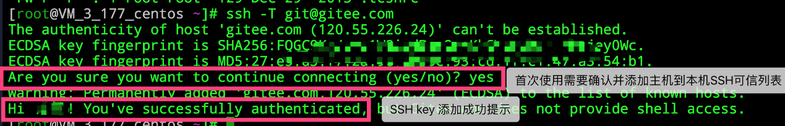

# 第五章 Gitee（码云）操作&#x20;

## 5.1 Git代码托管服务

前面我们已经知道了Git中存在两种类型的仓库，即**本地仓库**和**远程仓库**。那么我们如何搭建Git远程仓库呢？我们可以借助互联网上提供的一些代码托管服务来实现，其中比较常用的有GitHub、码云、GitLab等。

-   gitHub（ 地址：[https://github.com/](https://github.com/ "https://github.com/") ）

是一个面向开源及私有软件项目的托管平台，因为只支持Git 作为唯一的版本库格式进行托管，故名gitHub

-   码云（地址： [https://gitee.com/](https://gitee.com/ "https://gitee.com/") ）

是**国内**的一个代码托管平台，由于服务器在国内，所以相比于GitHub，码云速度会更快

-   GitLab （地址： [https://about.gitlab.com/](https://about.gitlab.com/ "https://about.gitlab.com/") ）

是一个用于仓库管理系统的开源项目，使用Git作为代码管理工具，并在此基础上搭建起来的web服务

## 5.2 Gitee简介

1.是什么： gitee是一个git项目托管网站，主要提供基于git的版本托管服务

2.能干嘛： gitee是一个基于git的代码托管平台， Git 并不像 SVN 那样有个中心服务器。目前我们使用到的 Git 命令都是在本地执行，如果你想通过 Git 分享你的代码或者与其他开发人员合作。 你就需要将数据放到一台其他开发人员能够连接的服务器上。

3.去哪下： [https://gitee.com/](https://gitee.com/ "https://gitee.com/")&#x20;

4.怎么玩：见课堂演示

前面执行的命令操作都是针对的本地仓库，本章节我们会学习关于远程仓库的一些操作，具体包括：

-   查看远程仓库
-   添加远程仓库
-   从远程仓库克隆
-   移除无效的远程仓库
-   从远程仓库中抓取与拉取
-   推送到远程仓库

## 5.3 码云帐号注册和登录

进入码云官网地址：[https://gitee.com/](https://gitee.com/ "https://gitee.com/")，点击注册Gitee

&#x9;输入个人信息，进行注册即可。

&#x9;帐号注册成功以后，直接登录。

&#x9;登录以后，就可以看到码云官网首页了。

## 5.4 创建远程仓库

## 5.5 远程仓库操作

| **命令名称**                    | **作用**                            |
| --------------------------- | --------------------------------- |
| git remote -v&#xA;          | 查看当前所有远程地址别名&#xA;                 |
| git remote add 别名 远程地址&#xA; | 起别名&#xA;                          |
| git push 别名 分支&#xA;         | 推送本地分支上的内容到远程仓库&#xA;              |
| git clone 远程地址&#xA;         | 将远程仓库的内容克隆到本地&#xA;                |
| git pull 远程库地址别名 远程分支名&#xA; | 将远程仓库对于分支最新内容拉下来后与当前本地分支直接合并&#xA; |

### 5.5.1 创建远程仓库别名

**1）基本语法**

**git remote -v 查看当前所有远程地址别名**

**git remote add 别名 远程地址**

**2）案例实操**

Layne\@LAPTOP-Layne MINGW64 /d/Git-Space/SH0720 (master)

\$ **git remote -v**

Layne\@LAPTOP-Layne MINGW64 /d/Git-Space/SH0720 (master)

\$ **git remote add ori <https://gitee.com/boncda/git-test.git>**

Layne\@LAPTOP-Layne MINGW64 /d/Git-Space/SH0720 (master)

\$ **git remote -v**

ori     <https://gitee.com/boncda/git-test.git> (fetch)

ori     <https://gitee.com/boncda/git-test.git> (push)

**<https://github.com/atguiguyueyue/git-shTest.git>**

**这个地址在创建完远程仓库后生成的连接，如图所示红框中**

### 5.4.2 推送本地分支到远程仓库

**1）基本语法**

**git push 别名 分支**

**2）案例实操**

Layne\@LAPTOP-Layne MINGW64 /d/Git-Space/SH0720 (master)

\$ **git push ori master**

Enumerating objects: 12, done.

Counting objects: 100% (12/12), done.

Delta compression using up to 16 threads

Compressing objects: 100% (4/4), done.

Writing objects: 100% (12/12), 872 bytes | 109.00 KiB/s, done.

Total 12 (delta 1), reused 0 (delta 0), pack-reused 0

remote: Powered by GITEE.COM \[GNK-6.3]

To <https://gitee.com/boncda/git-test.git>

&#x20;\* \[new branch]      master -> master

需要输入码云的用户名和密码

此时发现已将我们master分支上的内容推送到Gitee创建的远程仓库。

### 5.4.3 克隆远程仓库到本地

**1）基本语法**

**git clone 远程地址**

**2）案例实操**

**创建新文件夹，执行**

Layne\@LAPTOP-Layne MINGW64 /d/Git-Space/pro-linghuchong

\$\*\* git clone <https://gitee.com/boncda/git-test.git**>

Cloning into 'git-test'...

remote: Enumerating objects: 12, done.

remote: Counting objects: 100% (12/12), done.

remote: Compressing objects: 100% (4/4), done.

remote: Total 12 (delta 1), reused 0 (delta 0), pack-reused 0

Receiving objects: 100% (12/12), done.

Resolving deltas: 100% (1/1), done.

这个地址为远程仓库地址，克隆结果：初始化本地仓库

进入git-test执行

小结：clone会做如下操作。1、拉取代码。2、初始化本地仓库。3、创建别名

### 5.4.4 邀请加入团队

**（1）点击管理**

（2）选择 仓库成员管理

（3）选择邀请用户

（4）有多种方式可以添加

下面演示直接添加

直接输入用户名称添加

指定权限，提交

（5）测试功能

第一，使用atguiguwz登录码云，修改文件

第二 atguiguwz提交文件

第三 使用另外用户登录，发现文件已经更新

第四 本地使用pull命令查看

### 5.4.5 拉取远程库内容

**1）基本语法**

**git pull 远程库地址别名 远程分支名**

**2）案例实操**

\--将远程仓库对于分支最新内容拉下来后与当前本地分支直接合并

Layne\@LAPTOP-Layne MINGW64 /d/Git-Space/SH0720 (master)

\$ **git pull ori master**

remote: Enumerating objects: 5, done.

remote: Counting objects: 100% (5/5), done.

remote: Compressing objects: 100% (1/1), done.

remote: Total 3 (delta 1), reused 3 (delta 1), pack-reused 0

Unpacking objects: 100% (3/3), done.

From <https://github.com/atguiguyueyue/git-shTest>

&#x20;\* branch            master     -> FETCH\_HEAD

&#x20;  7cb4d02..5dabe6b  master     -> ori/master

Updating 7cb4d02..5dabe6b

Fast-forward

&#x20;hello.txt | 2 +-

&#x20;1 file changed, 1 insertion(+), 1 deletion(-)

Layne\@LAPTOP-Layne MINGW64 /d/Git-Space/SH0720 (master)

\$ cat hello.txt

hello git! hello atguigu! 2222222222222

hello git! hello atguigu! 33333333333333

hello git! hello atguigu!

hello git! hello atguigu!

hello git! hello atguigu! 我是最帅的，比岳不群还帅

hello git! hello atguigu!

hello git! hello atguigu!

hello git! hello atguigu!

hello git! hello atguigu!

hello git! hello atguigu!

hello git! hello atguigu!

hello git! hello atguigu!

hello git! hello atguigu!

hello git! hello atguigu!

hello git! hello atguigu! master test

hello git! hello atguigu! hot-fix test

## 5.5 SSH免密登录

我们可以看到远程仓库中还有一个SSH的地址，因此我们也可以使用SSH进行访问。

你可以按如下命令来生成 sshkey:

ssh-keygen -t ed25519 -C "<xxxxx@xxxxx.com>" &#x20;

\# Generating public/private ed25519 key pair...

注意：这里的 <xxxxx@xxxxx.com> 只是生成的 sshkey 的名称，并不约束或要求具体命名为某个邮箱。
现网的大部分教程均讲解的使用邮箱生成，其一开始的初衷仅仅是为了便于辨识所以使用了邮箱。

按照提示完成三次回车，即可生成 ssh key。通过查看 \~/.ssh/id\_ed25519.pub 文件内容，获取到你的 public key

cat \~/.ssh/id\_ed25519.pub

\# ssh-ed25519 AAAAB3NzaC1yc2EAAAADAQABAAABAQC6eNtGpNGwstc....

复制生成后的 ssh key，通过仓库主页 **「管理」->「部署公钥管理」->「添加部署公钥」** ，添加生成的 public key 添加到仓库中。

添加后，在终端（Terminal）中输入

ssh -T <git@gitee.com>

首次使用需要确认并添加主机到本机SSH可信列表。若返回 Hi XXX! You've successfully authenticated, but Gitee.com does not provide shell access. 内容，则证明添加成功。

添加成功后，就可以使用SSH协议对仓库进行操作了。

