# 第六章 IDEA集成Git （本地库）

## 6.1 配置Git忽略文件

**1）Eclipse特定文件**

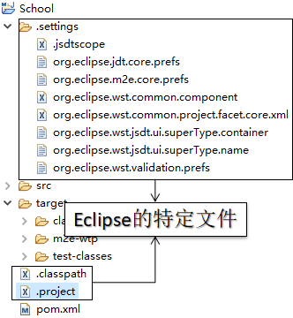

**2）IDEA特定文件**

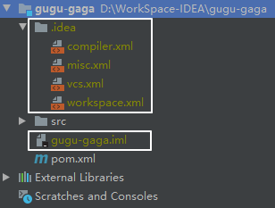

**3）Maven工程的target目录**

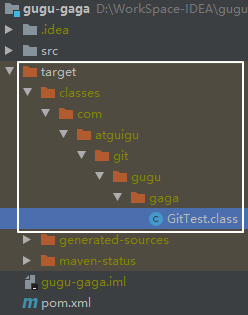

**问题1:为什么要忽略他们？**

答：与项目的实际功能无关，不参与服务器上部署运行。把它们忽略掉能够屏蔽IDE工具之间的差异。

**问题2：怎么忽略？**

1）创建忽略规则文件xxxx.ignore（前缀名随便起，建议是git.ignore）

这个文件的存放位置原则上在哪里都可以，为了便于让\~/.gitconfig文件引用，建议也放在用户家目录下

git.ignore文件模版内容如下：

\# Compiled class file

\*.class

\# Log file

\*.log

\# BlueJ files

\*.ctxt

\# Mobile Tools for Java (J2ME)

.mtj.tmp/

\# Package Files #

\*.jar

\*.war

\*.nar

\*.ear

\*.zip

\*.tar.gz

\*.rar

\# virtual machine crash logs, see <http://www.java.com/en/download/help/error_hotspot.xml>

hs\_err\_pid\*

.classpath

.project

.settings

target

.idea

\*.iml

2）在.gitconfig文件中引用忽略配置文件（此文件在Windows的家目录中）

\[user]

&#x9;name = Layne

&#x9;email = <Layne@atguigu.com>

\[core]

&#x9;excludesfile = C:/Users/asus/git.ignore

注意：这里要使用“正斜线（/）”，不要使用“反斜线（\）”

## 6.2 定位Git程序

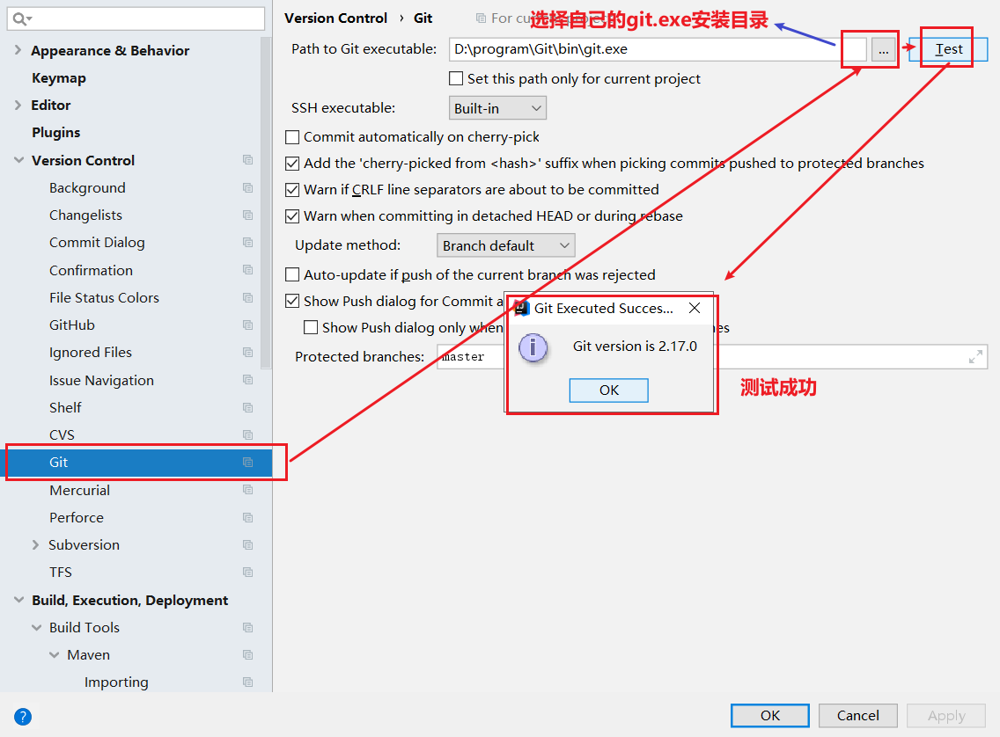

## 6.3 初始化本地库

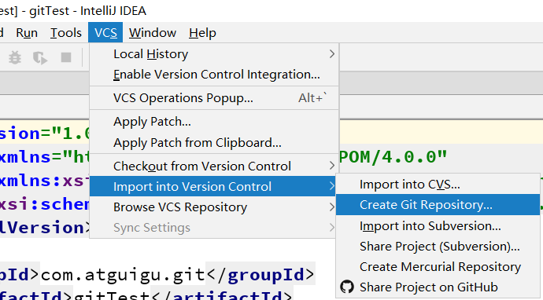

选择要创建Git本地仓库的工程。

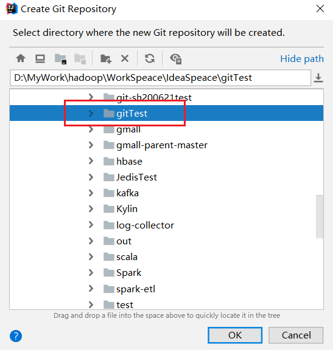

## 6.4 添加到暂存区

右键点击项目选择Git -> Add将项目添加到暂存区。

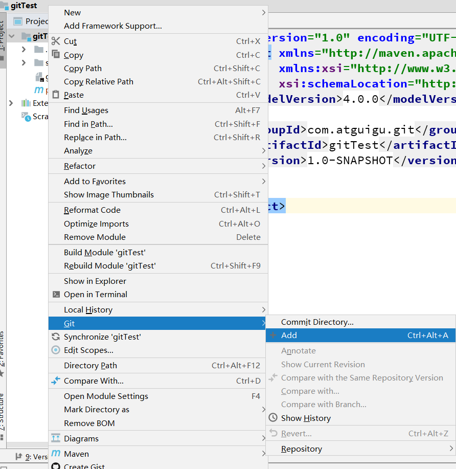

## 6.5 提交到本地库

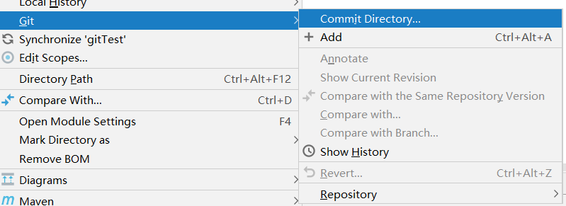

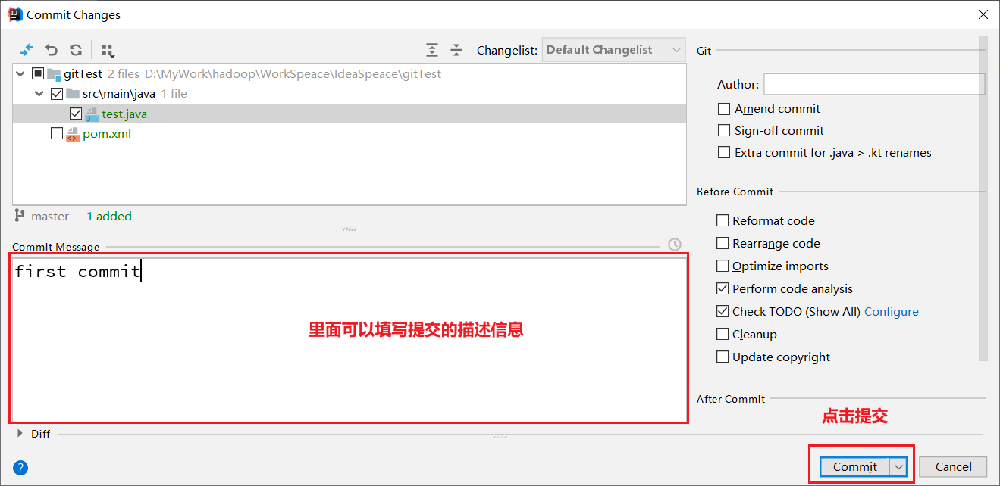

## 6.6 切换版本

在IDEA的左下角，点击Version Control，然后点击Log查看版本

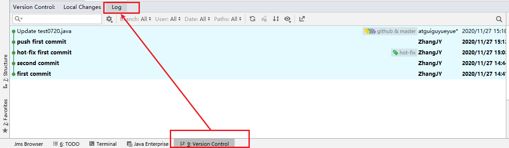

右键选择要切换的版本，然后在菜单里点击Checkout Revision。

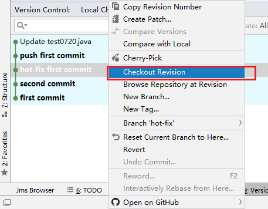

## 6.7 创建分支

选择Git，在Repository里面，点击Branches按钮。

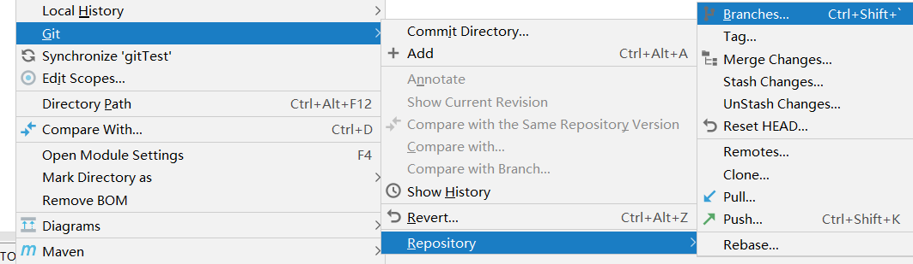

在弹出的Git Branches框里，点击New Branch按钮。

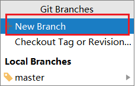

填写分支名称，创建hot-fix分支。

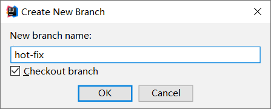

&#x9;然后再IDEA的右下角看到hot-fix，说明分支创建成功，并且当前已经切换成hot-fix分支

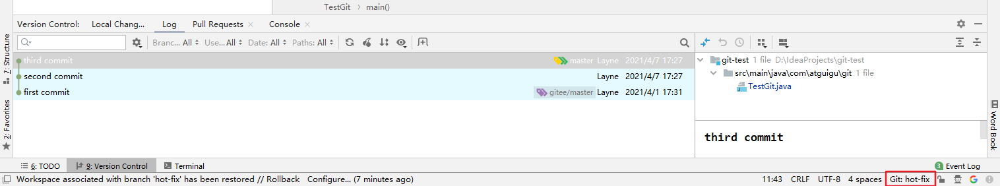

## 6.8 切换分支

在IDEA窗口的右下角，切换到master分支。

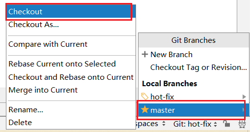

然后在IDEA窗口的右下角看到了master，说明master分支切换成功。

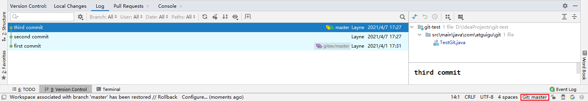

## 6.9 合并分支

在IDEA窗口的右下角，将hot-fix分支合并到当前master分支。

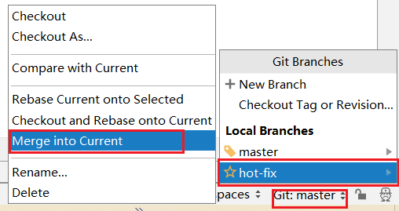

如果代码没有冲突，分支直接合并成功，分支合并成功以后，代码自动提交，无需手动提交本地库。

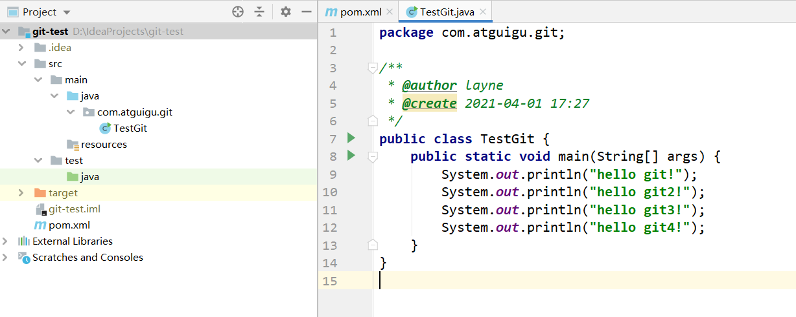

## 6.10 解决冲突

如图所示，如果master分支和hot-fix分支都修改了代码，在合并分支的时候就会发生冲突。

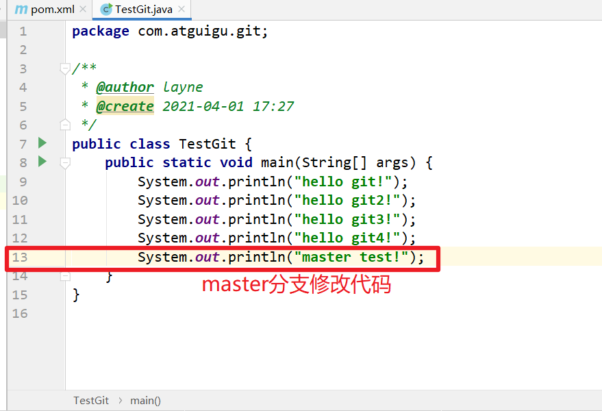

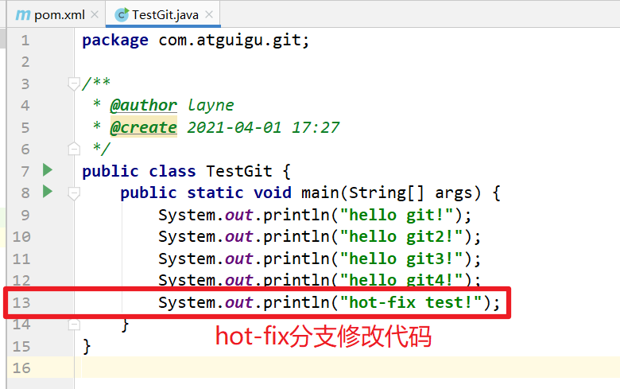

我们现在站在master分支上合并hot-fix分支，就会发生代码冲突。

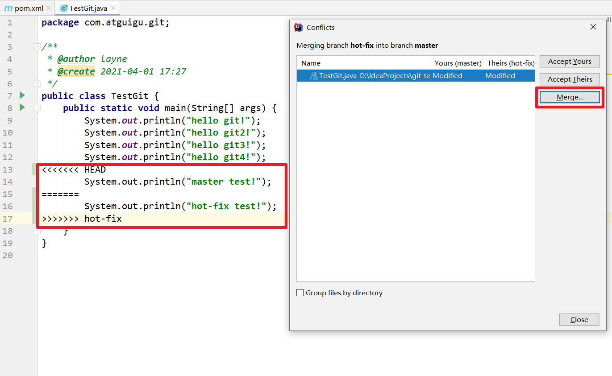

&#x9;点击Conflicts框里的Merge按钮，进行手动合并代码。

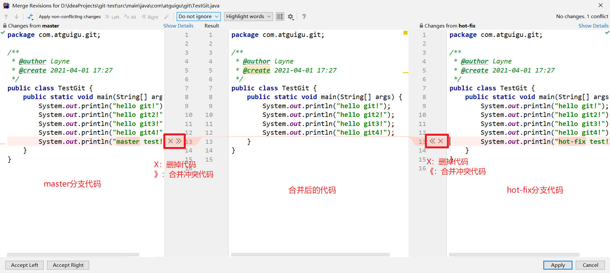

&#x9;手动合并完代码以后，点击右下角的Apply按钮。

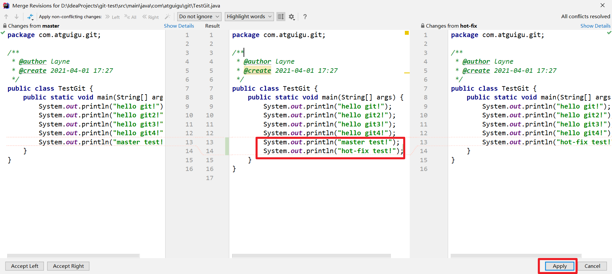

代码冲突解决，自动提交本地库。

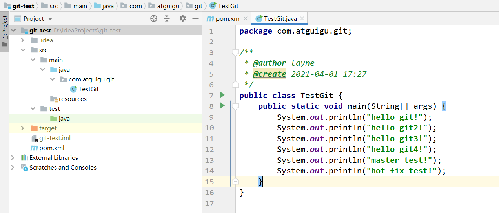

