# 第七章 IDEA集成Gitee（码云）&#x20;

## 7.1 IDEA集成码云

### 7.1.1 IDEA安装码云插件

Idea默认不带码云插件，我们第一步要安装Gitee插件。

如图所示，在Idea插件商店搜索Gitee，然后点击右侧的Install按钮。

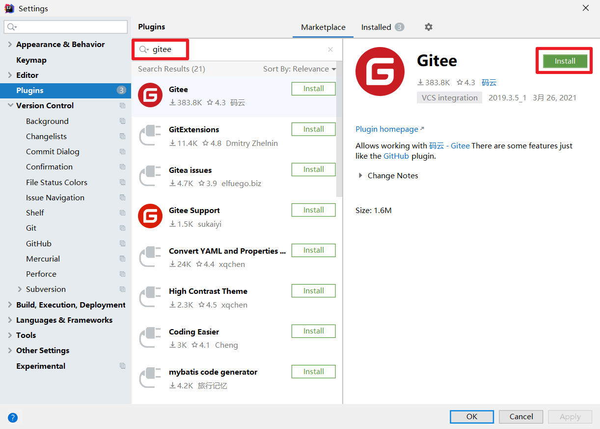

Idea链接码云和链接GitHub几乎一样，安装成功后，重启Idea。

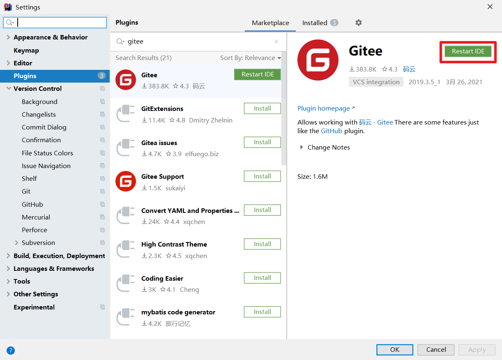

&#x20;

&#x9;Idea重启以后在Version Control设置里面看到Gitee，说明码云插件安装成功。

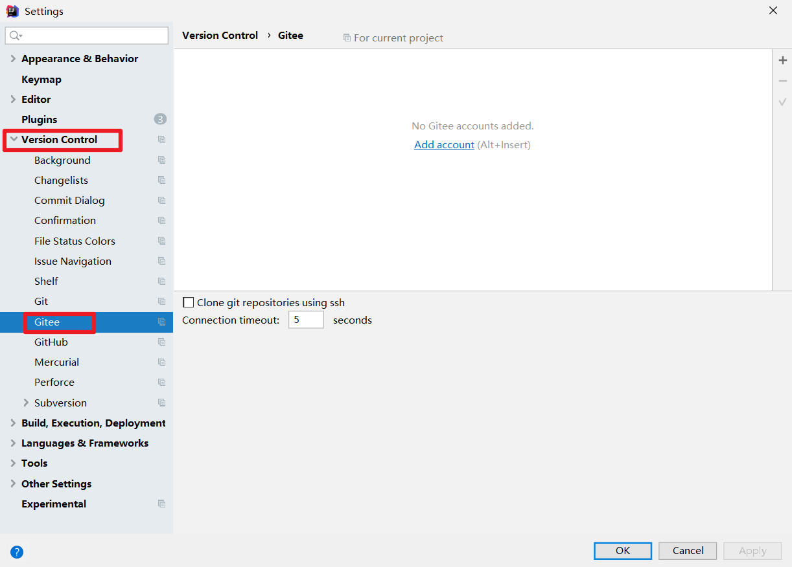

&#x9;然后在码云插件里面添加码云帐号，我们就可以用Idea连接码云了。

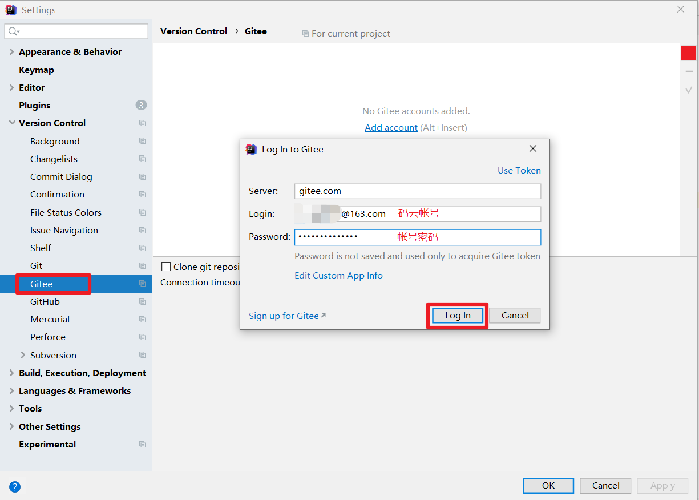

### 7.1.2 push推送本地库到远程库

Idea连接码云和连接GitHub几乎一样，首先在Idea里面创建一个工程，初始化git工程，然后将代码添加到暂存区，提交到本地库，这些步骤上面已经讲过，此处不再赘述。

-   **将本地代码push到码云远程库**

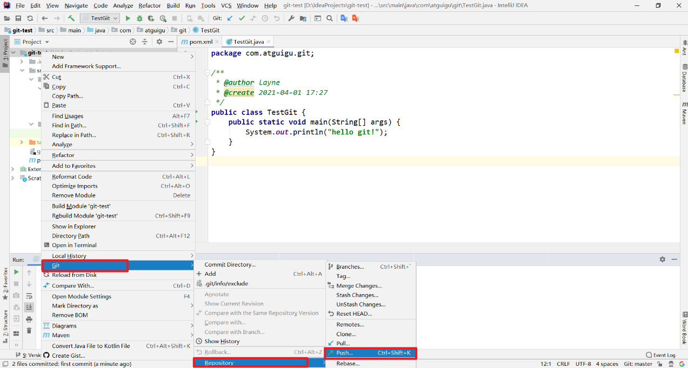

自定义远程库链接。

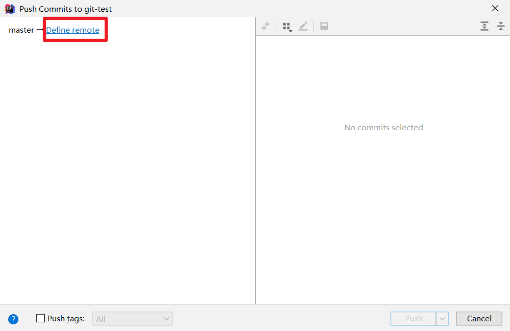

给远程库链接定义个name，然后再URL里面填入码云远程库的HTTPS链接即可。码云服务器在国内，用HTTPS链接即可，没必要用SSH免密链接。

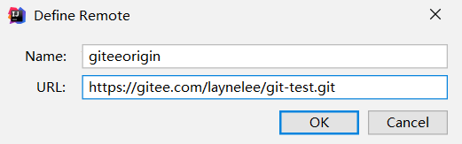

然后选择定义好的远程链接，点击Push即可。

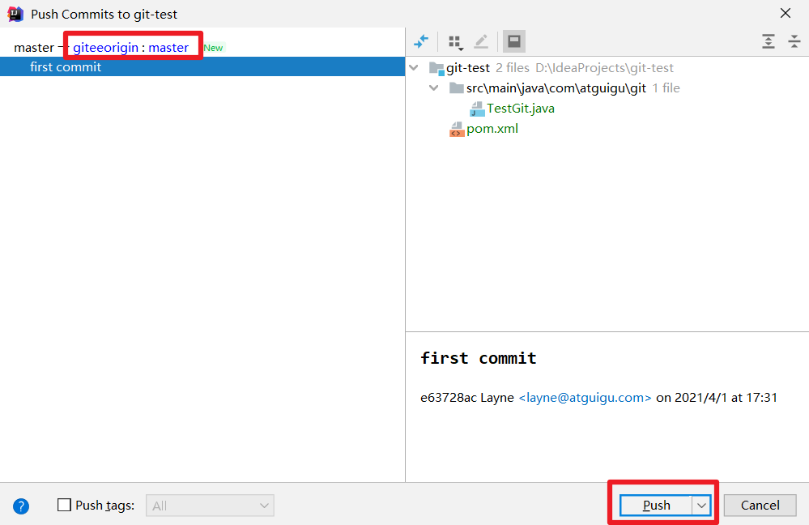

看到提示就说明Push远程库成功。

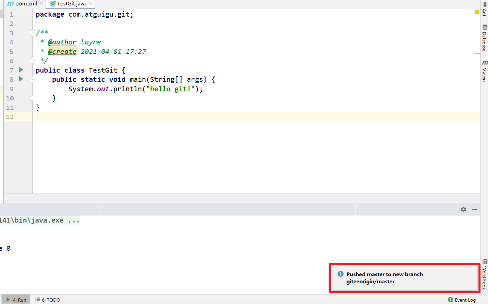

去码云远程库查看代码。

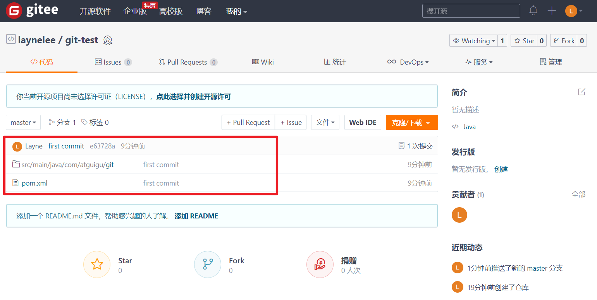

只要码云远程库链接定义好以后，对码云远程库进行pull和clone的操作和GitHub相同

### 7.1.3 pull拉取远程库到本地库

右键点击项目，可以将远程仓库的内容pull到本地仓库。

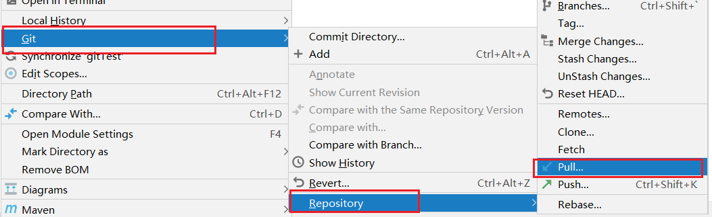

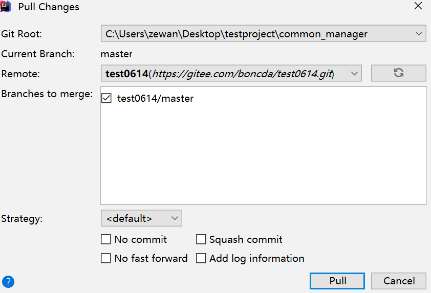

注意：pull是拉取远端仓库代码到本地，如果远程库代码和本地库代码不一致，会自动合并，如果自动合并失败，还会涉及到手动解决冲突的问题。&#x20;

### 7.1.4 clone克隆远程库到本地

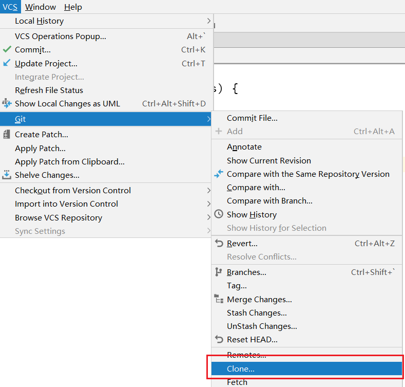

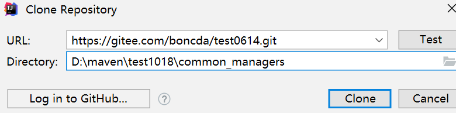

为clone下来的项目创建一个工程，然后点击Next。

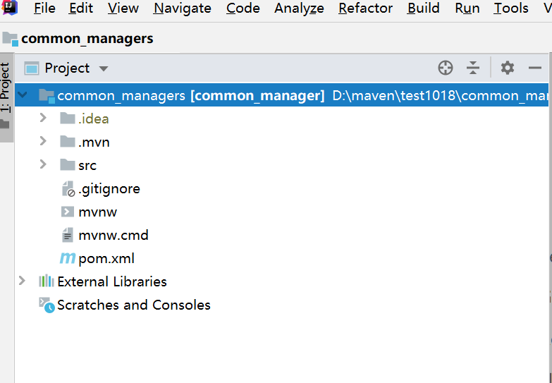

## 7.5 码云复制GitHub项目

码云提供了直接复制GitHub项目的功能，方便我们做项目的迁移和下载。

具体操作如下：

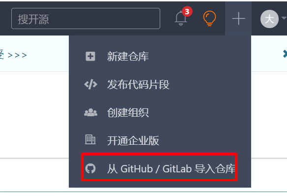

&#x9;将GitHub的远程库HTTPS链接复制过来，点击导入按钮即可。

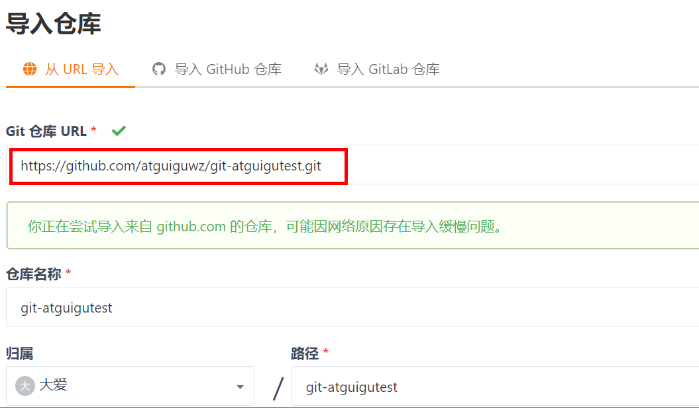

如果GitHub项目更新了以后，在码云项目端可以手动重新同步，进行更新！

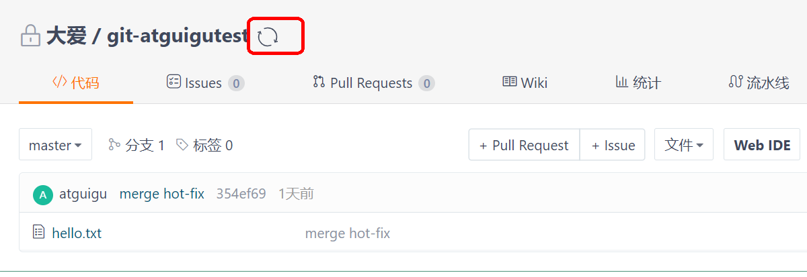

