# 第八章 IDEA集成GitHub

## 8.1 设置GitHub账号

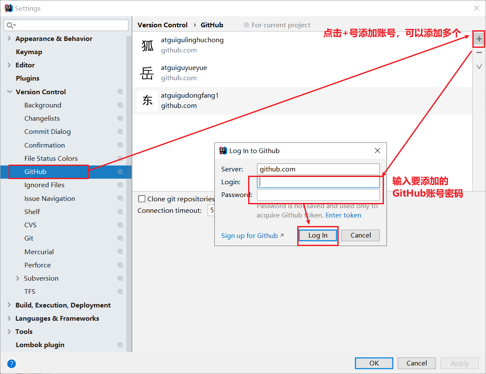

如果出现401等情况连接不上的，是因为网络原因，可以使用以下方式连接：

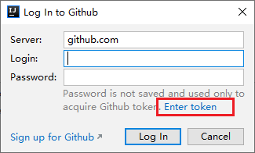

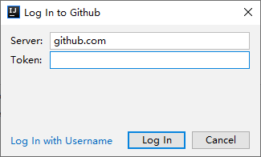

然后去GitHub账户上设置token。

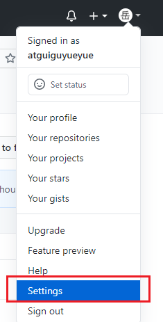

&#x20;         &#x20;

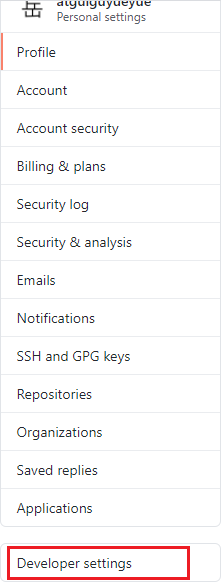

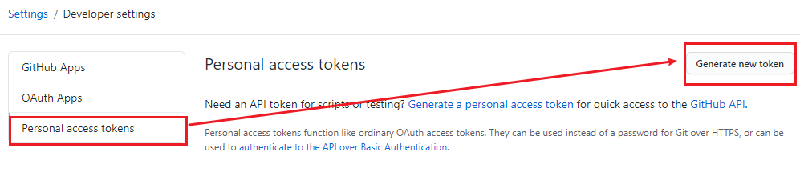

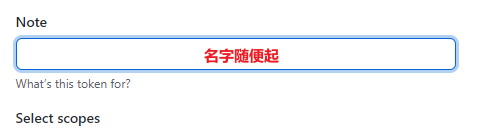

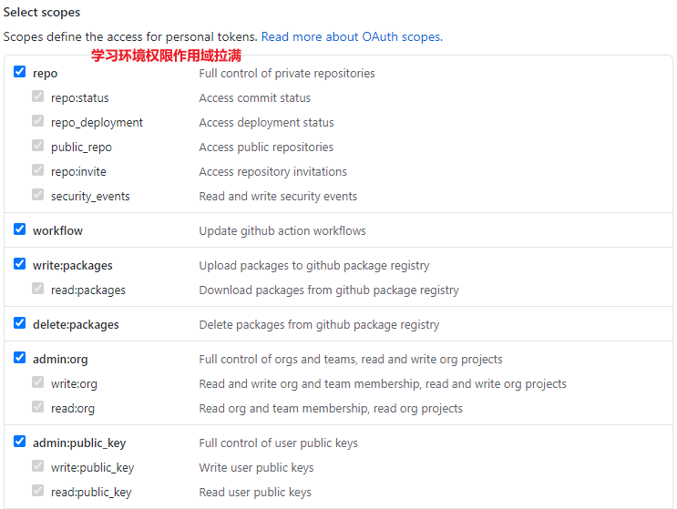

点击生成token。

复制红框中的字符串到idea中。

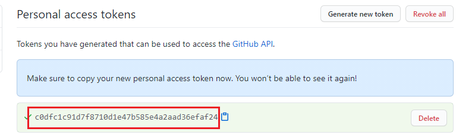

点击登录。

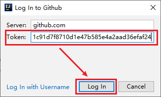

## 8.2 分享工程到GitHub

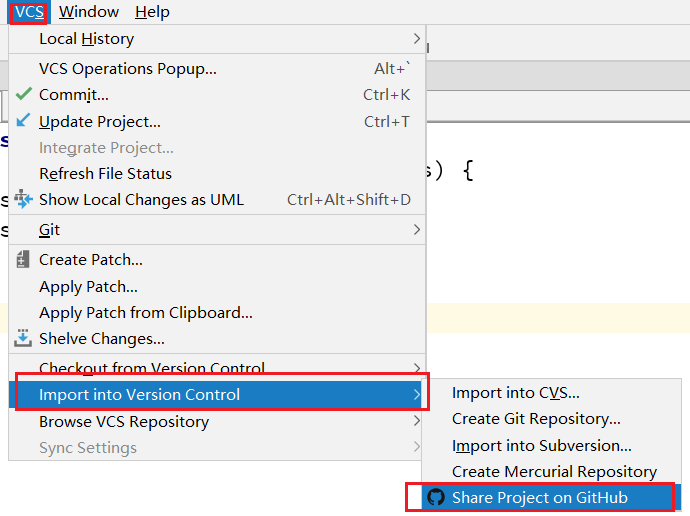

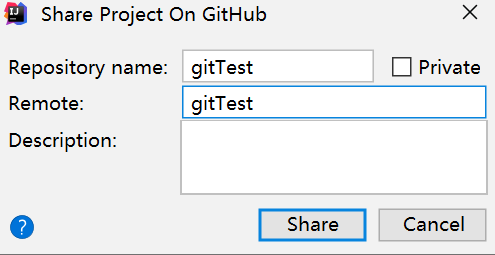

来到GitHub中发现已经帮我们创建好了gitTest的远程仓库。

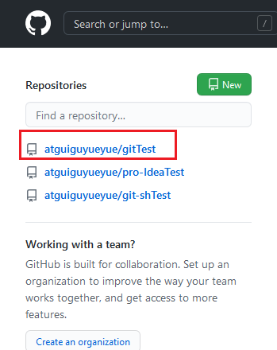

## 8.3 push推送本地库到远程库

右键点击项目，可以将当前分支的内容push到GitHub的远程仓库中。

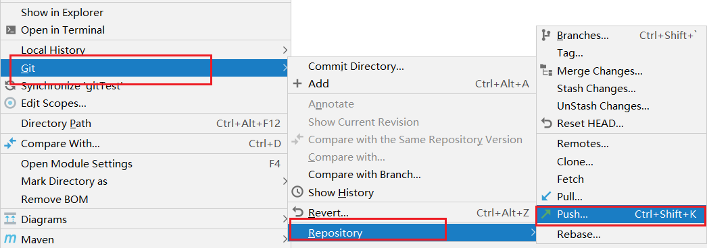

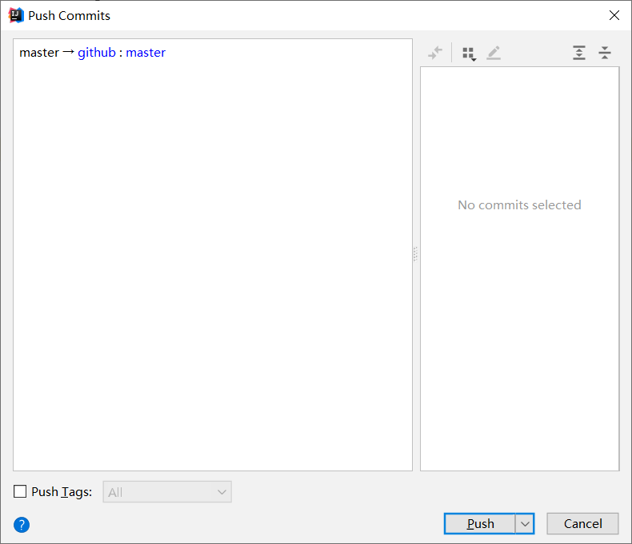

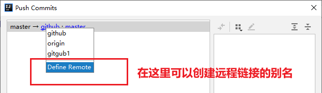

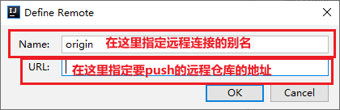

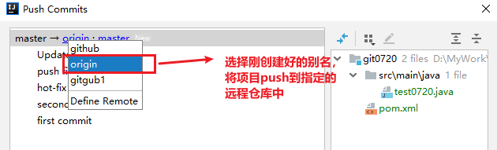

注意：push是将本地库代码推送到远程库，如果本地库代码跟远程库代码版本不一致，push的操作是会被拒绝的。也就是说，要想push成功，一定要保证本地库的版本要比远程库的版本高！因此一个成熟的程序员在动手改本地代码之前，一定会先检查下远程库跟本地代码的区别！如果本地的代码版本已经落后，切记要先pull拉取一下远程库的代码，将本地代码更新到最新以后，然后再修改，提交，推送！

## 8.4 pull拉取远程库到本地库

右键点击项目，可以将远程仓库的内容pull到本地仓库。

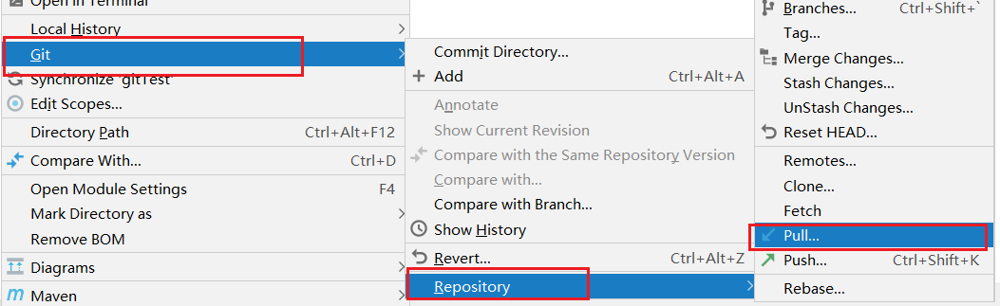

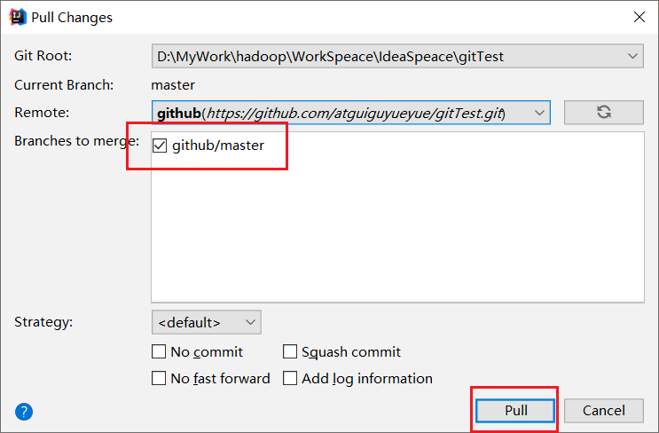

注意：pull是拉取远端仓库代码到本地，如果远程库代码和本地库代码不一致，会自动合并，如果自动合并失败，还会涉及到手动解决冲突的问题。&#x20;

## 8.5 clone克隆远程库到本地

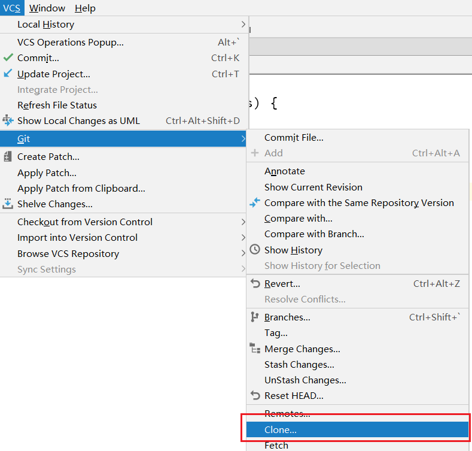

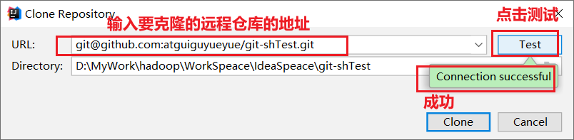

为clone下来的项目创建一个工程，然后点击Next。

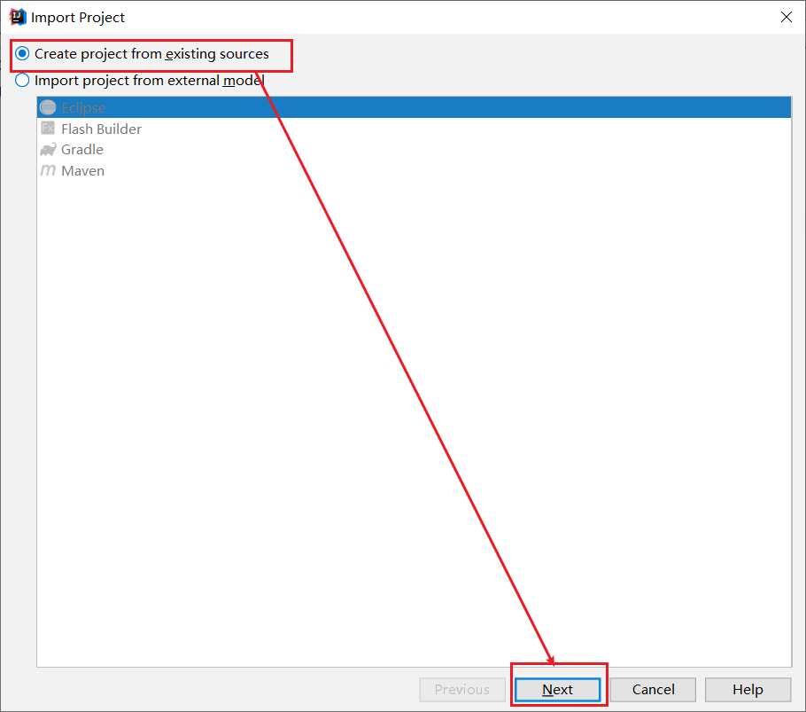

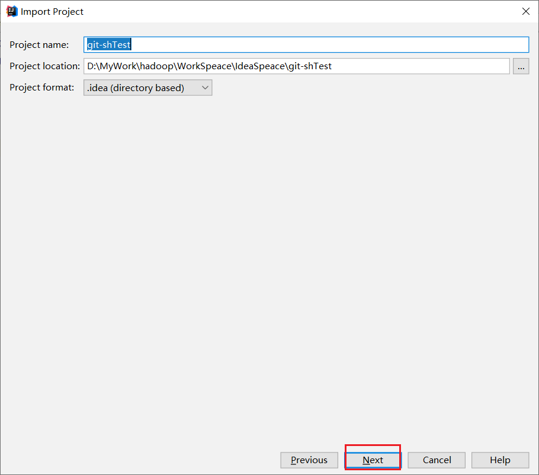

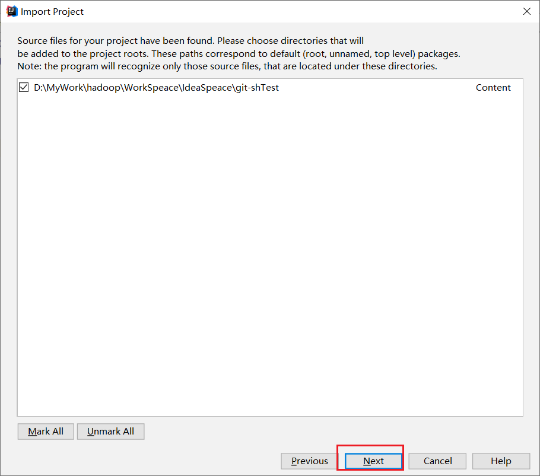

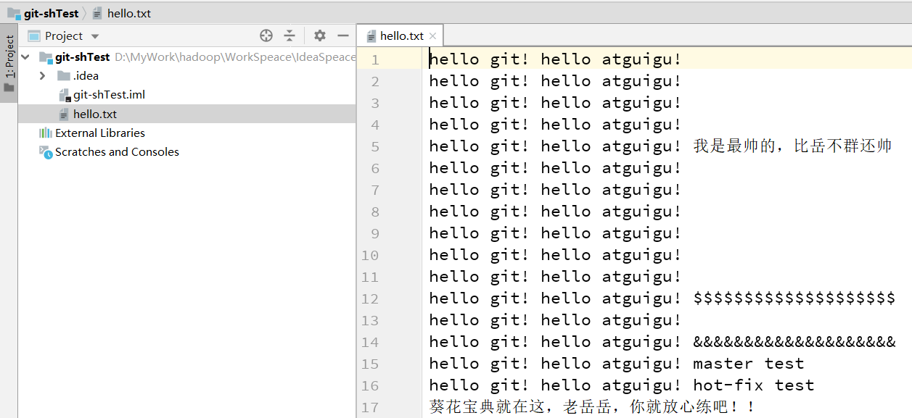

