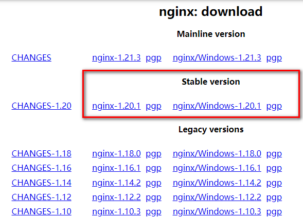
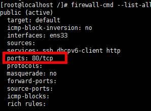
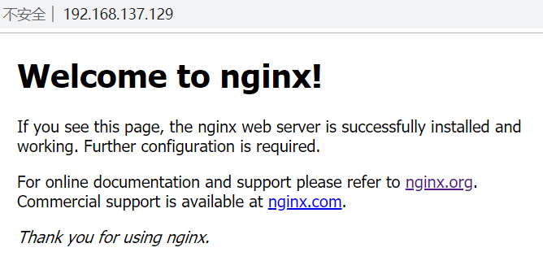

# 第二章 Nginx安装

## 2.1 下载http\://nginx.org/

## 2.2 安装包

pcre-8.37.tar.gz&#x20;

openssl-1.0.1t.tar.gz

zlib-1.2.8.tar.gz

nginx-1.20.1.tar.gz

## 2.3 在线安装

### 第一步，安装pcre

第一步 联网下载pcre&#x20;

wget [http://downloads.sourceforge.net/project/pcre/pcre/8.37/pcre-8.37.tar.gz](http://downloads.sourceforge.net/project/pcre/pcre/8.37/pcre-8.37.tar.gz "http://downloads.sourceforge.net/project/pcre/pcre/8.37/pcre-8.37.tar.gz")

第二步 解压压缩文件

使用命令 tar -zxvf pcre-8.37.tar.gz

第三步 ./configure完成后，回到pcre目录下执行make，最后执行make install

第四步  pcre-config --version  检查版本

### 第二步，安装openssl 、zlib 、 gcc 依赖

yum -y install make zlib zlib-devel gcc-c++ libtool  openssl openssl-devel

### 第三步，安装nginx

使用命令解压&#x20;

./configure

make && make install

进入目录 /usr/local/nginx/sbin   执行./nginx 启动服务

### 第四步，关闭防火墙，访问nginx

在windows系统中访问linux中nginx，默认不能访问的，因为防火墙问题

关闭防火墙-开放访问的端口号，**80**端口

查看开放的端口号

firewall-cmd --list-all

设置开放的服务或端口号

firewall-cmd --add-service=http --permanent

firewall-cmd --add-port=80/tcp --permanent

重启防火墙

firewall-cmd --reload

 

## 2.4 离线安装

### 第一步 安装pcre

解压缩pcre-xx.tar.gz包

进入解压缩目录，执行./configure

注意：如果提示错误，需要提前安装gcc++

| 执行  cd  /run/media/root/CentOS 7 x86\_64/Packages（已经从中拷贝出来了**26个**安装包，直接使用准备好的文件夹rpmgcc安装即可）&#xA;rpm -Uvh \*.rpm --nodeps --force&#xA;检查安装后版本&#xA;gcc -v&#xA;g++ -v &#xA; |
| ------------------------------------------------------------------------------------------------------------------------------------------------------------------------- |

./configure完成后，回到pcre目录下执行make，再执行make install

### 第二步 安装openssl

解压缩openssl-xx.tar.gz包

进入解压缩目录，执行./config&#x20;

make && make install

### 第三步 安装zlib

解压缩zlib-xx.tar.gz包

进入解压缩目录，执行./configure

make && make install

### 第四步 安装nginx

解压缩nginx-xx.tar.gz包&#x20;

进入解压缩目录，执行./configure&#x20;

make && make install

### 第五步 关闭防火墙，开放端口【参考2.3第四步】
