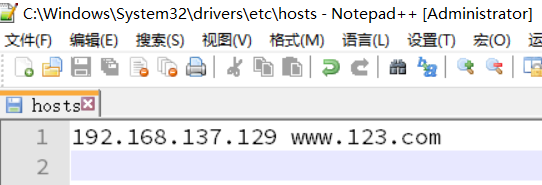
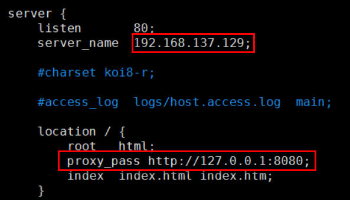
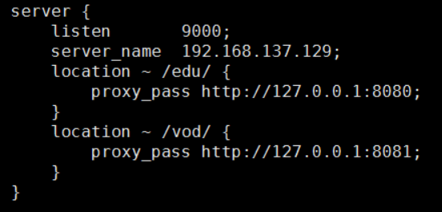
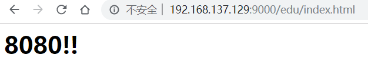
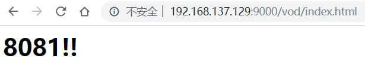
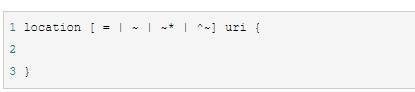

# 第四章 Nginx配置实例-反向代理

## 4.1 反向代理案例一

实现效果：使用nginx反向代理，访问 [www.123.com](http://www.123.com) 直接跳转到127.0.0.1:8080

### 4.1.1 准备工作

1.  启动一个 tomcat

在linux系统安装tomcat；将tomcat安装文件放到liunx系统/opt中，解压；进入tomcat的bin目录中，./startup.sh启动tomcat服务器 ，使用默认端口8080

1.  linux本机访问:localhost:8080
2.  在windows系统中通过浏览器访问tomcat服务器，注意防火墙或开放端口
3.  映射域名，通过修改本地 C:/Windows/System32/drivers/etc/hosts 文件，将 [www.123.com](http://www.123.com "www.123.com") 映射到 192.168.137.129

1.  配置完成之后，访问[www.123.com:8080](www.123.com:8080 "www.123.com:8080") 

### 4.1.2 案例一

那么，如何只需要输入 [www.123.com](http://www.123.com "www.123.com") 便可以跳转到 Tomcat初始界面呢？便用到 nginx的反向代理。

-   **在 nginx.conf 配置文件中增加如下配置**

## 4.2 反向代理案例二

实现效果：使用nginx反向代理，根据访问的路径跳转到不同端口服务

nginx监听端口为9000，

访问 [http://127.0.0.1:9000/edu/](http://127.0.0.1:9000/edu/ "http://127.0.0.1:9000/edu/") 直接跳转到127.0.0.1:8080

访问 [http://127.0.0.1:9000/vod/](http://127.0.0.1:9000/vod/ "http://127.0.0.1:9000/vod/") 直接跳转到127.0.0.1:8081

### 4.2.1 准备工作

第一步，准备两个tomcat，一个8080端口，一个8081端口，并准备好测试的页面

webapps/edu/index.html

webapps/vod/index.html 

由于一个ip服务器上启动两个tomcat，端口不能相同。所以，需要修改端口：22行8005->9005;69行8080->8081;

第二步，修改nginx的配置文件,在http块中添加server{}

### 4.2.2 案例二

 

## 4.3 location指令说明

该指令用于匹配 URL。

语法如下：

1、= ：用于不含正则表达式的 uri 前，要求请求字符串与 uri 严格匹配，如果匹配成功，就停止继续向下搜索并立即处理该请求。

2、\~：用于表示 uri 包含正则表达式，并且**区分**大小写。

3、\~ \*：用于表示 uri 包含正则表达式，并且**不区分**大小写。

4、^\~：用于不含正则表达式的 uri 前，要求 Nginx 服务器找到标识 uri 和请求字符串匹配度最高的 location 后，立即使用此 location 处理请求，而不再使用 location 块中的正则 uri 和请求字符串做匹配。

注意：如果 uri 包含正则表达式，则必须要有 \~ 或者 \~\* 标识。
