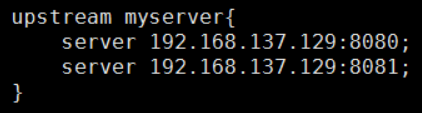
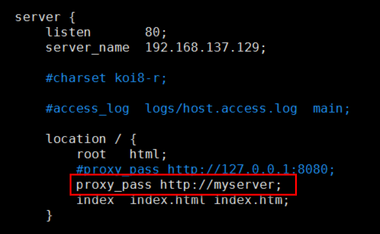
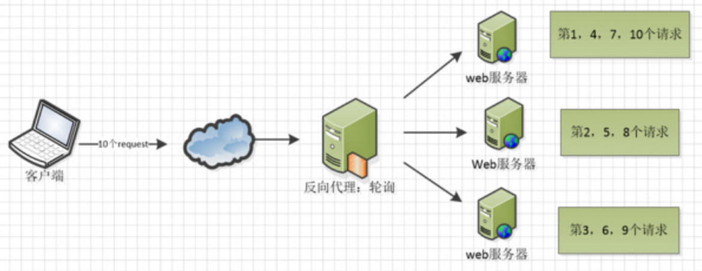
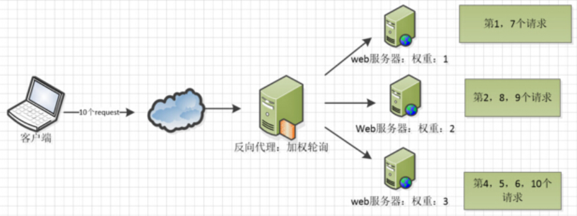
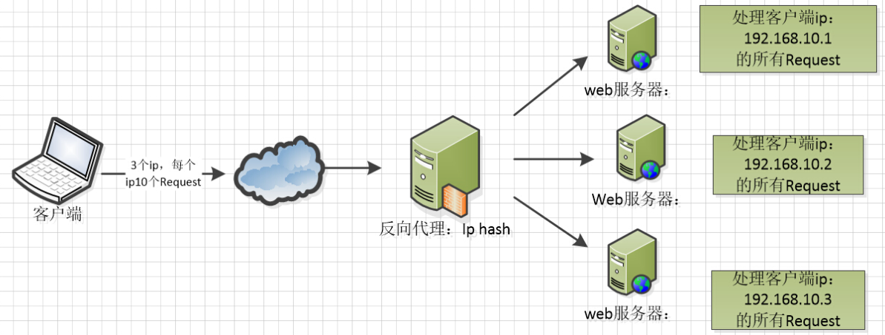
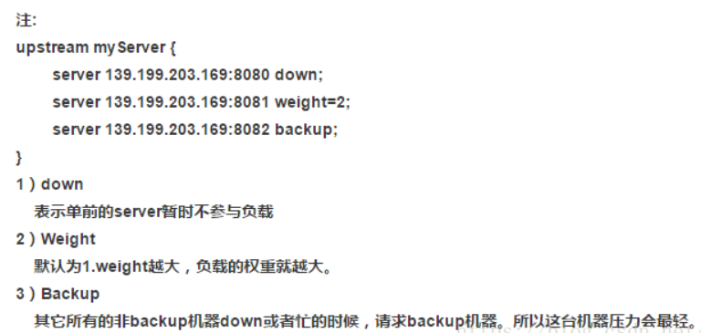

# 第五章 Nginx配置实例-负载均衡

## 5.1 实现效果

浏览器地址栏输入地址 [http://192.168.137.129/edu/a.html](http://192.168.137.129/edu/a.html "http://192.168.137.129/edu/a.html")，负载均衡效果，将请求平均分配到8080和8081两台服务器上。

## 5.2 准备工作

（1）准备两台tomcat服务器，一台8080，一台8081

（2）在两台tomcat里面webapps目录中，创建名称是edu文件夹，在edu文件夹中创建页面a.html(让a.html内容不一样，查看效果)，用于测试

## 5.3 负载均衡配置 

upstream称为上游服务器，即真实处理请求的业务服务器。

 

## 5.4 nginx分配服务器策略

随着互联网信息的爆炸性增长，负载均衡（load balance）已经不再是一个很陌生的话题，顾名思义，负载均衡即是将负载分摊到不同的服务单元，既保证服务的可用性，又保证响应足够快，给用户很好的体验。快速增长的访问量和数据流量催生了各式各样的负载均衡产品，很多专业的负载均衡硬件提供了很好的功能，但却价格不菲，这使得负载均衡软件大受欢迎，nginx就是其中的一个，在linux下有Nginx、LVS、Haproxy等等服务可以提供负载均衡服务，而且Nginx提供了几种分配方式(策略)：

 

### 5.4.1 轮询（默认）

每个请求按时间顺序逐一分配到不同的后端服务器，如果后端服务器down掉，能自动剔除。

### 5.4.2 weight

weight代表权，重默认为1，权重越高被分配的客户端越多

指定轮询几率，weight和访问比率成正比，用于后端服务器性能不均的情况。 例如：

upstream server\_pool{  &#x20;

server 192.168.10.1 weight=1;   &#x20;

server 192.168.10.2 weight=2;&#x20;

server 192.168.10.3 weight=3;  &#x20;

}

### 5.4.3 ip\_hash

每个请求按访问ip的hash结果分配，这样每个访客固定访问一个后端服务器，可以解决session的问题。 例如：

upstream server\_pool{  &#x20;

ip\_hash;   &#x20;

server 192.168.10.1:80;  &#x20;

server 192.168.10.2:80; &#x20;

server 192.168.10.3:80; &#x20;

}

### 5.4.4 fair（第三方）

按后端服务器的响应时间来分配请求，响应时间短的优先分配。

upstream server\_pool{  &#x20;

server 192.168.10.1:80;   &#x20;

server 192.168.10.2:80;

server 192.168.10.3:80;

fair;   &#x20;

}

### 5.4.5 其他参数

