# 第六章 Nginx配置实例-动静分离

Nginx 动静分离简单来说就是把动态请求跟静态请求分开，Nginx 处理静态请求，Tomcat处理动态请求。

动静分离从目前实现角度来讲大致分为两种：

-   一种是纯粹把静态文件独立成单独的域名，放在独立的服务器上，也是目前主流推崇的方案；
-   另外一种方法就是动态跟静态文件混合在一起发布，通过 nginx 来分开。

通过 location 指定不同的后缀名实现不同的请求转发。

## 6.1 准备

1.项目静态资源准备

|   |   |
| - | - |

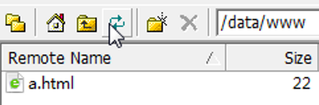

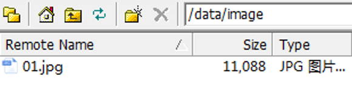

2\. nginx配置

找到nginx安装目录，打开/conf/nginx.conf配置文件

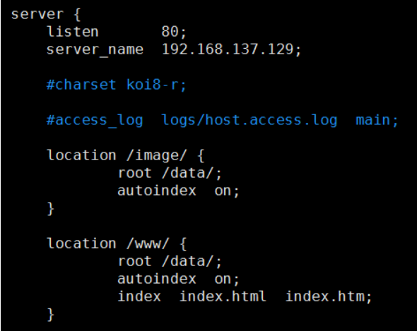

添加监听端口、访问服务名字；重点是添加location；

最后检查 Nginx 配置是否正确即可，然后测试动静分离是否成功。

## 6.2 实验一

（1）浏览器中输入地址：[http://192.168.137.129/image/01.jpg](http://192.168.17.129/image/01.jpg "http://192.168.137.129/image/01.jpg")

 \* 因为配置文件 autoindex on，所以通过访问目录时可以列出该目录问题。注意：文件路径的斜线。

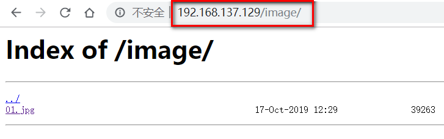

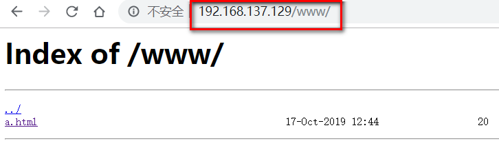

（2）在浏览器地址栏输入地址：[http://192.168.137.129/www/a.html](http://192.168.17.129/www/a.html "http://192.168.137.129/www/a.html")

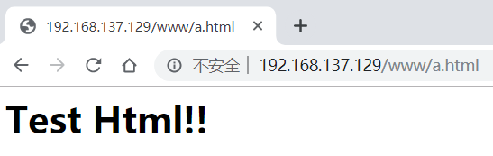

## 6.3 实验二

（1）如果开启反向代理，访问tomcat动态资源jsp，jsp中引用的静态资源可以从nginx服务器中进行加载。

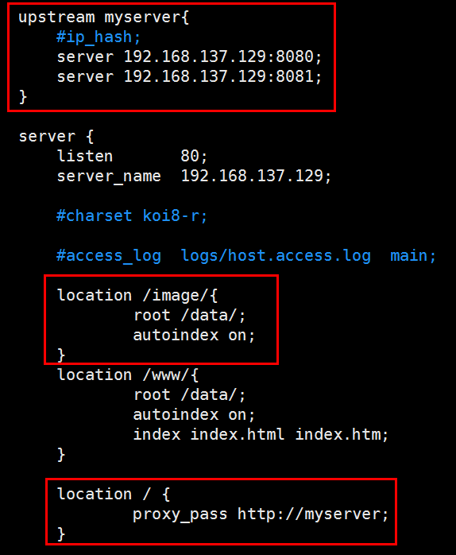

（2）建立jsp部署到tomcat8080/webapps/edu目录下;tomcat8081/webapps/edu目录下

|   |   |
| - | - |

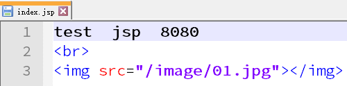

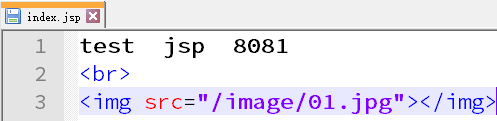

（3）测试结果

|   |   |
| - | - |

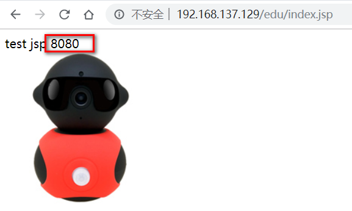

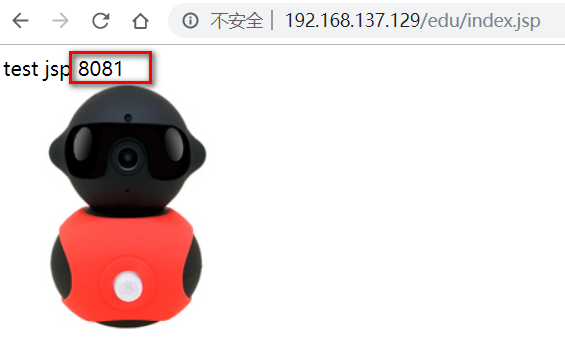
