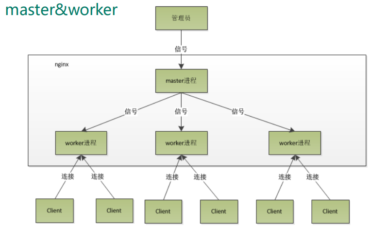
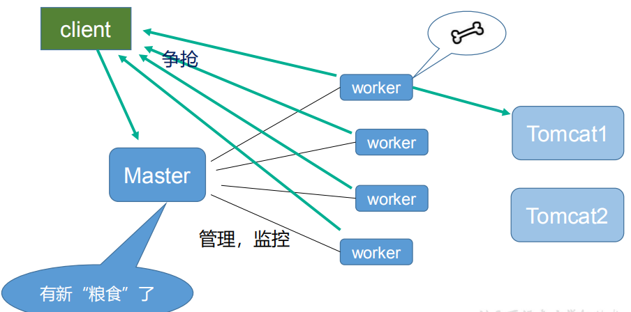

# 第七章 Nginx原理与优化参数配置

## 7.1 Nginx原理

-   **master-workers的机制的好处**

首先，对于每个worker进程来说，独立的进程，不需要加锁，所以省掉了锁带来的开销，同时在编程以及问题查找时，也会方便很多。

其次，采用独立的进程，可以让互相之间不会影响，一个进程退出后，其它进程还在工作，服务不会中断，master进程则很快启动新的worker进程。

当然，worker进程的异常退出，肯定是程序有bug了，异常退出，会导致当前worker上的所有请求失败，不过不会影响到所有请求，所以降低了风险。

-   **需要设置多少个worker**

Nginx 同redis类似都采用了IO多路复用机制，每个worker都是一个独立的进程，但每个进程里只有一个主线程，通过异步非阻塞的方式来处理请求， 即使是千上万个请求也不在话下。每个worker的线程可以把一个cpu的性能发挥到极致。所以worker数和服务器的cpu数相等是最为适宜的。设少了会浪费cpu，设多了会造成cpu频繁切换上下文带来的损耗。

-   **#设置worker数量**

worker\_processes 4

\#work绑定cpu (8 work绑定8个cpu) 。

worker\_cpu\_affinity 00000001 00000010 00000100 00001000  00010000  00100000 01000000  10000000

-   **#连接数**

**worker\_connections 1024**

这个值是表示每个worker进程所能建立连接的最大值，所以，一个nginx能建立的最大连接数，应该是worker\_connections \* worker\_processes。

当然，这里说的是最大连接数，对于HTTP请求本地资源来说，能够支持的**最大并发数量**是worker\_connections \* worker\_processes，

-   如果是支持http1.1的浏览器每次访问要占两个连接，所以普通的静态访问最大并发数是： worker\_connections \* worker\_processes /2，
-   而如果是HTTP作为反向代理来说，最大并发数量应该是worker\_connections \* worker\_processes/4。

因为作为反向代理服务器，每个并发会建立与客户端的连接和与后端服务的连接，会占用两个连接。

| 面试题：&#xA;第一个：发送请求，占用了woker的几个连接数？&#xA;第二个：nginx有一个master，有四个woker，每个woker支持最大的连接数1024，支持的最大并发数是多少？&#xA; |
| ------------------------------------------------------------------------------------------------------- |

## 7.2 Nginx.conf配置详解

| #安全问题，建议用nobody,不要用root.&#xA;#user  nobody;&#xA; &#xA;#worker数和服务器的cpu数相等是最为适宜&#xA;worker\_processes  2;&#xA; &#xA;#work绑定cpu(4 work绑定4cpu)&#xA;worker\_cpu\_affinity 0001 0010 0100 1000&#xA;  &#xA;#error\_log path(存放路径) level(日志等级) path表示日志路径，level表示日志等级，&#xA;#具体如下：\[ debug \| info \| notice \| warn \| error \| crit ]&#xA;#从左至右，日志详细程度逐级递减，即debug最详细，crit最少，默认为crit。 &#xA;#error\_log  logs/error.log;&#xA;#error\_log  logs/error.log  notice;&#xA;#error\_log  logs/error.log  info;&#xA;#pid        logs/nginx.pid;&#xA; &#xA;**events** {&#xA;    worker\_connections  1024;  &#xA; &#xA;    \#这个值是表示nginx要支持哪种多路io复用。&#xA;    \#一般的Linux选择epoll, 如果是(\*BSD)系列的Linux使用kquene。&#xA;    \#windows版本的nginx不支持多路IO复用，这个值不用配。&#xA;    use epoll;&#xA; &#xA;    \# 当一个worker抢占到一个链接时，是否尽可能的让其获得更多的连接,默认是off 。&#xA;    multi\_accept on; //并发量大时缓解客户端等待时间。&#xA;    \# 默认是on ,开启nginx的抢占锁机制。&#xA;    accept\_mutex  on; //master指派worker抢占锁&#xA;}&#xA;**http** {&#xA;    \#当web服务器收到静态的资源文件请求时，依据请求文件的后缀名在服务器的MIME配置文件中找到对应的MIME Type，再根据MIME Type设置HTTP Response的Content-Type，然后浏览器根据Content-Type的值处理文件。&#xA;    include       mime.types;  #/usr/local/nginx/conf/mime.types&#xA; &#xA;    \#如果 不能从mime.types找到映射的话，用以下作为默认值-二进制&#xA;    default\_type  application/octet-stream;&#xA; &#xA;     \#日志位置&#xA;     access\_log  logs/host.access.log  main;&#xA; &#xA;     \#一条典型的accesslog：&#xA;     \#101.226.166.254 - - \[21/Oct/2013:20:34:28 +0800] "**GET** /movie\_cat.php?year=2013 HTTP/1.1" **200** 5209 "<http://www.baidu.com>" "Mozilla/4.0 (compatible; MSIE 8.0; Windows NT 6.1; Trident/4.0; SLCC2; .NET CLR 2.0.50727; .NET CLR 3.5.30729; .NET CLR 3.0.30729; Media Center PC 6.0; MDDR; .NET4.0C; .NET4.0E; .NET CLR 1.1.4322; Tablet PC 2.0); 360Spider"&#xA;     \#1）101.226.166.254:(用户IP)&#xA;     \#2）\[21/Oct/2013:20:34:28 +0800]：(访问时间) &#xA;     \#3）GET：http请求方式，有GET和POST两种&#xA;     \#4）/movie\_cat.php?year=2013：当前访问的网页是动态网页，movie\_cat.php即请求的后台接口，year=2013为具体接口的参数&#xA;     \#5）200：服务状态，200表示正常，常见的还有，301永久重定向、4XX表示请求出错、5XX服务器内部错误&#xA;     \#6）5209：传送字节数为5209，单位为byte&#xA;     \#7）"[http://www.baidu.com"：refer:即当前页面的上一个网页]("：refer:即当前页面的上一个网页)&#xA;     \#8）"Mozilla/4.0 (compatible; MSIE 8.0; Windows NT 6.1; Trident/4.0; SLCC2; .NET CLR 2.0.50727; .NET CLR 3.5.30729; #.NET CLR 3.0.30729; Media Center PC 6.0; MDDR; .NET4.0C; .NET4.0E; .NET CLR 1.1.4322; Tablet PC 2.0); 360Spider"： agent字段：通常用来记录操作系统、浏览器版本、浏览器内核等信息&#xA; &#xA;    log\_format  main  '\$remote\_addr - \$remote\_user \[\$time\_local] "\$request" '&#xA;                       '\$status \$body\_bytes\_sent "\$http\_referer" '&#xA;                      '"\$http\_user\_agent" "\$http\_x\_forwarded\_for"';&#xA; &#xA;    \#开启从磁盘直接到网络的文件传输，适用于有大文件上传下载的情况，提高IO效率。&#xA;    sendfile        on; //大文件传递优化，提高效率&#xA;   &#xA;    \#一个请求完成之后还要保持连接多久，0表示完成请求后直接关闭连接。默认：75s&#xA;    keepalive\_timeout  60s; &#xA; &#xA;    \#开启或者关闭gzip模块, 文件压缩，再传输，提高效率&#xA;    \#gzip  on ; &#xA; &#xA;    \#设置允许压缩的页面最小字节数，页面字节数从header头中的Content-Length中进行获取。&#xA;    \#gzip\_min\_lenth 1k;&#xA; &#xA;    \# gzip压缩比，1 压缩比最小处理速度最快，9 压缩比最大但处理最慢（传输快但比较消耗cpu）&#xA;    \#gzip\_comp\_level 4;&#xA; &#xA;    \#匹配MIME类型进行压缩，（无论是否指定）"text/html"类型总是会被压缩的。&#xA;    \#gzip\_types types text/plain text/css application/json  application/x-javascript text/xml   &#xA; &#xA;    \#动静分离&#xA;    \#服务器端静态资源缓存，最大缓存到内存中的文件，不活跃期限&#xA;    open\_file\_cache max=655350 inactive=20s;   &#xA;   &#xA;    \#活跃期限内最少使用的次数，否则视为不活跃。&#xA;    open\_file\_cache\_min\_uses 2;&#xA; &#xA;    \#验证缓存是否活跃的时间间隔 &#xA;    open\_file\_cache\_valid 30s;&#xA;    &#xA;    upstream  myserver{&#xA;        \# ip\_hash;&#xA;        server 192.168.161.132:8080 weight=1;&#xA;        server 192.168.161.132:8081 weight=1 backup;&#xA;        \#hash \$request\_uri&#xA;        \#hash\_method crc32&#xA;    }&#xA; &#xA;    **server** {&#xA;        \#监听端口号&#xA;        listen       80;&#xA;        \#服务名&#xA;        server\_name  192.168.137.129;&#xA;        \#字符集&#xA;        \#charset utf-8;&#xA;        location / {   #匹配任何查询。&#xA;            root   html;#资源查找位置。         /user/local/nginx/html&#xA;            \#默认访问首页索引文件的名称&#xA;            index  index.html index.htm;&#xA;            \#反向代理路径&#xA;            proxy\_pass [http://myserver](http://myserver "http://myserver");&#xA;#反向代理的超时时间&#xA;proxy\_connect\_timeout 10;&#xA;proxy\_redirect default;&#xA;}&#xA;#普通匹配&#xA;location  /images/ { root images ;&#xA;}&#xA;#反正则匹配&#xA;location ^\~ /images/jpg/ {  # 匹配任何以 /images/jpg/ 开头的任何查询并且停止搜索。任何正则表达式将不会被测试。&#xA;root images/jpg/ ;&#xA;}&#xA;#正则匹配&#xA;location \~ \*.(gif\|jpg\|jpeg)\$ { #所有静态文件直接读取硬盘&#xA;root pic ;&#xA;#expires定义用户浏览器缓存的时间为3天，如果静态页面不常更新，可以设置更长，这样可以节省带宽和缓解服务器的压力&#xA;expires 3d;&#xA;}&#xA;#error\_page  404              /404.html;&#xA;# redirect server error pages to the static page /50x.html&#xA;error\_page   500 502 503 504  /50x.html;&#xA;location = /50x.html {&#xA;root   html;&#xA;}&#xA;}&#xA;} |
| -------------------------------------------------------------------------------------------------------------------------------------------------------------------------------------------------------------------------------------------------------------------------------------------------------------------------------------------------------------------------------------------------------------------------------------------------------------------------------------------------------------------------------------------------------------------------------------------------------------------------------------------------------------------------------------------------------------------------------------------------------------------------------------------------------------------------------------------------------------------------------------------------------------------------------------------------------------------------------------------------------------------------------------------------------------------------------------------------------------------------------------------------------------------------------------------------------------------------------------------------------------------------------------------------------------------------------------------------------------------------------------------------------------------------------------------------------------------------------------------------------------------------------------------------------------------------------------------------------------------------------------------------------------------------------------------------------------------------------------------------------------------------------------------------------------------------------------------------------------------------------------------------------------------------------------------------------------------------------------------------------------------------------------------------------------------------------------------------------------------------------------------------------------------------------------------------------------------------------------------------------------------------------------------------------------------------------------------------------------------------------------------------------------------------------------------------------------------------------------------------------------------------------------------------------------------------------------------------------------------------------------------------------------------------------------------------------------------------------------------------------------------------------------------------------------------------------------------------------------------------------------------------------------------------------------------------------------------------------------------------------------------------------------------------------------------------------------------------------------------------------------------------------------------------------------------------------------------------------------------------------------------------------------------------------------------------------------------------------------------------------------------------------------------------------------------------------------------------------------------------------------------------------------------------------------------------------------------------------------------------------------------------------------------------------------------------------------------------------------------------------------------------------------------------------------------------------------------------------------------------------------------------------------------------------------------------------------------------------------------------------------------------------------------------------------------------------------------------------------------------------------------------------------------------------------------------------------------------------------------------------------------------------------------------------------------------------------------------------------------------------------------------------------------------------------------------------------------------------------------------------------------------------------------------------------------------------------------------------------------------------------------------------------------------------------------------------------------------------------------------------------------------------------------------------------------------------------------------------------------------------------------------------------------------------------------------------------------------------------------------------------------------------------------------------------------------- |
