# 第一章 Spring Boot 概述与入门(掌握)&#x9;

## 1.1 Spring Boot 概述&#x20;

### 1.1.1 什么是Spring Boot

Spring Boot是Spring项目中的一个子工程，与我们所熟知的Spring-framework 同属于spring的产品:

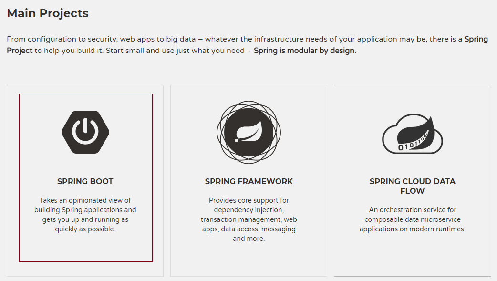

其最主要作用就是帮助开发人员快速的构建庞大的spring项目，并且尽可能的减少一切xml配置，做到**开箱即用**，迅速上手，让开发人员关注业务而非配置。

**主要特点:**

1.  自动配置 : 不需要再关注各个框架的整合配置, springboot全部已经配置好了
2.  起步依赖 : 我们在需要使用某个框架的时候, 直接添加这个框架的启动器依赖即可 , 不需要在关注jar包的冲突和整合

**设计目的**： 用来简化 Spring 应用的初始搭建以及开发过程。

从最根本上来讲，Spring Boot 就是一些库的集合，它能够被任意项目所使用。它使用 “习惯优于配置”的理念让你的项目快速运行起来。spring boot 其实不是什么新的框架，它默认配置了很多框架的使用方式，就像 maven 整合了所有的 jar 包，spring boot 整合了所有的框架，**总结一下及几点：**

（1）为所有 Spring 开发提供一个更快更广泛的入门体验。

（2）零配置。无冗余代码生成和XML 强制配置，遵循“约定大于配置” 。

（3）集成了大量常用的第三方库的配置， Spring Boot 应用为这些第三方库提供了几乎可以零配置的开箱即用的能力。

（4）提供一系列大型项目常用的非功能性特征，如嵌入服务器等。

**使用 Spring Boot有什么好处：**

其实就是**简单**、**快速**、**方便**！

平时如果我们需要搭建一个 Spring Web 项目的时候需要怎么做呢？

-   1）配置 web.xml，加载 Spring 和 Spring mvc
-   2）配置数据库连接、配置 Spring 事务
-   3）配置加载配置文件的读取，开启注解
-   4）配置日志文件
-   …
-   配置完成之后部署 Tomcat 调试
-   …

### 1.1.2 Spring Boot的优势

使用Java开发程序 , 一直困扰我们的就是臃肿、麻烦。搭建项目的过程相当复杂 , 我们需要考虑很多问题 , 主要的问题有如下两点 :

1.  复杂的配置
2.  混乱的依赖管理

Spring Boot帮我们解决了这个些, 我们在使用Spring Boot开发时, **不需要关注各种复杂的整合配置** , 也**不用关注各个库之间的依赖及冲突问题** , Spring Boot已经默认帮我们整合配置好了 !

节省了大量的配置及依赖调整时间, 让我们能够把时间用在刀刃上, 专注业务逻辑的开发。

## 1.2 Spring Boot 快速入门

下面，我们就利用Spring Boot搭建一个web工程，体会一下Spring Boot的魅力所在！

### 1.2.1 需求

需求：访问 http\://localhost:8080/hello输出 “Hello Spring Boot”

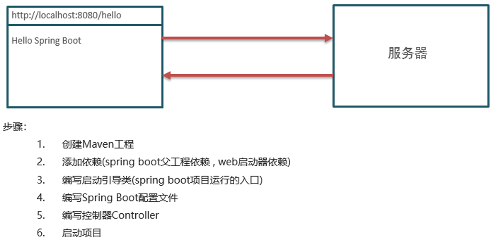

### 1.2.2 步骤

1.  创建Maven工程
2.  添加依赖(springboot父工程依赖 , web启动器依赖)
3.  编写启动引导类(springboot项目运行的入口)
4.  编写处理器Controller
5.  启动项目

### 1.2.3 实现

创建项目: springboot\_01

#### 1.2.3.1 创建工程

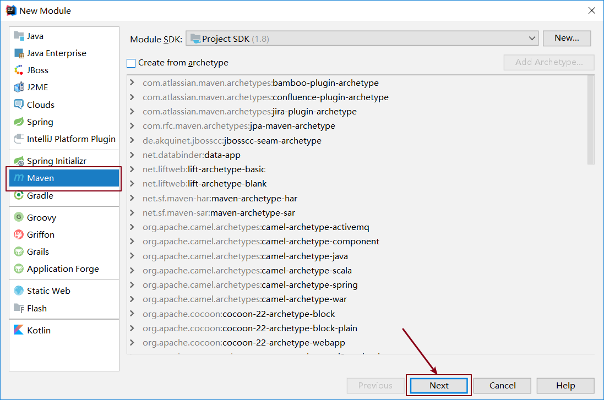

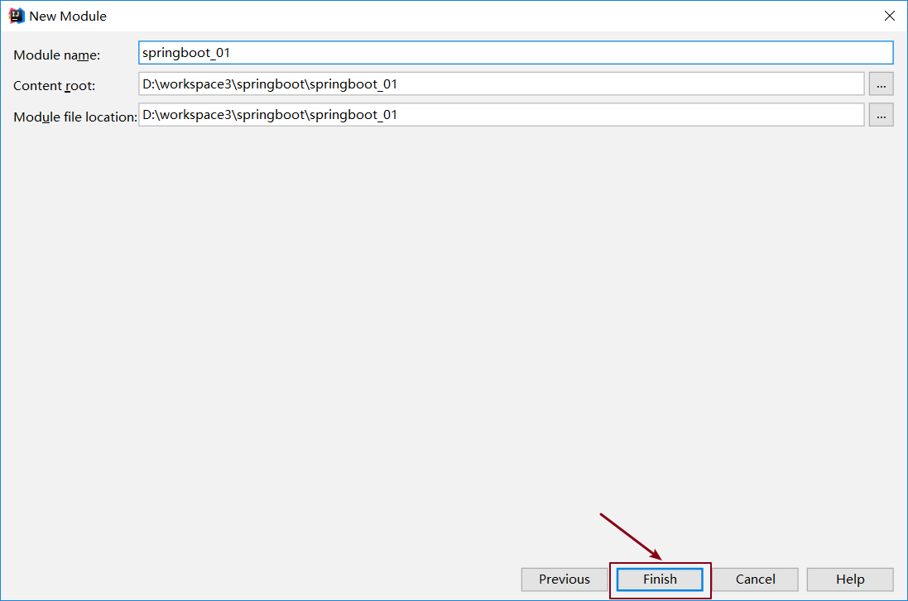

#### 1.2.3.2 添加依赖

SpringBoot可以帮我们方便的管理项目依赖 , 在Spring Boot提供了一个名为\*\***spring-boot-starter-parent**\*\*的工程，里面已经对各种常用依赖的版本进行了管理，我们的项目需要以这个项目为父工程，这样我们就不用操心依赖的版本问题了，需要什么依赖，直接引入坐标(不需要添加版本)即可！

1.  **添加父工程坐标**

| <**parent**>&#xA;    <**groupId**>org.springframework.boot\</**groupId**>&#xA;    <**artifactId**>**spring-boot-starter-parent**\</**artifactId**>&#xA;    <**version**>2.3.6.RELEASE\</**version**>&#xA;\</**parent**>&#xA; |
| ---------------------------------------------------------------------------------------------------------------------------------------------------------------------------------------------------------------------------- |

1.  **添加web启动器**

为了让Spring Boot帮我们完成各种自动配置，我们必须引入Spring Boot提供的**自动配置依赖**，我们称为**启动器**。因为我们是web项目，这里我们引入web启动器，在 pom.xml 文件中加入如下依赖：

| <**dependencies**>&#xA;    <**dependency**>&#xA;        <**groupId**>org.springframework.boot\</**groupId**>&#xA;        <**artifactId**>spring-boot-starter-web\</**artifactId**>&#xA;    \</**dependency**>&#xA;\</**dependencies**>&#xA; |
| ------------------------------------------------------------------------------------------------------------------------------------------------------------------------------------------------------------------------------------------- |

需要注意的是，我们并没有在这里指定版本信息 , 当我们添加好启动器之后我们发现项目中已经依赖了大量的Jar包

1.  **配置JDK版本**

| <**properties**>&#xA;    <**java.version**>1.8\</**java.version**>&#xA;\</**properties**>&#xA; |
| ---------------------------------------------------------------------------------------------- |

思考: 为什么我们这里仅仅配置了这么一个变量 , 项目的JDK版本就会改变呢 ?

因为jdk插件已经在父工程中定义好了 , 默认会读取\${java.version}变量值

1.  **完整的pom.xml文件**

配置完毕之后完整的\*\*pom.xml\*\*配置文件如下所示

| \<?xml version="1.0" encoding="UTF-8"?>&#xA;<**project** **xmlns**="<http://maven.apache.org/POM/4.0.0>"&#xA;         **xmlns:xsi**="<http://www.w3.org/2001/XMLSchema-instance>"&#xA;         **xsi:schemaLocation**="<http://maven.apache.org/POM/4.0.0> <http://maven.apache.org/xsd/maven-4.0.0.xsd>">&#xA;    <**modelVersion**>4.0.0\</**modelVersion**>&#xA;&#xA;    <**parent**>&#xA;        <**groupId**>org.springframework.boot\</**groupId**>&#xA;        <**artifactId**>spring-boot-starter-**parent**\</**artifactId**>&#xA;        <**version**>2.3.6.RELEASE\</**version**>&#xA;    \</**parent**>&#xA;    &#xA;    <**groupId**>com.atguigu\</**groupId**>&#xA;    <**artifactId**>springboot\_01\</**artifactId**>&#xA;    <**version**>1.0-SNAPSHOT\</**version**>&#xA;&#xA;    <**properties**>&#xA;        <**java.version**>1.8\</**java.version**>&#xA;    \</**properties**>&#xA;&#xA;    <**dependencies**>&#xA;        <**dependency**>&#xA;            <**groupId**>org.springframework.boot\</**groupId**>&#xA;            <**artifactId**>spring-boot-starter-**web**\</**artifactId**>&#xA;        \</**dependency**>&#xA;    \</**dependencies**>&#xA;&#xA;\</**project**>&#xA; |
| --------------------------------------------------------------------------------------------------------------------------------------------------------------------------------------------------------------------------------------------------------------------------------------------------------------------------------------------------------------------------------------------------------------------------------------------------------------------------------------------------------------------------------------------------------------------------------------------------------------------------------------------------------------------------------------------------------------------------------------------------------------------------------------------------------------------------------------------------------------------------------------------------------------------------------------------------------------------------------------------------------------------------------------------------------------------------------------------------------------------------------------------------------------------------------------------------------------- |

#### 1.2.3.3 创建启动类

Spring Boot项目通过main函数即可启动，我们需要创建一个启动类：

| **package** com.atguigu;&#xA;&#xA;**import** org.springframework.boot.SpringApplication;&#xA;**import** org.springframework.boot.autoconfigure.SpringBootApplication;&#xA;&#xA;@SpringBootApplication&#xA;**public** **class** **Application** {&#xA;    **public** **static** **void** **main**(String\[] args) {&#xA;        SpringApplication.run(Application.class,args);&#xA;    }&#xA;}&#xA; |
| -------------------------------------------------------------------------------------------------------------------------------------------------------------------------------------------------------------------------------------------------------------------------------------------------------------------------------------------------------------------------------------------------- |

#### 1.2.3.4 编写controller

| **package** com.atguigu.controller;&#xA;&#xA;**import** org.springframework.web.bind.annotation.RequestMapping;&#xA;**import** org.springframework.web.bind.annotation.RestController;&#xA;@RestController&#xA;**public** **class** **HelloController** {&#xA;    @RequestMapping("/hello")&#xA;    **public** String **sayHello**(){&#xA;        **return** "hello spring boot!!" ;&#xA;    }&#xA;}&#xA; |
| --------------------------------------------------------------------------------------------------------------------------------------------------------------------------------------------------------------------------------------------------------------------------------------------------------------------------------------------------------------------------------------------------------- |

#### 1.2.3.5 启动测试

运行启动类的main方法 :

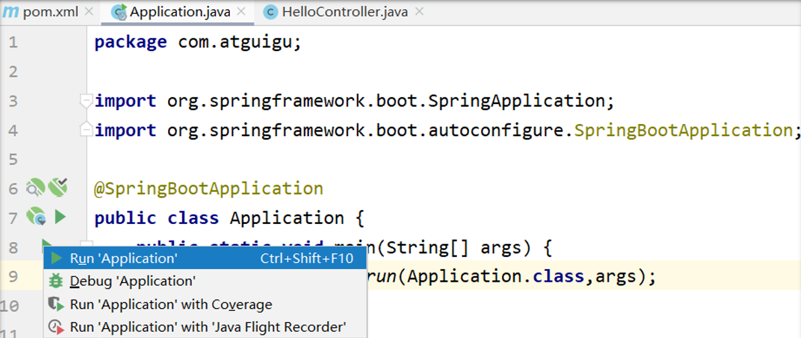

控制台会输出如下信息 :

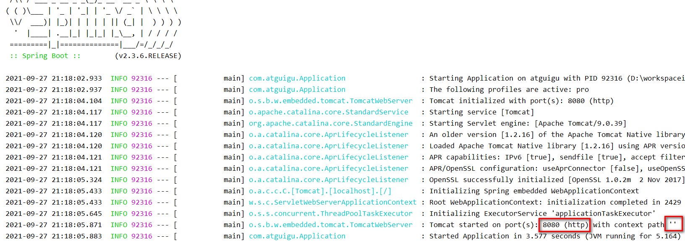

通过输出的日志我们知道了以下信息 :

1.  监听的端口是8080
2.  项目的上下文路径是""

打开浏览器,访问：[http://localhost:8080/hello](http://localhost:8080/hello "http://localhost:8080/hello")

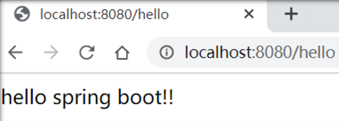

1.3 Spring Boot 入门 – 思考

### 问题1：

为什么我们在添加启动器的时候不需要在启动器的坐标中指定版本？

答案：因为我们指定了项目的父工程，在spring-boot-starter-parent中已经通过Maven的版本锁定了Jar包的版本，所以就不需要再指定了。

### 问题2：

为什么我们就添加一个启动器依赖，项目就可以运行起来了，运行项目所需要的Jar包从何而来？

答案：因为我们添加了这个启动器的依赖，它已经把自己运行所需要的必要包集成在这个启动器中，通过Maven的依赖传递性，将这些包都依赖到咱们的项目里了。

点击项目右键 open module settings

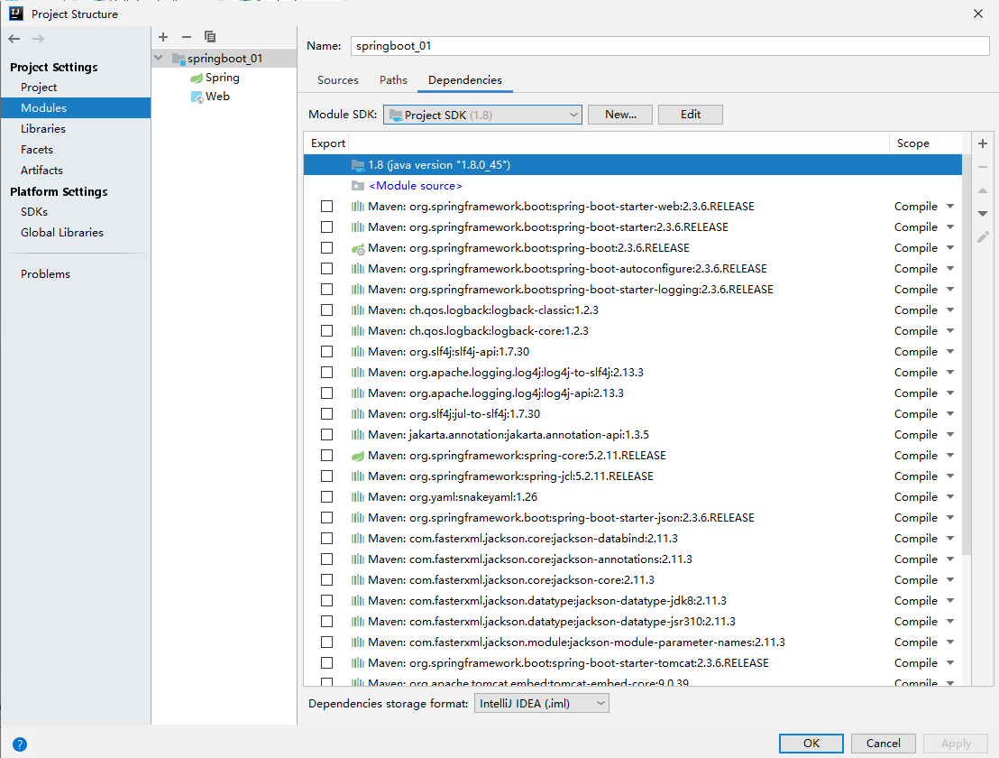

## 1.4 配置文件详解

springboot支持二种类型的配置文件

-   properties属性配置文件
-   yaml配置文件

配置文件必须放置在项目的类加载目录下, 并且名字必须是application

springboot项目在运行的时候会自动加载这些配置文件

同级目录下打开：spring-configuration-metadata.json

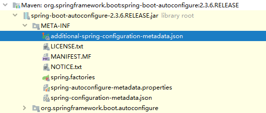

搜素：server.port

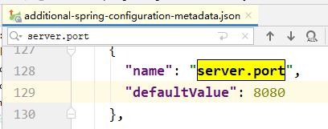

为什么可以在resources下创建application.properties文件呢？我们查看springboot的父启动依赖：

点击spring-boot-starter-parent

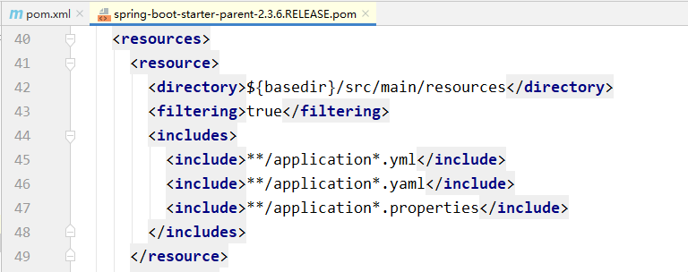

### 1.4.1 属性配置文件

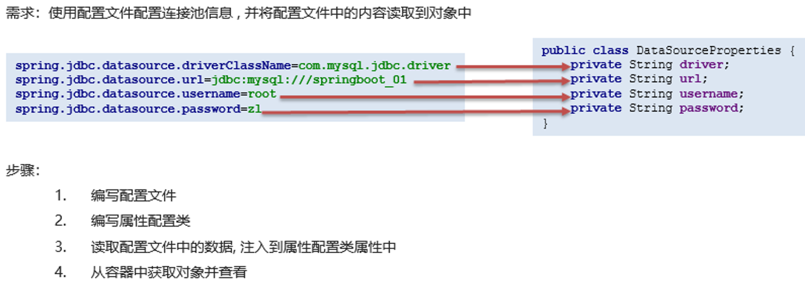

在 resource 文件夹下面新建 application.properties 配置文件

| **spring**.jdbc.datasource.driverClassName=com.mysql.jdbc.driver&#xA;**spring**.jdbc.datasource.url=jdbc:mysql:///springboot\_01&#xA;**spring**.jdbc.datasource.username=root&#xA;**spring**.jdbc.datasource.password=root&#xA; |
| ------------------------------------------------------------------------------------------------------------------------------------------------------------------------------------------------------------------------------- |

新建 properties 包，创建类 DataSourceProperties

| **package** com.atguigu.properties;&#xA;&#xA;**import** org.springframework.beans.factory.annotation.Value;&#xA;**import** org.springframework.stereotype.Component;&#xA;&#xA;@Component&#xA;**public** **class** **DataSourceProperties** {&#xA;&#xA;    @Value("\${spring.jdbc.datasource.driverClassName}")&#xA;    **private** String driverClassName;&#xA;    @Value("\${spring.jdbc.datasource.url}")&#xA;    **private** String url;&#xA;    @Value("\${spring.jdbc.datasource.username}")&#xA;    **private** String username;&#xA;    @Value("\${spring.jdbc.datasource.password}")&#xA;    **private** String password;&#xA;&#xA;    // 生成get set 和 toString方法&#xA;}&#xA; |
| ----------------------------------------------------------------------------------------------------------------------------------------------------------------------------------------------------------------------------------------------------------------------------------------------------------------------------------------------------------------------------------------------------------------------------------------------------------------------------------------------------------------------------------------------------------------------------------------------------------------------------------------------------------------------------------- |

在 controller 添加 sayHello2 方法

| **package** com.atguigu.controller;&#xA;&#xA;**import** com.atguigu.properties.DataSourceProperties;&#xA;**import** org.springframework.beans.factory.annotation.Autowired;&#xA;**import** org.springframework.web.bind.annotation.RequestMapping;&#xA;**import** org.springframework.web.bind.annotation.RestController;&#xA;&#xA;@RestController&#xA;**public** **class** **HelloController** {&#xA;&#xA;    @Autowired&#xA;    **private** DataSourceProperties dataSourceProperties ;&#xA;    &#xA;    @RequestMapping(path = "/hello")&#xA;    **public** String **sayHello**() {&#xA;        System.out.println(dataSourceProperties);&#xA;        **return** "Hello Spring Boot ! " ;&#xA;    }&#xA;}&#xA; |
| ----------------------------------------------------------------------------------------------------------------------------------------------------------------------------------------------------------------------------------------------------------------------------------------------------------------------------------------------------------------------------------------------------------------------------------------------------------------------------------------------------------------------------------------------------------------------------------------------------------------------------------------------------------------------------------------------------------------- |

请求地址：http\://localhost:8080/hello

控制台打印：

| DataSourceProperties{driverClassName='com.mysql.jdbc.Driver', url='jdbc:mysql:///springboot\_01', username='root', password='root'}&#xA; |
| ---------------------------------------------------------------------------------------------------------------------------------------- |

### 1.4.2 YAML配置文件

何谓YAML？

 YAML是一种配置文件格式

语法 :

1.数据结构用树形结构呈现，通过缩进来表示层级，

2.连续的项目通过减号 ” - ” 来表示

3.键值结构里面的key/value对用冒号 ” : ” 来分隔。

4.YAML配置文件的扩展名是yaml 或 yml

在 resource 文件夹下面新建 application.yml 配置文件，修改 application.properties 配置文件名字为 application.properties.bak

| spring:&#xA;  jdbc:&#xA;    datasource:&#xA;      driverClassName: com.mysql.jdbc.Driver&#xA;      url: jdbc:mysql:///springboot\_01&#xA;      username: root&#xA;      password: root&#xA; |
| ------------------------------------------------------------------------------------------------------------------------------------------------------------------------------------------- |

运行项目，重新请求 http\://localhost:8080/hello

yml配置文件的特征：

1.  树状层级结构展示配置项；
2.  配置项之间如果有关系的话需要分行，空两格；
3.  配置项如果有值的话，那么需要在 :之后空一格再写配置项值；

**yaml与properties配置文件除了展示形式不相同以外，其它功能和作用都是一样的**

### 1.4.3 多环境profile切换配置

我们刚刚说过在Spring Boot项目中配置文件的名称只能是\*\*application\*\* , 如果我们把所有的配置全都写在一个配置文件中如果配置项比较多, 配置文件就会显得比较复杂和臃肿 ! 不利于后期的项目维护和开发

例如下面几个场景 :

1.因为开发环境的变化, 我们需要修改配置文件中某一个配置项的值（比如之前是mysql数据库，切换成oracle数据库）

2.项目开发完成需要上线了 , 需要把一些环境修改成正式环境（**开发**，**测试**，**上线**，多环境切换）

**解决方案 :使用profiles拆分配置**

spring boot项目中允许使用多个YAML配置文件。

这些文件名称必须为application-\*\* \*.yml，并且在application.yml中激活。

创建**application-****dev****.yml**文件如下：

\# 配置数据库连接池信息 ，开发环境

| spring:&#xA;  jdbc:&#xA;    datasource:&#xA;      driverClassName: com.mysql.jdbc.Driver&#xA;      url: jdbc:mysql:///springboot&#xA;      username: root&#xA;      password: root&#xA; |
| --------------------------------------------------------------------------------------------------------------------------------------------------------------------------------------- |

创建**application-****pro****.yml**文件如下：

\# 配置数据库连接池信息，上线环境

| spring:&#xA;  jdbc:&#xA;    datasource:&#xA;      driverClassName: com.mysql.jdbc.Driver&#xA;      url: jdbc:mysql:///business&#xA;      username: business&#xA;      password: business&#xA; |
| --------------------------------------------------------------------------------------------------------------------------------------------------------------------------------------------- |

在 **application.yml** 文件中添加如下配置：

\# 激活配置文件

| spring:&#xA;  profiles:&#xA;    active: **dev** |
| ----------------------------------------------- |

直接运行项目：http\://localhost:8080/hello

打印结果：

| DataSourceProperties{driverClassName='com.mysql.jdbc.Driver', url='jdbc:mysql:///springboot', username='root', password='root'}&#xA; |
| ------------------------------------------------------------------------------------------------------------------------------------ |

修改 application.yml 配置文件：

\# 激活配置文件

| spring:&#xA;  profiles:&#xA;    active: **pro** |
| ----------------------------------------------- |

打印结果：

| DataSourceProperties{driverClassName='com.mysql.jdbc.Driver', url='jdbc:mysql:///business', username='business', password='business'}&#xA; |
| ------------------------------------------------------------------------------------------------------------------------------------------ |

==**注意**==

**如果properties和yml文件都存在，不存在spring.profiles.active设置，如果有重叠属性，默认以properties优先。**

**如果设置了spring.profiles.active，并且有重叠属性，以active设置优先。**

**可以在两种文件中分别增加server.port属性指定不同的端口，启动项目查看控制台端口号进行测试。**
