# 第二章 Spring Boot 自动配置(理解)

## 2.1 @SpringBootApplication注解

-   @SpringBootConfiguration : 代表这个类就是一个配置类 , 本质上就是一个@Configuration注解
-   @ComponentScan : 组件扫描, 默认扫描启动类所在包及子包下的类身上的注解
-   @EnableAutoConfiguration : 自动配置注解 , 添加了此注解会自动去读取spring.factories配置文件中的自动配置类

## 2.2 @ConfigurationProperties注解

@ConfigurationProperties是SpringBoot提供的重要注解, 他可以将一些配置属性\*\***批量**\*\*注入到bean对象。

**application.yml配置文件**

| spring:&#xA;  jdbc:&#xA;    datasource:&#xA;      driverClassName: com.mysql.jdbc.driver&#xA;      url: jdbc:mysql:///springboot\_01&#xA;      username: root&#xA;      password: root&#xA; |
| ------------------------------------------------------------------------------------------------------------------------------------------------------------------------------------------- |

**DataSourceProperties.java**

| **public** **class** **DataSourceProperties** {&#xA;&#xA;    **private** String driverClassName;&#xA;    **private** String url;&#xA;    **private** String username;&#xA;    **private** String password;&#xA;    &#xA;    // 省略getter和setter.....&#xA;}&#xA; |
| -------------------------------------------------------------------------------------------------------------------------------------------------------------------------------------------------------------------------------------------------------------- |

### 方式一 : 使用@Value一个个注入

这种注入方式，如果属性特别多，一个一个注入太麻烦啦o(╥﹏╥)o

| @Component&#xA;**public** **class** **DataSourceProperties** {&#xA;&#xA;    @Value("\${spring.jdbc.datasource.driverClassName}")&#xA;    **private** String driverClassName;&#xA;    @Value("\${spring.jdbc.datasource.url}")&#xA;    **private** String url;&#xA;    @Value("\${spring.jdbc.datasource.username}")&#xA;    **private** String username;&#xA;    @Value("\${spring.jdbc.datasource.password}")&#xA;    **private** String password;&#xA;&#xA;    // 省略getter和setter.....&#xA;}&#xA; |
| --------------------------------------------------------------------------------------------------------------------------------------------------------------------------------------------------------------------------------------------------------------------------------------------------------------------------------------------------------------------------------------------------------------------------------------------------------------------------------------------------- |

### 方式二 : 使用@ConfigurationProperties批量注入

这种注入方式，属性再多，只要按照规则就可以一次性自动注入。方便的很哦\\(^o^)/\~

| **package** com.atguigu.properties;&#xA;&#xA;**import** org.springframework.boot.context.properties.ConfigurationProperties;&#xA;**import** org.springframework.stereotype.Component;&#xA;&#xA;@Component&#xA;@ConfigurationProperties(prefix = "spring.jdbc.datasource")&#xA;**public** **class** **DataSourceProperties2** {&#xA;&#xA;    **private** String driverClassName;&#xA;    **private** String url;&#xA;    **private** String username;&#xA;    **private** String password;&#xA;    &#xA;     // 省略getter和setter.....&#xA;}    &#xA; |
| -------------------------------------------------------------------------------------------------------------------------------------------------------------------------------------------------------------------------------------------------------------------------------------------------------------------------------------------------------------------------------------------------------------------------------------------------------------------------------------------------------------------------------------------------- |

&#x20;

-   在类上通过@ConfigurationProperties注解声明该类要读取属性配置
-   prefix="spring.jdbc.datasource" 读取属性文件中前缀为spring.jdbc.datasource的值。前缀和属性名称和配置文件中的key必须要保持一致才可以注入成功
-   Spring Boot默认读取application.properties属性文件

开启@ConfigurationProperties注解使用

| @Controller&#xA;@EnableConfigurationProperties(DataSourceProperties2.class)&#xA;**public** **class** **HelloController** {&#xA;    &#xA;    @Autowired&#xA;    **private** DataSourceProperties2 dataSourceProperties2 ;&#xA;&#xA;    @RequestMapping(path = "/hello")&#xA;    @ResponseBody&#xA;    **public** String **sayHello**(){&#xA;        System.out.println(dataSourceProperties2);&#xA;        **return** "hello spring boot";&#xA;    }&#xA;}&#xA; |
| -------------------------------------------------------------------------------------------------------------------------------------------------------------------------------------------------------------------------------------------------------------------------------------------------------------------------------------------------------------------------------------------------------------------------------------------------------------- |

使用@EnableConfigurationProperties(DataSourceProperties2.class)，开启DataSourceProperties2身上的@ConfigurationProperties注解 , 他就会生效了, 就会帮助我们注入数据了

请求地址：http\://localhost:8080/hello

打印结果：

| DataSourceProperties2{driverClassName='com.mysql.jdbc.Driver', url='jdbc:mysql:///springboot\_01', username='root', password='root'}&#xA; |
| ----------------------------------------------------------------------------------------------------------------------------------------- |

报错提示，请在pom文件添加配置信息

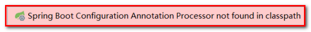

| <**dependency**>&#xA;    <**groupId**>org.springframework.boot\</**groupId**>&#xA;    <**artifactId**>spring-boot-configuration-processor\</**artifactId**>&#xA;    <**optional**>true\</**optional**>&#xA;\</**dependency**>&#xA; |
| ---------------------------------------------------------------------------------------------------------------------------------------------------------------------------------------------------------------------------------- |

## 2.3 条件化配置注解

我们看到自动配置类上有一些ConditionalXxxx注解 , 这些注解的作用就是进行条件化选择

所谓条件化选择就是如果满足条件, 该配置类就生效, 如果不满足该配置类就不生效

常用的条件化选择注解如下 :

| 注解&#xA;                              | 作用&#xA;                 |
| ------------------------------------ | ----------------------- |
| @ConditionalOnBean&#xA;              | 如果存在某个Bean, 配置类生效&#xA;  |
| @ConditionalOnMissingBean&#xA;       | 如果不存在某个Bean, 配置类生效&#xA; |
| @ConditionalOnClass&#xA;             | 如果存在某个类, 配置类生效&#xA;     |
| @ConditionalOnMissingClass&#xA;      | 如果不存在某个类, 配置类生效&#xA;    |
| @ConditionalOnProperty&#xA;          | 如果存在某个属性配置, 配置类生效&#xA;  |
| @ConditionalOnWebApplication&#xA;    | 如果是一个web应用, 配置类生效&#xA;  |
| @ConditionalOnNotWebApplication&#xA; | 如果不是一个web应用, 配置类生效&#xA; |

因为我们配置了DispatcherServlet 满足上面定义的条件, 所以WebMvcAutoConfiguration会生效 , 那么WebMvcAutoConfiguration自动配置类中帮我们配置了什么呢 ?

**视图解析器**

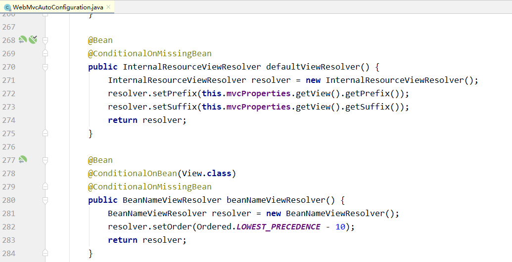

**处理器适配器（HandlerAdapter）**

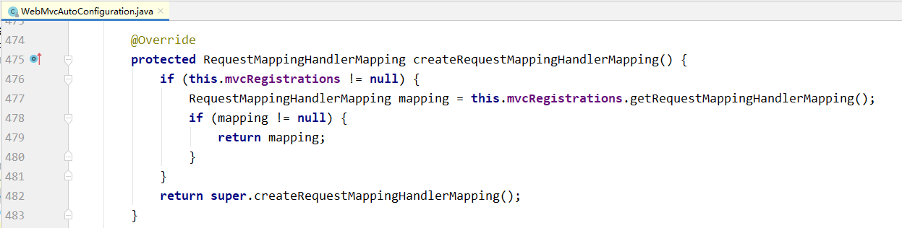

这些配置都是我们之前在学习SpringMVC时需要自己配置的 , 现在Spring Boot框架都已经提前帮我们配置好了 , 所以我们才能使用的那么方便

## 2.4 自动配置原理

### 2.4.1 加载spring.factories

在\*\*SpringApplication\*\*类构建的时候，有这样一段初始化代码：

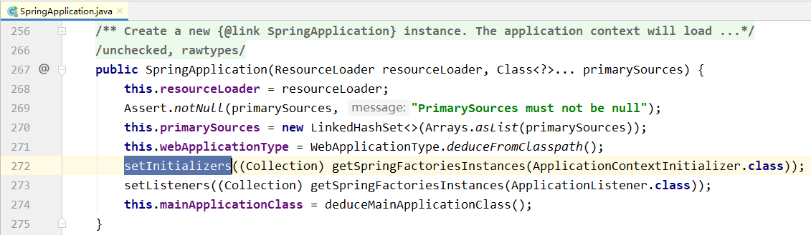

跟进去往下走

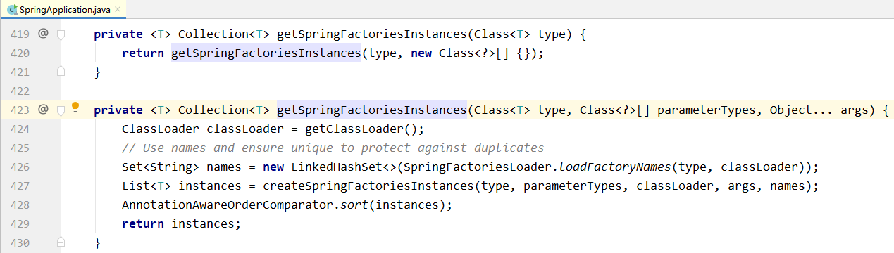

这里发现会通过loadFactoryNames尝试加载一些FactoryName，然后利用createSpringFactoriesInstances将这些加载到的类名进行实例化。 继续跟进loadFactoryNames方法：

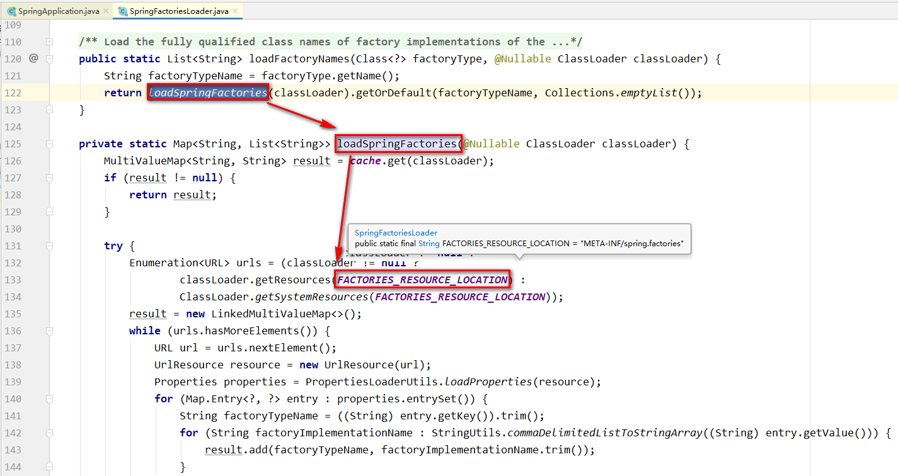

发现此处会利用类加载器加载一个文件： META-INF/spring.factories 。我们知道，ClassLoader默认是从classpath下读取文件，因此，SpringBoot会在初始化的时候，加载所有classpath:META-INF/spring.factories文件，包括jar包当中的。而在Spring的一个依赖包：spring-boot-autoconfigure中，就有这样的文件：

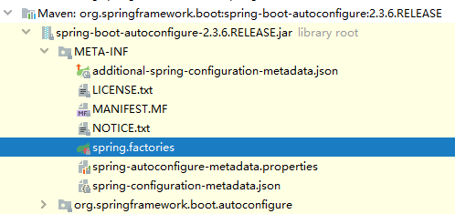

我们引入的任何第三方启动器，只要实现自动配置，也都会有类似文件。

### 2.4.2 读取自动配置类

我们打开\*\*spring.factories\*\*文件

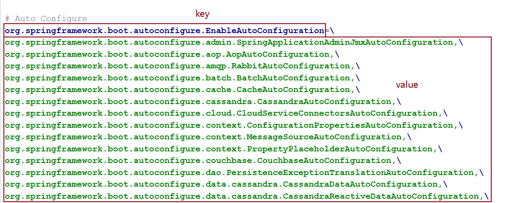

可以发现以EnableAutoConfiguration接口为key的一系列配置，key所对应的值，就是所有的自动配置类，可以在当前的jar包中找到这些自动配置类：

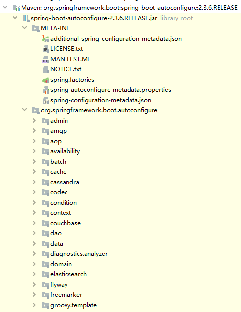

几乎涵盖了现在主流的开源框架 , 我们来看一个我们熟悉的，例如SpringMVC，查看mvc 的自动配置类：

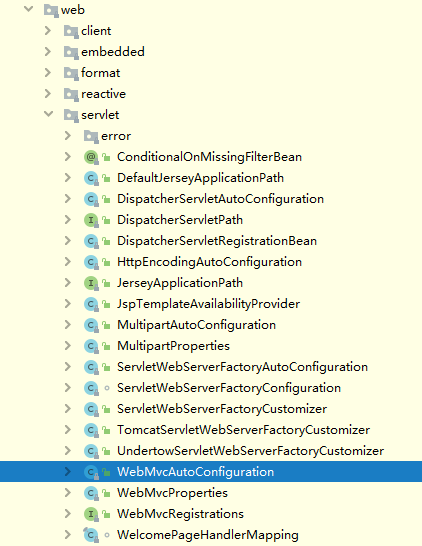

打开WebMvcAutoConfiguration

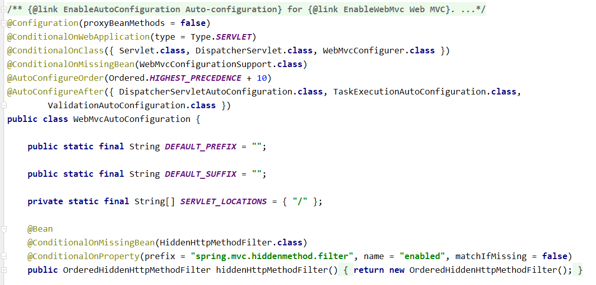

### 2.4.3 默认属性配置

配置类我们找到了 , 那么这些默认配置的属性来自哪里呢？

例如 : 我们配置视图解析器的时候需要配置前缀和后缀 , 那么这些配置在哪配置的呢 ?

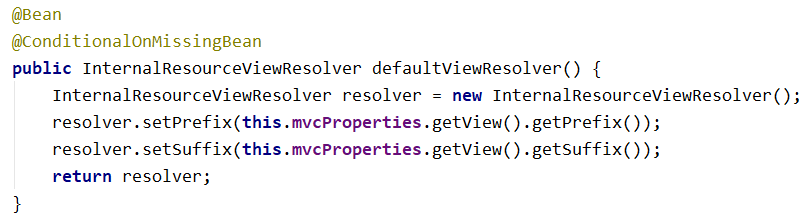

通过源码发现, 这个配置是从this.mvcProperties.getView()中读取的 ,this.mvcProperties又是什么呢 ? 我们继续跟踪,发现其实就是定义的一个变量

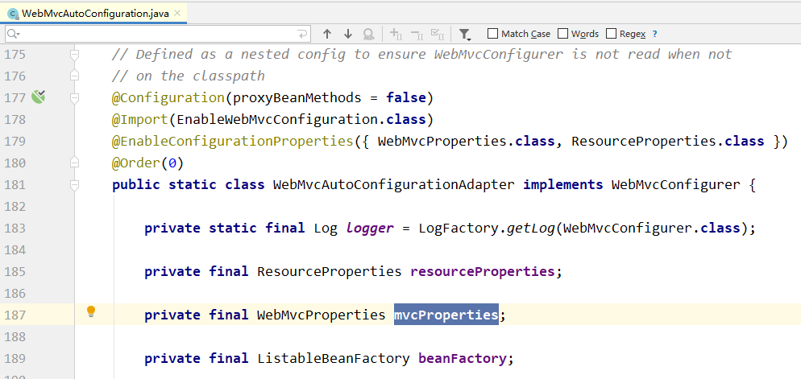

这个变量中又有一个View类型的变量 , 这个变量中配置的就是前缀和后缀

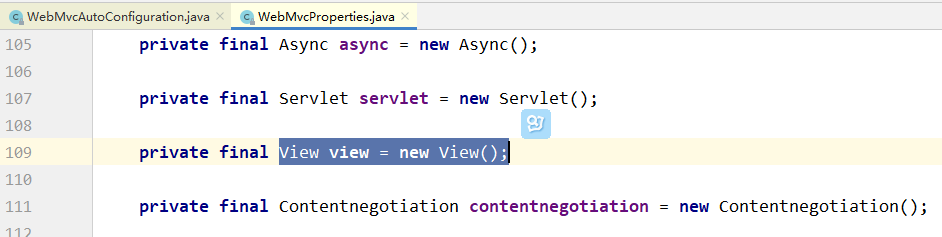

View中的源码如下 :

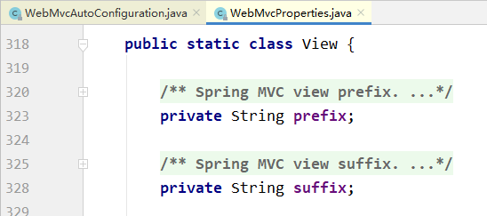

可以看到, 默认读取就是这里的前缀和后缀变量的值 , 默认就是null .

### 2.4.4 覆盖默认属性配置

如果我们想自己指定视图的前缀和后缀该如何去做呢 ?

我们再看WebMvcAutoConfiguration这个类的声明, 发现这个类身上有这么一个注解, 我们之前也使用过 , 引入了二个配置对象 , 所以我们知道下面成员位置的WebMvcProperties这个成员变量 , 就是从这里来的

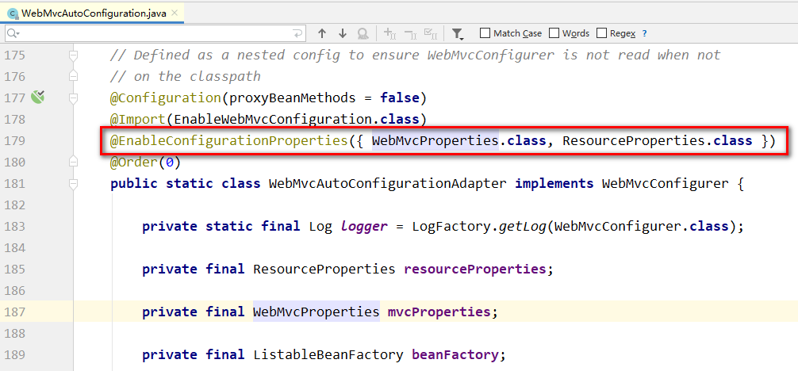

我们再进去看看这两个配置类 , 配置类身上使用ConfigurationProperties读取配置,前缀是spring.mvc , 所以如果我们在配置文件中配置spring.mvc前缀开头的配置 , 是不是就可以将自己配置的数据注入到这个对象的属性中 !

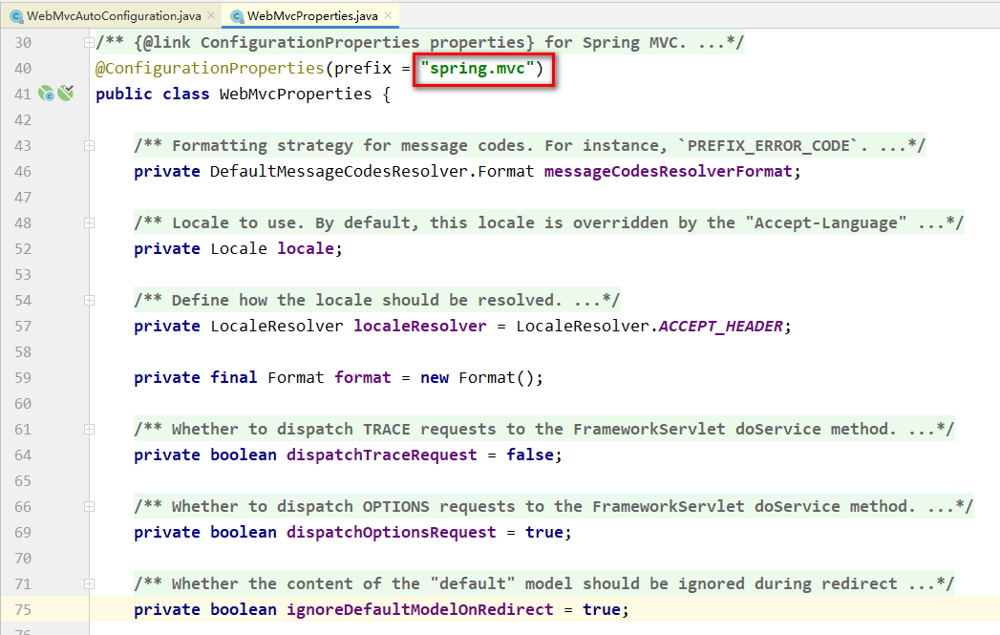

所以如果想要自己设置视图前缀和后缀就可以这么配置

\# 激活配置文件

| spring:&#xA;  mvc:&#xA;    view:&#xA;      prefix: /WEB-INF/&#xA;      suffix: .html&#xA; |
| ----------------------------------------------------------------------------------------- |

修改服务器端口 :

| server:&#xA;  port: 10000&#xA; |
| ------------------------------ |

## 2.5 自定义启动器

### 2.5.1 需求介绍

定义一个连接池启动器 , 当用户引入了连接池启动依赖之后 , 项目中就已经自动配置了连接池

### 2.5.2 步骤分析

1.  创建启动器项目
2.  添加启动器相关依赖
3.  创建属性配置类
4.  创建自动配置类
5.  编写自动配置文件(\*\*spring.factories\*\*)
6.  使用自定义的启动器

### 2.5.3 代码实现

#### 2.5.3.1 创建项目并引入依赖

**创建项目** spring-boot-jdbc-starter

**引入依赖**

| <**parent**>&#xA;    <**groupId**>org.springframework.boot\</**groupId**>&#xA;    <**artifactId**>spring-boot-starter-parent\</**artifactId**>&#xA;    <**version**>2.3.6.RELEASE\</**version**>&#xA;\</**parent**>&#xA;&#xA;<**properties**>&#xA;    <**project.build.sourceEncoding**>UTF-8\</**project.build.sourceEncoding**>&#xA;    <**project.reporting.outputEncoding**>UTF-8\</**project.reporting.outputEncoding**>&#xA;    <**java.version**>1.8\</**java.version**>&#xA;\</**properties**>&#xA;&#xA;<**dependencies**>&#xA;    \<!--引入spring‐boot‐starter；所有starter的基本配置-->&#xA;    <**dependency**>&#xA;        <**groupId**>org.springframework.boot\</**groupId**>&#xA;        <**artifactId**>spring-boot-starter\</**artifactId**>&#xA;\</**dependency**>&#xA;&#xA;    \<!--自动配置连接池-->&#xA;    <**dependency**>&#xA;        <**groupId**>com.alibaba\</**groupId**>&#xA;        <**artifactId**>druid\</**artifactId**>&#xA;        <**version**>1.1.12\</**version**>&#xA;\</**dependency**>&#xA;&#xA;    <**dependency**>&#xA;            <**groupId**>c3p0\</**groupId**>&#xA;            <**artifactId**>c3p0\</**artifactId**>&#xA;            <**version**>0.9.1.2\</**version**>&#xA;\</**dependency**>&#xA;&#xA;    <**dependency**>&#xA;        <**groupId**>org.springframework.boot\</**groupId**>&#xA;        <**artifactId**>spring-boot-configuration-processor\</**artifactId**>&#xA;        <**optional**>true\</**optional**>&#xA;    \</**dependency**>&#xA;\</**dependencies**>&#xA; |
| ------------------------------------------------------------------------------------------------------------------------------------------------------------------------------------------------------------------------------------------------------------------------------------------------------------------------------------------------------------------------------------------------------------------------------------------------------------------------------------------------------------------------------------------------------------------------------------------------------------------------------------------------------------------------------------------------------------------------------------------------------------------------------------------------------------------------------------------------------------------------------------------------------------------------------------------------------------------------------------------------------------------------------------------------------------------------------------------------------------------------------------------------------------------------------------------------------------------------------------------------------------------------------------------------------------------------------------------------------------------------------------------------------------------------------------------------------------------------------------------------------------------------ |

#### 2.5.3.2 创建属性配置类

| **package** com.atguigu.autoconfig;&#xA;&#xA;**import** org.springframework.boot.context.properties.ConfigurationProperties;&#xA;&#xA;@Component&#xA;@ConfigurationProperties(prefix = "spring.jdbc.datasource")&#xA;**public** **class** **DataSourceProperties** {&#xA;    **private** String driverClassName ;&#xA;    **private** String url;&#xA;    **private** String username;&#xA;    **private** String password;&#xA;    // 生成set get toString方法   } |
| ------------------------------------------------------------ |

&#x20;

#### 2.5.3.3 创建自动配置类

| **package** com.atguigu.autoconfig;&#xA;&#xA;**import** com.alibaba.druid.pool.DruidDataSource;&#xA;**import** org.springframework.beans.factory.annotation.Autowired;&#xA;**import** org.springframework.boot.context.properties.EnableConfigurationProperties;&#xA;**import** org.springframework.context.annotation.Bean;&#xA;**import** org.springframework.context.annotation.Configuration;&#xA;**import** javax.sql.DataSource;&#xA;&#xA;@SpringBootConfiguration&#xA;@EnableConfigurationProperties(DataSourceProperties.class)&#xA;**public** **class** **DataSourceAutoConfiguration** {&#xA;&#xA;    @Autowired&#xA;    **private** DataSourceProperties dataSourceProperties ;&#xA;&#xA;    @Bean&#xA;    **public** DataSource **createDataSource**(){&#xA;        DruidDataSource dataSource = **new** DruidDataSource();&#xA;        dataSource.setDriverClassName(dataSourceProperties.getDriverClassName());&#xA;        dataSource.setUrl(dataSourceProperties.getUrl());&#xA;        dataSource.setUsername(dataSourceProperties.getUsername());&#xA;        dataSource.setPassword(dataSourceProperties.getPassword());&#xA;        **return** dataSource;&#xA;    }&#xA;}&#xA; |
| --------------------------------------------------------------------------------------------------------------------------------------------------------------------------------------------------------------------------------------------------------------------------------------------------------------------------------------------------------------------------------------------------------------------------------------------------------------------------------------------------------------------------------------------------------------------------------------------------------------------------------------------------------------------------------------------------------------------------------------------------------------------------------------------------------------------------------------------------------------------------------------------------------------------------------------------------------------------------------------------------------------------------------------------------------------------------------------------------------------------------------------------------------------------------------------------------- |

#### 2.5.3.4 编写自动配置属性文件

在 resource 文件夹下面新建 META-INF/spring.factories

| # Auto Configure&#xA;org.springframework.boot.autoconfigure.EnableAutoConfiguration=com.atguigu.autoconfig.DataSourceAutoConfiguration&#xA; |
| ------------------------------------------------------------------------------------------------------------------------------------------- |

做完了之后注意要执行install , 安装项目

#### 2.5.3.5 使用自定义启动器

在 springboot\_01 项目当中引入依赖

| <**dependency**>&#xA;    <**groupId**>com.atguigu\</**groupId**>&#xA;    <**artifactId**>spring-boot-jdbc-starter\</**artifactId**>&#xA;    <**version**>1.0-SNAPSHOT\</**version**>&#xA;\</**dependency**>&#xA; |
| ---------------------------------------------------------------------------------------------------------------------------------------------------------------------------------------------------------------- |

**配置连接池信息**

新建 application-datasource.yml

| spring:&#xA;  jdbc:&#xA;    datasource:&#xA;      driverClassName: com.mysql.jdbc.Driver&#xA;      url: jdbc:mysql:///springboot\_01&#xA;      username: root&#xA;      password: root&#xA; |
| ------------------------------------------------------------------------------------------------------------------------------------------------------------------------------------------- |

激活配置文件 application.yml

\# 激活配置文件

| spring:&#xA;  profiles:&#xA;    active: datasource&#xA; |
| ------------------------------------------------------- |

**注入连接池, 查看连接池属性**

**//注意 DataSourceProperties类冲突**

| **package** com.atguigu.controller;&#xA;&#xA;**import** org.springframework.beans.factory.annotation.Autowired;&#xA;**import** org.springframework.boot.context.properties.EnableConfigurationProperties;&#xA;**import** org.springframework.web.bind.annotation.RequestMapping;&#xA;**import** org.springframework.web.bind.annotation.RestController;&#xA;&#xA;**import** javax.sql.DataSource;&#xA;&#xA;@RestController&#xA;**public** **class** **HelloController** { &#xA;    @Autowired&#xA;    **private** DataSource dataSource ;&#xA;&#xA;    @RequestMapping(path = "/hello")&#xA;    **public** String **sayHello**() {&#xA;        System.out.println(dataSource.getClass());//打印DruidDataSource数据源&#xA;        **return** "Hello Spring Boot ! " ;&#xA;    }&#xA; }   &#xA; |
| ---------------------------------------------------------------------------------------------------------------------------------------------------------------------------------------------------------------------------------------------------------------------------------------------------------------------------------------------------------------------------------------------------------------------------------------------------------------------------------------------------------------------------------------------------------------------------------------------------------------------------------------------------------------------------------------------------------------------------------------------------------------------------------------- |

&#x20;

### 2.5.4 多种数据源

如果想让我们的启动器支持多种数据源, 例如 : C3P0和Druid , 根据配置进行选择 , 就可以使用条件选择进行实现。例如 : 如下配置中, 有二个创建连接池的配置, 一个是C3P0 , 一个是Druid ,如何能够根据配置文件自动选择呢 ?

修改配置文件 application-datasource.yml

| spring:&#xA;  jdbc:&#xA;    datasource:&#xA;      driverClassName: com.mysql.jdbc.Driver&#xA;      url: jdbc:mysql:///springboot\_01&#xA;      username: root&#xA;      password: root&#xA;      type: druid   # 数据源类型&#xA; |
| --------------------------------------------------------------------------------------------------------------------------------------------------------------------------------------------------------------------------- |

-   如果配置文件中配置了spring.jdbc.datasource.type=c3p0使用c3p0数据源
-   如果配置文件中配置了spring.jdbc.datasource.type=druid使用druid数据源

在项目 spring-boot-jdbc-starter , 添加创建 c3p0 方法

| **package** com.atguigu.autoconfig;&#xA;&#xA;**import** com.alibaba.druid.pool.DruidDataSource;&#xA;**import** com.mchange.v2.c3p0.ComboPooledDataSource;&#xA;**import** org.springframework.beans.factory.annotation.Autowired;&#xA;**import** org.springframework.boot.context.properties.EnableConfigurationProperties;&#xA;**import** org.springframework.context.annotation.Bean;&#xA;**import** org.springframework.context.annotation.Configuration;&#xA;**import** javax.sql.DataSource;&#xA;&#xA;@Configuration&#xA;@EnableConfigurationProperties(DataSourceProperties.class)&#xA;**public** **class** **DataSourceAutoConfiguratioin** {&#xA;&#xA;    @Autowired&#xA;    **private** DataSourceProperties dataSourceProperties ;&#xA;&#xA;@Bean&#xA;    @ConditionalOnProperty(value = "spring.jdbc.datasource.type",havingValue = "druid")&#xA;    **public** DataSource **createDataSource**(){&#xA;        DruidDataSource dataSource = **new** DruidDataSource();&#xA;        dataSource.setDriverClassName(dataSourceProperties.getDriverClassName());&#xA;        dataSource.setUrl(dataSourceProperties.getUrl());&#xA;        dataSource.setUsername(dataSourceProperties.getUsername());&#xA;        dataSource.setPassword(dataSourceProperties.getPassword());&#xA;        **return** dataSource;&#xA;    }&#xA;&#xA;@Bean&#xA;    @ConditionalOnProperty(value = "spring.jdbc.datasource.type",havingValue = "c3p0")&#xA;    **public** DataSource **createC3P0DataSource**() **throws** Exception{&#xA;        ComboPooledDataSource dataSource = **new** ComboPooledDataSource();&#xA;        dataSource.setDriverClass(dataSourceProperties.getDriverClassName());&#xA;        dataSource.setJdbcUrl(dataSourceProperties.getUrl());&#xA;        dataSource.setUser(dataSourceProperties.getUsername());&#xA;        dataSource.setPassword(dataSourceProperties.getPassword());&#xA;        **return** dataSource;&#xA;    }&#xA;}&#xA; |
| ------------------------------------------------------------------------------------------------------------------------------------------------------------------------------------------------------------------------------------------------------------------------------------------------------------------------------------------------------------------------------------------------------------------------------------------------------------------------------------------------------------------------------------------------------------------------------------------------------------------------------------------------------------------------------------------------------------------------------------------------------------------------------------------------------------------------------------------------------------------------------------------------------------------------------------------------------------------------------------------------------------------------------------------------------------------------------------------------------------------------------------------------------------------------------------------------------------------------------------------------------------------------------------------------------------------------------------------------------------------------------------------------------------------------------------------------------------------------------------------------------------------------------------------------------------------------------------------------------------------------------------------------------------------------------------------------------------------------------------------------------------------------------------------------------------------------------------------------------------------------------------------------------------------------------------------------------------------ |

我们可以使用条件选择实现 , 如下图所示

@ConditionalOnProperty(value = "spring.jdbc.datasource.type",havingValue = "druid")

install 安装 spring-boot-jdbc-starter , 运行 springboot\_01

**springboot\_01需要添加mysql驱动jar包，否则c3p0测试会报错**

| <**dependency**>&#xA;    <**groupId**>mysql\</**groupId**>&#xA;    <**artifactId**>mysql-connector-java\</**artifactId**>&#xA;\</**dependency**>&#xA; |
| ----------------------------------------------------------------------------------------------------------------------------------------------------- |

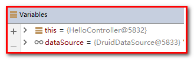

修改配置文件 ，重新安装，再次请求

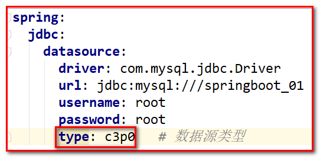

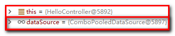

