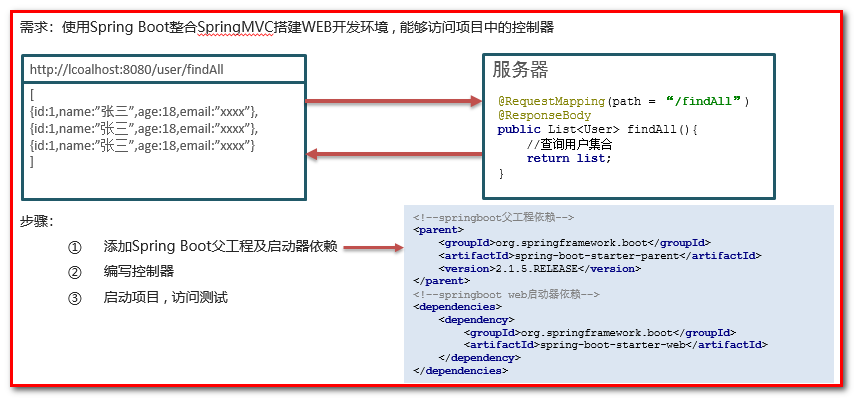
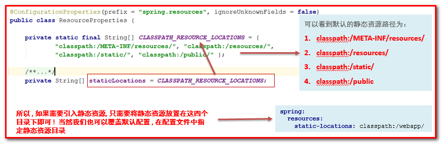
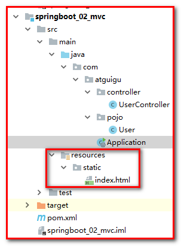
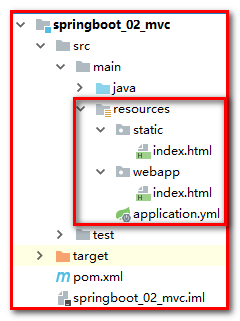
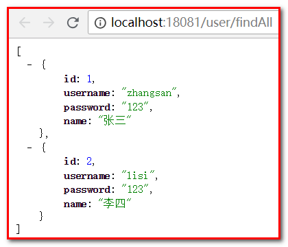

# 第三章 Spring Boot常用启动器(掌握)

## 3.1 SpringBoot整合MVC

创建项目 springboot\_02\_mvc

### 3.1.1 起步依赖

| <**parent**>&#xA;        <**groupId**>org.springframework.boot\</**groupId**>&#xA;        <**artifactId**>spring-boot-starter-parent\</**artifactId**>&#xA;        <**version**>2.3.6.RELEASE\</**version**>&#xA;    \</**parent**>&#xA;&#xA;    <**dependencies**>&#xA;        <**dependency**>&#xA;            <**groupId**>org.springframework.boot\</**groupId**>&#xA;            <**artifactId**>spring-boot-starter-web\</**artifactId**>&#xA;        \</**dependency**>&#xA;    \</**dependencies**>&#xA; |
| ---------------------------------------------------------------------------------------------------------------------------------------------------------------------------------------------------------------------------------------------------------------------------------------------------------------------------------------------------------------------------------------------------------------------------------------------------------------------------------------------------------------- |

① 新建入口程序类 Application

| **package** com.atguigu;&#xA;**import** org.springframework.boot.SpringApplication;&#xA;**import** org.springframework.boot.autoconfigure.SpringBootApplication;&#xA;@SpringBootApplication&#xA;**public** **class** **Application** {&#xA;    **public** **static** **void** **main**(String\[] args) {&#xA;        SpringApplication.run(Application.class,args);&#xA;    }&#xA;}&#xA; |
| ---------------------------------------------------------------------------------------------------------------------------------------------------------------------------------------------------------------------------------------------------------------------------------------------------------------------------------------------------------------------------------------- |

② 新建 javabean

| **package** com.atguigu.pojo;&#xA;**public** **class** **User** {&#xA;    **private** String username ;&#xA;    **private** String password ;&#xA;    **private** Integer age ;&#xA;**private** String sex ;&#xA;…&#xA; |
| ----------------------------------------------------------------------------------------------------------------------------------------------------------------------------------------------------------------------- |

③ 新建 UserController

| **package** com.atguigu.controller;&#xA;**import** com.atguigu.pojo.User;&#xA;**import** org.springframework.stereotype.Controller;&#xA;**import** org.springframework.web.bind.annotation.RequestMapping;&#xA;**import** org.springframework.web.bind.annotation.ResponseBody;&#xA;**import** java.util.ArrayList;&#xA;**import** java.util.List;&#xA;&#xA;@Controller&#xA;@RequestMapping(path = "/user")&#xA;**public** **class** **UserController** {&#xA;&#xA;    @RequestMapping(path = "/findAll")&#xA;    @ResponseBody&#xA;    **public** List\<User> **findAll**(){&#xA;        //查询所有&#xA;        List\<User> users = **new** ArrayList\<User>();&#xA;&#xA;        User user1 = **new** User();&#xA;        user1.setUsername("杨过");&#xA;        user1.setPassword("123456");&#xA;        user1.setAge(18);&#xA;        user1.setSex("男");&#xA;&#xA;        User user2 = **new** User();&#xA;        user2.setUsername("杨过");&#xA;        user2.setPassword("123456");&#xA;        user2.setAge(18);&#xA;        user2.setSex("男");&#xA;&#xA;        User user3 = **new** User();&#xA;        user3.setUsername("杨过");&#xA;        user3.setPassword("123456");&#xA;        user3.setAge(18);&#xA;        user3.setSex("男");&#xA;&#xA;        users.add(user1);&#xA;        users.add(user2);&#xA;        users.add(user3);&#xA;&#xA;        **return** users ;&#xA;    }&#xA;}&#xA; |
| ----------------------------------------------------------------------------------------------------------------------------------------------------------------------------------------------------------------------------------------------------------------------------------------------------------------------------------------------------------------------------------------------------------------------------------------------------------------------------------------------------------------------------------------------------------------------------------------------------------------------------------------------------------------------------------------------------------------------------------------------------------------------------------------------------------------------------------------------------------------------------------------------------------------------------------------------------------------------------------------------------------------------------------------------------------------------------------------------------------------------------------------------------------------------------------------------------------------------------------------------------------------------------------------------------------------------------------------------------------------------------------------------- |

运行程序

### 3.1.2 静态资源目录

在WEB开发中我们经常需要引入一些静态资源 , 例如 : HTML , CSS , JS , 图片等 , 如果是普通的项目静态资源可以放在项目的webapp目录下

现在使用Spring Boot做开发 , 项目中没有webapp目录 , 我们的项目是一个jar工程，那么就没有webapp，我们的静态资源该放哪里呢？

在springboot中有一个叫做ResourceProperties的类，里面就定义了静态资源的默认查找路径：

默认的静态资源路径为：

-   classpath:/META-INF/resources/
-   classpath:/resources/
-   classpath:/static/
-   classpath:/public/

我们只要静态资源放在这些目录中任何一个，SpringMVC都会帮我们处理。 我们习惯会把静态资源放在classpath:/static/ 目录下。在resources目录下创建index.html文件

打开浏览器输入 : http\://localhost:8080/index.html

覆盖路径

如果想要修改默认的静态资源路径, 配置如下 :

新建 application.yml

| spring:&#xA;  resources:&#xA;    **static**-locations: classpath:/webapp/&#xA; |
| ------------------------------------------------------------------------------ |

请求地址 http\://localhost:8080/index.html

### 3.1.3 自定义拦截器

web开发中的拦截器也是我们经常需要使用的组件,可以帮我们完成一些日志记录 , 数据过滤 , 请求过滤等等很多功能，那么在SpringBoot中该如何配置呢？

回顾一下SpringMVC中配置拦截器的步骤 :

1.  编写一个拦截器(实现HandlerInterceptor接口)
2.  注册拦截器(mvc:interceptors)

xml

| \<!--配置拦截器-->&#xA;   <**mvc:interceptors**>&#xA;       <**mvc:interceptor**>&#xA;           \<!--配置拦截路径-->&#xA;           <**mvc:mapping** **path**="/user/ \*\*"/>&#xA;<!--配置不拦截路径:不拦截路径是指从拦截路径中排除-->&#xA;<**mvc:exclude-mapping** **path**="/user/sayByby">\</**mvc:exclude-mapping**>&#xA;           \<!--配置拦截器bean-->&#xA;           <**bean** **class**="com.atguigu.interceptor.LogInterceptor2">\</**bean**>&#xA;       \</**mvc:interceptor**>&#xA;   \</**mvc:interceptors**>&#xA; |
| ------------------------------------------------------------------------------------------------------------------------------------------------------------------------------------------------------------------------------------------------------------------------------------------------------------------------------------------------------------------------------------------------------------------------------------------------------------------------------------------- |

因为SpringBoot没有XML配置文件了 , 所以在SpringBoot中使用拦截器的注册拦截器的方式就不太一样了, 需要借助一个WebMvcConfigurer类帮助我们注册拦截器 , 实现拦截器的具体步骤如下 :

1.  编写一个拦截器
2.  通过WebMvcConfigurer注册拦截器

**编写拦截器**

| **package** com.atguigu.interceptor;&#xA;**import** org.springframework.stereotype.Component;&#xA;**import** org.springframework.web.servlet.HandlerInterceptor;&#xA;**import** javax.servlet.http.HttpServletRequest;&#xA;**import** javax.servlet.http.HttpServletResponse;&#xA;&#xA;@Component&#xA;**public** **class** **MyInterceptor** **implements** **HandlerInterceptor** {&#xA;    @Override&#xA;    **public** **boolean** **preHandle**(HttpServletRequest request, HttpServletResponse response, Object handler) **throws** Exception {&#xA;        System.out.println("MyInterceptor拦截器的preHandle方法执行....");&#xA;        **return** **true**;&#xA;    }&#xA;&#xA;    @Override&#xA;    **public** **void** **postHandle**(HttpServletRequest request, HttpServletResponse response, Object handler, ModelAndView modelAndView) **throws** Exception {&#xA;        System.out.println("MyInterceptor拦截器的postHandle方法执行....");&#xA;    }&#xA;&#xA;    @Override&#xA;    **public** **void** **afterCompletion**(HttpServletRequest request, HttpServletResponse response, Object handler, Exception ex) **throws** Exception {&#xA;        System.out.println("MyInterceptor拦截器的afterCompletion方法执行....");&#xA;    }&#xA;}&#xA; |
| ------------------------------------------------------------------------------------------------------------------------------------------------------------------------------------------------------------------------------------------------------------------------------------------------------------------------------------------------------------------------------------------------------------------------------------------------------------------------------------------------------------------------------------------------------------------------------------------------------------------------------------------------------------------------------------------------------------------------------------------------------------------------------------------------------------------------------------------------------------------------------------------------------------------------------------------------------------------------------------------------------------------------------------------------------------------------------------------------------------------------------------------------------------------------------------------------------------------------------------------- |

**注册拦截器**

| **package** com.atguigu.config;&#xA;**import** com.atguigu.interceptor.MyInterceptor;&#xA;**import** org.springframework.beans.factory.annotation.Autowired;&#xA;**import** org.springframework.context.annotation.Configuration;&#xA;**import** org.springframework.web.servlet.config.annotation.InterceptorRegistry;&#xA;**import** org.springframework.web.servlet.config.annotation.WebMvcConfigurer;&#xA;@Configuration&#xA;**public** **class** **MvcConfig** **implements** **WebMvcConfigurer** {&#xA;&#xA;    @Autowired&#xA;    **private** MyInterceptor myInterceptor ;&#xA;&#xA;    /\*\*&#xA;     \* /\*\*  拦截当前目录及子目录下的所有路径 /user/\*\*   /user/findAll  /user/order/findAll&#xA;     \* /\*   拦截当前目录下的以及子路径   /user/\*     /user/findAll&#xA;     \* @param registry&#xA;     \*/&#xA;    @Override&#xA;    **public** **void** **addInterceptors**(InterceptorRegistry registry) {&#xA;registry.addInterceptor(myInterceptor).addPathPatterns("/ \*\*");&#xA;}&#xA;} |
| ------------------------------------------------------------------------------------------------------------------------------------------------------------------------------------------------------------------------------------------------------------------------------------------------------------------------------------------------------------------------------------------------------------------------------------------------------------------------------------------------------------------------------------------------------------------------------------------------------------------------------------------------------------------------------------------------------------------------------------------------------------------------------------------------------------------------------------------------------------------------------------------------------------------------------------------------------------------------------------- |

打开浏览器,输入 : http\://localhost:8888/user/findAll

## 3.2 SpringBoot整合Spring Data JPA

新建项目 springboot\_jpa

添加Spring Data JPA的起步依赖
&#x20;  &#x20;

| <**parent**>&#xA;        <**groupId**>org.springframework.boot\</**groupId**>&#xA;        <**artifactId**>spring-boot-starter-parent\</**artifactId**>&#xA;        <**version**>2.3.6.RELEASE\</**version**>&#xA;        <**relativePath**/>&#xA;    \</**parent**>&#xA;&#xA;    <**properties**>&#xA;        <**project.build.sourceEncoding**>UTF-8\</**project.build.sourceEncoding**>&#xA;        <**project.reporting.outputEncoding**>UTF-8\</**project.reporting.outputEncoding**>&#xA;        <**java.version**>1.8\</**java.version**>&#xA;    \</**properties**>&#xA;&#xA;    <**dependencies**>&#xA;        <**dependency**>&#xA;            <**groupId**>org.springframework.boot\</**groupId**>&#xA;            <**artifactId**>spring-boot-starter-web\</**artifactId**>&#xA;        \</**dependency**>&#xA;&#xA;        <**dependency**>&#xA;            <**groupId**>org.springframework.boot\</**groupId**>&#xA;            <**artifactId**>spring-boot-starter-test\</**artifactId**>&#xA;            <**scope**>test\</**scope**>&#xA;        \</**dependency**>&#xA;&#xA;        \<!-- springBoot JPA的起步依赖 -->&#xA;        <**dependency**>&#xA;            <**groupId**>org.springframework.boot\</**groupId**>&#xA;            <**artifactId**>spring-boot-starter-data-jpa\</**artifactId**>&#xA;        \</**dependency**>&#xA;&#xA;        \<!-- MySQL连接驱动 -->&#xA;        <**dependency**>&#xA;            <**groupId**>mysql\</**groupId**>&#xA;            <**artifactId**>mysql-connector-java\</**artifactId**>&#xA;        \</**dependency**>&#xA;&#xA;        \<!-- 配置使用redis启动器 -->&#xA;        <**dependency**>&#xA;            <**groupId**>org.springframework.boot\</**groupId**>&#xA;            <**artifactId**>spring-boot-starter-data-redis\</**artifactId**>&#xA;        \</**dependency**>&#xA;&#xA;    \</**dependencies**>&#xA; |
| ----------------------------------------------------------------------------------------------------------------------------------------------------------------------------------------------------------------------------------------------------------------------------------------------------------------------------------------------------------------------------------------------------------------------------------------------------------------------------------------------------------------------------------------------------------------------------------------------------------------------------------------------------------------------------------------------------------------------------------------------------------------------------------------------------------------------------------------------------------------------------------------------------------------------------------------------------------------------------------------------------------------------------------------------------------------------------------------------------------------------------------------------------------------------------------------------------------------------------------------------------------------------------------------------------------------------------------------------------------------------------------------------------------------------------------------------------------------------------------------------------------------------------------------------------------------------------------------------------------------------------------------------------------------------------------------------------------------------------------------------------------------------------------------------------------------------------------------------------------------------------- |

在application.yml中配置数据库和jpa的相关属性

| logging:&#xA;  level:&#xA;    com.atguigu.dao: debug # 配置日志&#xA;spring:&#xA;  datasource:&#xA;    username: root&#xA;    password: root&#xA;    url: jdbc:mysql://127.0.0.1:3306/springboot?useUnicode=**true**\&characterEncoding=utf8\&serverTimezone=Asia/Shanghai&#xA;    driver-**class**-**name**: **com**.**mysql**.**cj**.**jdbc**.**Driver**&#xA;  jpa:&#xA;    database: mysql&#xA;    show-sql: **true**&#xA;    generate-ddl: **true**&#xA;    hibernate:&#xA;      ddl-auto: update&#xA;      naming\_strategy: org.hibernate.cfg.ImprovedNamingStrategy&#xA;server:&#xA;  port: 18081&#xA; |
| -------------------------------------------------------------------------------------------------------------------------------------------------------------------------------------------------------------------------------------------------------------------------------------------------------------------------------------------------------------------------------------------------------------------------------------------------------------------------------------------------------------------------------------------------------------------------------------------------------- |

注意：Mysql8.x版本，连接时url需要指定时区，并且驱动类包名发生了变化。

创建实体配置实体

| **package** com.atguigu.bean;**import **java.io.Serializable;&#xA;&#xA;*/\*\*** \* O - R Mapping  对象关系映射** \*/*&#xA;@Entity *//声明实体类*&#xA;@Table(name = **"user"**) *//声明实体类与哪个表进行映射*&#xA;\*\*public class \*\*User **implements \**Serializable {&#xA;&#xA;    @Id *//声明主键**    *@GeneratedValue(strategy = GenerationType.***IDENTITY***) *//声明主键生成策略：auto\_increment**    *@Column(name = **"id"**) *//表的字段配置：**    \***private \*\*Long **id**;&#xA;&#xA;    @Column(name = **"username"**,nullable = **false**,unique = **true**,length = 16)&#xA;    \*\*private **String **username**;&#xA;&#xA;    @Column(name = **"password"**)&#xA;    **private **String **password**;&#xA;&#xA;    *//如果不指定@Column注解，框架会默认进行映射，字段名和属性名保持一致。**    //@Column(name = "name")**    ***private **String **name**;&#xA;&#xA;    *//设置属性为临时属性，不需要与表进行映射。**    *@Transient&#xA;    \*\*private \*\*String **email**;&#xA;&#xA;    \*\*public \*\*Long getId() {&#xA;        \*\*return \*\***id**;&#xA;    }&#xA;&#xA;    \*\*public void \*\*setId(Long id) {&#xA;        **this**.\*\*id \*\*= id;&#xA;    }&#xA;&#xA;    \*\*public \*\*String getUsername() {&#xA;        \*\*return \*\***username**;&#xA;    }&#xA;&#xA;    \*\*public void \*\*setUsername(String username) {&#xA;        **this**.\*\*username \*\*= username;&#xA;    }&#xA;&#xA;    \*\*public \*\*String getPassword() {&#xA;        \*\*return \*\***password**;&#xA;    }&#xA;&#xA;    \*\*public void \*\*setPassword(String password) {&#xA;        **this**.\*\*password \*\*= password;&#xA;    }&#xA;&#xA;    \*\*public \*\*String getName() {&#xA;        \*\*return \*\***name**;&#xA;    }&#xA;&#xA;    \*\*public void \*\*setName(String name) {&#xA;        **this**.\*\*name \*\*= name;&#xA;    }&#xA;&#xA;    @Override&#xA;    \*\*public \*\*String toString() {&#xA;        \*\*return ****"User{" \*\*+&#xA;                \*\*"id=" \*\*+ \*\*id \*\*+&#xA;                \*\*", username='" \*\*+ \*\*username \*\*+ \*\*'****\\'****' \*\*+&#xA;                \*\*", password='" \*\*+ \*\*password \*\*+ \*\*'****\\'****' \*\*+&#xA;                \*\*", name='" \*\*+ \*\*name \*\*+ \*\*'****\\'****' \*\*+&#xA;                \*\*", email='" \*\*+ \*\*email \*\*+ \*\*'****\\'****' \*\*+&#xA;                **'}'**;&#xA;    }&#xA;&#xA;    \*\*public \*\*String getEmail() {&#xA;        \*\*return \*\***email**;&#xA;    }&#xA;&#xA;    \*\*public void \*\*setEmail(String email) {&#xA;        **this**.\*\*email \*\*= email;&#xA;    }&#xA;}&#xA; |
| ----------------------------------------------------------------------------------------------------------------------------------------------------------------------------------------------------------------------------------------------------------------------------------------------------------------------------------------------------------------------------------------------------------------------------------------------------------------------------------------------------------------------------------------------------------------------------------------------------------------------------------------------------------------------------------------------------------------------------------------------------------------------------------------------------------------------------------------------------------------------------------------------------------------------------------------------------------------------------------------------------------------------------------------------------------------------------------------------------------------------------------------------------------------------------------------------------------------------------------------------------------------------------------------------------------------------------------------------------------------------------------------------------------------------------------------------------------------------------------------------------------------------------------------------------------------------------------------------------------------------------------------------------------------------------------------------------------------------------------------------------------------------------------------------------------------------------------------------------------------------------------------------------------------------------------------------------------------------------------------------------------------------------------------------------------------------------------------------------------------------------------------------------------------------------------------------------------------------------------------------------------------------------------------------------------------------------------------------------------------------------------------------------------------------------------------------------------------------------------------------------------------------------------------------------------------- |

编写UserRepository

| **package** com.atguigu.dao;&#xA;&#xA;**import** com.atguigu.domain.User;&#xA;**import** org.springframework.data.jpa.repository.JpaRepository;&#xA;&#xA;**public** **interface** **UserDao** **extends** **JpaRepository**<**User**,**Integer**> {&#xA;}&#xA; |
| -------------------------------------------------------------------------------------------------------------------------------------------------------------------------------------------------------------------------------------------------------------- |

编写service类

| **package** com.atguigu.service;&#xA;&#xA;**import** com.atguigu.domain.User;&#xA;**import** java.util.List;&#xA;&#xA;**public** **interface** **UserService** {&#xA;    List\<User> **findUsers**();&#xA;&#xA;    User **findUserById**(Long id);&#xA;&#xA;    **void** **saveUser**(User user);&#xA;&#xA;    **void** **updateUser**(User user);&#xA;&#xA;    **void** **deleteUserById**(Long id);&#xA;}&#xA; |
| ---------------------------------------------------------------------------------------------------------------------------------------------------------------------------------------------------------------------------------------------------------------------------------------------------------------------------------------------------------------------------------------------------------------- |

| **package** com.atguigu.service.impl;&#xA;&#xA;**import** com.atguigu.dao.UserDao;&#xA;**import** com.atguigu.domain.User;&#xA;**import** com.atguigu.service.UserService;&#xA;**import** org.springframework.beans.factory.annotation.Autowired;&#xA;**import** org.springframework.stereotype.Service;&#xA;**import** java.util.List;&#xA;&#xA;@Service&#xA;**public** **class** **UserServiceImpl** **implements** **UserService** {&#xA;&#xA;    @Autowired&#xA;    **private** UserDao userDao;&#xA;&#xA;    /\*\*&#xA;     \* 查询所有&#xA;     \* @return&#xA;     \*/&#xA;    @Override&#xA;    **public** List\<User> **findUsers**() {&#xA;        **return** userDao.findAll();&#xA;    }&#xA;    /\*\*&#xA;     \* 根据id查询&#xA;     \* @return&#xA;     \*/&#xA;    @Override&#xA;    **public** User **findUserById**(Long id) {&#xA;        **return** userDao.findById(id).get();&#xA;    }&#xA;    /\*\*&#xA;     \* 保存&#xA;     \* @return&#xA;     \*/&#xA;    @Override&#xA;    **public** **void** **saveUser**(User user) {&#xA;        userDao.save(user);&#xA;    }&#xA;    /\*\*&#xA;     \* 更新&#xA;     \* @return&#xA;     \*/&#xA;    @Override&#xA;    **public** **void** **updateUser**(User user) {&#xA;        userDao.save(user);&#xA;    }&#xA;    /\*\*&#xA;     \* 根据id删除&#xA;     \* @return&#xA;     \*/&#xA;    @Override&#xA;    **public** **void** **deleteUserById**(Long id) {&#xA;        userDao.deleteById(id);&#xA;    }&#xA;}&#xA; |
| ------------------------------------------------------------------------------------------------------------------------------------------------------------------------------------------------------------------------------------------------------------------------------------------------------------------------------------------------------------------------------------------------------------------------------------------------------------------------------------------------------------------------------------------------------------------------------------------------------------------------------------------------------------------------------------------------------------------------------------------------------------------------------------------------------------------------------------------------------------------------------------------------------------------------------------------------------------------------------------------------------------------------------------------------------------------------------------------------------------------------------------------------------------------------------------------------------------------------------------------------------------------------------------------------------------------------------------------------------------------------------------------------------------------------------------------------------------------------------ |

编写controller类

| **package** com.atguigu.controller;&#xA;&#xA;**import** com.atguigu.domain.User;&#xA;**import** com.atguigu.service.UserService;&#xA;**import** org.springframework.beans.factory.annotation.Autowired;&#xA;**import** org.springframework.web.bind.annotation.RequestMapping;&#xA;**import** org.springframework.web.bind.annotation.RestController;&#xA;&#xA;**import** java.util.List;&#xA;&#xA;@RestController&#xA;@RequestMapping("/user")&#xA;**public** **class** **UserController** {&#xA;&#xA;    @Autowired&#xA;    **private** UserService userService;&#xA;&#xA;    @RequestMapping("/findAll")&#xA;    **public** List\<User> **findAll**(){&#xA;        **return** userService.findUsers();&#xA;    }&#xA;}&#xA; |
| ------------------------------------------------------------------------------------------------------------------------------------------------------------------------------------------------------------------------------------------------------------------------------------------------------------------------------------------------------------------------------------------------------------------------------------------------------------------------------------------------------------------------------------------------------------------------------------------------------------------------------------------------------------------------------------------------------------------------------ |

编写主程序类

| \*\*package \*\*com.atguigu;&#xA;&#xA;\*\*import \*\*org.springframework.boot.SpringApplication;&#xA;\*\*import \*\*org.springframework.boot.autoconfigure.SpringBootApplication;&#xA;&#xA;@SpringBootApplication&#xA;\*\*public class \*\*Application {&#xA;    \*\*public static void \*\*main(String\[] args) {&#xA;        SpringApplication.*run*(Application.**class**,args);&#xA;    }&#xA;}&#xA; |
| :----------------------------------------------------------- |

测试运行

