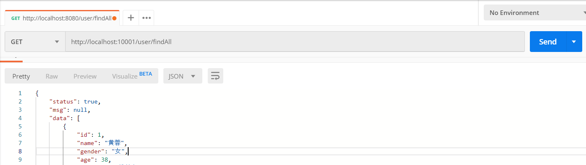
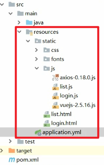
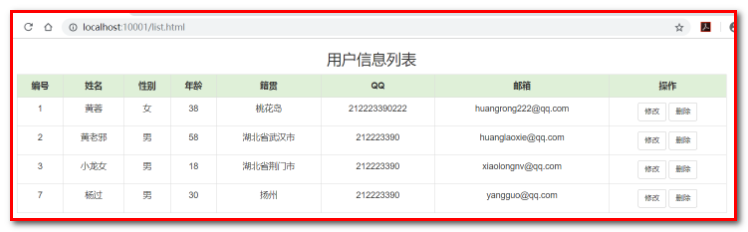
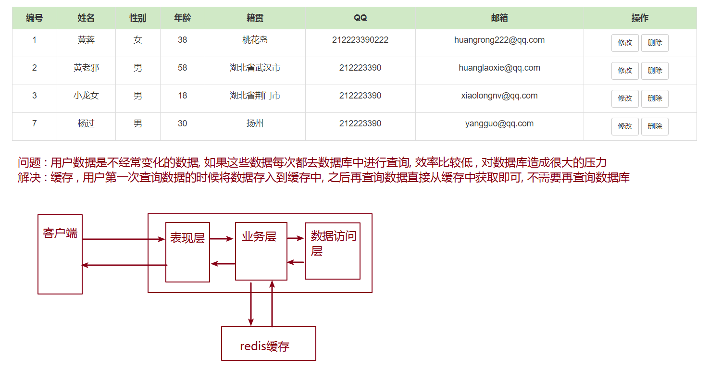

# 第四章 Spring Boot综合案例(应用)

## 4.2 环境搭建

### 4.2.1 数据库准备

| **create** **database** springboot character **set** utf8 ;&#xA;&#xA;**use** springboot ; &#xA;&#xA;**CREATE** **TABLE** \`tb\_user\` (&#xA;  \`id\` int(11) **NOT** NULL AUTO\_INCREMENT,&#xA;  \`name\` varchar(20) **NOT** NULL,&#xA;  \`gender\` varchar(5) **DEFAULT** NULL,&#xA;  \`age\` int(11) **DEFAULT** NULL,&#xA;  \`address\` varchar(32) **DEFAULT** NULL,&#xA;  \`qq\` varchar(20) **DEFAULT** NULL,&#xA;  \`email\` varchar(50) **DEFAULT** NULL,&#xA;  \`username\` varchar(20) **NOT** NULL,&#xA;  \`phone\` varchar(11) **DEFAULT** NULL,&#xA;  **PRIMARY** **KEY** (\`id\`),&#xA;  **UNIQUE** **KEY** \`user\_username\_uindex\` (\`username\`)&#xA;) **ENGINE**=**InnoDB** AUTO\_INCREMENT=8 **DEFAULT** **CHARSET**=utf8;&#xA;&#xA;**INSERT** **INTO** \`tb\_user\` **VALUES** (1,'黄蓉','女',38,'桃花岛','212223390222','<huangrong222@qq.com>','huangrong','15600003333'),(2,'黄老邪','男',58,'湖北省武汉市','212223390','<huanglaoxie@qq.com>','huanglaoxie','15872320405'),(3,'小龙女','男',18,'湖北省荆门市','212223390','<xiaolongnv@qq.com>','xiaolongnv','15600004444'),(7,'杨过','男',30,'扬州','212223390','<yangguo@qq.com>','yangguo','15600005555');&#xA; |
| -------------------------------------------------------------------------------------------------------------------------------------------------------------------------------------------------------------------------------------------------------------------------------------------------------------------------------------------------------------------------------------------------------------------------------------------------------------------------------------------------------------------------------------------------------------------------------------------------------------------------------------------------------------------------------------------------------------------------------------------------------------------------------------------------------------------------------------------------------------------------------------------------------------------------------------------------------------------------------------------------------------------------------------------------------------------------------------------------------------------------------------------------------------- |

### 4.2.2 创建项目及包结构

创建项目 springboot\_case

### 4.2.3 导入依赖

| <**parent**>&#xA;    <**groupId**>org.springframework.boot\</**groupId**>&#xA;    <**artifactId**>spring-boot-starter-parent\</**artifactId**>&#xA;    <**version**>2.3.6.RELEASE\</**version**>&#xA;\</**parent**>&#xA;&#xA;<**dependencies**>&#xA;    *\<!--单元测试启动器-->*&#xA;\*    *<**dependency**>&#xA;        <**groupId**>org.springframework.boot\</**groupId**>&#xA;        <**artifactId**>spring-boot-starter-test\</**artifactId**>&#xA;    \</**dependency**>&#xA;&#xA;    *\<!--通用mapper启动器依赖-->**    *<**dependency**>&#xA;        <**groupId**>tk.mybatis\</**groupId**>&#xA;        <**artifactId**>mapper-spring-boot-starter\</**artifactId**>&#xA;        <**version**>2.1.5\</**version**>&#xA;    \</**dependency**>&#xA;    *\<!--JDBC启动器依赖-->**    *<**dependency**>&#xA;        <**groupId**>org.springframework.boot\</**groupId**>&#xA;        <**artifactId**>spring-boot-starter-jdbc\</**artifactId**>&#xA;    \</**dependency**>&#xA;    *\<!--mysql驱动-->**    *<**dependency**>&#xA;        <**groupId**>mysql\</**groupId**>&#xA;        <**artifactId**>mysql-connector-java\</**artifactId**>&#xA;        <**version**>5.1.47\</**version**>&#xA;    \</**dependency**>&#xA;    *\<!--druid启动器依赖-->**    *<**dependency**>&#xA;        <**groupId**>com.alibaba\</**groupId**>&#xA;        <**artifactId**>druid-spring-boot-starter\</**artifactId**>&#xA;        <**version**>1.1.10\</**version**>&#xA;    \</**dependency**>&#xA;    *\<!--web启动器依赖-->**    *<**dependency**>&#xA;        <**groupId**>org.springframework.boot\</**groupId**>&#xA;        <**artifactId**>spring-boot-starter-web\</**artifactId**>&#xA;    \</**dependency**>&#xA;&#xA;    *\<!--spring boot actuator依赖-->**    *<**dependency**>&#xA;        <**groupId**>org.springframework.boot\</**groupId**>&#xA;        <**artifactId**>spring-boot-starter-actuator\</**artifactId**>&#xA;    \</**dependency**>&#xA;&#xA;    *\<!--编码工具包-->**    *<**dependency**>&#xA;        <**groupId**>org.apache.commons\</**groupId**>&#xA;        <**artifactId**>commons-lang3\</**artifactId**>&#xA;    \</**dependency**>&#xA;&#xA;    *\<!--热部署 -->**    *<**dependency**>&#xA;        <**groupId**>org.springframework.boot\</**groupId**>&#xA;        <**artifactId**>spring-boot-devtools\</**artifactId**>&#xA;        <**scope**>runtime\</**scope**>&#xA;        <**optional**>true\</**optional**>&#xA;    \</**dependency**>&#xA;&#xA;\</**dependencies**>&#xA;&#xA;<**build**>&#xA;    <**plugins**>&#xA;        *\<!--spring boot maven插件 , 可以将项目运行依赖的jar包打到我们的项目中-->**        \*<**plugin**>&#xA;            <**groupId**>org.springframework.boot\</**groupId**>&#xA;            <**artifactId**>spring-boot-maven-plugin\</**artifactId**>&#xA;        \</**plugin**>&#xA;    \</**plugins**>&#xA;\</**build**>&#xA; |
| --------------------------------------------------------------------------------------------------------------------------------------------------------------------------------------------------------------------------------------------------------------------------------------------------------------------------------------------------------------------------------------------------------------------------------------------------------------------------------------------------------------------------------------------------------------------------------------------------------------------------------------------------------------------------------------------------------------------------------------------------------------------------------------------------------------------------------------------------------------------------------------------------------------------------------------------------------------------------------------------------------------------------------------------------------------------------------------------------------------------------------------------------------------------------------------------------------------------------------------------------------------------------------------------------------------------------------------------------------------------------------------------------------------------------------------------------------------------------------------------------------------------------------------------------------------------------------------------------------------------------------------------------------------------------------------------------------------------------------------------------------------------------------------------------------------------------------------------------------------------------------------------------------------------------------------------------------------------------------------------------------------------------------------------------------------------------------------------------------------------------------------------------------------------------------------------------------------------------------------------------------------------------------------------------------------------------------------------------------------------------------------------------------------------------------------------------------------------------------------------------------------------------------------------------------------------------------------------------------------------------------------------------------------------------------------------------------------------------------------------------------------------------------------------------------------------------------------------- |

### 4.2.4 创建启动类

| **package** com.atguigu;&#xA;&#xA;**import** org.springframework.boot.SpringApplication;&#xA;**import** org.springframework.boot.autoconfigure.SpringBootApplication;&#xA;**import** tk.mybatis.spring.annotation.MapperScan;&#xA;&#xA;@SpringBootApplication&#xA;@MapperScan(basePackages = "com.atguigu.dao")&#xA;@EnableTransactionManagement&#xA;**public** **class** **Application** {&#xA;    **public** **static** **void** **main**(String\[] args) {&#xA;        SpringApplication.run(Application.class,args);&#xA;    }&#xA;}&#xA; |
| --------------------------------------------------------------------------------------------------------------------------------------------------------------------------------------------------------------------------------------------------------------------------------------------------------------------------------------------------------------------------------------------------------------------------------------------------------------------------------------------------------------------------------------------- |

## 4.3 数据访问层

### 4.3.1 编写配置文件application.yml

| server:&#xA;  port: 10001&#xA;spring:&#xA;  datasource:&#xA;    driver-**class**\*\*-name\*\*: com.mysql.jdbc.Driver&#xA;    url: jdbc:mysql:///springboot&#xA;    username: root&#xA;    password: root&#xA;    type: com.alibaba.druid.pool.DruidDataSource&#xA;mybatis:&#xA;  **type**\*\*-aliases-package\*\*: com.atguigu.pojo&#xA; |
| ---------------------------------------------------------------------------------------------------------------------------------------------------------------------------------------------------------------------------------------------------------------------------------------------------------------------------------------- |

### 4.3.2 编写实体类User

| package com.atguigu.pojo;&#xA;&#xA;import java.io.Serializable;&#xA;&#xA;@Entity&#xA;@Table(name = "tb\_user")&#xA;public class User implements Serializable {&#xA;    private Integer id;&#xA;    private String name;&#xA;    private String gender;&#xA;    private Integer age;&#xA;    private String address;&#xA;    private String qq;&#xA;    private String email;&#xA;    private String username;&#xA;    private String phone;&#xA;…&#xA; |
| ------------------------------------------------------------------------------------------------------------------------------------------------------------------------------------------------------------------------------------------------------------------------------------------------------------------------------------------------------------------------------------------------------------------------------------------------------ |

### 4.3.3 Mapper接口和映射配置

| **package** com.atguigu.dao;&#xA;&#xA;**import** com.atguigu.pojo.User;&#xA;**import** tk.mybatis.mapper.common.Mapper;&#xA;**import** java.util.List;&#xA;&#xA;**public** **interface** **UserMapper** **extends** **Mapper**<**User**> {&#xA;}&#xA; |
| ----------------------------------------------------------------------------------------------------------------------------------------------------------------------------------------------------------------------------------------------------- |

### 4.3.4 编写测试代码

| @RunWith(SpringRunner.class)&#xA;@SpringBootTest&#xA;**public** **class** **UserMapperTest** {&#xA;&#xA;    @Autowired&#xA;    **private** UserMapper userMapper ;&#xA;&#xA;    @Test&#xA;    **public** **void** **findAll**() {&#xA;        List\<User> users = userMapper.selectAll();&#xA;        System.out.println(users);&#xA;    }&#xA;}&#xA; |
| ----------------------------------------------------------------------------------------------------------------------------------------------------------------------------------------------------------------------------------------------------------------------------------------------------------------------------------------------------- |

## 4.4 业务层

### 4.4.1编写接口

| **public** **interface** **UserService** {&#xA;&#xA;    /\*\*&#xA;     \* 查询所有用户信息&#xA;     \* @return&#xA;     \*/&#xA;    **public** List\<User> **findAll**();&#xA;}&#xA; |
| ---------------------------------------------------------------------------------------------------------------------------------------------------------------------------- |

### 4.4.2 编写实现类

| **package** com.atguigu.service.impl;&#xA;&#xA;**import** com.atguigu.dao.UserMapper;&#xA;**import** com.atguigu.pojo.User;&#xA;**import** com.atguigu.service.UserService;&#xA;**import** org.springframework.beans.factory.annotation.Autowired;&#xA;**import** org.springframework.stereotype.Service;&#xA;**import** java.util.List;&#xA;&#xA;@Service&#xA;**public** **class** **UserServiceImpl** **implements** **UserService** {&#xA;    @Autowired&#xA;**private** UserMapper userMapper;&#xA;&#xA;@Override&#xA;@Transactional(readOnly = true ,propagation = Propagation.SUPPORTS)&#xA;    **public** List\<User> **findAll**() {&#xA;        **return** userMapper.selectAll();&#xA;    }&#xA;}&#xA; |
| ---------------------------------------------------------------------------------------------------------------------------------------------------------------------------------------------------------------------------------------------------------------------------------------------------------------------------------------------------------------------------------------------------------------------------------------------------------------------------------------------------------------------------------------------------------------------------------------------------------------------------------------------------------------------------------------------------------------- |

### 4.4.3 编写测试代码

| @RunWith(SpringRunner.class)&#xA;@SpringBootTest&#xA;**public** **class** **UserServiceTest** {&#xA;&#xA;    @Autowired&#xA;    **private** UserService userService;&#xA;&#xA;    @Test&#xA;    **public** **void** **findAll**() {&#xA;        List\<User> users = userService.findAll();&#xA;        System.out.println(users);&#xA;    }&#xA;}&#xA; |
| ------------------------------------------------------------------------------------------------------------------------------------------------------------------------------------------------------------------------------------------------------------------------------------------------------------------------------------------------------ |

Spring Boot整合单元测试 , 需要在测试类上添加二个注解

1.  @RunWith(SpringRunner.class)指定Junit核心运行类
2.  @SpringBootTest 指定这是一个Spring Boot的测试类, 运行时会自动加载Spring Boot运行环境

## 4.5 表现层

### 4.5.1 引入起步依赖

| \<!--Web起步依赖-->&#xA;<**dependency**>&#xA;    <**groupId**>org.springframework.boot\</**groupId**>&#xA;    <**artifactId**>spring-boot-starter-web\</**artifactId**>&#xA;\</**dependency**>&#xA;&#xA;\<!--编码工具包-->&#xA;<**dependency**>&#xA;    <**groupId**>org.apache.commons\</**groupId**>&#xA;    <**artifactId**>commons-lang3\</**artifactId**>&#xA;\</**dependency**>&#xA; |
| --------------------------------------------------------------------------------------------------------------------------------------------------------------------------------------------------------------------------------------------------------------------------------------------------------------------------------------------------------------------------------- |

### 4.5.2 新建工具类

| **package** com.atguigu.utils;&#xA;&#xA;**import** java.io.Serializable;&#xA;&#xA;**public** **class** **Result** **implements** **Serializable** {&#xA;    **private** **boolean** status ; //响应状态  true  false&#xA;    **private** String msg ;  // 响应信息&#xA;    **private** Object data ;  //处理成功的响应数据&#xA;&#xA;    **public** **static** Result **ok**(Object data){&#xA;        Result result = **new** Result();&#xA;        result.setStatus(**true**);&#xA;        result.setData(data);&#xA;        **return**  result ;&#xA;    }&#xA;&#xA;    **public** **static** Result **error**(String msg){&#xA;        Result result = **new** Result();&#xA;        result.setStatus(**false**);&#xA;        result.setMsg(msg);&#xA;        **return**  result ;&#xA;    }&#xA;    &#xA;    // 生成set get tostring方法&#xA;    &#xA;}  &#xA; |
| --------------------------------------------------------------------------------------------------------------------------------------------------------------------------------------------------------------------------------------------------------------------------------------------------------------------------------------------------------------------------------------------------------------------------------------------------------------------------------------------------------------------------------------------------------------------------------------------------------------------------------------------------------------------------------------------------------------------------------------------------------------------------------------------------------------------------------------------- |

&#x20;&#x20;

### 4.5.3 编写表现层代码

| @Controller&#xA;@RequestMapping(path = "/user")&#xA;**public** **class** **UserController** {&#xA;&#xA;    @Autowired&#xA;    **private** UserService userService;&#xA;&#xA;    /\*\*&#xA;     \* 查询所有用户信息&#xA;     \* @return&#xA;     \*/&#xA;    @RequestMapping(path = "/findAll")&#xA;    @ResponseBody&#xA;    **public** Result **findAll**() {&#xA;        List\<User> users = userService.findAll();&#xA;        **return** Result.ok(users);&#xA;    }&#xA;}&#xA; |
| --------------------------------------------------------------------------------------------------------------------------------------------------------------------------------------------------------------------------------------------------------------------------------------------------------------------------------------------------------------------------------------------------------------------------------------------------------------------------- |

### 4.5.4 代码测试

使用postman进行测试

## 4.6 页面展示

在resources目录下创建static目录 , 将提供的页面复制进来 , 修改即可 :

-   页面异步请求的端口和服务器端口一致
-   页面异步请求访问的路径和对应的表现层控制方法路径要致
-   页面异步请求参数名称和和对应的表现层控制方法参数一致

修改之后, 访问页面即可 : localhost:10001/list.html

## 4.7 缓存优化

### 4.7.1 缓存需求

### 4.7.2 引入起步依赖

| \<!--springboot整合redis启动器-->&#xA;<**dependency**>&#xA;    <**groupId**>org.springframework.boot\</**groupId**>&#xA;    <**artifactId**>spring-boot-starter-data-redis\</**artifactId**>&#xA;\</**dependency**>&#xA; |
| ------------------------------------------------------------------------------------------------------------------------------------------------------------------------------------------------------------------- |

### 4.7.3 编写配置文件

| spring:&#xA;  redis: # 配置redis&#xA;    host: 192.168.197.129&#xA;    port: 6379&#xA; |
| ------------------------------------------------------------------------------------ |

### 4.7.4 修改业务层实现类代码

| **package** com.atguigu.service.impl;&#xA;&#xA;**import** com.atguigu.mapper.UserMapper;&#xA;**import** com.atguigu.pojo.User;&#xA;**import** com.atguigu.service.UserService;&#xA;**import** org.springframework.beans.factory.annotation.Autowired;&#xA;**import** org.springframework.data.redis.core.RedisTemplate;&#xA;**import** org.springframework.stereotype.Service;&#xA;**import** org.springframework.transaction.annotation.Propagation;&#xA;**import** org.springframework.transaction.annotation.Transactional;&#xA;**import** java.util.List;&#xA;&#xA;@Service&#xA;**public** **class** **UserServiceImpl** **implements** **UserService** {&#xA;&#xA;    @Autowired&#xA;    **private** UserMapper userMapper ;&#xA;    @Autowired&#xA;    **private** RedisTemplate redisTemplate ;&#xA;&#xA;    @Override&#xA;    @Transactional(readOnly = **true** ,propagation = Propagation.SUPPORTS)&#xA;    **public** List\<User> **findAll**() {&#xA;        //从缓存中查询数据  规定存储用户信息使用string类型进行存储, 存储的key就是userList&#xA;        List\<User> userList = (List\<User>) redisTemplate.boundValueOps("userList").get();&#xA;        //如果缓存中没有数据, 查询数据库 , 将查询到的数据放入缓存&#xA;        **if**(userList==**null**){&#xA;            userList = userMapper.selectAll();&#xA;            redisTemplate.boundValueOps("userList").set(userList);&#xA;            System.out.println("从数据库中查询...");&#xA;        }**else** {&#xA;            System.out.println("从缓存中查询.....");&#xA;        }&#xA;        //如果缓存中有数据, 直接返回&#xA;        **return** userList ;&#xA;    }&#xA;}&#xA; |
| --------------------------------------------------------------------------------------------------------------------------------------------------------------------------------------------------------------------------------------------------------------------------------------------------------------------------------------------------------------------------------------------------------------------------------------------------------------------------------------------------------------------------------------------------------------------------------------------------------------------------------------------------------------------------------------------------------------------------------------------------------------------------------------------------------------------------------------------------------------------------------------------------------------------------------------------------------------------------------------------------------------------------------------------------------------------------------------------------------------------------------------------------------------------------------------------------------------------------------------------------------------------------------------------------------------------------------------------------------------------------------------------------------------------------------------------------------------------------------------------------------------------------------------------------------------------------- |
