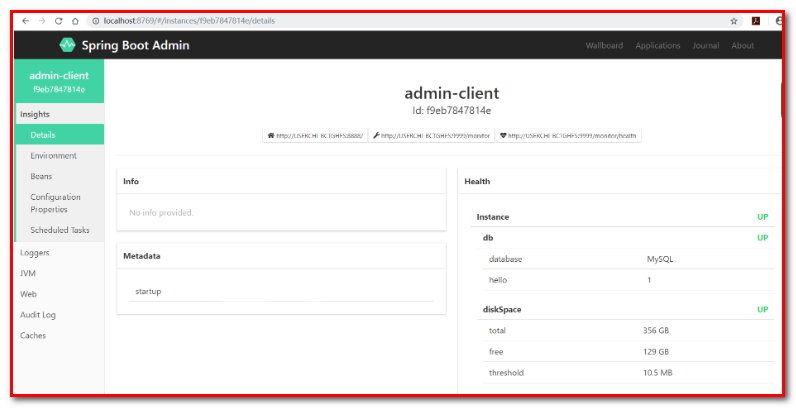
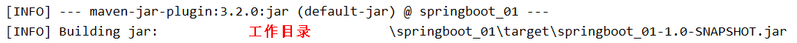
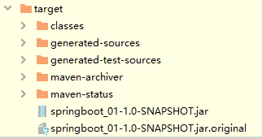

# 第五章 Spring Boot其他组件（了解）

## 5.1 SpringBoot Actuator组件

**Spring Boot Actuator**是SpringBoot自带的一个组件 , 可以帮助我们监控和管理Spring Boot应用，比如健康检查、审计、统计和HTTP追踪等。

**引入SpringBoot Actuator起步依赖**

| <**dependency**>&#xA;    <**groupId**>org.springframework.boot\</**groupId**>&#xA;    <**artifactId**>spring-boot-starter-actuator\</**artifactId**>&#xA;\</**dependency**>&#xA; |
| -------------------------------------------------------------------------------------------------------------------------------------------------------------------------------- |

**配置SpringBoot Actuator参数**

| management:&#xA;endpoints:&#xA;web:&#xA;exposure:&#xA;include: ' \*'  # 对外暴露的访问入口 , 默认是/health和/info&#xA;base-path: /monitor # 默认是actuator&#xA;endpoint:&#xA;health:&#xA;show-details: ALWAYS	# 显示所有健康状态&#xA;server:&#xA;port: 9999 |
| ----------------------------------------------------------------------------------------------------------------------------------------------------------------------------------------------------------------------------------- |

**启动项目获取系统信息**

项目启动之后就可以通过发送http请求获取系统健康数据了 , 例如 : http\://localhost:9999/monitor/health , 返回数据如下 :

| {&#xA;    "**status**": "UP",&#xA;    "**details**": {&#xA;        "**db**": {&#xA;            "**status**": "UP",&#xA;            "**details**": {&#xA;                "**database**": "MySQL",&#xA;                "**hello**": 1&#xA;            }&#xA;        },&#xA;        "**diskSpace**": {&#xA;            "**status**": "UP",&#xA;            "**details**": {&#xA;                "**total**": 355816562688,&#xA;                "**free**": 129251151872,&#xA;                "**threshold**": 10485760&#xA;            }&#xA;        },&#xA;        "**redis**": {&#xA;            "**status**": "UP",&#xA;            "**details**": {&#xA;                "**version**": "2.8.9"&#xA;            }&#xA;        }&#xA;    }&#xA;}&#xA; |
| ---------------------------------------------------------------------------------------------------------------------------------------------------------------------------------------------------------------------------------------------------------------------------------------------------------------------------------------------------------------------------------------------------------------------------------------------------------------------------------------------------------------------------------------------------------------------------------------------------------------------------------------------------------------------------------------------------------------------------------------------------- |

常用的访问路径如下 :

| HTTP 方法&#xA; | 路径&#xA;              | 描述&#xA;                                         |
| ------------ | -------------------- | ----------------------------------------------- |
| GET&#xA;     | /autoconfig&#xA;     | 提供了一份自动配置报告，记录哪些自动配置条件通过了，哪些没通过&#xA;            |
| GET&#xA;     | /**configprops**     | 描述配置属性(包含默认值)如何注入Bean&#xA;                      |
| GET&#xA;     | /**beans**           | 描述应用程序上下文里全部的Bean，以及它们的关系&#xA;                  |
| GET&#xA;     | /dump&#xA;           | 获取线程活动的快照&#xA;                                  |
| GET&#xA;     | /**env**             | 获取全部环境属性&#xA;                                   |
| GET&#xA;     | /env/{name}&#xA;     | 根据名称获取特定的环境属性值&#xA;                             |
| GET&#xA;     | /**health**          | 报告应用程序的健康指标，这些值由HealthIndicator的实现类提供&#xA;      |
| GET&#xA;     | /info&#xA;           | 获取应用程序的定制信息，这些信息由info打头的属性提供&#xA;               |
| GET&#xA;     | /**mappings**        | 描述全部的URI路径，以及它们和控制器(包含Actuator端点)的映射关系&#xA;     |
| GET&#xA;     | /metrics&#xA;        | 报告各种应用程序度量信息，比如内存用量和HTTP请求计数&#xA;               |
| GET&#xA;     | /metrics/{name}&#xA; | 报告指定名称的应用程序度量值&#xA;                             |
| POST&#xA;    | /shutdown&#xA;       | 关闭应用程序，要求endpoints.shutdown.enabled设置为true&#xA; |
| GET&#xA;     | /trace&#xA;          | 提供基本的HTTP请求跟踪信息(时间戳、HTTP头等)&#xA;                |

我们可以通过发送这些请求, 获取系统状态信息

## 5.2 SpringBoot Admin组件

上面我们讲了Spring Boot Actuator , 可以通过http协议获取系统状态信息 , 但是返回的是JSON格式数据, 看起来不太方面, 而且还需要记忆路径, 比较麻烦 , Spring Boot Admin给我们提供了更加友好的可视化界面来查看这些信息 !

Spring Boot Admin是一个开源社区项目，用于管理和监控SpringBoot应用程序。 应用程序作为Spring Boot Admin Client向Spring Boot Admin Server注册 , Client会定时向Server发送数据, Server使用友好的界面展示数据。

### 5.2.1 SpringBoot Admin服务端

1.  **创建项目**springboot-admin-server
2.  **起步依赖**

| \<?xml version="1.0" encoding="UTF-8"?>&#xA;<**project** **xmlns**="<http://maven.apache.org/POM/4.0.0>"&#xA;         **xmlns:xsi**="<http://www.w3.org/2001/XMLSchema-instance>"&#xA;         **xsi:schemaLocation**="<http://maven.apache.org/POM/4.0.0> <http://maven.apache.org/xsd/maven-4.0.0.xsd>">&#xA;    <**modelVersion**>4.0.0\</**modelVersion**>&#xA;&#xA;    <**parent**>&#xA;        <**groupId**>org.springframework.boot\</**groupId**>&#xA;        <**artifactId**>spring-boot-starter-parent\</**artifactId**>&#xA;        <**version**>2.3.6.RELEASE\</**version**>&#xA;    \</**parent**>&#xA;&#xA;    <**properties**>&#xA;        <**java.version**>1.8\</**java.version**>&#xA;    \</**properties**>&#xA;&#xA;    <**dependencies**>&#xA;&#xA;        <**dependency**>&#xA;            <**groupId**>org.springframework.boot\</**groupId**>&#xA;            <**artifactId**>spring-boot-starter-web\</**artifactId**>&#xA;        \</**dependency**>&#xA;        <**dependency**>&#xA;            <**groupId**>de.codecentric\</**groupId**>&#xA;            <**artifactId**>spring-boot-admin-starter-server\</**artifactId**>&#xA;            <**version**>2.2.0\</**version**>&#xA;        \</**dependency**>&#xA;    \</**dependencies**>&#xA;\</**project**>&#xA; |
| ------------------------------------------------------------------------------------------------------------------------------------------------------------------------------------------------------------------------------------------------------------------------------------------------------------------------------------------------------------------------------------------------------------------------------------------------------------------------------------------------------------------------------------------------------------------------------------------------------------------------------------------------------------------------------------------------------------------------------------------------------------------------------------------------------------------------------------------------------------------------------------------------------------------------------------------------------------------------------------------------------------------------------------------------------------------------------------------------------------------------------------------------------------------------------------------------------------------------------------------------------------------------------------------------ |

1.  **配置application.yml**

| spring:&#xA;  application:&#xA;    name: admin-server&#xA;server:&#xA;  port: 8769&#xA; |
| --------------------------------------------------------------------------------------- |

Spring Boot Admin 端口号 8769

1.  **启动类**

| @SpringBootApplication&#xA;**@EnableAdminServer****public** **class** **Application** {&#xA;    **public** **static** **void** **main**(String\[] args) {&#xA;        SpringApplication.run(Application.class,args);&#xA;    }&#xA;}&#xA; |
| ----------------------------------------------------------------------------------------------------------------------------------------------------------------------------------------------------------------------------------------- |

@EnableAdminServer , 开启管理服务

### 5.2.2 SpringBoot Admin客户端

1.  **起步依赖**

| <**dependency**>&#xA;    <**groupId**>de.codecentric\</**groupId**>&#xA;    <**artifactId**>spring-boot-admin-starter-client\</**artifactId**>&#xA;    <**version**>2.2.0\</**version**>&#xA;\</**dependency**>&#xA; |
| -------------------------------------------------------------------------------------------------------------------------------------------------------------------------------------------------------------------- |

1.  **配置**

向admin-server注册的地址为http\://localhost:8769，最后暴露自己的actuator的所有端口信息，具体配置如下：

| server:&#xA;port: 9999&#xA;spring:&#xA;application:&#xA;name: admin-client&#xA;boot:&#xA;admin:&#xA;client:&#xA;url: <http://localhost:8769>   # 指定注册地址 , Spring Boot Admin Server地址&#xA;management:&#xA;endpoints:&#xA;web:&#xA;exposure:&#xA;include: ' \*'&#xA;endpoint:&#xA;health:&#xA;show-details: ALWAYS |
| ---------------------------------------------------------------------------------------------------------------------------------------------------------------------------------------------------------------------------------------------------------------------------------------------------------------- |

注册地址一定要和Spring Boot Admin Server地址匹配

### 5.3.3 启动测试

分别开启客户端(应用程序)和服务端 ,访问http\://localhost:8769 , 可以看到如下界面

# 六. Spring Boot项目打包部署(应用)

## 6.1 项目打包

1.  在pom.xml中配置Spring Boot项目的maven插件

| <**build**>&#xA;    <**plugins**>&#xA;        \<!-- 打jar包时如果不配置该插件，打出来的jar包没有清单文件 -->&#xA;        <**plugin**>&#xA;            <**groupId**>org.springframework.boot\</**groupId**>&#xA;            <**artifactId**>spring-boot-maven-plugin\</**artifactId**>&#xA;        \</**plugin**>&#xA;    \</**plugins**>&#xA;\</**build**>&#xA; |
| ---------------------------------------------------------------------------------------------------------------------------------------------------------------------------------------------------------------------------------------------------------------------------------------------------------------------------------------- |

1.  运行maven的打包命令 : package
2.  打包之前我们需要跳过测试 , 如果不跳过测试那么我们编写的测试类都会被maven自动执行, 可能会出现错误,导致打包不成功
3.  执行之后可以在控制台看到打包的日志信息, 其中有生成的包的位置

打开指定目录就可以发现有一个jar包存在 , 仔细观察其实我们会发现 , 在target目录下其实会存在二个jar包 , 一个是springboot\_01-1.0-SNAPSHOT.jar一个是springboot\_01-1.0-SNAPSHOT.jar.original , 那么这两个jar包有什么区别呢?

我们如果是普通项目打包那么就只会得到一个jar包 , 这个jar包中不包含项目的一些依赖jar包

但是我们现在是一个Spring Boot项目 , 我们希望打完的包能够直接运行, 所以项目中就必须包含他的依赖jar包 , 我们之前在pom.xml中配置一个Spring Boot的maven插件可以在普通包的基础上将我们项目的一些运行及依赖信息打进jar包里面 , 打完包之后将原来的普通包改名为xxx.jar.original , 新打的包为xxx.jar .

1.  简单总结一下 :

-   .jar.original 是普通jar包，不包含依赖
-   .jar 是可执行jar包，包含了pom中的所有依赖，可以直接用java -jar 命令执行
-   如果是部署，就用.jar , 如果是给别的项目用，就要给.jar.original这个包，把.original后缀去掉即可

## 6.2 项目运行

打开命令行运行打出来的包；使用命令：java –jar 包全名

| **java** -jar springboot\_01-1.0-SNAPSHOT.jar&#xA; |
| -------------------------------------------------- |
