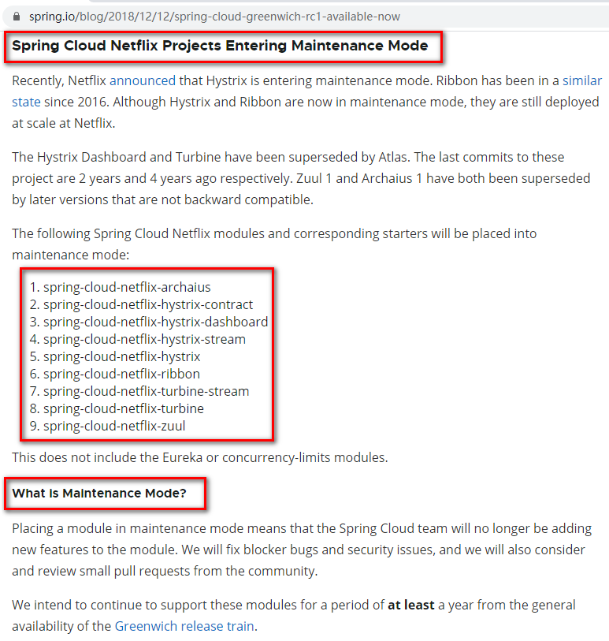

# 第十章 SpringCloud Alibaba入门简介

## why会出现SpringCloud alibaba

Spring Cloud Netflix项目进入维护模式

[https://spring.io/blog/2018/12/12/spring-cloud-greenwich-rc1-available-now](https://spring.io/blog/2018/12/12/spring-cloud-greenwich-rc1-available-now "https://spring.io/blog/2018/12/12/spring-cloud-greenwich-rc1-available-now")

说明：

**Spring Cloud Netflix项目进入维护模式**

最近，Netflix宣布Hystrix正在进入维护模式。自2016年以来，Ribbon已处于类似状态。

虽然Hystrix和Ribbon现已处于维护模式，但它们仍然在Netflix大规模部署。

Hystrix Dashboard和Turbine已被Atlas取代。这些项目的最后一次提交是2年和4年前。Zuul1和Archaius1都被后来不兼容的版本所取代。

这不包括Eureka或并发限制模块。

**什么是维护模式？**

将模块置于维护模式，意味着SpringCloud团队将不会再向模块添加新功能。我们将修复block级别的bug以及安全问题，我们也会考虑并审查社区的小型pull request。

我们打算继续支持这些模块，直到Greenwich版本被普遍采用至少一年。

**进入维护模式意味着什么？**

Spring Cloud Netflix将不再开放新的组件

我们都知道SpringCloud版本迭代算是比较快的，因而出现了很多重大ISSU都还来不及Fix就又推出另一个Release了。

进入维护模式意思就是目前以致以后一段时间SpringCloud netflix提供的服务和功能就这么多了，不再开发新的组件和功能了。以后将以维护和Merge分支Pull Request为主。

新组件功能将以其他替代的方式实现

## SpringCloud alibaba带来了什么？

### 是什么

诞生：2018.10.31，Spring Cloud Alibaba正式入驻了Spring Cloud官网孵化器，并在Maven中央库发布了第一个版本。

[https://github.com/alibaba/spring-cloud-alibaba/blob/master/README-zh.md](https://github.com/alibaba/spring-cloud-alibaba/blob/master/README-zh.md "https://github.com/alibaba/spring-cloud-alibaba/blob/master/README-zh.md")

### 能干嘛

-   **服务限流降级**：默认支持 WebServlet、WebFlux, OpenFeign、RestTemplate、Spring Cloud Gateway, Zuul, Dubbo 和 RocketMQ 限流降级功能的接入，可以在运行时通过控制台实时修改限流降级规则，还支持查看限流降级 Metrics 监控。
-   **服务注册与发现**：适配 Spring Cloud 服务注册与发现标准，默认集成了 Ribbon 的支持。
-   **分布式配置管理**：支持分布式系统中的外部化配置，配置更改时自动刷新。
-   **消息驱动能力**：基于 Spring Cloud Stream 为微服务应用构建消息驱动能力。
-   **分布式事务**：使用 @GlobalTransactional 注解， 高效并且对业务零侵入地解决分布式事务问题。。
-   **阿里云对象存储**：阿里云提供的海量、安全、低成本、高可靠的云存储服务。支持在任何应用、任何时间、任何地点存储和访问任意类型的数据。
-   **分布式任务调度**：提供秒级、精准、高可靠、高可用的定时（基于 Cron 表达式）任务调度服务。同时提供分布式的任务执行模型，如网格任务。网格任务支持海量子任务均匀分配到所有 Worker（schedulerx-client）上执行。
-   **阿里云短信服务**：覆盖全球的短信服务，友好、高效、智能的互联化通讯能力，帮助企业迅速搭建客户触达通道。

### 去哪下

| \<dependencyManagement>&#xA;    \<dependencies>&#xA;        \<dependency>&#xA;            \<groupId>com.alibaba.cloud\</groupId>&#xA;            \<artifactId>spring-cloud-alibaba-dependencies\</artifactId>&#xA;            \<version>2.2.6.RELEASE\</version>&#xA;            \<type>pom\</type>&#xA;            \<scope>import\</scope>&#xA;        \</dependency>&#xA;    \</dependencies>&#xA;\</dependencyManagement>&#xA; |
| --------------------------------------------------------------------------------------------------------------------------------------------------------------------------------------------------------------------------------------------------------------------------------------------------------------------------------------------------------------------------------------------------------------------------------- |

### 怎么玩

**一整套解决方案，简单理解就是替换Netflix那一套**

**Sentinel**：把流量作为切入点，从流量控制、熔断降级、系统负载保护等多个维度保护服务的稳定性。

**Nacos**：一个更易于构建云原生应用的动态服务发现、配置管理和服务管理平台。

**RocketMQ**：一款开源的分布式消息系统，基于高可用分布式集群技术，提供低延时的、高可靠的消息发布与订阅服务。

**Dubbo**：Apache Dubbo™ 是一款高性能 Java RPC 框架。

**Seata**：阿里巴巴开源产品，一个易于使用的高性能微服务分布式事务解决方案。

**Alibaba Cloud ACM**：一款在分布式架构环境中对应用配置进行集中管理和推送的应用配置中心产品。

**Alibaba Cloud OSS**: 阿里云对象存储服务（Object Storage Service，简称 OSS），是阿里云提供的海量、安全、低成本、高可靠的云存储服务。您可以在任何应用、任何时间、任何地点存储和访问任意类型的数据。

**Alibaba Cloud SchedulerX**: 阿里中间件团队开发的一款分布式任务调度产品，提供秒级、精准、高可靠、高可用的定时（基于 Cron 表达式）任务调度服务。

\*\*Alibaba Cloud \*\***SMS**: 覆盖全球的短信服务，友好、高效、智能的互联化通讯能力，帮助企业迅速搭建客户触达通道。 

## SpringCloud alibaba学习资料获取

官网：[https://spring.io/projects/spring-cloud-alibaba#overview](https://spring.io/projects/spring-cloud-alibaba#overview "https://spring.io/projects/spring-cloud-alibaba#overview")&#x20;

 

英文

[https://github.com/alibaba/spring-cloud-alibaba](https://github.com/alibaba/spring-cloud-alibaba "https://github.com/alibaba/spring-cloud-alibaba")

中文

[https://github.com/alibaba/spring-cloud-alibaba/blob/master/README-zh.md](https://github.com/alibaba/spring-cloud-alibaba/blob/master/README-zh.md "https://github.com/alibaba/spring-cloud-alibaba/blob/master/README-zh.md")
