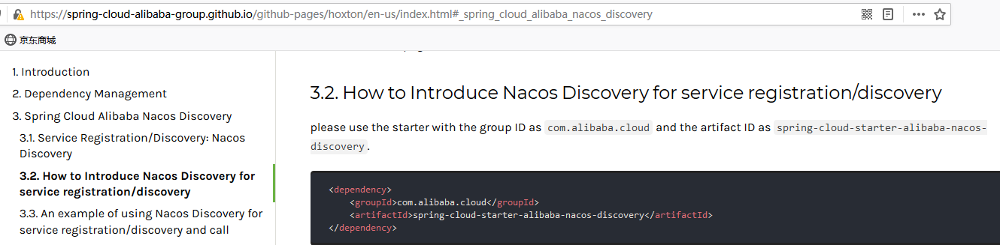
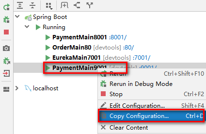
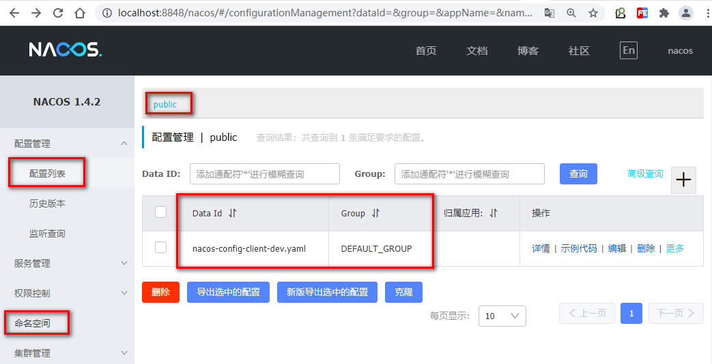
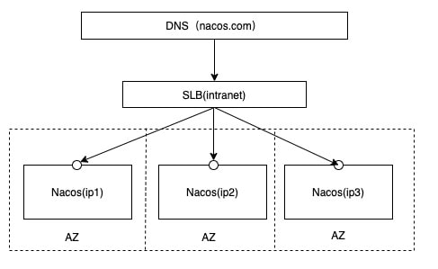

# 第十一章SpringCloud Alibaba Nacos服务注册和配置中心

## Nacos简介

### 为什么叫Nacos

前四个字母分别为Naming和Configuration的前两个字母，最后的s为Service

### 是什么

一个更易于构建云原生应用的动态服务发现，配置管理和服务管理中心

Nacos：Dynamic Naming and Configuration Service

Nacos就是注册中心+配置中心的组合

等价于：Nacos = Eureka+Config+Bus

### 能干嘛

**替代Eureka做服务注册中心**

**替代Config做服务配置中心**

### 去哪下

[https://github.com/alibaba/Nacos](https://github.com/alibaba/Nacos "https://github.com/alibaba/Nacos")

官网文档

[https://nacos.io/zh-cn/index.html](https://nacos.io/zh-cn/index.html "https://nacos.io/zh-cn/index.html")

 

 

[https://spring-cloud-alibaba-group.github.io/github-pages/hoxton/en-us/index.html#\_spring\_cloud\_alibaba\_nacos\_discovery](https://spring-cloud-alibaba-group.github.io/github-pages/hoxton/en-us/index.html#_spring_cloud_alibaba_nacos_discovery "https://spring-cloud-alibaba-group.github.io/github-pages/hoxton/en-us/index.html#_spring_cloud_alibaba_nacos_discovery")

### 各种注册中心比较

据说nacos在阿里巴巴内部有超过10万的实例运行，已经过了类似双十一等各种大型流量的考验

CAP原则又称CAP定理，指的是在一个分布式系统中，一致性（Consistency）、可用性（Availability）、分区容错性（Partition tolerance）。CAP 原则指的是，这三个要素最多只能同时实现两点，不可能三者兼顾。

## 安装并运行Nacos

### 本地Java8+Maven环境已经OK

### 先从官网下载Nacos

[https://github.com/alibaba/nacos/releases/tag/1.4.2](https://github.com/alibaba/nacos/releases/tag/1.4.2 "https://github.com/alibaba/nacos/releases/tag/1.4.2")&#x20;

### 解压安装包，直接运行bin/startup.cmd -m standalone

默认：MODE="cluster"集群方式启动，如果单机启动需要设置-m tandalone参数，否则，启动失败。

### 命令运行成功后直接访问

http\://localhost:8848/nacos

默认账号密码都是nacos

### 登录结果页面

## Nacos作为服务注册中心演示

### 官网文档

[https://spring.io/projects/spring-cloud-alibaba#learn](https://spring.io/projects/spring-cloud-alibaba#learn "https://spring.io/projects/spring-cloud-alibaba#learn")

### 基于Nacos的服务提供者

#### 新建Module：cloudalibaba\_provider\_payment9001

#### POM

-   父POM

| \<!--spring cloud alibaba 2.1.0.RELEASE-->&#xA;\<dependency>&#xA;  \<groupId>com.alibaba.cloud\</groupId>&#xA;  \<artifactId>spring-cloud-alibaba-dependencies\</artifactId>&#xA;  \<version>2.2.6.RELEASE\</version>&#xA;  \<type>pom\</type>&#xA;  \<scope>import\</scope>&#xA;\</dependency>&#xA; |
| ---------------------------------------------------------------------------------------------------------------------------------------------------------------------------------------------------------------------------------------------------------------------------------------------------- |

-   本模块POM

| \<dependencies>&#xA;    \<dependency>&#xA;        \<groupId>com.alibaba.cloud\</groupId>&#xA;        \<artifactId>spring-cloud-starter-alibaba-nacos-discovery\</artifactId>&#xA;    \</dependency>&#xA;    \<dependency>&#xA;        \<groupId>org.springframework.boot\</groupId>&#xA;        \<artifactId>spring-boot-starter-web\</artifactId>&#xA;    \</dependency>&#xA;    \<dependency>&#xA;        \<groupId>org.springframework.boot\</groupId>&#xA;        \<artifactId>spring-boot-starter-actuator\</artifactId>&#xA;    \</dependency>&#xA;    \<dependency>&#xA;        \<groupId>org.springframework.boot\</groupId>&#xA;        \<artifactId>spring-boot-devtools\</artifactId>&#xA;        \<scope>runtime\</scope>&#xA;        \<optional>true\</optional>&#xA;    \</dependency>&#xA;    \<dependency>&#xA;        \<groupId>org.projectlombok\</groupId>&#xA;        \<artifactId>lombok\</artifactId>&#xA;        \<optional>true\</optional>&#xA;    \</dependency>&#xA;    \<dependency>&#xA;        \<groupId>org.springframework.boot\</groupId>&#xA;        \<artifactId>spring-boot-starter-test\</artifactId>&#xA;        \<scope>test\</scope>&#xA;    \</dependency>&#xA;\</dependencies>&#xA; |
| ----------------------------------------------------------------------------------------------------------------------------------------------------------------------------------------------------------------------------------------------------------------------------------------------------------------------------------------------------------------------------------------------------------------------------------------------------------------------------------------------------------------------------------------------------------------------------------------------------------------------------------------------------------------------------------------------------------------------------------------------------------------------------------------------------------------------------------------------------------------------------------------------------------------------------------------------------------------------------------------------------------------------------------------------------------------------------------------------------------------------------------------------------------------------------------------------------------------------------- |

#### YML

| server:&#xA;port: 9001 |
| ---------------------- |

#### 主启动

| package com.atguigu.springcloud.alibaba;&#xA;&#xA;import org.springframework.boot.SpringApplication;&#xA;import org.springframework.boot.autoconfigure.SpringBootApplication;&#xA;import org.springframework.cloud.client.discovery.EnableDiscoveryClient;&#xA;&#xA;@EnableDiscoveryClient&#xA;@SpringBootApplication&#xA;public class PaymentMain9001 {&#xA;    public static void main(String\[] args) {&#xA;        SpringApplication.run(PaymentMain9001.class,args);&#xA;    }&#xA;}&#xA; |
| ---------------------------------------------------------------------------------------------------------------------------------------------------------------------------------------------------------------------------------------------------------------------------------------------------------------------------------------------------------------------------------------------------------------------------------------------------------------------------------------------- |

#### 业务类

| package com.atguigu.springcloud.alibaba.controller;&#xA;&#xA;import org.springframework.beans.factory.annotation.Value;&#xA;import org.springframework.web.bind.annotation.GetMapping;&#xA;import org.springframework.web.bind.annotation.PathVariable;&#xA;import org.springframework.web.bind.annotation.RestController;&#xA;&#xA;@RestController&#xA;public class PaymentController{&#xA;    @Value("\${server.port}")&#xA;    private String serverPort;&#xA; &#xA;    @GetMapping(value = "/payment/nacos/{id}")&#xA;    public String getPayment(@PathVariable("id") Long id) {&#xA;        return "nacos registry, serverPort: "+ serverPort+"\t id"+id;&#xA;    }&#xA;}&#xA; |
| ------------------------------------------------------------------------------------------------------------------------------------------------------------------------------------------------------------------------------------------------------------------------------------------------------------------------------------------------------------------------------------------------------------------------------------------------------------------------------------------------------------------------------------------------------------------------------------------------------------------------------------------------------------------------------------ |

#### 测试

[http://localhost:9001/payment/nacos/1](http://localhost:9001/payment/nacos/1 "http://localhost:9001/payment/nacos/1")

nacos控制台

nacos服务注册中心+服务提供者9001都ok了

#### 为了下一章节演示nacos的负载均衡，参照9001新建9002

新建cloudalibaba-provider-payment9002

9002其他步骤你懂的

或者取巧不想新建重复体力劳动，直接拷贝虚拟端口映射

 

 

 

 

### 基于Nacos的服务消费者

#### 新建Module：cloudalibaba-consumer-nacos-order83

#### POM

| \<dependencies>&#xA;    \<!--SpringCloud ailibaba nacos -->&#xA;    \<dependency>&#xA;        \<groupId>com.alibaba.cloud\</groupId>&#xA;        \<artifactId>spring-cloud-starter-alibaba-nacos-discovery\</artifactId>&#xA;    \</dependency>&#xA;        \<dependency>&#xA;        \<groupId>com.atguigu.springcloud\</groupId>&#xA;        \<artifactId>cloud-api-commons\</artifactId>&#xA;        \<version>\${project.version}\</version>&#xA;    \</dependency>&#xA;    \<dependency>&#xA;        \<groupId>org.springframework.boot\</groupId>&#xA;        \<artifactId>spring-boot-starter-web\</artifactId>&#xA;    \</dependency>&#xA;    \<dependency>&#xA;        \<groupId>org.springframework.boot\</groupId>&#xA;        \<artifactId>spring-boot-starter-actuator\</artifactId>&#xA;    \</dependency>&#xA;    \<dependency>&#xA;        \<groupId>org.springframework.boot\</groupId>&#xA;        \<artifactId>spring-boot-devtools\</artifactId>&#xA;        \<scope>runtime\</scope>&#xA;        \<optional>true\</optional>&#xA;    \</dependency>&#xA;    \<dependency>&#xA;        \<groupId>org.projectlombok\</groupId>&#xA;        \<artifactId>lombok\</artifactId>&#xA;        \<optional>true\</optional>&#xA;    \</dependency>&#xA;    \<dependency>&#xA;        \<groupId>org.springframework.boot\</groupId>&#xA;        \<artifactId>spring-boot-starter-test\</artifactId>&#xA;        \<scope>test\</scope>&#xA;    \</dependency>&#xA;\</dependencies>&#xA; |
| ------------------------------------------------------------------------------------------------------------------------------------------------------------------------------------------------------------------------------------------------------------------------------------------------------------------------------------------------------------------------------------------------------------------------------------------------------------------------------------------------------------------------------------------------------------------------------------------------------------------------------------------------------------------------------------------------------------------------------------------------------------------------------------------------------------------------------------------------------------------------------------------------------------------------------------------------------------------------------------------------------------------------------------------------------------------------------------------------------------------------------------------------------------------------------------------------------------------------------------------------------------------------------------------------------------------------------------------------------------------------------------------------------------------------------------------------------------------------------------------------- |

为什么nacos支持负载均衡

#### YML

| server:&#xA;  port: 83&#xA;&#xA;spring:&#xA;  application:&#xA;    name: nacos-order-consumer&#xA;  cloud:&#xA;    nacos:&#xA;      discovery:&#xA;        server-addr: localhost:8848&#xA;#消费者将要去访问的微服务名称(注册成功进nacos的微服务提供者【可选】，注意：nacos-payment-provider含有IP和端口)&#xA;service-url:&#xA;  nacos-user-service: [http://](http://nacos-payment-provider "http://")[nacos-payment-provider](http://nacos-payment-provider "nacos-payment-provider") |
| ------------------------------------------------------------------------------------------------------------------------------------------------------------------------------------------------------------------------------------------------------------------------------------------------------------------------------------------------------------------------------------------------------------------------------------------------ |

#### 主启动

| package com.atguigu.springcloud.alibaba;&#xA;&#xA;import org.springframework.boot.SpringApplication;&#xA;import org.springframework.boot.autoconfigure.SpringBootApplication;&#xA;import org.springframework.cloud.client.discovery.EnableDiscoveryClient;&#xA;&#xA;@EnableDiscoveryClient&#xA;@SpringBootApplication&#xA;public class OrderNacosMain83{&#xA;    public static void main(String\[] args){&#xA;        SpringApplication.run(OrderNacosMain83.class,args);&#xA;    }&#xA;}&#xA; |
| ---------------------------------------------------------------------------------------------------------------------------------------------------------------------------------------------------------------------------------------------------------------------------------------------------------------------------------------------------------------------------------------------------------------------------------------------------------------------------------------------- |

#### 业务类

ApplicationContextBean

| package com.atguigu.springcloud.alibaba.config;&#xA;&#xA;import org.springframework.cloud.client.loadbalancer.LoadBalanced;&#xA;import org.springframework.context.annotation.Bean;&#xA;import org.springframework.context.annotation.Configuration;&#xA;import org.springframework.web.client.RestTemplate;&#xA;&#xA;@Configuration&#xA;public class ApplicationContextConfig{&#xA;    @Bean&#xA;    @LoadBalanced&#xA;    public RestTemplate getRestTemplate(){&#xA;        return new RestTemplate();&#xA;    }&#xA;}&#xA; |
| ------------------------------------------------------------------------------------------------------------------------------------------------------------------------------------------------------------------------------------------------------------------------------------------------------------------------------------------------------------------------------------------------------------------------------------------------------------------------------------------------------------------------------ |

#### OrderNacosController

| package com.atguigu.springcloud.alibaba.controller;&#xA;&#xA;import lombok.extern.slf4j.Slf4j;&#xA;import org.springframework.beans.factory.annotation.Value;&#xA;import org.springframework.web.bind.annotation.GetMapping;&#xA;import org.springframework.web.bind.annotation.PathVariable;&#xA;import org.springframework.web.bind.annotation.RestController;&#xA;import org.springframework.web.client.RestTemplate;&#xA;import javax.annotation.Resource;&#xA;&#xA;@RestController&#xA;@Slf4j&#xA;public class OrderNacosController{&#xA;    @Resource&#xA;    private RestTemplate restTemplate;&#xA;&#xA;    @Value("\${service-url.nacos-user-service}")&#xA;    private String serverURL;&#xA;&#xA;    @GetMapping(value = "/consumer/payment/nacos/{id}")&#xA;    public String paymentInfo(@PathVariable("id") Long id){&#xA;        return restTemplate.getForObject(serverURL+"/payment/nacos/"+id,String.class);&#xA;    }&#xA;&#xA;}&#xA; |
| -------------------------------------------------------------------------------------------------------------------------------------------------------------------------------------------------------------------------------------------------------------------------------------------------------------------------------------------------------------------------------------------------------------------------------------------------------------------------------------------------------------------------------------------------------------------------------------------------------------------------------------------------------------------------------------------------------------------------------------------------------------------------------------------------------------------------------------------------------------------------------------------------------------------------------------------------------- |

#### 测试

nacos控制台

[http://localhost:83/consumer/payment/nacos/1](http://localhost:83/consumer/payment/nacos/1 "http://localhost:83/consumer/payment/nacos/1")

83访问9001/9002，轮询负载OK

### 服务注册中心对比

#### Nacos和CAP

CAP原则又称CAP定理，指的是在一个分布式系统中， Consistency（一致性）、 Availability（可用性）、Partition tolerance（分区容错性），三者不可得兼。

一致性（C）：在分布式系统中的所有数据备份，在同一时刻是否同样的值。（等同于所有节点访问同一份最新的数据副本）

可用性（A）：在集群中一部分节点故障后，集群整体是否还能响应客户端的读写请求。（对数据更新具备高可用性）

分区容忍性（P）：以实际效果而言，分区相当于对通信的时限要求。系统如果不能在时限内达成数据一致性，就意味着发生了分区的情况，必须就当前操作在C和A之间做出选择。

CAP原则的精髓就是要么AP，要么CP，要么AC，但是不存在CAP。

如果在某个分布式系统中数据无副本， 那么系统必然满足强一致性条件， 因为只有独一数据，不会出现数据不一致的情况，此时C和P两要素具备，但是如果系统发生了网络分区状况或者宕机，必然导致某些数据不可以访问，此时可用性条件就不能被满足，即在此情况下获得了CP系统，但是CAP不可同时满足。

因此在进行分布式架构设计时，必须做出取舍。当前一般是通过分布式缓存中各节点的最终一致性来提高系统的性能，通过使用多节点之间的数据异步复制技术来实现集群化的数据一致性。

#### Nacos支持AP和CP模式的切换

curl -X PUT '\$NACOS\_SERVER:8848/nacos/v1/ns/operator/switches?entry=serverMode\&value=CP'&#x20;

## Nacos作为服务配置中心演示

### Nacos作为配置中心-基础配置

#### 创建Module：cloudalibaba-config-nacos-client3377

#### POM

| \<dependencies>&#xA;    \<!--nacos-config-->&#xA;    \<dependency>&#xA;        \<groupId>com.alibaba.cloud\</groupId>&#xA;        \<artifactId>spring-cloud-starter-alibaba-nacos-config\</artifactId>&#xA;    \</dependency>&#xA;    \<!--nacos-discovery-->&#xA;    \<dependency>&#xA;        \<groupId>com.alibaba.cloud\</groupId>&#xA;        \<artifactId>spring-cloud-starter-alibaba-nacos-discovery\</artifactId>&#xA;    \</dependency>&#xA;    \<!--web + actuator-->&#xA;    \<dependency>&#xA;        \<groupId>org.springframework.boot\</groupId>&#xA;        \<artifactId>spring-boot-starter-web\</artifactId>&#xA;    \</dependency>&#xA;    \<dependency>&#xA;        \<groupId>org.springframework.boot\</groupId>&#xA;        \<artifactId>spring-boot-starter-actuator\</artifactId>&#xA;    \</dependency>&#xA;    \<!--一般基础配置-->&#xA;    \<dependency>&#xA;        \<groupId>org.springframework.boot\</groupId>&#xA;        \<artifactId>spring-boot-devtools\</artifactId>&#xA;        \<scope>runtime\</scope>&#xA;        \<optional>true\</optional>&#xA;    \</dependency>&#xA;    \<dependency>&#xA;        \<groupId>org.projectlombok\</groupId>&#xA;        \<artifactId>lombok\</artifactId>&#xA;        \<optional>true\</optional>&#xA;    \</dependency>&#xA;    \<dependency>&#xA;        \<groupId>org.springframework.boot\</groupId>&#xA;        \<artifactId>spring-boot-starter-test\</artifactId>&#xA;        \<scope>test\</scope>&#xA;    \</dependency>&#xA;\</dependencies>&#xA; |
| --------------------------------------------------------------------------------------------------------------------------------------------------------------------------------------------------------------------------------------------------------------------------------------------------------------------------------------------------------------------------------------------------------------------------------------------------------------------------------------------------------------------------------------------------------------------------------------------------------------------------------------------------------------------------------------------------------------------------------------------------------------------------------------------------------------------------------------------------------------------------------------------------------------------------------------------------------------------------------------------------------------------------------------------------------------------------------------------------------------------------------------------------------------------------------------------------------------------------------------------------------------------------------------------------------------------------------------------------------------------------------------------------------------------------------------------------------------------------------------------------------------------------------- |

#### YML

Nacos同springcloud-config一样，在项目初始化时，要保证先从配置中心进行配置拉取，拉取配置之后，才能保证项目的正常启动

springboot中配置文件的加载是存在优先级顺序的，bootstrap优先级高于application

**bootstrap.yml**

| server:&#xA;  port: 3377&#xA;&#xA;spring:&#xA;  application:&#xA;    name: nacos-config-client&#xA;  cloud:&#xA;    nacos:&#xA;      discovery:&#xA;        server-addr: localhost:8848 #服务注册中心地址&#xA;      config:&#xA;        server-addr: localhost:8848 #配置中心地址&#xA;        file-extension: **yaml** #指定yaml格式的配置（yml和yaml都可以）&#xA;&#xA;#\${spring.application.name}-\${spring.profile.active}.\${spring.cloud.nacos.config.file-extension}&#xA;#nacos-config-client-dev.yaml  (一定要与file-extension值保持一致)&#xA; |
| ----------------------------------------------------------------------------------------------------------------------------------------------------------------------------------------------------------------------------------------------------------------------------------------------------------------------------------------------------------------------------------------------------------------------------------------------------------------------------------------------------------------- |

**application.yml**

| spring:&#xA;  profiles:&#xA;    active: dev #表示开发环境&#xA; |
| -------------------------------------------------------- |

#### 主启动

| package com.atguigu.springcloud.alibaba;&#xA;&#xA;import org.springframework.boot.SpringApplication;&#xA;import org.springframework.boot.autoconfigure.SpringBootApplication;&#xA;import org.springframework.cloud.client.discovery.EnableDiscoveryClient;&#xA;&#xA;@EnableDiscoveryClient&#xA;@SpringBootApplication&#xA;public class NacosConfigClientMain3377{&#xA;    public static void main(String\[] args) {&#xA;        SpringApplication.run(NacosConfigClientMain3377.class, args);&#xA;    }&#xA;}&#xA; |
| ------------------------------------------------------------------------------------------------------------------------------------------------------------------------------------------------------------------------------------------------------------------------------------------------------------------------------------------------------------------------------------------------------------------------------------------------------------------------------------------------------------------ |

#### 业务类:ConfigClientController

| package com.atguigu.springcloud.alibaba.controller;&#xA;&#xA;import org.springframework.beans.factory.annotation.Value;&#xA;import org.springframework.cloud.context.config.annotation.RefreshScope;&#xA;import org.springframework.web.bind.annotation.GetMapping;&#xA;import org.springframework.web.bind.annotation.RestController;&#xA;&#xA;@RestController&#xA;@RefreshScope   //通过SpringCould原生注解@RefreshScope实现配置自动更新&#xA;public class ConfigClientController{&#xA;    @Value("\${config.info}") //对应nacos配置:nacos-config-client-dev.yaml&#xA;    private String configInfo;&#xA;&#xA;    @GetMapping("/config/info")&#xA;    public String getConfigInfo() {&#xA;        return configInfo;&#xA;    }&#xA;}&#xA; |
| ------------------------------------------------------------------------------------------------------------------------------------------------------------------------------------------------------------------------------------------------------------------------------------------------------------------------------------------------------------------------------------------------------------------------------------------------------------------------------------------------------------------------------------------------------------------------------------------------------------------------------------------------------------------------------------------------------------------------ |

#### 在Nacos中添加配置信息

Nacos中的匹配规则

Nacos中的dataid的组成格式与SpringBoot配置文件中的匹配规则

官网 [https://nacos.io/zh-cn/docs/quick-start-spring-cloud.html](https://nacos.io/zh-cn/docs/quick-start-spring-cloud.html "https://nacos.io/zh-cn/docs/quick-start-spring-cloud.html")

最后公式：

\${spring.application.name}-\${spring.profiles.active}.\${spring.cloud.nacos.config.file-extension}

nacos-config-client-dev.yaml

Nacos界面配置对应

| config:&#xA;  info: "config info for dev,from nacos config center."&#xA;&#x20;&#xA;&#xA; |
| ---------------------------------------------------------------------------------------- |

**设置DataId**

公式: \${spring.application.name}-\${spring.profile.active}.\${spring.cloud.nacos.config.file-extension}

**小总结说明**

**历史配置：** Nacos会记录配置文件的历史版本默认保留30天

#### 测试

启动前需要在nacos客户端-配置管理-配置管理栏目下有没有对应的yaml配置文件

运行cloud-config-nacos-client3377的主启动类

调用接口查看配置信息： [http://localhost:3377/config/info](http://localhost:3377/config/info "http://localhost:3377/config/info")

#### 自带动态刷新&#x20;

修改Nacos中的yaml配置文件，查看配置已经刷新  &#x20;

### Nacos作为配置中心-分类配置

#### 问题

多环境多项目管理

**问题1**

-   实际开发中，通常一个系统会准备
-   dev开发环境
-   test测试环境
-   prod生产环境
-   如何保证指定环境启动时服务能正确读取到 Nacos上相应环境的配置文件呢?

**问题2**

-   一个大型分布式微服务系统会有很多微服务子项目
-   每一个微服务项目又会相应的开发环境、测试环境、预发环境、正式环境….
-   那怎么对这些微服务配置进行管理呢？

#### Nacos的图形化管理界面

-   **配置管理**

-   **命名空间**

#### Namespace+Group+Data ID三者关系？为什么这么设计？

最外层的namespace是可以用于区分部署环境的，Group和DataID逻辑上区分两个目标对象。

默认情况：Namespace=public，Group=DEFAULT\_GROUP，默认Cluster是DEFAULT

-   Nacos默认的命名空间是public，Namespace主要用来实现隔离。

比方说我们现在有三个环境：**开发、测试、生产环境**，我们就可以创建**三个Namespace**，不同的 Namespace之间是隔离的。

-   Group默认是**DEFAULT\_GROUP**，Group可以把不同的微服务划分到同一个分组里面去。Service就是微服务；一个Service可以包含多个Cluster(集群)，Nacos默认Cluster是**DEFAULT**，Cluster是对指定微服务的一个虚拟划分。

比方说为了容灾，将Service微服务分别部署在了**杭州机房**和**广州机房**，这时就可以给杭州机房的Service微服务起一个集群名称(**HZ**)，给广州机房的Service微服务起一个集群名字(**GZ**)，还可以尽量让同一个机房的微服务互相调用，以提升性能。

-   最后是Instance，就是微服务的实例。

#### Case

#### DataID方案

指定spring.profile.active和配置文件的DataID来使不同环境下读取不同的配置

**默认空间+默认分组**+**新建dev和test两个DataID**

新建dev配置DataID

 

新建test配置DataID

通过spring.profile.active属性就能进行多环境下配置文件的读取

测试

[http://localhost:3377/config/info](http://localhost:3377/config/info "http://localhost:3377/config/info")

配置是什么就加载什么

#### Group方案

通过Group实现环境区分

新建Group

 

在nacos图形界面控制台上面新建配置文件DataID

bootstrap+application

在config下增加一条group的配置即可。可配置为DEV\_GROUP或TEST\_GROUP

#### Namespace方案

新建dev/test的Namespace

 

回到服务管理-服务列表查看

按照域名配置填写

| nacos-config-client-dev.yaml&#xA;&#xA;config: &#xA;  info: 9f62d48c-ef2e-4d83-a9fb-c9db5833f93b DEFAULT\_GROUP nacos-config-client-dev.yaml&#xA; |
| ------------------------------------------------------------------------------------------------------------------------------------------------ |

YML

bootstrap

| # nacos配置&#xA;server:&#xA;  port: 3377&#xA;&#xA;spring:&#xA;  application:&#xA;    name: nacos-config-client&#xA;  cloud:&#xA;    nacos:&#xA;      discovery:&#xA;        server-addr: localhost:8848 #Nacos服务注册中心地址&#xA;      config:&#xA;        server-addr: localhost:8848 #Nacos作为配置中心地址&#xA;        file-extension: yaml #指定yaml格式的配置&#xA;        group: DEV\_GROUP&#xA;        namespace: 7d8f0f5a-6a53-4785-9686-dd460158e5d4&#xA;&#xA;# \${spring.application.name}-\${spring.profile.active}.\${spring.cloud.nacos.config.file-extension}&#xA;# nacos-config-client-dev.yaml&#xA; |
| ------------------------------------------------------------------------------------------------------------------------------------------------------------------------------------------------------------------------------------------------------------------------------------------------------------------------------------------------------------------------------------------------------------------------------------------------------------------------------------------------------------------------------------------------------------------------------------------- |

application&#x20;

| spring:&#xA;  profiles:&#xA;    active: dev # 表示开发环境&#xA;    \#active: test # 表示测试环境&#xA;    \#active: info&#xA; |
| ---------------------------------------------------------------------------------------------------------------- |

图解：

测试结果：

## Nacos集群和持久化配置（重要）

### 官网说明

[https://nacos.io/zh-cn/docs/cluster-mode-quick-start.html](https://nacos.io/zh-cn/docs/cluster-mode-quick-start.html "https://nacos.io/zh-cn/docs/cluster-mode-quick-start.html")

#### 官网架构图

集群部署架构图 &#x20;

因此开源的时候推荐用户把所有服务列表放到一个vip下面，然后挂到一个域名下面

[http://ip1](http://ip1 "http://ip1"):port/openAPI 直连ip模式，机器挂则需要修改ip才可以使用。

[http://SLB](http://SLB "http://SLB"):port/openAPI 挂载SLB模式(内网SLB，不可暴露到公网，以免带来安全风险)，直连SLB即可，下面挂server真实ip，可读性不好。

[http://nacos.com](http://nacos.com "http://nacos.com"):port/openAPI 域名 + SLB模式(内网SLB，不可暴露到公网，以免带来安全风险)，可读性好，而且换ip方便，推荐模式

#### 上图官网翻译，真实情况 

 

#### 说明

默认Nacos使用嵌入式数据库实现数据的存储。所以，如果启动多个默认配置下的Nacos节点，数据存储是存在一致性问题的。

为了解决这个问题，**Nacos采用了集中式存储的方式来支持集群化部署，目前只支持MySQL 的存储。**

[https://github.com/alibaba/nacos/blob/master/distribution/conf/application.properties](https://github.com/alibaba/nacos/blob/master/distribution/conf/application.properties "https://github.com/alibaba/nacos/blob/master/distribution/conf/application.properties")

[https://github.com/alibaba/nacos/blob/master/distribution/conf/nacos-mysql.sql](https://github.com/alibaba/nacos/blob/master/distribution/conf/nacos-mysql.sql "https://github.com/alibaba/nacos/blob/master/distribution/conf/nacos-mysql.sql")&#x20;

 

[https://nacos.io/zh-cn/docs/deployment.html](https://nacos.io/zh-cn/docs/deployment.html "https://nacos.io/zh-cn/docs/deployment.html") 

### Nacos持久化配置解释

#### Nacos默认自带的是嵌入式数据库derby

[https://github.com/alibaba/nacos/blob/develop/config/pom.xml](https://github.com/alibaba/nacos/blob/develop/config/pom.xml "https://github.com/alibaba/nacos/blob/develop/config/pom.xml")

#### derby到mysql切换配置步骤

nacos-server-1.4.2\nacos\conf目录下找到sql脚本

nacos-mysql.sql

执行脚本

nacos-server-1.4.2\nacos\conf目录下找到application.properties

| spring.datasource.platform=mysql&#xA;&#xA;db.num=1&#xA;db.url.0=jdbc:mysql://localhost:3306/nacos\_config?serverTimezone=GMT%2B8\&characterEncoding=utf8\&connectTimeout=1000\&socketTimeout=3000\&autoReconnect=true&#xA;db.user=root&#xA;db.password=root&#xA; |
| ---------------------------------------------------------------------------------------------------------------------------------------------------------------------------------------------------------------------------------------------------------------- |

#### 启动nacos，可以看到是个全新的空记录界面，以前是记录进derby

#### 测试：新建配置，发现配置信息写入了MySQL数据库

### Linux版Nacos+MySQL生产环境配置

#### 预计需要，1个nginx+3个nacos注册中心+1个mysql

#### Nacos下载linux版本

[https://github.com/alibaba/nacos/releases/tag/1.4.2](https://github.com/alibaba/nacos/releases/tag/1.4.2 "https://github.com/alibaba/nacos/releases/tag/1.4.2")

nacos-server-1.4.2.tar.gz

#### 集群配置步骤（重点）

#### 1.创建/opt/nacoscluster目录，解压3个节点

#### 2.Linux服务器上mysql数据库配置

-   其中一个节点conf/目录下，找到nacos\_config文件，创建数据库并导入表结构

#### 3.三个节点conf/application.properties配置

| spring.datasource.platform=mysql&#xA;&#xA;db.num=1&#xA;db.url.0=jdbc:mysql://192.168.137.150:3306/nacos\_config?characterEncoding=utf8\&connectTimeout=1000\&socketTimeout=3000\&autoReconnect=true&#xA;db.user=root&#xA;db.password=root&#xA; |
| ---------------------------------------------------------------------------------------------------------------------------------------------------------------------------------------------------------------------------------------------- |

#### 4.三个节点/conf下配置cluster.conf

| 192.168.137.150:8848&#xA;192.168.137.150:8849&#xA;192.168.137.150:8850&#xA; |
| --------------------------------------------------------------------------- |

 

#### 5.启动三个节点前，修改内存大小

启动时，需要修改startup.sh文件内存大小，否则，内存可能不够用。

#### 6.启动三个节点

查看进程：ps -ef | grep nacos    &#x20;

登录任意节点查看集群：

#### 7.Nginx的配置，由它作为负载均衡器

修改nginx的配置文件：vim /usr/local/nginx/conf/nginx.conf

nginx.conf

| upstream nacoscluster{ &#xA;    server 192.168.137.150:8848;&#xA;    server 192.168.137.150:8849;&#xA;    server 192.168.137.150:8850;&#xA;}&#xA;&#xA;server{               &#xA;    listen 1111;&#xA;    server\_name 192.168.137.150;&#xA;    location / {&#xA;         proxy\_pass http\://nacoscluster;                        &#xA;    }&#xA;....省略  &#xA; |
| --------------------------------------------------------------------------------------------------------------------------------------------------------------------------------------------------------------------------------------------------------------------------------------------------------------------------------------------------------------- |

启动Nginx：

 

#### 6.截止到此处，1个Nginx+3个nacos注册中心+1个mysql

测试通过nginx访问nacos

[https://192.168.137.150:1111/nacos](https://192.168.137.150:1111/nacos/#/login "https://192.168.137.150:1111/nacos")

新建一个配置测试

linux服务器的mysql插入一条记录

#### 测试微服务从配置中心获取配置

微服务nacos-config-client启动注册进nacos集群

Yml

访问URL:

#### 高可用小总结

