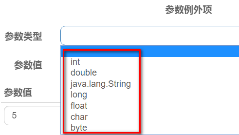

# 第十二章SpringCloud Alibaba Sentinel实现熔断与限流

## Sentinel介绍

### 官网&#x20;

[https://github.com/alibaba/Sentinel](https://github.com/alibaba/Sentinel "https://github.com/alibaba/Sentinel")

中文

[https://github.com/alibaba/Sentinel/wiki/%E4%BB%8B%E7%BB%8D](https://github.com/alibaba/Sentinel/wiki/%E4%BB%8B%E7%BB%8D "https://github.com/alibaba/Sentinel/wiki/%E4%BB%8B%E7%BB%8D")

### 是什么

一句话解释，之前我们讲解过的Hystrix

 

### 能干嘛

### 去哪下

&#x20;     [https://github.com/alibaba/Sentinel/releases](https://github.com/alibaba/Sentinel/releases "https://github.com/alibaba/Sentinel/releases")

### 怎么玩

[https://spring-cloud-alibaba-group.github.io/github-pages/hoxton/en-us/index.html#\_spring\_cloud\_alibaba\_sentinel](https://spring-cloud-alibaba-group.github.io/github-pages/hoxton/en-us/index.html#_spring_cloud_alibaba_sentinel "https://spring-cloud-alibaba-group.github.io/github-pages/hoxton/en-us/index.html#_spring_cloud_alibaba_sentinel")&#x20;

-   服务使用中的各种问题
    -   服务雪崩
    -   服务降级
    -   服务熔断
    -   服务限流 &#x20;

## 安装Sentinel控制台

### sentinel组件由2部分组成

Sentinel 分为两个部分:

核心库（Java 客户端）不依赖任何框架/库，能够运行于所有 Java 运行时环境，同时对 Dubbo / Spring Cloud 等框架也有较好的支持。

控制台（Dashboard）基于 Spring Boot 开发，打包后可以直接运行，不需要额外的 Tomcat 等应用容器。

-   后台
-   前台8080

### 安装步骤

#### 下载

[https://github.com/alibaba/Sentinel/releases](https://github.com/alibaba/Sentinel/releases "https://github.com/alibaba/Sentinel/releases")

下载到本地sentinel-dashboard-1.8.2.jar

#### 运行命令

前提

**java8环境OK**

**8080端口不能被占用**

命令

&#x20;	java -jar sentinel-dashboard-1.8.2.jar&#x20;

#### 访问sentinel管理界面

[http://localhost:8080](http://localhost:8080 "http://localhost:8080")

登录账号密码均为sentinel

## 初始化演示工程

### 启动Nacos8848成功

[http://localhost:8848/nacos/#/login](http://localhost:8848/nacos/#/login "http://localhost:8848/nacos/#/login")

### 案例

#### 创建Module：cloudalibaba-sentinel-service8401

#### POM

| \<?xml version="1.0" encoding="UTF-8"?>&#xA;\<project xmlns="<http://maven.apache.org/POM/4.0.0>"&#xA;         xmlns:xsi="<http://www.w3.org/2001/XMLSchema-instance>"&#xA;         xsi:schemaLocation="<http://maven.apache.org/POM/4.0.0> [http://maven.apache.org/xsd/maven-4.0.0.xsd](http://maven.apache.org/xsd/maven-4.0.0.xsd "http://maven.apache.org/xsd/maven-4.0.0.xsd")">&#xA;    \<parent>&#xA;        \<artifactId>cloud2021\</artifactId>&#xA;        \<groupId>com.atguigu.springcloud\</groupId>&#xA;        \<version>1.0-SNAPSHOT\</version>&#xA;    \</parent>&#xA;    \<modelVersion>4.0.0\</modelVersion>&#xA;    \<artifactId>cloudalibaba-sentinel-service8401\</artifactId>&#xA;&#xA;    \<dependencies>&#xA;        \<dependency>&#xA;            \<groupId>com.atguigu.springcloud\</groupId>&#xA;            \<artifactId>cloud-api-commons\</artifactId>&#xA;            \<version>\${project.version}\</version>&#xA;        \</dependency>&#xA;        \<dependency>&#xA;            \<groupId>com.alibaba.cloud\</groupId>&#xA;            \<artifactId>spring-cloud-starter-alibaba-nacos-discovery\</artifactId>&#xA;        \</dependency>&#xA;        \<dependency>&#xA;            \<groupId>com.alibaba.csp\</groupId>&#xA;            \<artifactId>sentinel-datasource-nacos\</artifactId>&#xA;        \</dependency>&#xA;        \<dependency>&#xA;            \<groupId>com.alibaba.cloud\</groupId>&#xA;            \<artifactId>spring-cloud-starter-alibaba-sentinel\</artifactId>&#xA;        \</dependency>&#xA;        \<dependency>&#xA;            \<groupId>org.springframework.cloud\</groupId>&#xA;            \<artifactId>spring-cloud-starter-openfeign\</artifactId>&#xA;        \</dependency>&#xA;        \<dependency>&#xA;            \<groupId>org.springframework.boot\</groupId>&#xA;            \<artifactId>spring-boot-starter-web\</artifactId>&#xA;        \</dependency>&#xA;        \<dependency>&#xA;            \<groupId>org.springframework.boot\</groupId>&#xA;            \<artifactId>spring-boot-starter-actuator\</artifactId>&#xA;        \</dependency>&#xA;        \<dependency>&#xA;            \<groupId>org.springframework.boot\</groupId>&#xA;            \<artifactId>spring-boot-devtools\</artifactId>&#xA;            \<scope>runtime\</scope>&#xA;            \<optional>true\</optional>&#xA;        \</dependency>&#xA;        \<dependency>&#xA;            \<groupId>cn.hutool\</groupId>&#xA;            \<artifactId>hutool-all\</artifactId>&#xA;            \<version>4.6.3\</version>&#xA;        \</dependency>&#xA;        \<dependency>&#xA;            \<groupId>org.projectlombok\</groupId>&#xA;            \<artifactId>lombok\</artifactId>&#xA;            \<optional>true\</optional>&#xA;        \</dependency>&#xA;        \<dependency>&#xA;            \<groupId>org.springframework.boot\</groupId>&#xA;            \<artifactId>spring-boot-starter-test\</artifactId>&#xA;            \<scope>test\</scope>&#xA;        \</dependency>&#xA;    \</dependencies>&#xA;\</project>&#xA; |
| ----------------------------------------------------------------------------------------------------------------------------------------------------------------------------------------------------------------------------------------------------------------------------------------------------------------------------------------------------------------------------------------------------------------------------------------------------------------------------------------------------------------------------------------------------------------------------------------------------------------------------------------------------------------------------------------------------------------------------------------------------------------------------------------------------------------------------------------------------------------------------------------------------------------------------------------------------------------------------------------------------------------------------------------------------------------------------------------------------------------------------------------------------------------------------------------------------------------------------------------------------------------------------------------------------------------------------------------------------------------------------------------------------------------------------------------------------------------------------------------------------------------------------------------------------------------------------------------------------------------------------------------------------------------------------------------------------------------------------------------------------------------------------------------------------------------------------------------------------------------------------------------------------------------------------------------------------------------------------------------------------------------------------------------------------------------------------------------------------------------------------------------------------------------------------------------------------------------------------------------------------------------------------------------------------------------------------------------------------------------------------------------------------------------------------------------------------------------------------------------------------------------------------------------------------------------------------------------------------------------------------------------------------------------------------------------------------------------------------------------------------------------------------------------------------------------------------------------------------------------------------------------------------------------------------------------------------------------------------------------------------------------------------------------------------------------------------------------------------------- |

#### YML

| server:&#xA;port: 8401 |
| ---------------------- |

[https://docs.spring.io/spring-boot/docs/current/reference/html/production-ready-features.html#production-ready-endpoints](https://docs.spring.io/spring-boot/docs/current/reference/html/production-ready-features.html#production-ready-endpoints "https://docs.spring.io/spring-boot/docs/current/reference/html/production-ready-features.html#production-ready-endpoints")

#### 主启动

| package com.atguigu.springcloud.alibaba;&#xA;&#xA;import org.springframework.boot.SpringApplication;&#xA;import org.springframework.boot.autoconfigure.SpringBootApplication;&#xA;import org.springframework.cloud.client.discovery.EnableDiscoveryClient;&#xA;&#xA;@EnableDiscoveryClient&#xA;@SpringBootApplication&#xA;public class MainApp8401{&#xA;    public static void main(String\[] args) {&#xA;        SpringApplication.run(MainApp8401.class, args);&#xA;    }&#xA;}&#xA; |
| -------------------------------------------------------------------------------------------------------------------------------------------------------------------------------------------------------------------------------------------------------------------------------------------------------------------------------------------------------------------------------------------------------------------------------------------------------------------------------------- |

#### 业务类FlowLimitController

| package com.atguigu.springcloud.alibaba.controller;&#xA;&#xA;import org.springframework.web.bind.annotation.GetMapping;&#xA;import org.springframework.web.bind.annotation.RestController;&#xA;&#xA;@RestController&#xA;@Slf4j&#xA;public class FlowLimitController{&#xA;    @GetMapping("/testA")&#xA;    public String testA() {&#xA;        return "------testA";&#xA;    }&#xA;&#xA;    @GetMapping("/testB")&#xA;    public String testB() {&#xA;        return "------testB";&#xA;    }&#xA;}&#xA; |
| -------------------------------------------------------------------------------------------------------------------------------------------------------------------------------------------------------------------------------------------------------------------------------------------------------------------------------------------------------------------------------------------------------------------------------------------------------------------------------------------------------- |

### 启动Sentinel8080

java -jar sentinel-dashboard-1.8.2.jar

### 启动微服务8401

### 启动8401微服务后查看sentienl控制台

空空如也，啥都没有

Sentinel采用的懒加载说明

执行一次访问即可

[http://localhost:8401/testA](http://localhost:8401/testA "http://localhost:8401/testA")

[http://localhost:8401/testB](http://localhost:8401/testB "http://localhost:8401/testB")

效果

结论

sentinel8080正在监控微服务8401

## 流控规则

### 基本介绍

 

进一步解释说明

### 流控模式

#### 直接（默认）

-   直接->快速失败
    -   系统默认
-   测试QPS
    -   配置及说明
        -   表示1秒钟内查询1次就是OK,若超过次数1，就直接-快速失败，报默认错误

 

-   快速点击访问： [http://localhost:8401/testA](http://localhost:8401/testA "http://localhost:8401/testA")
-   结果
    -   Blocked by Sentinel (flow limiting)
-   测试线程数

-   快速点击访问： [http://localhost:8401/testA](http://localhost:8401/testA "http://localhost:8401/testA")
-   结果
    -   不会出现Blocked by Sentinel (flow limiting)（线程处理请求很快）

但是，在映射方法里添加sleep后，同样也会出现Blocked by Sentinel (flow limiting)默认提示信息。

 

-   思考？？？
    -   直接调用默认报错信息，技术方面OK but，是否应该有我们自己的后续处理？
        -   类似有一个fallback的兜底方法？

#### 关联

-   是什么？
    -   当关联的资源达到阈值时，就限流自己
    -   当与A关联的资源B达到阈值后，就限流自己
    -   B惹事，A挂了

#### 配置A

-   设置效果：
    -   当关联资源/testB的QPS阀值超过1时，就限流/testA的REST访问地址，当关联资源到阀值后闲置配置的的资源名。

#### postman模拟并发密集访问testB

-   访问testB成功

-   postman里新建多线程集合组，将请求保存到集合组

-   运行线程集合组

 

-   设置并发访问参数

 

-   Run
    -   大批量线程高并发访问B，导致A失效了
-   运行后发现testA挂了
    -   点击访问http\://localhost:8401/testA
    -   结果
        -   Blocked by Sentinel (flow limiting)

#### 链路

-   多个请求调用了同一个微服务
-   家庭作业试试

### 流控效果

#### 直接->快速失败（默认的流控处理）

-   直接失败，抛出异常：Blocked by Sentinel (flow limiting)
-   源码：com.alibaba.csp.sentinel.slots.block.flow\.controller.DefaultController

#### 预热

-   说明
    -   公式：阈值除以coldFactor（默认值为3），经过预热时长后才会达到阈值
-   官网： [https://github.com/alibaba/Sentinel/wiki/%E6%B5%81%E9%87%8F%E6%8E%A7%E5%88%B6#%E5%9F%BA%E4%BA%8Eqps%E5%B9%B6%E5%8F%91%E6%95%B0%E7%9A%84%E6%B5%81%E9%87%8F%E6%8E%A7%E5%88%B6](https://github.com/alibaba/Sentinel/wiki/%E6%B5%81%E9%87%8F%E6%8E%A7%E5%88%B6#%E5%9F%BA%E4%BA%8Eqps%E5%B9%B6%E5%8F%91%E6%95%B0%E7%9A%84%E6%B5%81%E9%87%8F%E6%8E%A7%E5%88%B6 "https://github.com/alibaba/Sentinel/wiki/%E6%B5%81%E9%87%8F%E6%8E%A7%E5%88%B6#%E5%9F%BA%E4%BA%8Eqps%E5%B9%B6%E5%8F%91%E6%95%B0%E7%9A%84%E6%B5%81%E9%87%8F%E6%8E%A7%E5%88%B6")

 

 

-   限流 冷启动

[https://github.com/alibaba/Sentinel/wiki/%E9%99%90%E6%B5%81---%E5%86%B7%E5%90%AF%E5%8A%A8](https://github.com/alibaba/Sentinel/wiki/%E9%99%90%E6%B5%81---%E5%86%B7%E5%90%AF%E5%8A%A8 "https://github.com/alibaba/Sentinel/wiki/%E9%99%90%E6%B5%81---%E5%86%B7%E5%90%AF%E5%8A%A8")

-   源码
    -   com.alibaba.csp.sentinel.slots.block.flow\.controller.WarmUpController

-   Warmup配置

默认 coldFactor 为 3，即请求 QPS 从 threshold / 3 开始，经预热时长逐渐升至设定的 QPS 阈值。

-   案例：阈值为10 + 预热时长设置5秒。
-   系统初始化的阈值为10/3约等于3，即阈值刚开始为3；然后过了5秒后阈值才慢慢升高，恢复到10

-   多次点击http\://localhost:8401/testB
-   刚开始不行，后续慢慢OK
-   应用场景
    -   如：秒杀系统在开启的瞬间，会有很多流量上来，很有可能把系统打死，预热方式就是为了保护系统，可慢慢的把流量放进来，慢慢的把阈值增长到设置的阈值。

#### 排队等待

-   匀速排队，让请求以均匀的速度通过，阈值类型必须设置成QPS，否则无效。
-   设置含义：/testB每秒1次请求，超过的话就排队等待，等待的超时时间为20000毫秒。

-   官网

-   源码：com.alibaba.csp.sentinel.slots.block.flow\.controller.RateLimiterController
-   测试
    -   增加打印语句

| @GetMapping("/testB")&#xA;public String testB() {&#xA;log.info(Thread.currentThread().getName()+"\t ...testB");&#xA;return "------testB";&#xA;}&#xA; |
| ---------------------------------------------------------------------------------------------------------------------------------------------------- |

-   增加线程组：直接10个线程并发，排队被依次处理

## 降级规则

### 官网

[https://github.com/alibaba/Sentinel/wiki/%E7%86%94%E6%96%AD%E9%99%8D%E7%BA%A7](https://github.com/alibaba/Sentinel/wiki/%E7%86%94%E6%96%AD%E9%99%8D%E7%BA%A7 "https://github.com/alibaba/Sentinel/wiki/%E7%86%94%E6%96%AD%E9%99%8D%E7%BA%A7")

### 基本介绍

-   整体介绍

 

### 降级策略实战

#### 慢调用比例

-   是什么

-   测试
    -   代码

| @GetMapping("/testA")&#xA;    public String testA() {&#xA;&#xA;        try {&#xA;            Thread.sleep(300);&#xA;        } catch (InterruptedException e) {&#xA;            e.printStackTrace();&#xA;        }&#xA;        return "------testA";&#xA;    }&#xA; |
| ------------------------------------------------------------------------------------------------------------------------------------------------------------------------------------------------------------------------------------------------------------------ |

-   配置

-   &#x20;访问测试: [http://localhost:8401/testA](http://localhost:8401/testA "http://localhost:8401/testA")&#x20;
-   5秒内打进10个请求，由于每次请求都大于RT，并且比例阈值100%，所以，熔断器打开。

#### 异常比例

-   是什么

 

-   测试
    -   代码

| @GetMapping("/testB")&#xA;public String testB() {&#xA;        int age = 10/0;&#xA;        return "------testB";&#xA;}&#xA; |
| -------------------------------------------------------------------------------------------------------------------------- |

-   配置

-   访问测试: [http://localhost:8401/testB](http://localhost:8401/testB "http://localhost:8401/testB")
-   5秒内打进10个请求，由于每次请求都抛异常，异常比例阈值100%超过50%，所以，熔断器打开，10s后半开。如果再次访问有异常，则继续熔断。

#### 异常数

-   是什么

-   测试
    -   代码

| @GetMapping("/testB")&#xA;public String testB(){&#xA;    int age = 10/0;&#xA;    return "------testB 测试异常数";&#xA;}&#xA; |
| ----------------------------------------------------------------------------------------------------------------------- |

-   配置

-   访问测试: [http://localhost:8401/testB](http://localhost:8401/testB "http://localhost:8401/testB")
-   5秒内打进10个请求，由于每次请求都抛异常，异常数超过5个，所以，熔断器打开，10s后半开。如果再次访问有异常，则继续熔断。

## 热点key限流

### 基本介绍

-   是什么

### 官网

[https://github.com/alibaba/Sentinel/wiki/热点参数限流](https://github.com/alibaba/Sentinel/wiki/热点参数限流 "https://github.com/alibaba/Sentinel/wiki/热点参数限流")

### 承上启下复习

-   兜底方法
-   分为系统默认和客户自定义，两种
    -   之前的case，限流出问题后，都是用sentinel系统默认的提示： Blocked by Sentinel(flow limiting)
    -   我们能不能自定义？类似hystrix,某个方法出现问题了，就找对应的兜底降级方法？
    -   结论
        -   **从@HystrixCommand到****@SentinelResource**​

### 代码

| @GetMapping("/testHotKey")&#xA;@SentinelResource(value = "testHotKey",blockHandler = "**deal\_testHotKey**")&#xA;public String testHotKey(@RequestParam(value = "p1",required = false) String p1,&#xA;                         @RequestParam(value = "p2",required = false) String p2) {&#xA;    //int age = 10/0;&#xA;    return "------testHotKey";&#xA;}&#xA;&#xA;//兜底方法&#xA;public String **deal\_testHotKey** (String p1, String p2, BlockException exception){&#xA;    return "------deal\_testHotKey,o(╥﹏╥)o";  &#xA;}&#xA; |
| ---------------------------------------------------------------------------------------------------------------------------------------------------------------------------------------------------------------------------------------------------------------------------------------------------------------------------------------------------------------------------------------------------------------------------------------------------------------------------------------------------------------------------------- |

&#x20;     com.alibaba.csp.sentinel.slots.block.BlockException

### 配置

-   配置

 

-   默认
    -   @SentinelResource(value = "testHotKey")
    -   异常打到了前台用户界面，不友好

-   自定义
    -   @SentinelResource(value = "testHotKey",blockHandler = "deal\_testHotKey")  //value值与资源名一致即可
    -   方法testHostKey里面第一个参数只要QPS超过每秒1次，马上降级处理
-   测试
    -   error （1秒1下可以，但是，超过则降级，和p1参数有关）

[http://localhost:8401/testHotKey?p1=abc](http://localhost:8401/testHotKey?p1=abc "http://localhost:8401/testHotKey?p1=abc")

-   error（1秒1下可以，但是，超过则降级，和p1参数有关）

[http://localhost:8401/testHotKey?p1=abc\&p2=33](http://localhost:8401/testHotKey?p1=abc\&p2=33 "http://localhost:8401/testHotKey?p1=abc\&p2=33")

-   right（狂点不会触发降级，与p2参数无关）

&#x20;[http://localhost:8401/testHotKey?p2=abc](http://localhost:8401/testHotKey?p2=abc "http://localhost:8401/testHotKey?p2=abc")

### 参数例外项

-   上述案例演示了第一个参数p1,当QPS超过1秒1次点击后马上被限流
-   特殊情况
    -   普通
        -   超过1秒钟一个后，达到阈值1后马上被限流
    -   我们期望p1参数当它是某个特殊值时，它的限流值和平时不一样
    -   特例
        -   假如当p1的值等于5时，它的阈值可以达到200
-   配置
    -   添加按钮不能忘

-   测试

[http://localhost:8401/testHotKey?p1=5](http://localhost:8401/testHotKey?p1=5 "http://localhost:8401/testHotKey?p1=5") 对

[http://localhost:8401/testHotKey?p1=3](http://localhost:8401/testHotKey?p1=3 "http://localhost:8401/testHotKey?p1=3") 错

-   当p1等于5的时候，阈值变为200
-   当p1不等于5的时候，阈值就是平常的1
-   前提条件
    -   热点参数的注意点，参数必须是基本类型或者String

### 其他

-   手贱添加异常看看....
-   @SentinelResource
    -   处理的是Sentinel控制台配置的违规情况，有blockHandler方法配置的兜底处理
-   RuntimeException
    -   Int age = 10/0;这个是java运行时报出的运行时异常RuntimeException，@SentinelResource不管
-   总结：
    -   @SentinelResource主管配置出错，运行出错该走异常走异常

## 系统规则

### 是什么

[https://github.com/alibaba/Sentinel/wiki/%E7%B3%BB%E7%BB%9F%E8%87%AA%E9%80%82%E5%BA%94%E9%99%90%E6%B5%81](https://github.com/alibaba/Sentinel/wiki/%E7%B3%BB%E7%BB%9F%E8%87%AA%E9%80%82%E5%BA%94%E9%99%90%E6%B5%81 "https://github.com/alibaba/Sentinel/wiki/%E7%B3%BB%E7%BB%9F%E8%87%AA%E9%80%82%E5%BA%94%E9%99%90%E6%B5%81")

### 各项配置参数说明

### 配置全局QPS

## &#x20;@SentinelResource

### 按资源名称限流+后续处理

-   **启动Nacos成功**
-   \*\*启动Sentinel成功 \*\*
-   **Module**
    -   cloudalibaba-sentinel-service8401
    -   POM
-   YML

| server:&#xA;port: 8401 |
| ---------------------- |

-   业务类RateLimitController

| package com.atguigu.springcloud.alibaba.controller;&#xA;&#xA;import com.alibaba.csp.sentinel.annotation.SentinelResource;&#xA;import com.alibaba.csp.sentinel.slots.block.BlockException;&#xA;import com.atguigu.springcloud.alibaba.entities.CommonResult;&#xA;import com.atguigu.springcloud.alibaba.entities.Payment;&#xA;import org.springframework.web.bind.annotation.GetMapping;&#xA;import org.springframework.web.bind.annotation.RestController;&#xA;&#xA;@RestController&#xA;public class RateLimitController{&#xA;    @GetMapping("**/byResource**")&#xA;    @SentinelResource(value = "byResource",blockHandler = "handleException")&#xA;    public CommonResult byResource(){&#xA;        return new CommonResult(200,"按资源名称限流测试OK",new Payment(2020L,"serial001"));&#xA;    }&#xA;    public CommonResult handleException(BlockException exception){&#xA;        return new CommonResult(444,**exception.getClass().getCanonicalName()**+"\t 服务不可用");&#xA;    }&#xA;}&#xA; |
| ----------------------------------------------------------------------------------------------------------------------------------------------------------------------------------------------------------------------------------------------------------------------------------------------------------------------------------------------------------------------------------------------------------------------------------------------------------------------------------------------------------------------------------------------------------------------------------------------------------------------------------------------------------------------------------------------------------------------------------------------------------------------------------------------------------------------------------------------------------------------------------------------------------------------------------------------------------------------------------------- |

-   主启动

| package com.atguigu.springcloud.alibaba;&#xA;&#xA;import org.springframework.boot.SpringApplication;&#xA;import org.springframework.boot.autoconfigure.SpringBootApplication;&#xA;import org.springframework.cloud.client.discovery.EnableDiscoveryClient;&#xA;&#xA;@EnableDiscoveryClient&#xA;@SpringBootApplication&#xA;public class MainApp8401{&#xA;    public static void main(String\[] args) {&#xA;        SpringApplication.run(MainApp8401.class, args);&#xA;    }&#xA;}&#xA; |
| -------------------------------------------------------------------------------------------------------------------------------------------------------------------------------------------------------------------------------------------------------------------------------------------------------------------------------------------------------------------------------------------------------------------------------------------------------------------------------------- |

-   配置流控规则
    -   配置步骤

-   图形配置和代码关系
-   表示1秒钟内查询次数大于1，就跑到我们自定义的处理，限流
-   测试
    -   1秒钟点击1下，OK
    -   超过上述问题，疯狂点击，返回了自己定义的限流处理信息，限流发生

-   额外问题
    -   此时关闭微服务8401看看
    -   Sentinel控制台，流控规则消失了？？？？？
        -   临时/持久？

 

### 按照Url地址限流+后续处理

-   **通过访问的URL来限流，会返回Sentinel自带默认的限流处理信息**
-   **业务类RateLimitController**

| @GetMapping("/rateLimit/byUrl")&#xA;@SentinelResource(value = "byUrl")&#xA;public CommonResult byUrl(){&#xA;    return new CommonResult(200,"按url限流测试OK",new Payment(2020L,"serial002"));&#xA;}&#xA; |
| ---------------------------------------------------------------------------------------------------------------------------------------------------------------------------------------------------- |

-   访问一次
-   Sentinel控制台配置

-   测试
    -   疯狂点击http\://localhost:8401/rateLimit/byUrl
    -   结果
        -   会返回Sentinel自带的限流处理结果

### 上面兜底方法面临的问题

-   系统默认的，没有体现我们自己的业务要求。
-   依照现有条件，我们自定义的处理方法又和业务代码耦合在一起，不直观。
-   每个业务方法都增加一个兜底的，那代码膨胀加剧。
-   全局统一的处理方法没有体现。

 

### 客户自定义限流处理逻辑

-   **创建****customerBlockHandler****类用于自定义限流处理逻辑**
-   **自定义限流处理类**
    -   **方法必须是public static修饰的。**

| package com.atguigu.springcloud.alibaba.myhandler;&#xA;&#xA;import com.alibaba.csp.sentinel.slots.block.BlockException;&#xA;import com.atguigu.springcloud.entities.CommonResult;&#xA;&#xA;public class **CustomerBlockHandler** {&#xA;    public **static** CommonResult **handleException**(BlockException exception){&#xA;        return new CommonResult(2020,"自定义限流处理信息.... CustomerBlockHandler --- 1");&#xA;    }&#xA;&#xA;    public **static** CommonResult **handleException2**(BlockException exception){&#xA;        return new CommonResult(2020,"自定义限流处理信息.... CustomerBlockHandler --- 2");&#xA;    }&#xA;}&#xA; |
| ------------------------------------------------------------------------------------------------------------------------------------------------------------------------------------------------------------------------------------------------------------------------------------------------------------------------------------------------------------------------------------------------------------------------------------------------------------------------------------------------------------------------------------------------------------------------------------------------------------------------------- |

-   RateLimitController

| @GetMapping("/rateLimit/customerBlockHandler")&#xA;@SentinelResource(value = "customerBlockHandler",&#xA;        **blockHandlerClass** = CustomerBlockHandler.class, **blockHandler** = "handleException2")&#xA;public CommonResult customerBlockHandler(){&#xA;    return new CommonResult(200,"按客戶自定义",new Payment(2020L,"serial003"));&#xA;}&#xA; |
| ---------------------------------------------------------------------------------------------------------------------------------------------------------------------------------------------------------------------------------------------------------------------------------------------------------------------------------------------------- |

-   启动微服务后先调用一次

[http://localhost:8401](http://localhost:8401/rateLimit/customerBlockHandler "http://localhost:8401")[/rateLimit/customerBlockHandler](http://localhost:8401/rateLimit/customerBlockHandler "/rateLimit/customerBlockHandler")

-   Sentinel控制台配置
-   测试后我们自定义的出来了
-   进一步说明

### 更多注解属性说明

[https://github.com/alibaba/Sentinel/wiki/%E6%B3%A8%E8%A7%A3%E6%94%AF%E6%8C%81](https://github.com/alibaba/Sentinel/wiki/%E6%B3%A8%E8%A7%A3%E6%94%AF%E6%8C%81 "https://github.com/alibaba/Sentinel/wiki/%E6%B3%A8%E8%A7%A3%E6%94%AF%E6%8C%81")

| /\*\*&#xA;     \* @SentinelResource  与 Hystrix 组件中的@HystrixCommand注解作用类似的。&#xA;     \*    value = "byResourceName"  用于设置资源名称，只有根据资源名称设置的规则，才能执行blockHandler所引用降级方法。&#xA;     \*    如果按照映射路径进行规则配置，返回默认降级消息：Blocked by Sentinel (flow limiting)&#xA;     \*    blockHandler 用于引用降级方法。&#xA;     \*    blockHandlerClass 用于引用降级方法的处理器类。注意：降级方法必须是static的。否则，无法解析&#xA;     \*    blockHandler + blockHandlerClass 只处理配置违规，进行降级处理。代码出现异常，不执行的。&#xA;     \*&#xA;     \*    blockHandler + fallback 同时存在，配置违规，代码也有异常，这时，走blockHandler配置文件降级处理&#xA;     \*&#xA;     \*    exceptionsToIgnore 设置特定异常不需要降级处理。&#xA;     \*/&#xA;    @RequestMapping("/fallback/{id}")&#xA;    @SentinelResource(value = "byFallbackName",blockHandler = "handleException3",&#xA;            blockHandlerClass = RateLimitControllerHandler.class,&#xA;            fallback = "handleException2",fallbackClass = RateLimitControllerHandler.class,&#xA;            exceptionsToIgnore=IllegalArgumentException.class&#xA;    )&#xA;    public CommonResult\<Payment> fallback(@PathVariable("id") Long id) {&#xA;        if (id == 4) {&#xA;            throw new IllegalArgumentException ("IllegalArgumentException,非法参数异常....");&#xA;        }&#xA;&#xA;        if (id==-1) {&#xA;            CommonResult\<Payment> result = new CommonResult<>(444,"数据不存在",null);&#xA;            throw new NullPointerException ("NullPointerException,该ID没有对应记录,空指针异常");&#xA;        }&#xA;        CommonResult\<Payment> result = new CommonResult<>(200,"数据已经获取",new Payment(id,"test"+1));&#xA;        return result;&#xA;    }&#xA; |
| -------------------------------------------------------------------------------------------------------------------------------------------------------------------------------------------------------------------------------------------------------------------------------------------------------------------------------------------------------------------------------------------------------------------------------------------------------------------------------------------------------------------------------------------------------------------------------------------------------------------------------------------------------------------------------------------------------------------------------------------------------------------------------------------------------------------------------------------------------------------------------------------------------------------------------------------------------------------------------------------------------------------------------------------------------------------------------------------------------------------------------------------------------------------------------------------------------------------------------------------------------------------------------------------------------------------------------------------------------------------------------------------------------------------------------------------------------------------------------------------------------------------------------------------------------------------------------------------------- |

## 熔断框架比较

## 规则持久化

### 是什么

一旦我们重启应用，Sentinel规则将消失，生产环境需要将配置规则进行持久化

### 怎么玩

将限流配置规则持久化进Nacos保存，只要刷新8401某个rest地址，sentinel控制台的流控规则就能看到，只要Nacos里面的配置不删除，针对8401上Sentinel上的流控规则持续有效

### 步骤

#### 修改：cloudalibaba-sentinel-service8401

#### POM

| \<dependency>&#xA;    \<groupId>com.alibaba.csp\</groupId>&#xA;    \<artifactId>sentinel-datasource-nacos\</artifactId>&#xA;\</dependency>&#xA; |
| ----------------------------------------------------------------------------------------------------------------------------------------------- |

#### YML

| server:&#xA;  port: 8401&#xA;&#xA;spring:&#xA;  application:&#xA;    name: **cloudalibaba-sentinel-service**&#xA;  cloud:&#xA;    nacos:&#xA;      discovery:&#xA;        server-addr: localhost:8848 #Nacos服务注册中心地址&#xA;    sentinel:&#xA;      transport:&#xA;        dashboard: localhost:8080 #配置Sentinel dashboard地址&#xA;        port: 8719&#xA;      datasource:&#xA;        ds1:&#xA;          nacos:&#xA;            server-addr: localhost:**8848**&#xA;            dataId: **cloudalibaba-sentinel-service** |
| ---------------------------------------------------------------------------------------------------------------------------------------------------------------------------------------------------------------------------------------------------------------------------------------------------------------------------------------------------------------------------------------------------------------------------------------------------------------------------------------------------------------------- |

#### 添加Nacos业务规则配置

-   内容解析

| \[&#xA;    {&#xA;         "resource": "/testA",&#xA;         "limitApp": "default",&#xA;         "grade": 1,&#xA;         "count": 1,&#xA;         "strategy": 0,&#xA;         "controlBehavior": 0,&#xA;         "clusterMode": false &#xA;    }&#xA;]&#xA; |
| ------------------------------------------------------------------------------------------------------------------------------------------------------------------------------------------------------------------------------------------------------------ |

#### 启动8401后刷新sentinel发现业务规则有了

 

#### 快速访问测试接口

[http://localhost:8401/testA](http://localhost:8401/testA "http://localhost:8401/testA")&#x20;

默认

#### 停止8401再看sentinel

#### 重新启动8401再看sentinel

扎一看还是没有，稍等一会儿

多次调用

&#x20;[http://localhost:8401/testA](http://localhost:8401/testA "http://localhost:8401/testA")&#x20;

重新配置出现了，持久化验证通过

