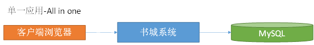

# 第二章 分布式概念

## 什么是分布式

《分布式系统原理与范型》定义：“分布式系统是若干独立计算机的集合，这些计算机对于用户来说就像单个相关系统”。

分布式系统（distributed system）是建立在网络之上的软件系统。

## 分布式与集群的关系

集群指的是将几台服务器集中在一起，实现同一业务。

**分布式中的每一个节点，都可以做集群。 而集群并不一定就是分布式的。**

## 软件架构演变

| **单一应用架构**&#xA;当网站流量很小时，只需一个应用，将所有功能都部署在一起，以减少部署节点和成本。此时，用于简化增删改查工作量的**数据访问框架(ORM)是关键**。&#xA;&#xA;                                   |
| ------------------------------------------------------------------------------------------------------------------------------------ |
| **垂直应用架构**&#xA;当访问量逐渐增大，单一应用增加机器带来的加速度越来越小，将应用拆成互不相干的几个应用，以提升效率。此时，用于加速前端页面开发的**Web框架(MVC)是关键**。&#xA;&#xA;                           |
| **分布式服务架构**&#xA;当垂直应用越来越多，应用之间交互不可避免，将核心业务抽取出来，作为独立的服务，逐渐形成稳定的服务中心，使前端应用能更快速的响应多变的市场需求。此时，用于提高业务复用及整合的**分布式服务框架(RPC)是关键**。&#xA;&#xA; |
| **流动计算架构**&#xA;当服务越来越多，容量的评估，小服务资源的浪费等问题逐渐显现，此时需增加**一个调度中心**基于访问压力实时管理集群容量，提高集群利用率。此时，用于提高机器利用率的**资源调度和治理中心(SOA)是关键**。&#xA;&#xA;     |

## RPC是什么

RPC【Remote Procedure Call】是指远程过程调用，是一种进程间通信方式，他是一种技术的思想，而不是规范。

它允许程序调用另一个地址空间（通常是共享网络的另一台机器上）的过程或函数，而不用程序员显式编码这个远程调用的细节。

即程序员无论是调用本地的还是远程的函数，本质上编写的调用代码基本相同。

### 解决分布式系统的各个服务之间互相交互问题

### RPC思想原理

 

### 服务之间的交互可以用两种方式

-   RPC
    -   Netty（Socket）+自定义序列化
-   RestAPI    (严格来说，SpringCloud是使用Rest方式进行服务之间交互的，不属于RPC)
    -   HTTP+JSON

## 分布式思想与基本概念

### 高并发

1.  **通过设计保证系统可以并行处理很多请求。应对大量****流量****与请求**

-   Tomcat最多支持并发多少用户？

Tomcat 默认配置的最大请求数是 150，也就是说同时支持 150 个并发，当然了，也可以将其改大。

当某个应用拥有 250 个以上并发的时候，应考虑应用服务器的集群。

具体能承载多少并发，需要看硬件的配置，CPU 越多性能越高，分配给 JVM 的内存越多性能也就越高，但也会加重 GC 的负担。

-   操作系统对于进程中的线程数有一定的限制：

Windows 每个进程中的线程数不允许超过 2000

Linux 每个进程中的线程数不允许超过 1000

另外，在 Java 中每开启一个线程需要耗用 1MB 的 JVM 内存空间用于作为线程栈之用。

Tomcat 默认的 HTTP 实现是采用阻塞式的 Socket 通信，每个请求都需要创建一个线程处理。这种模式下的并发量受到线程数的限制，但对于 Tomcat 来说几乎没有 BUG 存在了。

Tomcat 还可以配置 NIO 方式的 Socket 通信，在性能上高于阻塞式的，每个请求也不需要创建一个线程进行处理，并发能力比前者高。但没有阻塞式的成熟。

这个并发能力还与应用的逻辑密切相关，如果逻辑很复杂需要大量的计算，那并发能力势必会下降。如果每个请求都含有很多的数据库操作，那么对于数据库的性能也是非常高的。

对于单台数据库服务器来说，允许客户端的连接数量是有限制的。

并发能力问题涉及整个系统架构和业务逻辑。

系统环境不同，Tomcat版本不同、JDK版本不同、以及修改的设定参数不同。并发量的差异还是满大的。

-   maxThreads="1000" 最大并发数 ，默认值为200
-   minSpareThreads="100"//初始化时创建的线程数，默认值为10
-   acceptCount="700"// 指定当所有可以使用的处理请求的线程数都被使用时，可以放到处理队列中的请求数，超过这个数的请求将不予处理，默认值为100

[https://tomcat.apache.org/tomcat-8.0-doc/config/http.html](https://tomcat.apache.org/tomcat-8.0-doc/config/http.html "https://tomcat.apache.org/tomcat-8.0-doc/config/http.html")

1.  **高并发衡量指标**

-   响应时间(RT)&#x20;
    -   请求做出响应的时间，即一个http请求返回所用的时间
-   吞吐量
    -   系统在单位时间内处理请求的数量
-   QPS(Query/Request Per Second)、 TPS（Transaction Per Second）&#x20;
-   每秒查询（请求）数、每秒事务数
    -   专业的测试工具：Load Runner
    -   Apache ab
    -   Apache JMeter
-   并发用户数
    -   承载的正常使用系统功能的用户的数量

### 高可用

服务集群部署

数据库主从+双机热备

-   主-备方式（Active-Standby方式）

主-备方式即指的是一台服务器处于某种业务的激活状态（即Active状态），另一台服务器处于该业务的备用状态（即Standby状态)。

-   双主机方式（Active-Active方式）

双主机方式即指两种不同业务分别在两台服务器上互为主备状态（即Active-Standby和Standby-Active状态）

### 注册中心

保存某个服务所在地址等信息，方便调用者实时获取其他服务信息

-   服务注册
    -   服务提供者
-   服务发现
    -   服务消费者

### 负载均衡

-   动态将请求派发给比较闲的服务器

**策略：**

-   轮询(Round Robin)
-   加权轮询(Weighted Round Robin)
-   随机Random
-   哈希Hash
-   最小连接数LC
-   最短响应时间LRT

### 服务雪崩

服务之间复杂调用，一个服务不可用，导致整个系统受影响不可用

### 熔断

某个服务频繁超时，直接将其短路，快速返回mock（模拟/虚拟）值

### 限流

限制某个服务每秒的调用本服务的频率

### API网关

API网关要做很多工作，它作为一个系统的后端总入口，承载着所有服务的组合路由转换等工作，除此之外，我们一般也会把安全，限流，缓存，日志，监控，重试，熔断等放到 API 网关来做

### 服务跟踪

追踪服务的调用链，记录整个系统执行请求过程。如：请求响应时间，判断链中的哪些服务属于慢服务（可能存在问题，需要改善）。

### 弹性云

Elastic Compute Service（ECS）弹性计算服务

动态扩容，压榨服务器闲时能力

例如：双11,618，高峰时多配置些服务器，平时减少多余的服务器配置（用于其他服务应用），避免资源浪费

