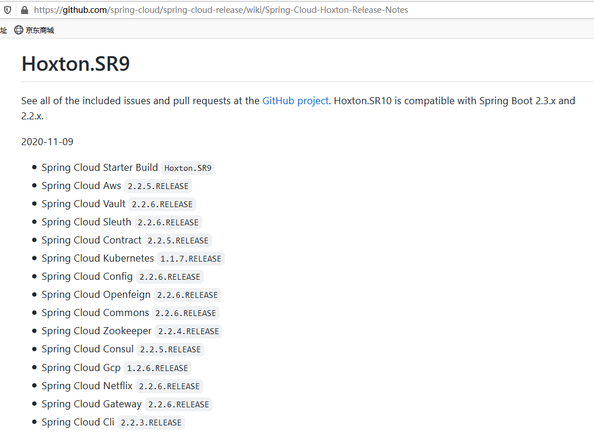
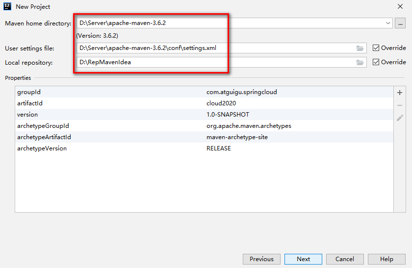

# 第三章SpringCloud背景

## 背景介绍

### 微服务架构

 

物联网（ IoT ，Internet of things ）即“万物相连的互联网”，是互联网基础上的延伸和扩展的网络，将各种信息传感设备与互联网结合起来而形成的一个巨大网络，实现在任何时间、任何地点，人、机、物的互联互通。

Breaker dashboard 断路器仪表板

Distributed Tracing分布式跟踪 （分布式处理程序链跟踪用于监视网络等待时间，并可视化通过微服务的请求流）

### 微服务框架之SpringBoot

[https://docs.spring.io/spring-boot/docs/2.3.6.RELEASE/reference/htmlsingle/](https://docs.spring.io/spring-boot/docs/2.3.6.RELEASE/reference/htmlsingle/ "https://docs.spring.io/spring-boot/docs/2.3.6.RELEASE/reference/htmlsingle/")

### 分布式系统微服务架构之SpringCloud

[https://docs.spring.io/spring-cloud/docs/Hoxton.SR9/reference/html/](https://docs.spring.io/spring-cloud/docs/Hoxton.SR9/reference/html/ "https://docs.spring.io/spring-cloud/docs/Hoxton.SR9/reference/html/")

英文困难的同学，也不耽误学习的

[https://www.bookstack.cn/read/spring-cloud-docs/docs-index.md](https://www.bookstack.cn/read/spring-cloud-docs/docs-index.md "https://www.bookstack.cn/read/spring-cloud-docs/docs-index.md")

### 组件概述

## 关于SpringBoot和SpringCloud版本

### SpringCloud版本选择

SpringBoot2.3.6版和SpringCloud Hoxton.SR9版

SpringCloud Alibaba 2.2.6

### Springboot版本选择

git源码地址：&#x20;

[https://github.com/spring-projects/spring-boot/releases/](https://github.com/spring-projects/spring-boot/releases/ "https://github.com/spring-projects/spring-boot/releases/")

SpringBoot2.0新特性：&#x20;

[https://github.com/spring-projects/spring-boot/wiki/Spring-Boot-2.0-Release-Notes](https://github.com/spring-projects/spring-boot/wiki/Spring-Boot-2.0-Release-Notes "https://github.com/spring-projects/spring-boot/wiki/Spring-Boot-2.0-Release-Notes")

通过上面官网发现，Boot官方强烈建议你升级到**2.X**以上版本

### 官网看Boot版本&#x20;

springboot(截至2021.9.28)

### SpringCloud版本选择

-   git源码地址： [https://github.com/spring-projects/spring-cloud/wiki](https://github.com/spring-projects/spring-cloud/wiki "https://github.com/spring-projects/spring-cloud/wiki")
-   官网： [https://spring.io/projects/spring-cloud](https://spring.io/projects/spring-cloud "https://spring.io/projects/spring-cloud")

官网看Cloud版本&#x20;

-   Cloud命名规则

Spring Cloud采用了英国伦敦地铁站的名称来命名，并由地铁站名称字母A-Z依次类推的形式来发布迭代版本。

Spring Cloud 是一个由许多子项目组成的综合项目，各子项目有不同的发布节奏。为了管理SpringCloud与各子项目的版本依赖关系，发布了一个清单，其中包括了某个SpringCloud版本对应的子项目版本。为了避免SpringCloud版本号与子项目版本号混淆，SpringCloud版本采用了名称而非版本号的命名，这些版本的名字采用了**伦敦地铁站**的名字，根据字母表的顺序来应对版本时间顺序。例如Angel是第一个版本，Brixton是第二个版本。当SpringCloud的发布内容积累到临界点或者一个重大BUG被解决后，会发布一个"service releases"版本，简称SRX版本，比如Greenwich.SR2就是SpringCloud发布的Greenwich版本的第二个SRX版本。

-   SpringCloud(截至2021.9.28)

### SpringCloud和Springboot之间的依赖关系

[https://docs.spring.io/spring-cloud/docs/Hoxton.SR9/reference/html/](https://docs.spring.io/spring-cloud/docs/Hoxton.SR9/reference/html/ "https://docs.spring.io/spring-cloud/docs/Hoxton.SR9/reference/html/")

更详细的版本对应查看方法： [https://start.spring.io/actuator/info](https://start.spring.io/actuator/info "https://start.spring.io/actuator/info")&#x20;

### SpringCloud（授课选择版本）

-   cloud
    -   Hoxton.SR9
-   boot
    -   2.3.6.RELEASE
-   cloud Alibaba
    -   2.2.6.RELEASE
-   &#x20;java
    -   JAVA8
-   maven
    -   3.5及以上
-   mysql
    -   5.7及以上

## 微服务架构编码构建-IDEA新建project工作空间

### 微服务cloud整体聚合父工程Project

#### New Project

#### 聚合总工程名字

#### Maven选版本

#### 工程名字

#### 字符编码

#### 注解生效激活

#### java编译版本

#### File Type过滤【可选】

### 父工程POM

| \<?xml version="1.0" encoding="UTF-8"?>&#xA;\<project xmlns="<http://maven.apache.org/POM/4.0.0>" xmlns:xsi="<http://www.w3.org/2001/XMLSchema-instance>"&#xA;         xsi:schemaLocation="<http://maven.apache.org/POM/4.0.0> [https://maven.apache.org/xsd/maven-4.0.0.xsd](https://maven.apache.org/xsd/maven-4.0.0.xsd "https://maven.apache.org/xsd/maven-4.0.0.xsd")">&#xA;&#xA;  \<modelVersion>4.0.0\</modelVersion>&#xA;&#xA;  \<groupId>**com.atguigu.springcloud**\</groupId>&#xA;  \<artifactId>**cloud2021**\</artifactId>&#xA;  \<version>1.0-SNAPSHOT\</version>&#xA;  \<packaging>**pom**\</packaging>&#xA;&#xA;  \<!-- 统一管理jar包版本 -->&#xA;  \<properties>&#xA;    \<project.build.sourceEncoding>UTF-8\</project.build.sourceEncoding>&#xA;    \<maven.compiler.source>1.8\</maven.compiler.source>&#xA;    \<maven.compiler.target>1.8\</maven.compiler.target>&#xA;    \<junit.version>4.12\</junit.version>&#xA;    \<log4j.version>1.2.17\</log4j.version>&#xA;    \<lombok.version>1.16.18\</lombok.version>&#xA;    \<mysql.version>5.1.47\</mysql.version>&#xA;    \<druid.version>1.1.16\</druid.version>&#xA;    \<mybatis.spring.boot.version>1.3.0\</mybatis.spring.boot.version>&#xA;  \</properties>&#xA;&#xA;  \<!-- 子模块继承之后，提供作用：锁定版本+子modlue不用写groupId和version  -->&#xA;  \<dependencyManagement>&#xA;    \<dependencies>&#xA;      \<dependency>&#xA;        \<groupId>org.springframework.boot\</groupId>&#xA;        \<artifactId>spring-boot-dependencies\</artifactId>&#xA;        \<version>2.3.6.RELEASE\</version>&#xA;        \<type>pom\</type>&#xA;        \<scope>import\</scope>&#xA;      \</dependency>&#xA;      \<dependency>&#xA;        \<groupId>org.springframework.cloud\</groupId>&#xA;        \<artifactId>spring-cloud-dependencies\</artifactId>&#xA;        \<version>Hoxton.SR9\</version>&#xA;        \<type>pom\</type>&#xA;        \<scope>import\</scope>&#xA;      \</dependency>&#xA;      \<dependency>&#xA;        \<groupId>com.alibaba.cloud\</groupId>&#xA;        \<artifactId>spring-cloud-alibaba-dependencies\</artifactId>&#xA;        \<version>2.2.6.RELEASE\</version>&#xA;        \<type>pom\</type>&#xA;        \<scope>import\</scope>&#xA;      \</dependency>&#xA;&#xA;      \<dependency>&#xA;        \<groupId>mysql\</groupId>&#xA;        \<artifactId>mysql-connector-java\</artifactId>&#xA;        \<version>\${mysql.version}\</version>&#xA;      \</dependency>&#xA;      \<dependency>&#xA;        \<groupId>com.alibaba\</groupId>&#xA;        \<artifactId>druid\</artifactId>&#xA;        \<version>\${druid.version}\</version>&#xA;      \</dependency>&#xA;      \<dependency>&#xA;        \<groupId>org.mybatis.spring.boot\</groupId>&#xA;        \<artifactId>mybatis-spring-boot-starter\</artifactId>&#xA;        \<version>\${mybatis.spring.boot.version}\</version>&#xA;      \</dependency>&#xA;      \<dependency>&#xA;        \<groupId>junit\</groupId>&#xA;        \<artifactId>junit\</artifactId>&#xA;        \<version>\${junit.version}\</version>&#xA;      \</dependency>&#xA;      \<dependency>&#xA;        \<groupId>log4j\</groupId>&#xA;        \<artifactId>log4j\</artifactId>&#xA;        \<version>\${log4j.version}\</version>&#xA;      \</dependency>&#xA;      \<dependency>&#xA;        \<groupId>org.projectlombok\</groupId>&#xA;        \<artifactId>lombok\</artifactId>&#xA;        \<version>\${lombok.version}\</version>&#xA;        \<optional>true\</optional>&#xA;      \</dependency>&#xA;    \</dependencies>&#xA;  \</dependencyManagement>&#xA;&#xA;  \<build>&#xA;    \<plugins>&#xA;      \<plugin>&#xA;        \<groupId>org.springframework.boot\</groupId>&#xA;        \<artifactId>spring-boot-maven-plugin\</artifactId>&#xA;        \<configuration>&#xA;          \<fork>true\</fork>&#xA;          \<addResources>true\</addResources>&#xA;        \</configuration>&#xA;      \</plugin>&#xA;    \</plugins>&#xA;  \</build>&#xA;&#xA;\</project>&#xA; |
| ----------------------------------------------------------------------------------------------------------------------------------------------------------------------------------------------------------------------------------------------------------------------------------------------------------------------------------------------------------------------------------------------------------------------------------------------------------------------------------------------------------------------------------------------------------------------------------------------------------------------------------------------------------------------------------------------------------------------------------------------------------------------------------------------------------------------------------------------------------------------------------------------------------------------------------------------------------------------------------------------------------------------------------------------------------------------------------------------------------------------------------------------------------------------------------------------------------------------------------------------------------------------------------------------------------------------------------------------------------------------------------------------------------------------------------------------------------------------------------------------------------------------------------------------------------------------------------------------------------------------------------------------------------------------------------------------------------------------------------------------------------------------------------------------------------------------------------------------------------------------------------------------------------------------------------------------------------------------------------------------------------------------------------------------------------------------------------------------------------------------------------------------------------------------------------------------------------------------------------------------------------------------------------------------------------------------------------------------------------------------------------------------------------------------------------------------------------------------------------------------------------------------------------------------------------------------------------------------------------------------------------------------------------------------------------------------------------------------------------------------------------------------------------------------------------------------------------------------------------------------------------------------------------------------------------------------------------------------------------------------------------------------------------------------------------------------------------------------------------------------------------------------------------------------------------------------------------------------------------------------------------------------------------------------------------------------------------------------------------------------------------------------------------------------------------------------------------------------------------------------------------------------------------------------------------------------------------------------------------------------------------------------------------------------------------------------------------------------------------------------------------------------------------------------------------------------------------------------------------------------------------------------------------------------------------------------------------------------------------------------------------------------- |

### Maven工程落地细节复习

Maven中的**dependencyManagement**和**dependencies**区别

maven中跳过单元测试【可选】

### 父工程创建完成执行mvn:install

## 微服务架构编码构建-Rest微服务-【服务提供者】

### 建cloud-provider-payment8001

创建完成后请回到父工程查看pom文件变化，增加了聚合模块

| \<modules>&#xA;    \<module>cloud-provider-payment8001\</module>&#xA;  \</modules>&#xA; |
| --------------------------------------------------------------------------------------- |

### 改POM文件

| \<?xml version="1.0" encoding="UTF-8"?>&#xA;\<project xmlns="<http://maven.apache.org/POM/4.0.0>"&#xA;         xmlns:xsi="<http://www.w3.org/2001/XMLSchema-instance>"&#xA;         xsi:schemaLocation="<http://maven.apache.org/POM/4.0.0> [http://maven.apache.org/xsd/maven-4.0.0.xsd](http://maven.apache.org/xsd/maven-4.0.0.xsd "http://maven.apache.org/xsd/maven-4.0.0.xsd")">&#xA;    \<parent>&#xA;        \<artifactId>cloud2021\</artifactId>&#xA;        \<groupId>com.atguigu.springcloud\</groupId>&#xA;        \<version>1.0-SNAPSHOT\</version>&#xA;    \</parent>&#xA;    \<modelVersion>4.0.0\</modelVersion>&#xA;&#xA;    \<artifactId>cloud-provider-payment8001\</artifactId>&#xA;&#xA;    \<dependencies>&#xA;        \<dependency>&#xA;            \<groupId>org.springframework.boot\</groupId>&#xA;            \<artifactId>spring-boot-starter-web\</artifactId>&#xA;        \</dependency>&#xA;        \<dependency>&#xA;            \<groupId>org.springframework.boot\</groupId>&#xA;            \<artifactId>spring-boot-starter-actuator\</artifactId>&#xA;        \</dependency>&#xA;        \<dependency>&#xA;            \<groupId>org.mybatis.spring.boot\</groupId>&#xA;            \<artifactId>mybatis-spring-boot-starter\</artifactId>&#xA;        \</dependency>&#xA;        \<dependency>&#xA;            \<groupId>com.alibaba\</groupId>&#xA;            \<artifactId>druid-spring-boot-starter\</artifactId>&#xA;            \<version>1.1.10\</version>&#xA;        \</dependency>&#xA;        \<dependency>&#xA;            \<groupId>mysql\</groupId>&#xA;            \<artifactId>mysql-connector-java\</artifactId>&#xA;        \</dependency>&#xA;        \<dependency>&#xA;            \<groupId>org.springframework.boot\</groupId>&#xA;            \<artifactId>spring-boot-starter-jdbc\</artifactId>&#xA;        \</dependency>&#xA;        \<dependency>&#xA;            \<groupId>org.springframework.boot\</groupId>&#xA;            \<artifactId>spring-boot-devtools\</artifactId>&#xA;           \<scope>runtime\</scope>&#xA;            \<optional>true\</optional>&#xA;        \</dependency>&#xA;        \<dependency>&#xA;            \<groupId>org.projectlombok\</groupId>&#xA;            \<artifactId>lombok\</artifactId>&#xA;            \<optional>true\</optional>&#xA;        \</dependency>&#xA;        \<dependency>&#xA;            \<groupId>org.springframework.boot\</groupId>&#xA;            \<artifactId>spring-boot-starter-test\</artifactId>&#xA;            \<scope>test\</scope>&#xA;        \</dependency>&#xA;&#xA;    \</dependencies>&#xA;\</project>&#xA; |
| --------------------------------------------------------------------------------------------------------------------------------------------------------------------------------------------------------------------------------------------------------------------------------------------------------------------------------------------------------------------------------------------------------------------------------------------------------------------------------------------------------------------------------------------------------------------------------------------------------------------------------------------------------------------------------------------------------------------------------------------------------------------------------------------------------------------------------------------------------------------------------------------------------------------------------------------------------------------------------------------------------------------------------------------------------------------------------------------------------------------------------------------------------------------------------------------------------------------------------------------------------------------------------------------------------------------------------------------------------------------------------------------------------------------------------------------------------------------------------------------------------------------------------------------------------------------------------------------------------------------------------------------------------------------------------------------------------------------------------------------------------------------------------------------------------------------------------------------------------------------------------------------------------------------------------------------------------------------------------------------------------------------------------------------------------------------------------------------------------------------------------------------------------------------------------------------------------------------------------------------------------------------------------------------------------------------------------------------------------------------------------------------------------------------------------------------------------------------------------------------------------------------------------------------------------------------------------------------------------------------------------------------------------- |

### 写YML

| server:&#xA;port: 8001 |
| ---------------------- |

### 主启动

| package com.atguigu.springcloud;&#xA;&#xA;import org.springframework.boot.SpringApplication;&#xA;import org.springframework.boot.autoconfigure.SpringBootApplication;&#xA;&#xA;@SpringBootApplication&#xA;public class PaymentMain8001 {&#xA;    public static void main(String\[] args) {&#xA;        SpringApplication.run(PaymentMain8001.class,args);&#xA;    }&#xA;}&#xA; |
| ------------------------------------------------------------------------------------------------------------------------------------------------------------------------------------------------------------------------------------------------------------------------------------------------------------------------------------------------------------------------------ |

### 业务类

#### 建表SQL

| CREATE DATABASE  IF NOT EXISTS cloud2021 DEFAULT CHARACTER SET utf8 ;&#xA;&#xA;USE cloud2021 ;&#xA;&#xA;DROP TABLE IF EXISTS payment ;&#xA;&#xA;CREATE TABLE payment (&#xA;  id BIGINT (20) NOT NULL AUTO\_INCREMENT COMMENT 'ID',&#xA;  SERIAL VARCHAR (300) DEFAULT NULL,&#xA;  PRIMARY KEY (id)&#xA;) ENGINE = INNODB AUTO\_INCREMENT = 33 DEFAULT CHARSET = utf8 ;&#xA;&#xA;INSERT INTO payment (id, SERIAL) VALUES(31, '尚硅谷001'),(32, 'atguigu002') ;&#xA; |
| --------------------------------------------------------------------------------------------------------------------------------------------------------------------------------------------------------------------------------------------------------------------------------------------------------------------------------------------------------------------------------------------------------------------------------------------------------------- |

#### Entitles

#### 主实体Payment

| package com.atguigu.springcloud.entities;&#xA;&#xA;import lombok.AllArgsConstructor;&#xA;import lombok.Data;&#xA;import lombok.NoArgsConstructor;&#xA;import java.io.Serializable;&#xA;&#xA;@Data&#xA;@AllArgsConstructor&#xA;@NoArgsConstructor&#xA;public class Payment implements Serializable {&#xA;    private Long id;&#xA;    private String serial;&#xA;}&#xA; |
| ---------------------------------------------------------------------------------------------------------------------------------------------------------------------------------------------------------------------------------------------------------------------------------------------------------------------------------------------------------------------- |

#### Json封装体CommonResult

| package com.atguigu.springcloud.entities;&#xA;&#xA;import lombok.AllArgsConstructor;&#xA;import lombok.Data;&#xA;import lombok.NoArgsConstructor;&#xA;&#xA;@Data&#xA;@AllArgsConstructor&#xA;@NoArgsConstructor&#xA;public class **CommonResult** \<T> implements Serializable{&#xA;&#xA;    private Integer code;&#xA;    private String message;&#xA;    private T data;&#xA;&#xA;    public CommonResult(Integer code,String message){&#xA;        this(code,message,null);**//如果这行报错，请安装lombok插件**&#xA;    }&#xA;}&#xA; |
| --------------------------------------------------------------------------------------------------------------------------------------------------------------------------------------------------------------------------------------------------------------------------------------------------------------------------------------------------------------------------------------------------------------------------------------------------------------------------------------------------------------------------- |

#### 安装lombok插件

[https://www.projectlombok.org/](https://www.projectlombok.org/ "https://www.projectlombok.org/")

@Data：提供getter/setter

@NoArgsConstructor, 无参构造器 @RequiredArgsConstructor   @AllArgsConstructor  全参数构造器

@EqualsAndHashCode：提供equals和hashCode方法

@Getter/@Setter

@Slf4j 内置log对象，直接调用日志方法输出日志

#### Dao

#### 接口PaymentDao

| package com.atguigu.springcloud.dao;&#xA;&#xA;import com.atguigu.springcloud.entities.Payment;&#xA;import org.apache.ibatis.annotations.Mapper;&#xA;import org.apache.ibatis.annotations.Param;&#xA;import org.springframework.stereotype.Repository;&#xA;&#xA;@Component       //代替@Repository声明bean&#xA;@Mapper               //mybatis提供的，等价：@MapperScan("com.atguigu.springcloud.dao")&#xA;//@Repository     //spring提供的。在此，只是为了声明bean对象&#xA;public interface PaymentDao {&#xA;    public int create(Payment payment);    &#xA;    public Payment getPaymentById(@Param("id") Long id);&#xA;}&#xA; |
| ------------------------------------------------------------------------------------------------------------------------------------------------------------------------------------------------------------------------------------------------------------------------------------------------------------------------------------------------------------------------------------------------------------------------------------------------------------------------------------------------------------------------------------------------------------------------------------------------------ |

#### mybatis的映射文件

src\main\resources\mapper\PaymentMapper.xml

| \<?xml version="1.0" encoding="UTF-8"?>&#xA;\<!DOCTYPE mapper PUBLIC "-//mybatis.org//DTD Mapper 3.0//EN" "[http://mybatis.org/dtd/mybatis-3-mapper.dtd](http://mybatis.org/dtd/mybatis-3-mapper.dtd "http://mybatis.org/dtd/mybatis-3-mapper.dtd")">&#xA;&#xA;\<mapper namespace="com.atguigu.springcloud.dao.PaymentDao">&#xA;    \<insert id="create"  useGeneratedKeys="true" keyProperty="id">&#xA;            insert into payment(serial) values(#{serial});&#xA;    \</insert>&#xA;&#xA;    \<resultMap id="BaseResultMap" type="com.atguigu.springcloud.entities.Payment">&#xA;        \<id column="id" property="id" jdbcType="BIGINT">\</id>&#xA;        \<result column="serial" property="serial" jdbcType="VARCHAR">\</result>&#xA;    \</resultMap>&#xA;&#xA;    \<select id="getPaymentById"  parameterType="Long" resultMap="BaseResultMap">&#xA;            select \* from payment where id=#{id}&#xA;    \</select>&#xA;&#xA;\</mapper>&#xA; |
| -------------------------------------------------------------------------------------------------------------------------------------------------------------------------------------------------------------------------------------------------------------------------------------------------------------------------------------------------------------------------------------------------------------------------------------------------------------------------------------------------------------------------------------------------------------------------------------------------------------------------------------------------------------------------------------------------------------------------------------------------------------------------------------------------------------------------------------------------------------------------------------------------------------------------------------------------------------- |

#### Service

#### 接口PaymentService

| package com.atguigu.springcloud.service;&#xA;&#xA;import com.atguigu.springcloud.entities.Payment;&#xA;import org.apache.ibatis.annotations.Param;&#xA;&#xA;public interface PaymentService {&#xA;    public int create(Payment payment); //写&#xA;    public Payment getPaymentById(Long id);  //读取&#xA;}&#xA; |
| -------------------------------------------------------------------------------------------------------------------------------------------------------------------------------------------------------------------------------------------------------------------------------------------------------------- |

#### 实现类PaymentServiceImpl

| package com.atguigu.springcloud.service.impl;&#xA;&#xA;import com.atguigu.springcloud.dao.PaymentDao;&#xA;import com.atguigu.springcloud.entities.Payment;&#xA;import com.atguigu.springcloud.service.PaymentService;&#xA;import org.apache.ibatis.annotations.Param;&#xA;import org.springframework.stereotype.Service;&#xA;import javax.annotation.Resource;&#xA;&#xA;@Service&#xA;public class PaymentServiceImpl implements PaymentService {&#xA;&#xA;\*\*    @Resource\*\*&#xA;\*\*    //@Autowired\*\*&#xA;    private PaymentDao paymentDao;&#xA;&#xA;    public int create(Payment payment){&#xA;        return paymentDao.create(payment);&#xA;    }&#xA;&#xA;    public Payment getPaymentById( Long id){&#xA;        return paymentDao.getPaymentById(id);&#xA;    }&#xA;}&#xA; |
| ------------------------------------------------------------------------------------------------------------------------------------------------------------------------------------------------------------------------------------------------------------------------------------------------------------------------------------------------------------------------------------------------------------------------------------------------------------------------------------------------------------------------------------------------------------------------------------------------------------------------------------------------------------------------------------------------------------------------------------------------------------------------------------------ |

#### Controller

| package com.atguigu.springcloud.controller; |
| ------------------------------------------- |

### 测试

#### postman测试get请求

#### postman测试post请求

#### 快速运行设置

| &#xA; &#xA;&#xA; |
| ---------------- |

### 开发步骤-小总结

1.  建module
2.  改POM
3.  写YML
4.  主启动
5.  业务类

### 热部署Devtools

#### Adding devtools to your project

| \<dependency>&#xA;    \<groupId>org.springframework.boot\</groupId>&#xA;    \<artifactId>spring-boot-devtools\</artifactId>&#xA;   \<scope>runtime\</scope>&#xA;    \<optional>true\</optional>&#xA;\</dependency>&#xA; |
| ----------------------------------------------------------------------------------------------------------------------------------------------------------------------------------------------------------------------- |

#### Adding plugin to your pom.xml

| 下一段配置黏贴到父工程当中的pom里&#xA;\<build>&#xA;  \<plugins>&#xA;    \<plugin>&#xA;      \<groupId>org.springframework.boot\</groupId>&#xA;      \<artifactId>spring-boot-maven-plugin\</artifactId>&#xA;      \<configuration>&#xA;        \<fork>true\</fork>&#xA;        \<addResources>true\</addResources>&#xA;      \</configuration>&#xA;    \</plugin>&#xA;  \</plugins>&#xA;\</build>&#xA; |
| --------------------------------------------------------------------------------------------------------------------------------------------------------------------------------------------------------------------------------------------------------------------------------------------------------------------------------------------------------------------------------------- |

#### Enabling automatic build

#### Update the value of

Ctrl+Shift+Alt+/ 选择Registry…

compiler.automake.allow\.when.app.running -> 自动编译

compile.document.save.trigger.delay -> 自动更新文件；它主要是针对静态文件如JS CSS的更新，将延迟时间减少后，直接按F5刷新页面就能看到效果！

#### 重启IDEA

## 微服务架构编码构建-Rest微服务-【服务消费者】

### 建cloud-consumer-order80

### 改POM

| \<?xml version="1.0" encoding="UTF-8"?>&#xA;\<project xmlns="<http://maven.apache.org/POM/4.0.0>"&#xA;         xmlns:xsi="<http://www.w3.org/2001/XMLSchema-instance>"&#xA;         xsi:schemaLocation="<http://maven.apache.org/POM/4.0.0> [http://maven.apache.org/xsd/maven-4.0.0.xsd](http://maven.apache.org/xsd/maven-4.0.0.xsd "http://maven.apache.org/xsd/maven-4.0.0.xsd")">&#xA;    \<parent>&#xA;        \<artifactId>cloud2021\</artifactId>&#xA;        \<groupId>com.atguigu.springcloud\</groupId>&#xA;        \<version>1.0-SNAPSHOT\</version>&#xA;    \</parent>&#xA;    \<modelVersion>4.0.0\</modelVersion>&#xA;    \<artifactId>cloud-consumer-order80\</artifactId>&#xA;&#xA;    \<dependencies>&#xA;        \<dependency>&#xA;            \<groupId>org.springframework.boot\</groupId>&#xA;            \<artifactId>spring-boot-starter-web\</artifactId>&#xA;        \</dependency>&#xA;        \<dependency>&#xA;            \<groupId>org.springframework.boot\</groupId>&#xA;            \<artifactId>spring-boot-starter-actuator\</artifactId>&#xA;        \</dependency>&#xA;        \<dependency>&#xA;            \<groupId>org.springframework.boot\</groupId>&#xA;            \<artifactId>spring-boot-devtools\</artifactId>&#xA;            \<scope>runtime\</scope>&#xA;            \<optional>true\</optional>&#xA;        \</dependency>&#xA;        \<dependency>&#xA;            \<groupId>org.projectlombok\</groupId>&#xA;            \<artifactId>lombok\</artifactId>&#xA;            \<optional>true\</optional>&#xA;        \</dependency>&#xA;        \<dependency>&#xA;            \<groupId>org.springframework.boot\</groupId>&#xA;            \<artifactId>spring-boot-starter-test\</artifactId>&#xA;            \<scope>test\</scope>&#xA;        \</dependency>&#xA;    \</dependencies>&#xA;\</project>&#xA; |
| --------------------------------------------------------------------------------------------------------------------------------------------------------------------------------------------------------------------------------------------------------------------------------------------------------------------------------------------------------------------------------------------------------------------------------------------------------------------------------------------------------------------------------------------------------------------------------------------------------------------------------------------------------------------------------------------------------------------------------------------------------------------------------------------------------------------------------------------------------------------------------------------------------------------------------------------------------------------------------------------------------------------------------------------------------------------------------------------------------------------------------------------------------------------------------------------------------------------------------------------------------------------------------------------------------------------------------------------------------------------------------------------------------------------------------------------------------------------------------------------------------------------------------------------------------------------------------------------------------------------------------------------------------------------------------------------------------------------------------------------------------------------------------------------------------------------------------------------------------------------- |

### 写YML

| server:&#xA;  port: 80&#xA;spring:&#xA;  application:&#xA;    name: cloud-consumer-order80&#xA; |
| ----------------------------------------------------------------------------------------------- |

### 主启动

| package com.atguigu.springcloud;&#xA;&#xA;import org.springframework.boot.SpringApplication;&#xA;import org.springframework.boot.autoconfigure.SpringBootApplication;&#xA;&#xA;@SpringBootApplication&#xA;public class OrderMain80 {&#xA;    public static void main(String\[] args) {&#xA;        SpringApplication.run(OrderMain80.class,args);&#xA;    }&#xA;}&#xA; |
| ---------------------------------------------------------------------------------------------------------------------------------------------------------------------------------------------------------------------------------------------------------------------------------------------------------------------------------------------------------------------- |

### 业务类

#### 创建entities

(将cloud-provider-payment8001工程下的entities包下的两个实体类复制过来)

#### RestTemplate

-   是什么

RestTemplate提供了多种便捷访问远程Http服务的方法，是一种简单便捷的访问Restful服务模板类，是Spring 提供的用于访问Rest服务的客户端模板工具集

-   官网及使用

官网地址： [https://docs.spring.io/spring-framework/docs/5.2.2.RELEASE/javadoc-api/org/springframework/web/client/RestTemplate.html](https://docs.spring.io/spring-framework/docs/5.2.2.RELEASE/javadoc-api/org/springframework/web/client/RestTemplate.html "https://docs.spring.io/spring-framework/docs/5.2.2.RELEASE/javadoc-api/org/springframework/web/client/RestTemplate.html")

使用RestTemplate访问Restful接口非常的简单粗暴无脑。（url，requestMap，ResponseBean.class）这三个参数分别代表REST请求地址、请求参数、Http响应转换被转换成的对象类型。

#### config配置类

ApplicationContextConfig

| package com.atguigu.springcloud.config;&#xA;&#xA;import org.springframework.context.annotation.Bean;&#xA;import org.springframework.context.annotation.Configuration;&#xA;import org.springframework.web.client.RestTemplate;&#xA;&#xA;//@Configuration&#xA;@SpringBootConfiguration&#xA;public class ApplicationContextConfig {&#xA;&#xA;    @Bean&#xA;\*\*    //@LoadBalanced\*\*&#xA;    public **RestTemplate** getRestTemplate(){&#xA;        return new RestTemplate();&#xA;    }&#xA;&#xA;}&#xA; |
| ------------------------------------------------------------------------------------------------------------------------------------------------------------------------------------------------------------------------------------------------------------------------------------------------------------------------------------------------------------------------------------------------------------------------------------------------------------------------------------------------------- |

#### 创建controller

| package com.atguigu.springcloud.controller;&#xA;&#xA;import com.atguigu.springcloud.entities.CommonResult;&#xA;import com.atguigu.springcloud.entities.Payment;&#xA;import lombok.extern.slf4j.Slf4j;&#xA;import org.springframework.web.bind.annotation.GetMapping;&#xA;import org.springframework.web.bind.annotation.PathVariable;&#xA;import org.springframework.web.bind.annotation.RestController;&#xA;import org.springframework.web.client.RestTemplate;&#xA;import javax.annotation.Resource;&#xA;&#xA;@RestController&#xA;@Slf4j&#xA;public class OrderController {&#xA;&#xA;    public static final String PAYMENT\_URL = "[http://localhost:8001](http://localhost:8001 "http://localhost:8001")";&#xA;&#xA;    @Resource&#xA;    private RestTemplate restTemplate;&#xA;&#xA;    @PostMapping("/consumer/payment/create")&#xA;    public CommonResult\<Payment>   create(Payment payment){&#xA;        return restTemplate.postForObject(PAYMENT\_URL+"/payment/create",payment,CommonResult.class);  //写操作&#xA;    }&#xA;&#xA;    @GetMapping("/consumer/payment/get/{id}")&#xA;    public CommonResult\<Payment> getPayment(@PathVariable("id") Long id){&#xA;        return restTemplate.getForObject(PAYMENT\_URL+"/payment/get/"+id,CommonResult.class);&#xA;    }&#xA;}&#xA; |
| ----------------------------------------------------------------------------------------------------------------------------------------------------------------------------------------------------------------------------------------------------------------------------------------------------------------------------------------------------------------------------------------------------------------------------------------------------------------------------------------------------------------------------------------------------------------------------------------------------------------------------------------------------------------------------------------------------------------------------------------------------------------------------------------------------------------------------------------------------------------------------------------------------------------------------------------------------------------------------------------------------------------------------------------------------------------------------------------------------------------------------------------------------------------------------------------------------------------------------------------------------------------------------------------------- |

### 测试

1.  先启动cloud-provider-payment8001
2.  再启动cloud-consumer-order80
3.  [http://localhost/consumer/payment/get/32](http://localhost/consumer/payment/get/32 "http://localhost/consumer/payment/get/32")
4.  不要忘记@RequestBody注解
5.  服务提供者接口方法需要增加@RequestBody注解(踩雷or破雷)；否则，接收不到数据。

## 工程重构

### 观察问题

### 新建：cloud-api-commons

### POM

| \<?xml version="1.0" encoding="UTF-8"?>&#xA;\<project xmlns="<http://maven.apache.org/POM/4.0.0>"&#xA;         xmlns:xsi="<http://www.w3.org/2001/XMLSchema-instance>"&#xA;         xsi:schemaLocation="<http://maven.apache.org/POM/4.0.0> [http://maven.apache.org/xsd/maven-4.0.0.xsd](http://maven.apache.org/xsd/maven-4.0.0.xsd "http://maven.apache.org/xsd/maven-4.0.0.xsd")">&#xA;    \<parent>&#xA;        \<artifactId>cloud2021\</artifactId>&#xA;        \<groupId>com.atguigu.springcloud\</groupId>&#xA;        \<version>1.0-SNAPSHOT\</version>&#xA;    \</parent>&#xA;    \<modelVersion>4.0.0\</modelVersion>&#xA;    \<artifactId>cloud-api-commons\</artifactId>&#xA;&#xA;    \<dependencies>&#xA;        \<dependency>&#xA;            \<groupId>org.springframework.boot\</groupId>&#xA;            \<artifactId>spring-boot-devtools\</artifactId>&#xA;            \<scope>runtime\</scope>&#xA;            \<optional>true\</optional>&#xA;        \</dependency>&#xA;&#xA;        \<dependency>&#xA;            \<groupId>org.projectlombok\</groupId>&#xA;            \<artifactId>lombok\</artifactId>&#xA;           \<optional>true\</optional>&#xA;        \</dependency>&#xA;        \<dependency>&#xA;            \<groupId>cn.hutool\</groupId>&#xA;            \<artifactId>hutool-all\</artifactId>&#xA;            \<version>5.1.0\</version>&#xA;        \</dependency>&#xA;    \</dependencies>&#xA;&#xA;\</project>&#xA; |
| ---------------------------------------------------------------------------------------------------------------------------------------------------------------------------------------------------------------------------------------------------------------------------------------------------------------------------------------------------------------------------------------------------------------------------------------------------------------------------------------------------------------------------------------------------------------------------------------------------------------------------------------------------------------------------------------------------------------------------------------------------------------------------------------------------------------------------------------------------------------------------------------------------------------------------------------------------------------------------------------------------------------------------------------------------------------------------------------------------------------------------------------------------------------------------------------------------------------------------------------------------------------------------------------------------------------------------------------------------------------------------------------------------------------------------------------------------------------- |

### entities

Payment实体

CommonResult通用封装类

### maven命令clean install

### 订单80和支付8001分别改造

删除各自的原先有过的entities

各自黏贴POM内容，依赖于cloud-api-commons公共项目

| \<dependency>&#xA;    \<groupId>com.atguigu.springcloud\</groupId>&#xA;    \<artifactId>cloud-api-commons\</artifactId>&#xA;    \<version>\${project.version}\</version>&#xA;\</dependency>&#xA; |
| ------------------------------------------------------------------------------------------------------------------------------------------------------------------------------------------------ |

