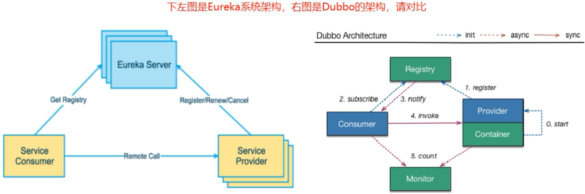
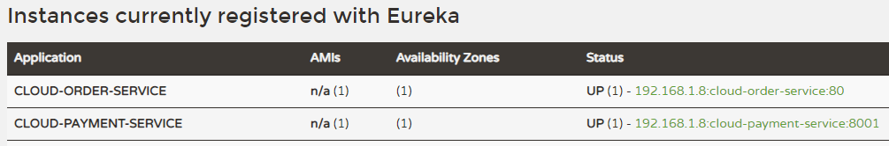
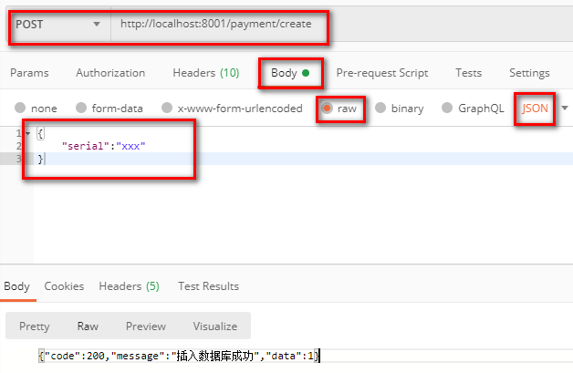

# 第四章Eureka服务注册与发现

## Eureka基础知识

### 什么是服务治理

SpringCloud封装了Netflix公司开发的Eureka模块来实现服务治理。

在传统的RPC远程调用框架中，管理每个服务与服务之间依赖关系比较复杂、所以需要进行服务治理，管理服务与服务之间依赖关联，以实现服务调用，负载均衡、容错等，实现服务发现与注册。

### 什么是服务注册

Eureka采用了CS的设计架构，Eureka Server作为服务注册功能的服务器，它是服务注册中心。

而系统中的其他微服务，使用Eureka的客户端连接到Eureka Server并维持心跳连接。这样系统的维护人员可以通过Eureka Server来监控系统中各个微服务是否正常运行。

在服务注册与发现中，有一个注册中心。当服务器启动的时候，会把当前自己服务器的信息，比如：服务通讯地址等以别名方式注册到注册中心上。

另一方（消费者服务），以该别名的方式去注册中心上获取到实际的服务通讯地址，然后，再实现本地RPC远程调用。

**RPC远程调用框架核心设计思想：** 在于注册中心，因为使用注册中心管理每个服务与服务之间的一个依赖关系（服务治理概念）。

在任何RPC远程框架中，都会有一个注册中心（存放服务地址相关信息（接口地址））。

### Eureka两组件

-   **Eureka Server提供服务注册服务**

各个微服务节点通过配置启动后，会在Eureka Server中进行注册，这样Eureka Server中的服务注册表中将会存储所有可用服务节点的信息，服务节点的信息可以在界面中直观看到。

-   **Eureka Client通过注册中心进行访问**

是一个Java客户端，用于简化Eureka Server的交互，客户端同时也具备一个内置的、使用轮询（round-robin）负载算法的负载均衡器。在应用启动后，将会在Eureka Server发送心跳（默认周期30秒）。如果Eureka Server在多个心跳周期内没有收到某个节点的心跳，Eureka Server将会从服务注册表中把这个服务节点移出（默认90秒）

## 单机Eureka构建步骤

### IDEA生成eurekaServer端服务注册中心

#### 建Module：cloud-eureka-server7001

#### 改POM

| \<?xml version="1.0" encoding="UTF-8"?>&#xA;\<project xmlns="<http://maven.apache.org/POM/4.0.0>"&#xA;         xmlns:xsi="<http://www.w3.org/2001/XMLSchema-instance>"&#xA;         xsi:schemaLocation="<http://maven.apache.org/POM/4.0.0> [http://maven.apache.org/xsd/maven-4.0.0.xsd](http://maven.apache.org/xsd/maven-4.0.0.xsd "http://maven.apache.org/xsd/maven-4.0.0.xsd")">&#xA;    \<parent>&#xA;        \<artifactId>cloud2021\</artifactId>&#xA;        \<groupId>com.atguigu.springcloud\</groupId>&#xA;        \<version>1.0-SNAPSHOT\</version>&#xA;    \</parent>&#xA;    \<modelVersion>4.0.0\</modelVersion>&#xA;    \<artifactId>cloud-eureka-server7001\</artifactId>&#xA;&#xA;    \<dependencies>&#xA;        \<dependency>&#xA;            \<groupId>org.springframework.cloud\</groupId>&#xA;            \<artifactId>spring-cloud-starter-netflix-eureka-server\</artifactId>&#xA;        \</dependency>&#xA;&#xA;        \<dependency>&#xA;            \<groupId>com.atguigu.springcloud\</groupId>&#xA;            \<artifactId>cloud-api-commons\</artifactId>&#xA;            \<version>\${project.version}\</version>&#xA;        \</dependency>&#xA;        \<dependency>&#xA;            \<groupId>org.springframework.boot\</groupId>&#xA;            \<artifactId>spring-boot-starter-web\</artifactId>&#xA;        \</dependency>&#xA;        \<dependency>&#xA;            \<groupId>org.springframework.boot\</groupId>&#xA;            \<artifactId>spring-boot-starter-actuator\</artifactId>&#xA;        \</dependency>&#xA;        \<dependency>&#xA;            \<groupId>org.springframework.boot\</groupId>&#xA;            \<artifactId>spring-boot-devtools\</artifactId>&#xA;            \<scope>runtime\</scope>&#xA;            \<optional>true\</optional>&#xA;        \</dependency>&#xA;        \<dependency>&#xA;            \<groupId>org.projectlombok\</groupId>&#xA;            \<artifactId>lombok\</artifactId>&#xA;        \</dependency>&#xA;        \<dependency>&#xA;            \<groupId>org.springframework.boot\</groupId>&#xA;            \<artifactId>spring-boot-starter-test\</artifactId>&#xA;            \<scope>test\</scope>&#xA;        \</dependency>&#xA;        \<dependency>&#xA;            \<groupId>junit\</groupId>&#xA;            \<artifactId>junit\</artifactId>&#xA;        \</dependency>&#xA;    \</dependencies>&#xA;\</project>&#xA; |
| ---------------------------------------------------------------------------------------------------------------------------------------------------------------------------------------------------------------------------------------------------------------------------------------------------------------------------------------------------------------------------------------------------------------------------------------------------------------------------------------------------------------------------------------------------------------------------------------------------------------------------------------------------------------------------------------------------------------------------------------------------------------------------------------------------------------------------------------------------------------------------------------------------------------------------------------------------------------------------------------------------------------------------------------------------------------------------------------------------------------------------------------------------------------------------------------------------------------------------------------------------------------------------------------------------------------------------------------------------------------------------------------------------------------------------------------------------------------------------------------------------------------------------------------------------------------------------------------------------------------------------------------------------------------------------------------------------------------------------------------------------------------------------------------------------------------------------------------------------------------------------------------------------------------------------------------------------------------------------------------------------------------------------------------------------------------------------------------------------------------------------------------------------------------------------------------------------------------------------------------------------------------------------------------------------------------------------------------------------------------------------------------------------------------------------------- |

#### 写YML

| server:&#xA;  port: 7001&#xA;&#xA;eureka:&#xA;  instance:&#xA;    hostname: localhost&#xA;&#xA;  client:&#xA;    register-with-eureka: false&#xA;    fetchRegistry: false&#xA;    service-url:&#xA;      defaultZone: [http://localhost:7001/eureka](http://localhost:7001/eureka "http://localhost:7001/eureka") |
| ----------------------------------------------------------------------------------------------------------------------------------------------------------------------------------------------------------------------------------------------------------------------------------------------------------------- |

#### 主启动

@EnableEurekaServer

#### 测试

[http://localhost:7001/](http://localhost:7001/ "http://localhost:7001/")

### 服务提供者

**EurekaClient端cloud-provider-payment8001将注册进EurekaServer成为服务提供者provider**

#### 建Module：cloud-provider-payment8001

#### 改POM

| \<dependency>&#xA;            \<groupId>org.springframework.cloud\</groupId>&#xA;            \<artifactId>spring-cloud-starter-netflix-eureka-client\</artifactId>&#xA;        \</dependency>&#xA; |
| -------------------------------------------------------------------------------------------------------------------------------------------------------------------------------------------------- |

#### 写YML

| eureka:&#xA;  client:&#xA;    register-with-eureka: true&#xA;    fetchRegistry: true&#xA;    service-url:&#xA;      defaultZone: [http://localhost:7001/eureka](http://localhost:7001/eureka "http://localhost:7001/eureka") |
| ---------------------------------------------------------------------------------------------------------------------------------------------------------------------------------------------------------------------------- |

#### 主启动

@EnableEurekaClient

#### 测试

先启动EurekaServer

[http://localhost:7001/](http://localhost:7001/ "http://localhost:7001/")

### 服务消费者

**EurekaClient端cloud-consumer-order80将注册进EurekaServer成为服务消费者consumer**

#### 建Module：cloud-consumer-order80

#### POM

| \<dependency>&#xA;\<groupId>org.springframework.cloud\</groupId>&#xA;\<artifactId>spring-cloud-starter-netflix-eureka-client\</artifactId>&#xA;\</dependency>&#xA; |
| ------------------------------------------------------------------------------------------------------------------------------------------------------------------ |

#### 写YML

| eureka:&#xA;  client:&#xA;    register-with-eureka: true&#xA;    fetchRegistry: true&#xA;    service-url:&#xA;      defaultZone: [http://localhost:7001/eureka](http://localhost:7001/eureka "http://localhost:7001/eureka") |
| ---------------------------------------------------------------------------------------------------------------------------------------------------------------------------------------------------------------------------- |

#### 主启动

@EnableEurekaClient

#### 测试

1.  先要启动EurekaServer，7001服务
2.  再要启动服务提供者8001服务和服务消费者80服务
3.  eureka服务器

1.  测试查询：http\://localhost/consumer/payment/get/31
2.  测试添加：postman测试添加
3.  测试8001服务和80服务效果一样

