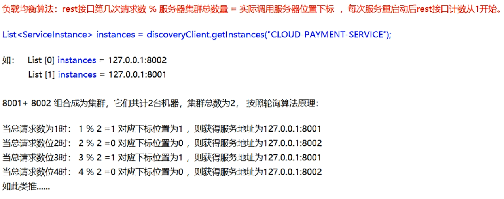

# 第五章Ribbon负载均衡服务调用

## 概述

### 是什么

Spring Cloud Ribbon是基于Netflix Ribbon实现的一套客户端负载均衡的工具。

简单的说，Ribbon是Netflix发布的开源项目，主要功能是提供客户端的软件负载均衡算法和服务调用。

Ribbon客户端组件提供一系列完善的配置项，如：连接超时，重试等。

简单的说，就是在配置文件中列出Load Balancer(简称LB)后面所有的机器，Ribbon会自动的帮助你基于某种规则（如简单轮询，随机连接等）去连接这些机器。

### 官网资料

[https://github.com/Netflix/ribbon](https://github.com/Netflix/ribbon "https://github.com/Netflix/ribbon")

Ribbon目前也进入维护模式

-   未来替换方案
    -   Spring Cloud LoadBalancer

### 能干嘛

#### LB（负载均衡）

1.  简单的说就是将用户的请求平均分配到多个服务器上，从而达到系统的HA(高可用)。
2.  常见的负载均衡有软件Nginx，LVS，硬件F5等。
3.  **Ribbon的本地负载均衡客户端  ****VS**** Nginx服务端负载均衡区别**：
    -   Nginx是服务器负载均衡，客户端所有请求都会交给Nginx，然后，由nginx实现转发请求。即负载均衡是由服务器端完成的。
    -   Ribbon本地负载均衡，在调用微服务接口时候，会在注册中心上获取注册信息服务列表之后缓存到JVM本地，从而在本地实现RPC远程服务调用。
4.  集中式LB
    -   即在服务的消费方和提供方之间使用独立的LB设施（可以是硬件，如F5，也可以是软件，如Nginx）,由该设施负责把访问请求通过某种策略转发至服务的提供方；
5.  进程内LB
    -   将LB逻辑集成到消费方，消费方从服务注册中心获知有哪些地址可用，然后自己再从这些地址中选择出一个合适的服务器。
    -   Ribbon就属于进程内LB，它只是一个类库，集成于消费方进程，消费方通过它来获取到服务提供方的地址。

#### 一句话

Ribbon=负载均衡+RestTemplate调用&#x9;

## Ribbon负载均衡演示

### 架构说明

Ribbon在工作时分成两步：

第一步，先选择EurekaServer，它优先选择在同一个区域内负载较少的server。

第二步，再根据用户指定的策略，在从server取到的服务注册列表中选择一个地址。其中Ribbon提供了多种策略。比如：轮询、随机和根据响应时间加权。

总结：Ribbon其实就是一个软负载均衡的客户端组件，他可以和其他所需请求的客户端结合使用，和eureka结合只是其中的一个实例。

### POM

| \<dependency>&#xA;\<groupId>org.springframework.cloud\</groupId>&#xA;\<artifactId>spring-cloud-starter-netflix-ribbon\</artifactId>&#xA;\</dependency>&#xA; |
| ----------------------------------------------------------------------------------------------------------------------------------------------------------- |

注意：这个不需要手动引用，Eureka客户端自带Ribbon

## Ribbon核心组件Irule

 

### IRule：根据特定算法从服务列表中选取一个要访问的服务

1.  com.netflix.loadbalancer.RoundRobinRule 轮询，默认策略。
2.  com.netflix.loadbalancer.RandomRule  随机
3.  com.netflix.loadbalancer.RetryRule 先按照RoundRobinRule的策略获取服务，如果获取服务失败则在指定时间内会进行重试，获取可用的服务&#x20;
4.  WeightedResponseTimeRule  对RoundRobinRule的扩展，响应速度越快的实例选择权重越大，越容易被选择
5.  BestAvailableRule 会先过滤掉由于多次访问故障而处于断路器跳闸状态的服务，然后选择一个并发量最小的服务
6.  AvailabilityFilteringRule 先过滤掉故障实例，再选择并发较小的实例
7.  ZoneAvoidanceRule 默认规则，复合判断server所在区域的性能和server的可用性选择服务器

### 如何替换

-   修改cloud-consumer-order80
-   注意配置细节

官方文档明确给出警告：

[https://docs.spring.io/spring-cloud-netflix/docs/2.2.6.RELEASE/reference/html/#customizing-the-ribbon-client](https://docs.spring.io/spring-cloud-netflix/docs/2.2.6.RELEASE/reference/html/#customizing-the-ribbon-client "https://docs.spring.io/spring-cloud-netflix/docs/2.2.6.RELEASE/reference/html/#customizing-the-ribbon-client")&#x20;

这个自定义配置类不能放在@ComponentScan所扫描的当前包下以及子包下，否则我们自定义的这个配置类就会被所有的Ribbon客户端所共享，达不到特殊化订制的目的了。

### 新建package（注意：包的位置）

com.atguigu.myrule

### 上面包下新建MySelfRule规则类

| package com.atguigu.myrule;&#xA;&#xA;import com.netflix.loadbalancer.IRule;&#xA;import com.netflix.loadbalancer.RandomRule;&#xA;import org.springframework.context.annotation.Bean;&#xA;import org.springframework.context.annotation.Configuration;&#xA;&#xA;@Configuration&#xA;public class MySelfRule {&#xA;&#xA;    @Bean&#xA;    public IRule myRule(){&#xA;        return new RandomRule();//定义为随机&#xA;    }&#xA;}&#xA; |
| ----------------------------------------------------------------------------------------------------------------------------------------------------------------------------------------------------------------------------------------------------------------------------------------------------------------------------------------------------------------------------------------------------------------------------- |

### 主启动类添加@RibbonClient

| package com.atguigu.springcloud;&#xA;&#xA;import com.atguigu.myrule.MySelfRule;&#xA;import org.springframework.boot.SpringApplication;&#xA;import org.springframework.boot.autoconfigure.SpringBootApplication;&#xA;import org.springframework.cloud.netflix.eureka.EnableEurekaClient;&#xA;import org.springframework.cloud.netflix.ribbon.RibbonClient;&#xA;&#xA;@EnableEurekaClient&#xA;@SpringBootApplication&#xA;@RibbonClient(name = "CLOUD-PAYMENT-SERVICE",configuration = MySelfRule.class)&#xA;public class OrderMain80 {&#xA;    public static void main(String\[] args) {&#xA;        SpringApplication.run(OrderMain80.class,args);&#xA;    }&#xA;}&#xA; |
| --------------------------------------------------------------------------------------------------------------------------------------------------------------------------------------------------------------------------------------------------------------------------------------------------------------------------------------------------------------------------------------------------------------------------------------------------------------------------------------------------------------------------------------------------------------------------------------------------------------------------------------------------------------------- |

### 测试

[http://localhost/consumer/payment/get/31](http://localhost/consumer/payment/get/31 "http://localhost/consumer/payment/get/31")

## Ribbon负载均衡算法

### 原理

