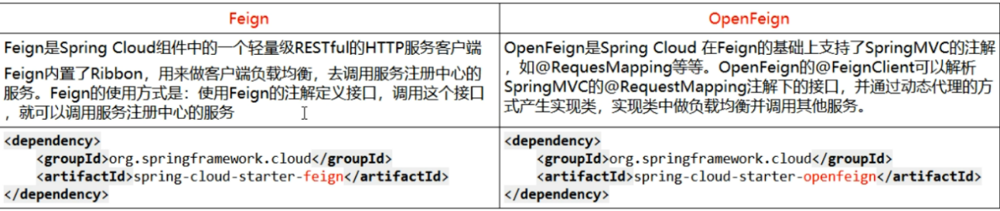

# 第六章OpenFeign服务接口调用

## 概述

### OpenFeign是什么

-   Feign是一个声明式的web服务客户端，让编写web服务客户端变得非常容易，只需创建一个接口并在接口上添加注解即可
-   SpringCloud对Feign进行了封装，使其支持了SpringMVC标准注解和HttpMessageConverters。Feign可以与Eureka和Ribbon组合使用以支持负载均衡。
-   [https://docs.spring.io/spring-cloud-openfeign/docs/2.2.6.RELEASE/reference/html/](https://docs.spring.io/spring-cloud-openfeign/docs/2.2.6.RELEASE/reference/html/ "https://docs.spring.io/spring-cloud-openfeign/docs/2.2.6.RELEASE/reference/html/")&#x20;

### 能干嘛

-   Feign能干什么？

Feign旨在使用编写Java Http客户端变得更容易。

前面在使用Ribbon+RestTemplate时，利用RestTemplate对Http请求的封装处理，形成了一套模板化的调用方法。

但是在实际开发中，由于对服务依赖的调用可能不止一处，往往一个接口会被多处调用，所以通常都会针对每个微服务自行封装一些客户端类来包装这些依赖服务端额调用。所以，Feign在此基础上做了进一步封装，由他来帮助我们定义和实现依赖服务接口的定义。

在Feign的实现下，我们只需创建一个接口并使用注解的方式来配置它（以前是DAO接口上面标注Mapper注解，现在是一个微服务接口上面标注一个Feign注解即可），即可完成对服务提供方的接口绑定，简化了使用Spring Cloud Ribbon时，自动封装服务调用客户端的开发量。

-   Feign集成了 Ribbon

利用Ribbon维护了Payment的服务列表信息，并且通过轮询实现了客户端的负载均衡。而与Ribbon不同的是，通过Feign只需要定义服务绑定接口且以声明式的方法，优雅而简单的实现了服务调用。

-   Feign和OpenFeign两者区别

## OpenFeign使用步骤

### 接口+注解

微服务调用接口+\@FeignClient

### 新建Module：cloud\_consumer\_feign\_order80

### POM

注意：openFeign也是自带rbibbon

| \<?xml version="1.0" encoding="UTF-8"?>&#xA;\<project xmlns="<http://maven.apache.org/POM/4.0.0>"&#xA;         xmlns:xsi="<http://www.w3.org/2001/XMLSchema-instance>"&#xA;         xsi:schemaLocation="<http://maven.apache.org/POM/4.0.0> [http://maven.apache.org/xsd/maven-4.0.0.xsd](http://maven.apache.org/xsd/maven-4.0.0.xsd "http://maven.apache.org/xsd/maven-4.0.0.xsd")">&#xA;    \<parent>&#xA;        \<artifactId>cloud2021\</artifactId>&#xA;        \<groupId>com.atguigu.springcloud\</groupId>&#xA;        \<version>1.0-SNAPSHOT\</version>&#xA;    \</parent>&#xA;    \<modelVersion>4.0.0\</modelVersion>&#xA;    \<artifactId>cloud-consumer-feign-order80\</artifactId>&#xA;&#xA;    \<dependencies>&#xA;        \<!--openfeign-->&#xA;        \<dependency>&#xA;            \<groupId>org.springframework.cloud\</groupId>&#xA;            \<artifactId>**spring-cloud-starter-openfeign**\</artifactId>&#xA;        \</dependency>&#xA;        \<dependency>&#xA;            \<groupId>org.springframework.cloud\</groupId>&#xA;            \<artifactId>spring-cloud-starter-netflix-eureka-client\</artifactId>&#xA;        \</dependency>&#xA;\*\*        \<dependency>****            \<groupId>com.atguigu.springcloud\</groupId>****            \<artifactId>cloud-api-commons\</artifactId>****            \<version>\${project.version}\</version>****        \</dependency>\*\*&#xA;        \<dependency>&#xA;            \<groupId>org.springframework.boot\</groupId>&#xA;            \<artifactId>spring-boot-starter-web\</artifactId>&#xA;        \</dependency>&#xA;        \<dependency>&#xA;            \<groupId>org.springframework.boot\</groupId>&#xA;            \<artifactId>spring-boot-starter-actuator\</artifactId>&#xA;        \</dependency>&#xA;        \<dependency>&#xA;            \<groupId>org.springframework.boot\</groupId>&#xA;            \<artifactId>spring-boot-devtools\</artifactId>&#xA;            \<scope>runtime\</scope>&#xA;            \<optional>true\</optional>&#xA;        \</dependency>&#xA;        \<dependency>&#xA;            \<groupId>org.projectlombok\</groupId>&#xA;            \<artifactId>lombok\</artifactId>&#xA;            \<optional>true\</optional>&#xA;        \</dependency>&#xA;        \<dependency>&#xA;            \<groupId>org.springframework.boot\</groupId>&#xA;            \<artifactId>spring-boot-starter-test\</artifactId>&#xA;            \<scope>test\</scope>&#xA;        \</dependency>&#xA;    \</dependencies>&#xA;\</project> &#xA; |
| ------------------------------------------------------------------------------------------------------------------------------------------------------------------------------------------------------------------------------------------------------------------------------------------------------------------------------------------------------------------------------------------------------------------------------------------------------------------------------------------------------------------------------------------------------------------------------------------------------------------------------------------------------------------------------------------------------------------------------------------------------------------------------------------------------------------------------------------------------------------------------------------------------------------------------------------------------------------------------------------------------------------------------------------------------------------------------------------------------------------------------------------------------------------------------------------------------------------------------------------------------------------------------------------------------------------------------------------------------------------------------------------------------------------------------------------------------------------------------------------------------------------------------------------------------------------------------------------------------------------------------------------------------------------------------------------------------------------------------------------------------------------------------------------------------------------------------------------------------------------------------------------------------------------------------------------------------------------------------------------------------------------------------------------------------------------------------------------------------------------------------------------------------------------------------------------------------------------------------------------------------------------------------------------------------------------------------------------------------------------------------------------------------------------------------------------------------------------------------------------------------------------------------------------------------------------ |

### YML

| server:&#xA;  port: 80&#xA;spring:&#xA;  application:&#xA;    name: cloud-consumer-feign-order80&#xA;eureka:&#xA;  client:&#xA;register-with-eureka: true&#xA;fetch-registry: true&#xA;    service-url:&#xA;      defaultZone: [http://localhost:7001/eureka](http://localhost:7001/eureka "http://localhost:7001/eureka") |
| -------------------------------------------------------------------------------------------------------------------------------------------------------------------------------------------------------------------------------------------------------------------------------------------------------------------------- |

### 主启动类

| package com.atguigu.springcloud;&#xA;&#xA;import org.springframework.boot.SpringApplication;&#xA;import org.springframework.boot.autoconfigure.SpringBootApplication;&#xA;import org.springframework.cloud.openfeign.EnableFeignClients;&#xA;&#xA;@SpringBootApplication&#xA;@EnableEurekaClient&#xA;@EnableFeignClients&#xA;public class OrderFeignMain80 {&#xA;    public static void main(String\[] args) {&#xA;        SpringApplication.run(OrderFeignMain80.class,args);&#xA;    }&#xA;}&#xA; |
| --------------------------------------------------------------------------------------------------------------------------------------------------------------------------------------------------------------------------------------------------------------------------------------------------------------------------------------------------------------------------------------------------------------------------------------------------------------------------------------------------- |

### 业务类

#### 业务逻辑接口+\@FeignClient配置调用provider服务

#### 新建PaymentFeignService接口并新增注解@FeignClient

| package com.atguigu.springcloud.service;&#xA;&#xA;import com.atguigu.springcloud.entities.CommonResult;&#xA;import com.atguigu.springcloud.entities.Payment;&#xA;import feign.Param;&#xA;import org.springframework.cloud.openfeign.FeignClient;&#xA;import org.springframework.stereotype.Component;&#xA;import org.springframework.web.bind.annotation.GetMapping;&#xA;import org.springframework.web.bind.annotation.PathVariable;&#xA;&#xA;@Component&#xA;@FeignClient(value = "CLOUD-PAYMENT-SERVICE")&#xA;public interface PaymentFeignService {&#xA;    @GetMapping(value = "/payment/get/{id}")&#xA;    public CommonResult getPaymentById(@PathVariable("id") Long id);&#xA;}&#xA; |
| ------------------------------------------------------------------------------------------------------------------------------------------------------------------------------------------------------------------------------------------------------------------------------------------------------------------------------------------------------------------------------------------------------------------------------------------------------------------------------------------------------------------------------------------------------------------------------------------------------------------------------------------------------------------------------------------- |

#### 控制层Controller

| package com.atguigu.springcloud.controller;&#xA;&#xA;import com.atguigu.springcloud.entities.CommonResult;&#xA;import com.atguigu.springcloud.entities.Payment;&#xA;import com.atguigu.springcloud.service.PaymentFeignService;&#xA;import org.springframework.web.bind.annotation.GetMapping;&#xA;import org.springframework.web.bind.annotation.PathVariable;&#xA;import org.springframework.web.bind.annotation.RestController;&#xA;import javax.annotation.Resource;&#xA;&#xA;@RestController&#xA;public class OrderFeignController {&#xA;&#xA;    @Resource&#xA;    private PaymentFeignService paymentFeignService;  //调用远程的微服接口&#xA;&#xA;    @GetMapping(value = "/consumer/payment/get/{id}")&#xA;    public CommonResult\<Payment> getPaymentById(@PathVariable("id") Long id){&#xA;       return paymentFeignService.getPaymentById(id);&#xA;    }&#xA;}&#xA; |
| ----------------------------------------------------------------------------------------------------------------------------------------------------------------------------------------------------------------------------------------------------------------------------------------------------------------------------------------------------------------------------------------------------------------------------------------------------------------------------------------------------------------------------------------------------------------------------------------------------------------------------------------------------------------------------------------------------------------------------------------------------------------------------------------------------------------------------------------------------------------------- |

### 测试

1.  先启动Eureka7001
2.  再启动1个微服务8001
3.  启动OpenFeign微服务：cloud-consumer-feign-order80
4.  [http://localhost/consumer/payment/get/31](http://localhost/consumer/payment/get/31 "http://localhost/consumer/payment/get/31")
5.  Feign自带负载均衡配置项

### 小总结

## OpenFeign超时控制

### 超时设置，故意设置超时演示出错情况

#### 服务提供方8001故意写暂停程序

| @GetMapping(value = "/payment/feign/timeout")&#xA;public String paymentFeignTimeout(){&#xA;    try { TimeUnit.SECONDS.sleep(3); }catch (Exception e) {e.printStackTrace();} //单位秒&#xA;    return serverPort;&#xA;}&#xA; |
| ----------------------------------------------------------------------------------------------------------------------------------------------------------------------------------------------------------------------- |

#### 服务消费方80添加超时方法PaymentFeignService

| @GetMapping(value = "/payment/feign/timeout")&#xA;public String paymentFeignTimeout();&#xA; |
| ------------------------------------------------------------------------------------------- |

#### 服务消费方80添加超时方法OrderFeignController

| @GetMapping(value = "/consumer/payment/feign/timeout")&#xA;public String paymentFeignTimeout(){&#xA;   return paymentFeignService.paymentFeignTimeout();&#xA;}&#xA; |
| ------------------------------------------------------------------------------------------------------------------------------------------------------------------- |

#### 测试

[http://localhost/consumer/payment/feign/timeout](http://localhost/consumer/payment/feign/timeout "http://localhost/consumer/payment/feign/timeout")

错误页面，OpenFeign默认等待一秒钟，超过后报错

### 是什么

默认Feign客户端只等待一秒钟，但是，服务端处理需要超过1秒钟，导致Feign客户端不想等待了，直接报错。

为了避免这样的情况，有时候我们需要设置Feign客户端的超时控制，也即Ribbon的超时时间，因为Feign集成了Ribbon进行负载均衡。

### YML中需要开启OpenFeign客户端超时控制

**cloud-consumer-feign-order80模块**Feign设置超时时间

使用Feign调用接口分两层，ribbon的调用和hystrix的调用，所以ribbon的超时时间和Hystrix的超时时间的结合就是Feign的超时时间

| #设置Feign客户端超时时间（openfeign默认支持ribbon）&#xA;ribbon:&#xA;  ReadTimeout:  5000&#xA;  ConnectTimeout: 3000&#xA;  MaxAutoRetries: 1 #同一台实例最大重试次数,不包括首次调用&#xA;  MaxAutoRetriesNextServer: 1 #重试负载均衡其他的实例最大重试次数,不包括首次调用&#xA;  OkToRetryOnAllOperations: false  #是否所有操作都重试&#xA;#hystrix的超时时间&#xA;hystrix:&#xA;  command:&#xA;    default:&#xA;      execution:&#xA;        timeout:&#xA;          enabled: true&#xA;        isolation:&#xA;          thread:&#xA;            timeoutInMilliseconds: 9000&#xA; |
| --------------------------------------------------------------------------------------------------------------------------------------------------------------------------------------------------------------------------------------------------------------------------------------------------------------------------------------------------------------------------------------------------------------------------------------------------------------------------------------------------- |

一般情况下 都是 ribbon 的超时时间（<）hystrix的超时时间（因为涉及到ribbon的重试机制）
**因为ribbon的重试机制和Feign的重试机制有冲突，所以源码中默认关闭Feign的重试机制，源码如下**

要开启Feign的重试机制如下：（Feign默认重试五次 源码中有）

| @Bean&#xA;Retryer feignRetryer() {&#xA;        return  new Retryer.Default();&#xA;}&#xA; |
| ---------------------------------------------------------------------------------------- |

根据上面的参数计算重试的次数：MaxAutoRetries+MaxAutoRetriesNextServer+(MaxAutoRetries \*MaxAutoRetriesNextServer) 即重试3次 则一共产生4次调用

如果在重试期间，时间超过了hystrix的超时时间，便会立即执行熔断，fallback。所以要根据上面配置的参数计算hystrix的超时时间，使得在重试期间不能达到hystrix的超时时间，不然重试机制就会没有意义

hystrix超时时间的计算： (1 + MaxAutoRetries + MaxAutoRetriesNextServer) \* ReadTimeout 即按照以上的配置 hystrix的超时时间应该配置为 （1+1+1）\* 3=9秒

当ribbon超时后且hystrix没有超时，便会采取重试机制。当OkToRetryOnAllOperations设置为false时，只会对get请求进行重试。如果设置为true，便会对所有的请求进行重试，如果是put或post等写操作，如果服务器接口没做幂等性，会产生不好的结果，所以OkToRetryOnAllOperations慎用。

如果不配置ribbon的重试次数，默认会重试一次

注意：

默认情况下,GET方式请求无论是连接异常还是读取异常,都会进行重试

非GET方式请求,只有连接异常时,才会进行重试

## OpenFeign日志打印功能

### 日志打印功能

### 是什么

Feign提供了日志打印功能，我们可以通过配置来调整日志级别，从而了解Feign中Http请求的细节。说白了就是对Feign接口的调用情况进行监控和输出。

### 日志级别

NONE：默认的，不显示任何日志

BASIC：仅记录请求方法、RUL、响应状态码及执行时间

HEADERS：除了BASIC中定义的信息之外，还有请求和响应的头信息

FULL：除了HEADERS中定义的信息之外，还有请求和响应的正文及元数据

 

### 配置日志bean

| package com.atguigu.springcloud.config;&#xA;&#xA;import feign.Logger;&#xA;import org.springframework.context.annotation.Bean;&#xA;import org.springframework.context.annotation.Configuration;&#xA;&#xA;@Configuration&#xA;public class FeignConfig {&#xA; &#xA;    @Bean&#xA;    public Logger.Level feignLoggerLevel(){&#xA;        return Logger.Level.FULL;&#xA;    }&#xA;}&#xA; |
| ------------------------------------------------------------------------------------------------------------------------------------------------------------------------------------------------------------------------------------------------------------------------------------------------------------------------------------------------------------------------------------ |

### YML文件里需要开启日志的Feign客户端

| logging:&#xA;  level:&#xA;    com.atguigu.springcloud.service.PaymentFeignService: debug&#xA; |
| --------------------------------------------------------------------------------------------- |

### 后台日志查看

[http://localhost/consumer/payment/get/31](http://localhost/consumer/payment/get/31 "http://localhost/consumer/payment/get/31")

