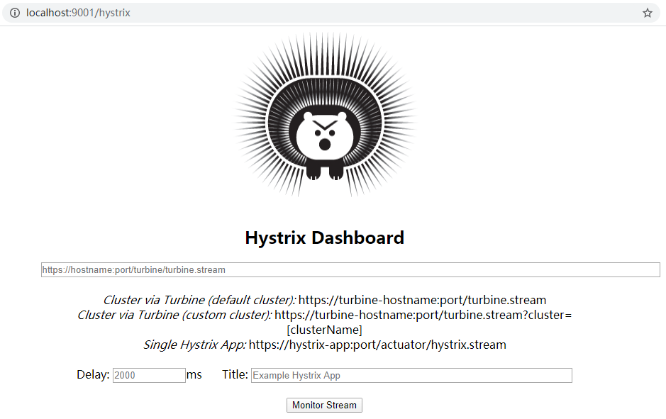

# 第七章Hystrix断路器

## 概述

### 分布式系统面临的问题

复杂分布式体系结构中的应用程序有数十个依赖关系，每一个依赖关系在某些时候将不可避免的失败。

服务雪崩

多个微服务之间调用的时候，假如微服务A调用微服务B和微服务C，微服务B和微服务C又调用其他的微服务，这就是所谓的"扇出"。

如果扇出的链路上某个微服务的调用响应的时间过长或者不可用，对微服A的调用就会占用越来越多的系统资源，进而引起系统崩溃，所谓的"雪崩效应"。

对于高流量的应用来说，单一的后端依赖可能会导致所有的服务器上的所有资源都在几秒钟内饱和。比失败更糟糕的是，这些应用程序还可能导致服务之间的延迟增加，备份队列，线程和其他系统资源紧张，导致整个系统发生更多的级联故障。这些都表示需要对故障和延迟进行**隔离和管理**，以便单个依赖关系的失败，不能取消整个应用程序或系统。

所以，通常当你发现一个模块下的某个实例失败后，这时候这个模块依然还会接收流量，然后这个有问题的模块还调用了其他的模块，这样就会发生级联故障，或者叫雪崩。

### 是什么

Hystrix是一个用于处理分布式系统的延迟和容错的开源库，在分布式系统里，许多依赖不可避免的会调用失败，比如超时、异常等，

Hystrix能够保证在一个依赖出问题的情况下，不会导致整体服务失败，避免级联故障，以提高分布式系统的弹性。

“断路器”本身是一种开关装置，当某个服务单元发生故障之后，通过断路器的故障监控（类似熔断保险丝），向调用方返回一个符合预期的、可处理的备选响应（Fallback），而不是长时间的等待或者抛出调用方无法处理的异常，这样就保证了服务调用方的线程不会被长时间、不必要地占用，从而避免了故障在分布式系统中的蔓延，乃至雪崩。

### 能干嘛

-   服务降级
-   服务熔断
-   接近实时的监控
-   。。。

### Hystrix官宣，停更进维

[https://github.com/Netflix/Hystrix](https://github.com/Netflix/Hystrix "https://github.com/Netflix/Hystrix")

## Hystrix重要概念

### 服务降级Fallback

-   服务器忙，请稍候再试，不让客户端等待并立刻返回一个友好提示
-   哪些情况会触发降级
    -   程序运行异常
    -   超时自动降级
    -   服务熔断触发服务降级
    -   线程池/信号量打满也会导致服务降级
    -   人工降级

### 服务熔断Breaker

-   类比保险丝达到最大服务访问后，直接拒绝访问，拉闸限电，然后调用服务降级的方法并返回友好提示
-   就是保险丝
    -   服务的降级->进而熔断->恢复调用链路

### 服务限流Flowlimit

秒杀高并发等操作，严禁一窝蜂的过来拥挤，大家排队，一秒钟N个，有序进行

## hystrix案例

### 构建

#### 新建Module：cloud\_provider\_hystrix\_payment8001

#### POM

| \<?xml version="1.0" encoding="UTF-8"?>&#xA;\<project xmlns="<http://maven.apache.org/POM/4.0.0>"&#xA;         xmlns:xsi="<http://www.w3.org/2001/XMLSchema-instance>"&#xA;         xsi:schemaLocation="<http://maven.apache.org/POM/4.0.0> [http://maven.apache.org/xsd/maven-4.0.0.xsd](http://maven.apache.org/xsd/maven-4.0.0.xsd "http://maven.apache.org/xsd/maven-4.0.0.xsd")">&#xA;    \<parent>&#xA;        \<artifactId>cloud2021\</artifactId>&#xA;        \<groupId>com.atguigu.springcloud\</groupId>&#xA;        \<version>1.0-SNAPSHOT\</version>&#xA;    \</parent>&#xA;    \<modelVersion>4.0.0\</modelVersion>&#xA;&#xA;    \<artifactId>cloud-provider-hystrix-payment8001\</artifactId>&#xA;&#xA;    \<dependencies>&#xA;        \<!--新增hystrix-->&#xA;        \<dependency>&#xA;            \<groupId>org.springframework.cloud\</groupId>&#xA;            \<artifactId>spring-cloud-starter-netflix-hystrix\</artifactId>&#xA;        \</dependency>&#xA;        \<dependency>&#xA;            \<groupId>org.springframework.cloud\</groupId>&#xA;            \<artifactId>spring-cloud-starter-netflix-eureka-client\</artifactId>&#xA;        \</dependency>&#xA;        \<dependency>&#xA;            \<groupId>com.atguigu.springcloud\</groupId>&#xA;            \<artifactId>cloud-api-commons\</artifactId>&#xA;            \<version>\${project.version}\</version>&#xA;        \</dependency>&#xA;        \<dependency>&#xA;            \<groupId>org.springframework.boot\</groupId>&#xA;            \<artifactId>spring-boot-starter-web\</artifactId>&#xA;        \</dependency>&#xA;        \<dependency>&#xA;            \<groupId>org.springframework.boot\</groupId>&#xA;            \<artifactId>spring-boot-starter-actuator\</artifactId>&#xA;        \</dependency>&#xA;        \<dependency>&#xA;            \<groupId>org.springframework.boot\</groupId>&#xA;            \<artifactId>spring-boot-devtools\</artifactId>&#xA;            \<scope>runtime\</scope>&#xA;            \<optional>true\</optional>&#xA;        \</dependency>&#xA;        \<dependency>&#xA;            \<groupId>org.projectlombok\</groupId>&#xA;            \<artifactId>lombok\</artifactId>&#xA;            \<optional>true\</optional>&#xA;        \</dependency>&#xA;        \<dependency>&#xA;            \<groupId>org.springframework.boot\</groupId>&#xA;            \<artifactId>spring-boot-starter-test\</artifactId>&#xA;            \<scope>test\</scope>&#xA;        \</dependency>&#xA;    \</dependencies>&#xA;\</project>&#xA; |
| -------------------------------------------------------------------------------------------------------------------------------------------------------------------------------------------------------------------------------------------------------------------------------------------------------------------------------------------------------------------------------------------------------------------------------------------------------------------------------------------------------------------------------------------------------------------------------------------------------------------------------------------------------------------------------------------------------------------------------------------------------------------------------------------------------------------------------------------------------------------------------------------------------------------------------------------------------------------------------------------------------------------------------------------------------------------------------------------------------------------------------------------------------------------------------------------------------------------------------------------------------------------------------------------------------------------------------------------------------------------------------------------------------------------------------------------------------------------------------------------------------------------------------------------------------------------------------------------------------------------------------------------------------------------------------------------------------------------------------------------------------------------------------------------------------------------------------------------------------------------------------------------------------------------------------------------------------------------------------------------------------------------------------------------------------------------------------------------------------------------------------------------------------------------------------------------------------------------------------------------------------------------------------------------------------------------------------------------------------------------------------------------------------------------------------------------------------------------------------------------------------------------------------------------------------------------------- |

#### YML

| server:&#xA;  port: 8001&#xA;&#xA;spring:&#xA;  application:&#xA;    name: cloud-hystrix-payment-service&#xA;&#xA;eureka:&#xA;  client:&#xA;    register-with-eureka: true&#xA;    fetch-registry: true&#xA;    service-url:&#xA;      defaultZone: [http://localhost:7001/eureka/](http://localhost:7001/eureka/ "http://localhost:7001/eureka/") |
| -------------------------------------------------------------------------------------------------------------------------------------------------------------------------------------------------------------------------------------------------------------------------------------------------------------------------------------------------- |

#### 主启动

| package com.atguigu.springcloud;&#xA;&#xA;import org.springframework.boot.SpringApplication;&#xA;import org.springframework.boot.autoconfigure.SpringBootApplication;&#xA;import org.springframework.cloud.netflix.eureka.EnableEurekaClient;&#xA;&#xA;@SpringBootApplication&#xA;@EnableEurekaClient&#xA;public class PaymentHystrixMain8001 {&#xA;    public static void main(String\[] args) {&#xA;        SpringApplication.run(PaymentHystrixMain8001.class,args);&#xA;    }&#xA;}&#xA; |
| -------------------------------------------------------------------------------------------------------------------------------------------------------------------------------------------------------------------------------------------------------------------------------------------------------------------------------------------------------------------------------------------------------------------------------------------------------------------------------------------- |

#### 业务类

#### Service/ServiceImpl

| package com.atguigu.springcloud.service;&#xA;&#xA;public interface **PaymentService** {&#xA;    public String paymentInfo\_OK(Integer id);&#xA;    public String payment\_Timeout(Integer id);&#xA;}&#xA;                                                                                                                                                                                                                                                                                                                                                                                                                                                                                                                                                                                  |
| ------------------------------------------------------------------------------------------------------------------------------------------------------------------------------------------------------------------------------------------------------------------------------------------------------------------------------------------------------------------------------------------------------------------------------------------------------------------------------------------------------------------------------------------------------------------------------------------------------------------------------------------------------------------------------------------------------------------------------------------------------------------------------------------ |
| package com.atguigu.springcloud.service.impl;&#xA;&#xA;import org.springframework.stereotype.Service;&#xA;import java.util.concurrent.TimeUnit;&#xA;&#xA;@Service&#xA;public class **PaymentServiceImpl** implements **PaymentService** {&#xA;&#xA;    //成功&#xA;    public String paymentInfo\_OK(Integer id){&#xA;        return "线程池："+Thread.currentThread().getName()+"   paymentInfo\_OK,id：  "+id+"\t"+"哈哈哈"  ;&#xA;    }&#xA;&#xA;    //失败&#xA;    public String payment\_Timeout(Integer id){&#xA;        int timeNumber = 3;&#xA;        try { TimeUnit.SECONDS.sleep(timeNumber); }catch (Exception e) {e.printStackTrace();}&#xA;        return "线程池："+Thread.currentThread().getName()+"   paymentInfo\_TimeOut,id：  "+id+"\t"+"呜呜呜"+" 耗时(秒)"+timeNumber;&#xA;    }&#xA;}&#xA; |

#### Controller

| package com.atguigu.springcloud.controller;&#xA;&#xA;import com.atguigu.springcloud.service.PaymentService;&#xA;import lombok.extern.slf4j.Slf4j;&#xA;import org.springframework.beans.factory.annotation.Value;&#xA;import org.springframework.web.bind.annotation.GetMapping;&#xA;import org.springframework.web.bind.annotation.PathVariable;&#xA;import org.springframework.web.bind.annotation.RestController;&#xA;import javax.annotation.Resource;&#xA;&#xA;@RestController&#xA;@Slf4j&#xA;public class PaymentController {&#xA;&#xA;    @Resource&#xA;    private PaymentService paymentService;&#xA;&#xA;    @Value("\${server.port}")&#xA;    private String serverPort;&#xA;&#xA;    @GetMapping("/payment/hystrix/ok/{id}")&#xA;    public String **paymentInfo\_OK**(@PathVariable("id") Integer id){&#xA;String result = paymentService.paymentInfo\_OK(id);&#xA;log.info("\*\*\*result:"+result);&#xA;return result;&#xA;}&#xA;@GetMapping("/payment/hystrix/timeout/{id}")&#xA;public String**paymentInfo\_TimeOut**(@PathVariable("id") Integer id){&#xA;String result = paymentService.payment\_TimeOut(id);&#xA;log.info("\*\*\*result:"+result);&#xA;return result;&#xA;}&#xA;} |
| --------------------------------------------------------------------------------------------------------------------------------------------------------------------------------------------------------------------------------------------------------------------------------------------------------------------------------------------------------------------------------------------------------------------------------------------------------------------------------------------------------------------------------------------------------------------------------------------------------------------------------------------------------------------------------------------------------------------------------------------------------------------------------------------------------------------------------------------------------------------------------------------------------------------------------------------------------------------------------------------------------------------------------------------------------------------------------------------------------------------------------------------------------------------------------------------------- |

#### 正常测试

-   启动eureka7001
-   启动cloud-provider-hystrix-payment8001
-   访问

访问： [http://localhost:8001/payment/hystrix/ok/31](http://localhost:8001/payment/hystrix/ok/31 "http://localhost:8001/payment/hystrix/ok/31")

每次调用耗费3秒钟： [http://localhost:8001/payment/hystrix/timeout/31](http://localhost:8001/payment/hystrix/timeout/31 "http://localhost:8001/payment/hystrix/timeout/31")

-   上述module均OK

以上述为根基平台，从正确->错误->降级熔断->恢复

### 高并发测试

#### 上述在非高并发情形下，还能勉强满足   but.....

#### Jmeter压测测试

下载地址：[https://archive.apache.org/dist/jmeter/binaries/](https://archive.apache.org/dist/jmeter/binaries/ "https://archive.apache.org/dist/jmeter/binaries/")

开启Jmeter，来20000个并发压死8001，20000个请求都去访问paymentInfo\_TimeOut服务

-   压测的过程中再来访问一下微服务

[http://localhost:8001/payment/hystrix/ok/31](http://localhost:8001/payment/hystrix/ok/31 "http://localhost:8001/payment/hystrix/ok/31")

[http://localhost:8001/payment/hystrix/timeout/31](http://localhost:8001/payment/hystrix/timeout/31 "http://localhost:8001/payment/hystrix/timeout/31")

-   演示结果
-   两个都在自己转圈圈
-   为什么会被卡死

tomcat的默认的工作线程数被打满了，没有多余的线程来分解压力和处理。

#### Jmeter压测结论

上面还是服务提供者8001自己测试，假如此时外部的消费者80也来访问，那消费者只能干等，最终导致消费端80不满意，服务端8001直接被拖死

#### 看热闹不嫌弃事大，80新建加入：cloud-consumer-feign-hystrix-order80

#### 新建：cloud-consumer-feign-hystrix-order80

#### POM

| \<?xml version="1.0" encoding="UTF-8"?>&#xA;\<project xmlns="<http://maven.apache.org/POM/4.0.0>"&#xA;         xmlns:xsi="<http://www.w3.org/2001/XMLSchema-instance>"&#xA;         xsi:schemaLocation="<http://maven.apache.org/POM/4.0.0> [http://maven.apache.org/xsd/maven-4.0.0.xsd](http://maven.apache.org/xsd/maven-4.0.0.xsd "http://maven.apache.org/xsd/maven-4.0.0.xsd")">&#xA;    \<parent>&#xA;        \<artifactId>cloud2021\</artifactId>&#xA;        \<groupId>com.atguigu.springcloud\</groupId>&#xA;        \<version>1.0-SNAPSHOT\</version>&#xA;    \</parent>&#xA;    \<modelVersion>4.0.0\</modelVersion>&#xA;    \<artifactId>cloud-consumer-feign-hystrix-order80\</artifactId>&#xA;&#xA;    \<dependencies>&#xA;        \<!--新增hystrix-->&#xA;        \<dependency>&#xA;            \<groupId>org.springframework.cloud\</groupId>&#xA;            \<artifactId>spring-cloud-starter-netflix-hystrix\</artifactId>&#xA;        \</dependency>&#xA;        \<dependency>&#xA;            \<groupId>org.springframework.cloud\</groupId>&#xA;            \<artifactId>spring-cloud-starter-openfeign\</artifactId>&#xA;        \</dependency>&#xA;        \<dependency>&#xA;            \<groupId>org.springframework.cloud\</groupId>&#xA;            \<artifactId>spring-cloud-starter-netflix-eureka-client\</artifactId>&#xA;        \</dependency>&#xA;        \<dependency>&#xA;            \<groupId>com.atguigu.springcloud\</groupId>&#xA;            \<artifactId>cloud-api-commons\</artifactId>&#xA;            \<version>\${project.version}\</version>&#xA;        \</dependency>&#xA;        \<dependency>&#xA;            \<groupId>org.springframework.boot\</groupId>&#xA;            \<artifactId>spring-boot-starter-web\</artifactId>&#xA;        \</dependency>&#xA;        \<dependency>&#xA;            \<groupId>org.springframework.boot\</groupId>&#xA;            \<artifactId>spring-boot-starter-actuator\</artifactId>&#xA;        \</dependency>&#xA;        \<dependency>&#xA;            \<groupId>org.springframework.boot\</groupId>&#xA;            \<artifactId>spring-boot-devtools\</artifactId>&#xA;            \<scope>runtime\</scope>&#xA;            \<optional>true\</optional>&#xA;        \</dependency>&#xA;        \<dependency>&#xA;            \<groupId>org.projectlombok\</groupId>&#xA;            \<artifactId>lombok\</artifactId>&#xA;            \<optional>true\</optional>&#xA;        \</dependency>&#xA;        \<dependency>&#xA;            \<groupId>org.springframework.boot\</groupId>&#xA;            \<artifactId>spring-boot-starter-test\</artifactId>&#xA;            \<scope>test\</scope>&#xA;        \</dependency>&#xA;    \</dependencies>&#xA;\</project>&#xA; |
| --------------------------------------------------------------------------------------------------------------------------------------------------------------------------------------------------------------------------------------------------------------------------------------------------------------------------------------------------------------------------------------------------------------------------------------------------------------------------------------------------------------------------------------------------------------------------------------------------------------------------------------------------------------------------------------------------------------------------------------------------------------------------------------------------------------------------------------------------------------------------------------------------------------------------------------------------------------------------------------------------------------------------------------------------------------------------------------------------------------------------------------------------------------------------------------------------------------------------------------------------------------------------------------------------------------------------------------------------------------------------------------------------------------------------------------------------------------------------------------------------------------------------------------------------------------------------------------------------------------------------------------------------------------------------------------------------------------------------------------------------------------------------------------------------------------------------------------------------------------------------------------------------------------------------------------------------------------------------------------------------------------------------------------------------------------------------------------------------------------------------------------------------------------------------------------------------------------------------------------------------------------------------------------------------------------------------------------------------------------------------------------------------------------------------------------------------------------------------------------------------------------------------------------------------------------------------------------------------------------------------------------------------------------------------------------------------------------------------------------------------------------------- |

#### YML

| server:&#xA;  port: 80&#xA;&#xA;spring:&#xA;  application:&#xA;    name: cloud-provider-hystrix-payment-service&#xA;&#xA;eureka:&#xA;  client:&#xA;    register-with-eureka: true    #表识不向注册中心注册自己&#xA;    fetch-registry: true   #表示自己就是注册中心，职责是维护服务实例，并不需要去检索服务&#xA;    service-url:&#xA;      defaultZone: [http://localhost:7001/eureka/](http://localhost:7001/eureka/ "http://localhost:7001/eureka/") |
| ------------------------------------------------------------------------------------------------------------------------------------------------------------------------------------------------------------------------------------------------------------------------------------------------------------------------------------------------------------------------------------------------------------ |

#### 主启动

| package com.atguigu.springcloud;&#xA;&#xA;import org.springframework.boot.SpringApplication;&#xA;import org.springframework.boot.autoconfigure.SpringBootApplication;&#xA;import org.springframework.cloud.openfeign.EnableFeignClients;&#xA;&#xA;@SpringBootApplication&#xA;@EnableEurekaClient&#xA;@EnableFeignClients&#xA;public class OrderHystrixMain80 {&#xA;    public static void main(String\[] args) {&#xA;        SpringApplication.run(OrderHystrixMain80.class,args);&#xA;    }&#xA;}&#xA; |
| ------------------------------------------------------------------------------------------------------------------------------------------------------------------------------------------------------------------------------------------------------------------------------------------------------------------------------------------------------------------------------------------------------------------------------------------------------------------------------------------------------- |

#### 业务类

\*\*PaymentHystrixService \*\*

| package com.atguigu.springcloud.service;&#xA;&#xA;import org.springframework.cloud.openfeign.FeignClient;&#xA;import org.springframework.web.bind.annotation.GetMapping;&#xA;import org.springframework.web.bind.annotation.PathVariable;&#xA;&#xA;@FeignClient("CLOUD-HYSTRIX-PAYMENT-SERVICE")&#xA;public interface PaymentHystrixService {&#xA;    @GetMapping("/payment/hystrix/ok/{id}")&#xA;    public String paymentInfo\_OK(@PathVariable("id") Integer id);&#xA;&#xA;    @GetMapping("/payment/hystrix/timeout/{id}")&#xA;    public String payment\_Timeout(@PathVariable("id") Integer id);&#xA;}&#xA; |
| ----------------------------------------------------------------------------------------------------------------------------------------------------------------------------------------------------------------------------------------------------------------------------------------------------------------------------------------------------------------------------------------------------------------------------------------------------------------------------------------------------------------------------------------------------------------------------------------------------------------- |

**OrderHystrixController**

| package com.atguigu.springcloud.controller; |
| ------------------------------------------- |

#### 正常测试

[http://localhost/consumer/payment/hystrix/ok/32](http://localhost/consumer/payment/hystrix/ok/32 "http://localhost/consumer/payment/hystrix/ok/32")

#### 高并发测试

-   2W个线程压8001
-   消费端80微服务再去访问正常的OK微服务8001地址
-   [http://localhost/consumer/payment/hystrix/timeout/32](http://localhost/consumer/payment/hystrix/timeout/32 "http://localhost/consumer/payment/hystrix/timeout/32")
-   消费者80，呜呜呜
    -   要么转圈圈等待
    -   要么消费端报超时错误

### 故障现象和导致原因

-   8001同一层次的其他接口服务被困死，因为tomcat线程里面的工作线程已经被挤占完毕
-   80此时调用8001，客户端访问响应缓慢，转圈圈

### 上诉结论

-   正因为有上述故障或不佳表现，才有我们的降级/容错/限流等技术诞生

### 如何解决？解决的要求

-   超时导致服务器变慢（转圈）
-   超时不再等待
-   出错（宕机或程序运行出错）
-   出错要有兜底
-   解决
-   对方服务（8001）超时了，调用者（80）不能一直卡死等待，必须有服务降级
-   对方服务（8001）down机了，调用者（80）不能一直卡死等待，必须有服务降级
-   对方服务（8001）OK，调用者（80）自己出故障或有自我要求（自己的等待时间小于服务提供者），自己处理降级

### 服务降级

#### 降低配置

@HystrixCommand

#### 8001先从自身找问题

设置自身调用超时时间的峰值，峰值内可以正常运行，超过了需要有兜底的方法处理，作服务降级fallback

#### 8001fallback

业务类启用阶级处理：使用@HystrixCommand注解来干活。

| package com.atguigu.springcloud.service.impl;&#xA;&#xA;import com.atguigu.springcloud.service.PaymentService;&#xA;import com.netflix.hystrix.contrib.javanica.annotation.HystrixCommand;&#xA;import com.netflix.hystrix.contrib.javanica.annotation.HystrixProperty;&#xA;import org.springframework.stereotype.Service;&#xA;import java.util.concurrent.TimeUnit;&#xA;&#xA;@Service&#xA;public class PaymentServiceImpl implements PaymentService {&#xA;&#xA;    @Override&#xA;    public String paymentInfo\_OK(Integer id) {&#xA;        return "线程池："+Thread.currentThread().getName()+" paymentInfo\_OK,id="+id +" \t O(∩\_∩)O哈哈\~";&#xA;    }&#xA;&#xA;    //超时降级演示&#xA;    @HystrixCommand(fallbackMethod = "payment\_TimeoutHandler",commandProperties = {&#xA;            @HystrixProperty(name="execution.isolation.thread.timeoutInMilliseconds",value="5000") //5秒钟以内就是正常的业务逻辑&#xA;    })&#xA;    @Override&#xA;    public String payment\_Timeout(Integer id) {&#xA;        //int timeNumber = 3; //小于等于3秒算是正常情况&#xA;        int timeNumber = 15; //模拟非正常情况&#xA;        //int i = 1/0 ; //模拟非正常情况&#xA;        try {&#xA;            TimeUnit.SECONDS.sleep(timeNumber);&#xA;        } catch (InterruptedException e) {&#xA;            e.printStackTrace();&#xA;        }&#xA;        return "线程池："+Thread.currentThread().getName()+" payment\_Timeout,id="+id+" \t o(╥﹏╥)o 耗时："+timeNumber;&#xA;    }&#xA;&#xA;    //兜底方法，上面方法出问题,我来处理，返回一个出错信息&#xA;    public String payment\_TimeoutHandler(Integer id) {&#xA;        return "线程池："+Thread.currentThread().getName()+" payment\_TimeoutHandler,系统繁忙,请稍后再试\t o(╥﹏╥)o ";&#xA;    }&#xA;}&#xA; |
| ----------------------------------------------------------------------------------------------------------------------------------------------------------------------------------------------------------------------------------------------------------------------------------------------------------------------------------------------------------------------------------------------------------------------------------------------------------------------------------------------------------------------------------------------------------------------------------------------------------------------------------------------------------------------------------------------------------------------------------------------------------------------------------------------------------------------------------------------------------------------------------------------------------------------------------------------------------------------------------------------------------------------------------------------------------------------------------------------------------------------------------------------------------------------------------------------------------------------------------------------------------------------------------------------------------------------------------------------------------------------------------------------------------------------------------------------------------------------------------------------------------------------------------------------------------------------------------------------------------------------------------------------------------- |

&#x20;一旦调用服务方法失败并抛出了错误信息后，会自动调用@HystrixCommand标注好的fallbackMethod调用类中的指定方法

主启动类激活

@EnableCircuitBreaker

测试超时和算数异常，都会走兜底方法——服务降级

[http://localhost:8001/payment/hystrix/timeout/1](http://localhost:8001/payment/hystrix/timeout/1 "http://localhost:8001/payment/hystrix/timeout/1")

 

#### 80fallback

1.  80订单微服务，也可以更好的保护自己，自己也依样画葫芦进行客户端降级保护。注意：服务降级可以在服务提供者侧，也可以在服务消费者侧。更多是在服务消费者侧。
2.  题外话，切记

我们自己配置过的热部署方式对java代码的改动明显，但对@HystrixCommand内属性的修改建议重启微服务

1.  YML

| feign:&#xA;  hystrix:&#xA;    enabled: true #如果处理自身的容错就开启。开启方式与生产端不一样。&#xA; |
| --------------------------------------------------------------------------- |

1.  主启动

@EnableHystrix

1.  业务类：OrderHystrixController

| //超时降级演示&#xA;@HystrixCommand(fallbackMethod = "payment\_TimeoutHandler",commandProperties = {&#xA;@HystrixProperty(name="execution.isolation.thread.timeoutInMilliseconds",value="1500")//超过1.5秒就降级自己&#xA;})&#xA;@GetMapping("/consumer/payment/hystrix/timeout/{id}")&#xA;public String paymentInfo\_TimeOut(@PathVariable("id") Integer id){&#xA;//int age= 1/0;&#xA;String result = paymentHystrixService.payment\_Timeout(id);&#xA;log.info("\*\*\*result:"+result);&#xA;return result;&#xA;} |
| ------------------------------------------------------------------------------------------------------------------------------------------------------------------------------------------------------------------------------------------------------------------------------------------------------------------------------------------------------------------------------------------------------------------------------------------------------------------------------------------------- |

1.  测试超时

[http://localhost/consumer/payment/hystrix/timeout/1](http://localhost/consumer/payment/hystrix/timeout/1 "http://localhost/consumer/payment/hystrix/timeout/1")

#### 目前问题

每个业务方法对应一个兜底的方法，代码膨胀，代码耦合

统一通用处理和自定义独立处理的分开

#### 解决问题

#### 每个方法配置一个？？？膨胀

feign接口系列

@DefaultProperties(defaultFallback = "")

说明

@DefaultProperties(defaultFallback = "")

1:1 每个方法配置一个服务降级方法，技术上可以，但实际上傻X

1:N 除了个别重要核心业务有专属，其它普通的可以通过@DefaultProperties(defaultFallback = "")统一跳转到统一处理结果页面

通用的和独享的各自分开，避免了代码膨胀，合理减少了代码量

controller配置

| package com.atguigu.springcloud.controller;&#xA;&#xA;import com.atguigu.springcloud.service.PaymentHystrixService;&#xA;import com.netflix.hystrix.contrib.javanica.annotation.DefaultProperties;&#xA;import com.netflix.hystrix.contrib.javanica.annotation.HystrixCommand;&#xA;import com.netflix.hystrix.contrib.javanica.annotation.HystrixProperty;&#xA;import lombok.extern.slf4j.Slf4j;&#xA;import org.springframework.web.bind.annotation.GetMapping;&#xA;import org.springframework.web.bind.annotation.PathVariable;&#xA;import org.springframework.web.bind.annotation.RestController;&#xA;import javax.annotation.Resource;&#xA;&#xA;@RestController&#xA;@Slf4j&#xA;@DefaultProperties(defaultFallback = "payment\_Global\_FallbackMethod")  //全局的&#xA;public class OrderHystrixController {&#xA;&#xA;    @Resource&#xA;    private PaymentHystrixService paymentHystrixService;&#xA;&#xA;    @GetMapping("/consumer/payment/hystrix/ok/{id}")&#xA;    public String paymentInfo\_OK(@PathVariable("id") Integer id){&#xA;        String result = paymentHystrixService.paymentInfo\_OK(id);&#xA;        return result;&#xA;    }&#xA;&#xA;    @HystrixCommand&#xA;    public String paymentInfo\_TimeOut(@PathVariable("id") Integer id){&#xA;        int age = 10/0;&#xA;        String result = paymentHystrixService.paymentInfo\_TimeOut(id);&#xA;        return result;&#xA;    }&#xA;&#xA;    //兜底方法&#xA;    public String paymentTimeOutFallbackMethod(@PathVariable("id") Integer id){&#xA;        return "我是消费者80，对付支付系统繁忙请10秒钟后再试或者自己运行出错请检查自己,(┬＿┬)";&#xA;    }&#xA;&#xA;    //下面是全局fallback方法&#xA;    public String payment\_Global\_FallbackMethod(){&#xA;        return "Global异常处理信息，请稍后再试,(┬＿┬)";&#xA;    }&#xA;}&#xA; |
| -------------------------------------------------------------------------------------------------------------------------------------------------------------------------------------------------------------------------------------------------------------------------------------------------------------------------------------------------------------------------------------------------------------------------------------------------------------------------------------------------------------------------------------------------------------------------------------------------------------------------------------------------------------------------------------------------------------------------------------------------------------------------------------------------------------------------------------------------------------------------------------------------------------------------------------------------------------------------------------------------------------------------------------------------------------------------------------------------------------------------------------------------------------------------------------------------------------------------------------------------------------------------------------------------------------------------------------------------------------------------------------------------------------------------------------------------------------------------------------------------------------------------------------------------------------------------------------------------------------------------------------------------------------------------------------------------------------------------------------------------- |

测试结果

#### 和业务逻辑混一起？？？混乱

服务降级，客户端去调用服务端，碰上服务端宕机或关闭

本次案例服务降级处理是在客户端80实现完成的，与服务端8001没有关系，**只需要为Feign客户端定义的接口**添加一个服务降级处理的实现类即可**实现解耦**

未来我们要面对的异常

-   运行
-   超时
-   宕机

再看我们的业务类PaymentController

修改cloud-consumer-feign-hystrix-order80

根据cloud-consumer-feign-hystrix-order80已经有的PaymentHystrixService接口，重新新建一个类（PaymentFallbackService）实现该接口，统一为接口里面的方法进行异常处理

PaymentFallbackService类实现PaymentFeignClientService接口

| package com.atguigu.springcloud.service;&#xA;&#xA;import org.springframework.stereotype.Component;&#xA;&#xA;@Component&#xA;public class PaymentFallbackService implements PaymentHystrixService {&#xA;    @Override&#xA;    public String paymentInfo\_OK(Integer id) {&#xA;        return "-----PaymentFallbackService fall back-paymentInfo\_OK , (┬＿┬)";&#xA;    }&#xA;&#xA;    @Override&#xA;    public String paymentInfo\_TimeOut(Integer id) {&#xA;        return "-----PaymentFallbackService fall back-paymentInfo\_TimeOut , (┬＿┬)";&#xA;    }&#xA;}&#xA; |
| ------------------------------------------------------------------------------------------------------------------------------------------------------------------------------------------------------------------------------------------------------------------------------------------------------------------------------------------------------------------------------------------------------------------------------------------------------------------------------------------------------------------------------------------------------------------- |

YML

| feign:&#xA;  hystrix:&#xA;    enabled: true #如果处理自身的容错就开启。开启方式与生产端不一样。&#xA; |
| --------------------------------------------------------------------------- |

PaymentFeignClientService接口

| package com.atguigu.springcloud.service;&#xA;&#xA;import org.springframework.cloud.openfeign.FeignClient;&#xA;import org.springframework.stereotype.Component;&#xA;import org.springframework.web.bind.annotation.GetMapping;&#xA;import org.springframework.web.bind.annotation.PathVariable;&#xA;&#xA;@Component&#xA;@FeignClient(value = "CLOUD-PROVIDER-HYSTRIX-PAYMENT",fallback = PaymentFallbackService.class)&#xA;public interface PaymentHystrixService {&#xA;&#xA;    @GetMapping("/payment/hystrix/ok/{id}")&#xA;    public String paymentInfo\_OK(@PathVariable("id") Integer id);&#xA;&#xA;    @GetMapping("/payment/hystrix/timeout/{id}")&#xA;    public String paymentInfo\_TimeOut(@PathVariable("id") Integer id);&#xA;}&#xA; |
| ----------------------------------------------------------------------------------------------------------------------------------------------------------------------------------------------------------------------------------------------------------------------------------------------------------------------------------------------------------------------------------------------------------------------------------------------------------------------------------------------------------------------------------------------------------------------------------------------------------------------------------------------------------------------------------------------------------------------------------------------- |

#### 测试

单个eureka先启动7001

PaymentHystrixMain8001启动

正常访问测试：http\://localhost/consumer/payment/hystrix/ok/31

故意关闭微服务8001

客户端自己调用提升

此时服务端provider已经down了，但是我们做了服务降级处理，让客户端在服务端不可用时也会获得提示信息而不会挂起耗死服务器

### 服务熔断

#### 断路器

一句话就是家里保险丝

#### 熔断是什么

熔断机制概述

熔断机制是应对雪崩效应的一种微服务链路保护机制。当扇出链路的某个微服务出错不可用或者响应时间太长时，会进行服务的降级，进而熔断该节点微服务的调用，快速返回错误的响应信息。

当检测到该节点微服务调用响应正常后，恢复调用链路。

在SpringCloud框架里，熔断机制通过Hystrix实现。Hystrix会监控微服务间调用的状态，当失败的调用到一定阈值，缺省是10秒内20次调用并有50%的失败情况，就会启动熔断机制。熔断机制的注解是@HystrixCommand

#### 大神论文：&#x20;

[https://martinfowler.com/bliki/CircuitBreaker.html](https://martinfowler.com/bliki/CircuitBreaker.html "https://martinfowler.com/bliki/CircuitBreaker.html")

 

#### 实操

#### 修改cloud-provider-hystrix-payment8001

#### PaymentServiceImpl

com.netflix.hystrix.HystrixCommandProperties

| //服务熔断&#xA;@HystrixCommand(fallbackMethod = "paymentCircuitBreaker\_fallback",commandProperties = {&#xA;        @HystrixProperty(name = "circuitBreaker.enabled",value = "true"),  //是否开启断路器&#xA;        @HystrixProperty(name = "circuitBreaker.requestVolumeThreshold",value = "10"),   //当在配置时间窗口内达到此数量，打开断路，默认20个&#xA;        @HystrixProperty(name = "circuitBreaker.sleepWindowInMilliseconds",value = "10000"),  //断路多久以后开始尝试是否恢复，默认5s&#xA;        @HystrixProperty(name = "circuitBreaker.errorThresholdPercentage",value = "60"), //出错百分比阈值，当达到此阈值后，开始短路。默认50%&#xA;})&#xA;public String **paymentCircuitBreaker**(Integer id){&#xA;if (id < 0){&#xA;throw new RuntimeException("\*id 不能负数");&#xA;}&#xA;String serialNumber = IdUtil.simpleUUID();//hutool.cn工具包 |
| ------------------------------------------------------------------------------------------------------------------------------------------------------------------------------------------------------------------------------------------------------------------------------------------------------------------------------------------------------------------------------------------------------------------------------------------------------------------------------------------------------------------------------------------------------------------------------------------------------------------------------------------------------------------------------------------------------------------------------------------------------------------------ |

#### PaymentController

| //===服务熔断&#xA;@GetMapping("/payment/circuit/{id}")&#xA;public String paymentCircuitBreaker(@PathVariable("id") Integer id){&#xA;String result = paymentService.paymentCircuitBreaker(id);&#xA;log.info("\*\*\*result:"+result);&#xA;return result;&#xA;} |
| -------------------------------------------------------------------------------------------------------------------------------------------------------------------------------------------------------------------------------------------------------- |

#### 测试

自测cloud-provider-hystrix-payment8001

正确： [http://localhost:8001/payment/circuit/31](http://localhost:8001/payment/circuit/31 "http://localhost:8001/payment/circuit/31")

错误： [http://localhost:8001/payment/circuit/-31](http://localhost:8001/payment/circuit/-31 "http://localhost:8001/payment/circuit/-31")

一次正确一次错误trytry

重点测试

多次错误（狂点），然后慢慢正确，发现刚开始不满足条件，就算是正确的访问地址也不能进行访问，需要慢慢的恢复链路

#### 原理（小总结）

#### 大神结论

#### 熔断类型

**熔断打开**

请求不再进行调用当前服务，内部设置时钟一般为MTTR(平均故障处理时间)，当打开时长达到所设时钟则进入熔断状态

**熔断关闭**

熔断关闭不会对服务进行熔断

**熔断半开**

部分请求根据规则调用当前服务，如果请求成功且符合规则则认为当前服务恢复正常，**关闭熔断**

#### 官网断路器流程图

#### 官网步骤

#### 断路器在什么情况下开始起作用

&#x20;   //服务熔断

@HystrixCommand(fallbackMethod = "paymentCircuitBreaker\_fallback",commandProperties = {

@HystrixProperty(name = "circuitBreaker.enabled",value = "true"),  //是否开启断路器

@HystrixProperty(name = "circuitBreaker.requestVolumeThreshold",value = "20"),   //当快照时间窗（默认10秒）内达到此数量才有资格打开断路，默认20个

@HystrixProperty(name = "circuitBreaker.sleepWindowInMilliseconds",value = "50000"),  //断路多久以后开始尝试是否恢复，默认5s

@HystrixProperty(name = "circuitBreaker.errorThresholdPercentage",value = "50"), //出错百分比阈值，当达到此阈值后，开始短路。默认50%

&#x20;   })

涉及到断路器的三个重要参数：**快照时间窗、请求总数阈值、错误百分比阈值。**

配置属性参考：[https://github.com/Netflix/Hystrix/wiki/Configuration](https://github.com/Netflix/Hystrix/wiki/Configuration "https://github.com/Netflix/Hystrix/wiki/Configuration")&#x20;

1、快照时间窗：断路器确定是否打开需要统计一些请求和错误数据，而统计的时间范围就是快照时间窗，默认为最近的10秒。

2、请求总数阈值：在快照时间窗内，必须满足请求总数阈值才有资格熔断。默认20，意味着在10秒内，如果该hystrix命令的调用次数不足20次，即使所有的请求都超时或其他原因失败，断路器都不会打开。

3、错误百分比阈值：当请求总数在快照时间窗内超过了阈值，比如发生了30次调用，如果在这30次调用，有15次发生了超时异常，也就是超过50%的错误百分比，在默认设定50%阈值情况下，这时候就会将断路器打开。

#### ③断路器开启或者关闭的条件

当满足一定阀值的时候（默认10秒内超过20个请求次数）

当失败率达到一定的时候（默认10秒内超过50%请求失败）

到达以上阀值，断路器将会开启

当开启的时候，所有请求都不会进行转发

一段时间之后（默认是5秒），这个时候断路器是半开状态，会让其中一个请求进行转发。如果成功，断路器会关闭，若失败，继续开启。重复4和5

#### 断路器打开之后

1：再有请求调用的时候，将不会调用主逻辑，而是直接调用降级fallbak。通过断路器，实现了自动地发现错误并将降级逻辑切换为主逻辑，减少响应延迟的效果。

2：原来的主逻辑要如何恢复呢？

对于这一个问题，hystrix也为我们实现了自动恢复功能。

当断路器打开，对主逻辑进行熔断之后，hystrix会启动一个休眠时间窗，在这个时间窗内，降级逻辑是临时的成为主逻辑，当休眠时间窗到期，断路器将进入半开状态，释放一次请求到原来的主逻辑上，如果此次请求正常返回，那么断路器将继续闭合，主逻辑恢复，如果这次请求依然有问题，断路器继续进入打开状态，休眠时间窗重新计时。

#### All配置

 

### 服务限流

后面讲

## 服务监控hystrixDashboard

### 概述

除了隔离依赖服务的调用以外，Hystrix还提供了准实时的调用监控(Hystrix Dashboard)，Hystrix会持续地记录所有通过Hystrix发起的请求的执行信息，并以统计报表和图形的形式展示给用户，包括每秒执行多少请求多少成功，多少失败等。Netflix通过hystrix-metrics-event-stram项目实现了对以上指示的监控。Spring Cloud也提供了Hystrix Dashboard的整合，对监控内容转化成可视化界面。

 

### 仪表盘9001

#### 新建Module：cloud\_consumer\_hystrix\_dashboard9001

#### POM

| \<?xml version="1.0" encoding="UTF-8"?>&#xA;\<project xmlns="<http://maven.apache.org/POM/4.0.0>"&#xA;         xmlns:xsi="<http://www.w3.org/2001/XMLSchema-instance>"&#xA;         xsi:schemaLocation="<http://maven.apache.org/POM/4.0.0> [http://maven.apache.org/xsd/maven-4.0.0.xsd](http://maven.apache.org/xsd/maven-4.0.0.xsd "http://maven.apache.org/xsd/maven-4.0.0.xsd")">&#xA;    \<parent>&#xA;        \<artifactId>cloud2021\</artifactId>&#xA;        \<groupId>com.atguigu.springcloud\</groupId>&#xA;        \<version>1.0-SNAPSHOT\</version>&#xA;    \</parent>&#xA;    \<modelVersion>4.0.0\</modelVersion>&#xA;    \<artifactId>cloud-consumer-hystrix-dashboard9001\</artifactId>&#xA;&#xA;    \<dependencies>&#xA;        \<!--新增hystrix dashboard-->&#xA;        \<dependency>&#xA;            \<groupId>org.springframework.cloud\</groupId>&#xA;            \<artifactId>spring-cloud-starter-netflix-hystrix-dashboard\</artifactId>&#xA;        \</dependency>&#xA;        \<dependency>&#xA;            \<groupId>org.springframework.boot\</groupId>&#xA;            \<artifactId>spring-boot-starter-actuator\</artifactId>&#xA;        \</dependency>&#xA;        \<dependency>&#xA;            \<groupId>org.springframework.boot\</groupId>&#xA;            \<artifactId>spring-boot-devtools\</artifactId>&#xA;            \<scope>runtime\</scope>&#xA;            \<optional>true\</optional>&#xA;        \</dependency>&#xA;        \<dependency>&#xA;            \<groupId>org.projectlombok\</groupId>&#xA;            \<artifactId>lombok\</artifactId>&#xA;            \<optional>true\</optional>&#xA;        \</dependency>&#xA;        \<dependency>&#xA;            \<groupId>org.springframework.boot\</groupId>&#xA;            \<artifactId>spring-boot-starter-test\</artifactId>&#xA;            \<scope>test\</scope>&#xA;        \</dependency>&#xA;    \</dependencies>&#xA;\</project>&#xA; |
| --------------------------------------------------------------------------------------------------------------------------------------------------------------------------------------------------------------------------------------------------------------------------------------------------------------------------------------------------------------------------------------------------------------------------------------------------------------------------------------------------------------------------------------------------------------------------------------------------------------------------------------------------------------------------------------------------------------------------------------------------------------------------------------------------------------------------------------------------------------------------------------------------------------------------------------------------------------------------------------------------------------------------------------------------------------------------------------------------------------------------------------------------------------------------------------------------------------------------------------------------------------------------------------------------------------------------------------------------------------------------------------------------------------------------------------------------------------------------------------------------------------------------------------------------------------------------------------------------------------------------------------------------------------------------------------------------------------------------------------------------------------------------------------------------------------------------------------------------------------------------------------------------------------------------------------------------- |

#### YML

| server:&#xA;  port: 9001&#xA;hystrix:&#xA;  dashboard:&#xA;    proxy-stream-allow-list: "localhost"&#xA; |
| -------------------------------------------------------------------------------------------------------- |

#### HystrixDashboardMain9001+新注解@EnableHystrixDashboard

| package com.atguigu.springcloud;&#xA;&#xA;import org.springframework.boot.SpringApplication;&#xA;import org.springframework.boot.autoconfigure.SpringBootApplication;&#xA;import org.springframework.cloud.netflix.hystrix.dashboard.EnableHystrixDashboard;&#xA;&#xA;@SpringBootApplication&#xA;@EnableHystrixDashboard&#xA;public class HystrixDashboardMain9001 {&#xA;    public static void main(String\[] args) {&#xA;        SpringApplication.run(HystrixDashboardMain9001.class,args);&#xA;    }&#xA;}&#xA; |
| ------------------------------------------------------------------------------------------------------------------------------------------------------------------------------------------------------------------------------------------------------------------------------------------------------------------------------------------------------------------------------------------------------------------------------------------------------------------------------------------------------------------- |

#### 所有Provider微服务提供类（8001/8002/8003）都需要监控依赖配置

| \<dependency>&#xA;    \<groupId>org.springframework.boot\</groupId>&#xA;    \<artifactId>spring-boot-starter-actuator\</artifactId>&#xA;\</dependency>&#xA; |
| ----------------------------------------------------------------------------------------------------------------------------------------------------------- |

#### 启动cloud-consumer-hystrix-dashboard9001该微服务后续将监控微服务8001

[http://localhost:9001/hystrix](http://localhost:9001/hystrix "http://localhost:9001/hystrix")

### 断路器演示

#### 修改cloud-provider-hystrix-payment8001

注意：新版本Hystrix需要在主启动类MainAppHystrix8001中指定监控路径

| /\*\*&#xA; \*此配置是为了服务监控而配置，与服务容错本身无关，springcloud升级后的坑&#xA; \*ServletRegistrationBean因为springboot的默认路径不是"/hystrix.stream"，&#xA; \*只要在自己的项目里配置上下面的servlet就可以了&#xA; \*/&#xA;@Bean&#xA;public ServletRegistrationBean getServlet() {&#xA;HystrixMetricsStreamServlet streamServlet = new HystrixMetricsStreamServlet();&#xA;ServletRegistrationBean registrationBean = new ServletRegistrationBean(streamServlet);&#xA;registrationBean.setLoadOnStartup(1);&#xA;registrationBean.addUrlMappings("/hystrix.stream");&#xA;registrationBean.setName("HystrixMetricsStreamServlet");&#xA;return registrationBean;&#xA;}&#xA; |
| --------------------------------------------------------------------------------------------------------------------------------------------------------------------------------------------------------------------------------------------------------------------------------------------------------------------------------------------------------------------------------------------------------------------------------------------------------------------------------------------------------------------------------------------------------------------------------------------------------------------- |

Unable to connect to Command Metric Stream

404

#### 监控测试

#### 启动1个eureka

#### 观察监控窗口

9001监控8001

[http://localhost:9001/hystrix](http://localhost:9001/hystrix "http://localhost:9001/hystrix")

[http://localhost:8001/hystrix.stream](http://localhost:8001/hystrix.stream "http://localhost:8001/hystrix.stream")

测试地址

[http://localhost:8001/payment/circuit/31](http://localhost:8001/payment/circuit/31 "http://localhost:8001/payment/circuit/31")

[http://localhost:8001/payment/circuit/-31](http://localhost:8001/payment/circuit/-31 "http://localhost:8001/payment/circuit/-31")

上述测试通过

ok

先访问正确地址，再访问错误地址，再正确地址，会发现图示断路器都是慢慢放开的

监控结果，成功

监控结果，失败

 

如何看

7色

1圈

实心圆：共有两种含义。它通过颜色的变化代表了实例的健康程度，它的健康度从绿色<黄色<橙色<红色递减。

该实心圆除了颜色的变化之外，它的大小也会根据实例的请求流量发生变化，流量越大该实心圆就越大。所以通过该实心圆的展示，就可以在大量的实体中快速的发现故障实例和高压力实例。

1线

曲线：用来记录2分钟内流量的相对变化，可以通过它来观察到流量的上升和下降趋势。

**整图说明**

 

**整图说明2**

**搞懂一个才能看懂复杂的**

