# 第八章Gateway新一代网关

## 概述简介

### 官网

[https://docs.spring.io/spring-cloud-gateway/docs/2.2.6.RELEASE/reference/html/](https://docs.spring.io/spring-cloud-gateway/docs/2.2.6.RELEASE/reference/html/ "https://docs.spring.io/spring-cloud-gateway/docs/2.2.6.RELEASE/reference/html/")&#x20;

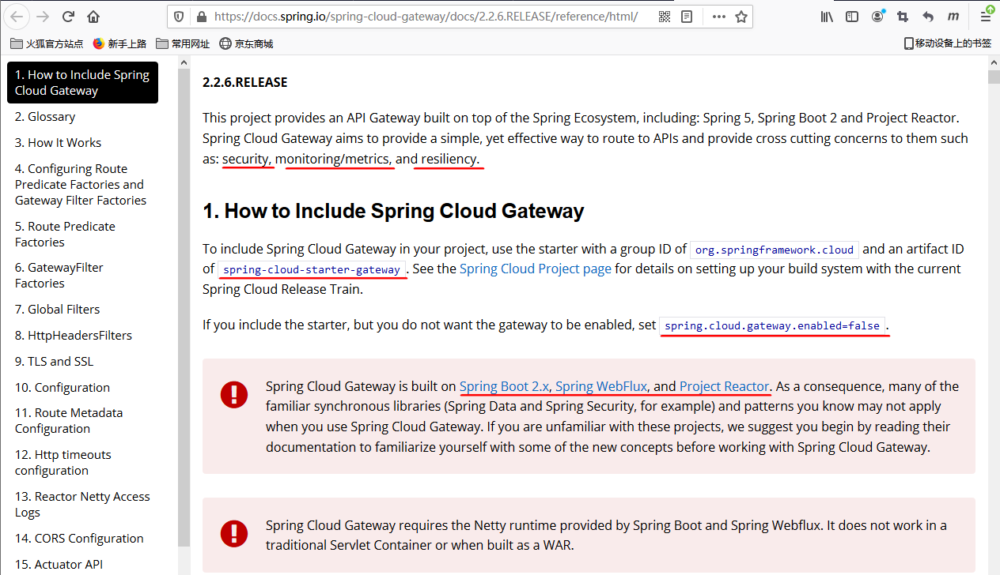

 

### 是什么

Cloud全家桶中有个很重要的组件就是网关，在1.x版本中都是采用的Zuul网关[https://github.com/Netflix/zuul/wiki](https://github.com/Netflix/zuul/wiki "https://github.com/Netflix/zuul/wiki")

但在2.x版本中，zuul的升级一直跳票，SpringCloud最后自己研发了一个网关代替Zull，那就是SpringCloud Geteway； 

#### 一句话：Geteway是原Zuul1.x版的替代

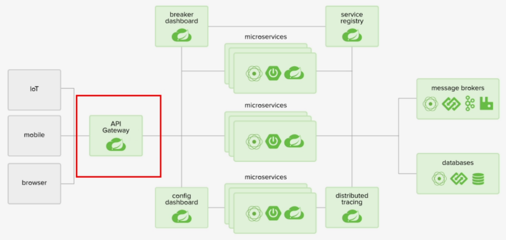

#### 概述

Gateway是在spring生态系统之上构建的API网关服务，基于Spring5，SpringBoot2和Project Reactor等技术。

Gateway旨在提供一种简单而有效的方式来对API进行路由，以及提供一些强大的过滤器功能，例如：熔断、限流、重试等

SpringCloud Gateway是SpringCloud的一个全新项目，基于Spring5.X+SpringBoot2.X和Project Reactor等技术开发的网关，它旨在为微服务架构提供一种简单有效的统一的API路由管理方式。

为了提升网关的性能，SpringCloud Gatway是基于WebFlux框架实现的，而WebFlux框架底层则使用了高性能的**Reactor**模式通讯框架**Netty**。

SpringCloud Gateway的目标提供统一的路由方式且基于Filter链的方式提供了网关基本的功能，例如：安全、监控/指标、和限流。

#### 一句话

Spring Cloud Gateway 使用的Webflux中的reactor-netty响应式编程组件，底层使用了Netty通讯框架

源码架构

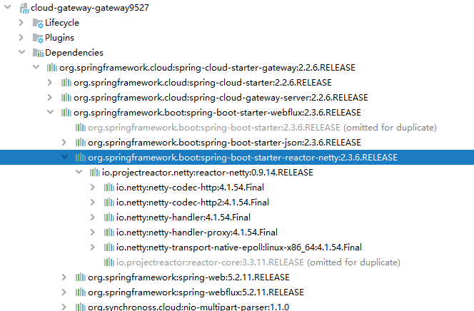

### 能干嘛

-   反向代理
-   鉴权
-   流量控制
-   熔断
-   日志监控
-   。。。。。。

### 微服务架构中网关在哪里

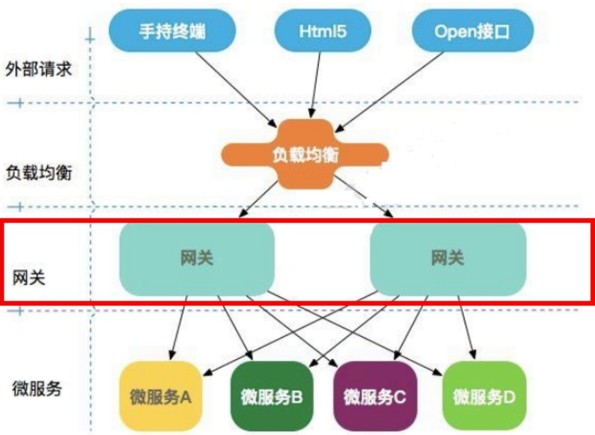

 

## 三大核心概念

### Route(路由)

&#x20;路由是构建网关的基本模块，它由ID，目标URI，一系列的断言和过滤器组成，如果断言为true则匹配**该路由**

### Predicate（断言）

参考的是java8的java.util.function.Predicate开发人员可以匹配HTTP请求中的所有内容（例如请求头或请求参数），如果请求与断言相匹配则进行路由

### Filter(过滤)

指的是Spring框架中GatewayFilter的实例，使用过滤器，可以在请求被路由前或者之后对请求进行修改。

### 总体

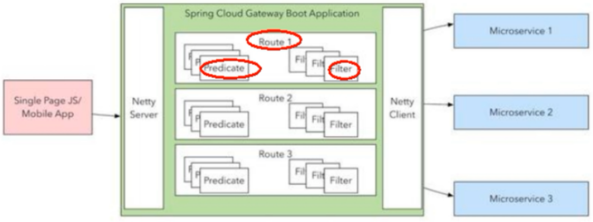

Web请求，通过一些匹配条件，定位到真正的服务节点。并在这个转发过程的前后，进行一些精细化控制。

Predicate就是我们的匹配条件： 而Filter，就是可以理解为一个无所不能的拦截器。有了这两个元素，再加上目标uri,就可以实现一个具体的路由了。

## Gateway工作流程

### 官网总结

[https://docs.spring.io/spring-cloud-gateway/docs/2.2.6.RELEASE/reference/html/](https://docs.spring.io/spring-cloud-gateway/docs/2.2.6.RELEASE/reference/html/ "https://docs.spring.io/spring-cloud-gateway/docs/2.2.6.RELEASE/reference/html/")

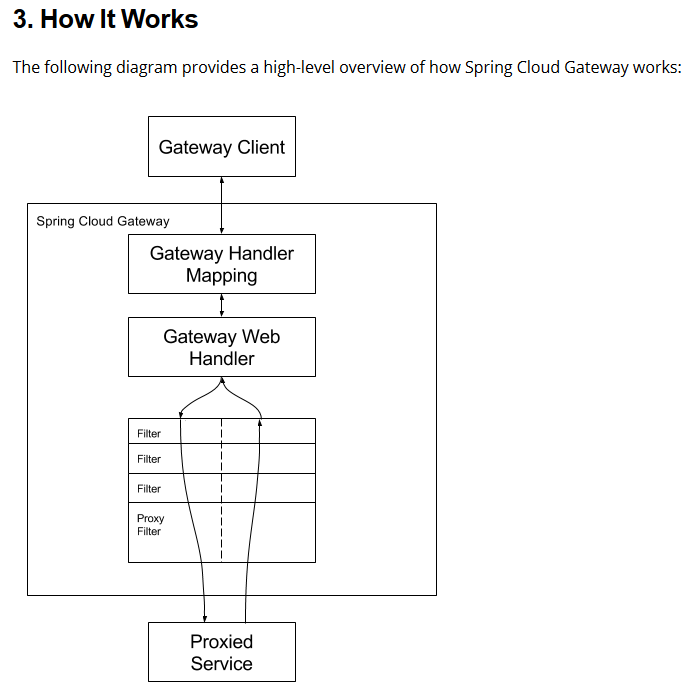

 

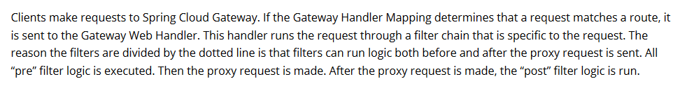

客户端向Spring Cloud Gateway发出请求。然后在Gateway Handler Mapping中找到与请求匹配的路由，将其发送到Gateway Web Handler.

Handler再通过指定的过滤器链来将请求发送给我们实际的服务执行业务逻辑，然后返回。

过滤器之间用虚线分开是因为过滤器可能会在发送代理请求之前（"pre"）或之后("post")执行业务逻辑。

Filter在 \*\*"pre"类型**的过滤器可以做参数校验、权限校验、流量监控、日志输出、协议转换等，在**"post"类型\*\*的过滤器中可以做响应内容、响应头的修改，日志的输出，流量控制等有着非常重要的作用

### 核心逻辑：路由转发+执行过滤器链

## 入门配置

### 新建Module：cloud\_gateway\_gateway9527

### POM

| \<?xml version="1.0" encoding="UTF-8"?>&#xA;\<project xmlns="<http://maven.apache.org/POM/4.0.0>"&#xA;         xmlns:xsi="<http://www.w3.org/2001/XMLSchema-instance>"&#xA;         xsi:schemaLocation="<http://maven.apache.org/POM/4.0.0> [http://maven.apache.org/xsd/maven-4.0.0.xsd](http://maven.apache.org/xsd/maven-4.0.0.xsd "http://maven.apache.org/xsd/maven-4.0.0.xsd")">&#xA;    \<parent>&#xA;        \<artifactId>cloud2021\</artifactId>&#xA;        \<groupId>com.atguigu.springcloud\</groupId>&#xA;        \<version>1.0-SNAPSHOT\</version>&#xA;    \</parent>&#xA;    \<modelVersion>4.0.0\</modelVersion>&#xA;    \<artifactId>cloud-gateway-gateway9527\</artifactId>&#xA;&#xA;    \<dependencies>&#xA;        \<!--**新增gateway，不需要引入web和actuator模块**-->&#xA;        \<dependency>&#xA;            \<groupId>org.springframework.cloud\</groupId>&#xA;            \<artifactId>spring-cloud-starter-gateway\</artifactId>&#xA;        \</dependency>&#xA;        \<dependency>&#xA;            \<groupId>com.atguigu.springcloud\</groupId>&#xA;            \<artifactId>cloud-api-commons\</artifactId>&#xA;            \<version>1.0-SNAPSHOT\</version>&#xA;        \</dependency>&#xA;        \<dependency>&#xA;            \<groupId>org.springframework.cloud\</groupId>&#xA;            \<artifactId>spring-cloud-starter-netflix-hystrix\</artifactId>&#xA;        \</dependency>&#xA;        \<dependency>&#xA;            \<groupId>org.springframework.cloud\</groupId>&#xA;            \<artifactId>spring-cloud-starter-netflix-eureka-client\</artifactId>&#xA;        \</dependency>&#xA;        \<dependency>&#xA;            \<groupId>org.springframework.boot\</groupId>&#xA;            \<artifactId>spring-boot-devtools\</artifactId>&#xA;            \<scope>runtime\</scope>&#xA;            \<optional>true\</optional>&#xA;        \</dependency>&#xA;        \<dependency>&#xA;            \<groupId>org.projectlombok\</groupId>&#xA;            \<artifactId>lombok\</artifactId>&#xA;            \<optional>true\</optional>&#xA;        \</dependency>&#xA;        \<dependency>&#xA;            \<groupId>org.springframework.boot\</groupId>&#xA;            \<artifactId>spring-boot-starter-test\</artifactId>&#xA;            \<scope>test\</scope>&#xA;        \</dependency>&#xA;    \</dependencies>&#xA;\</project>&#xA; |
| ---------------------------------------------------------------------------------------------------------------------------------------------------------------------------------------------------------------------------------------------------------------------------------------------------------------------------------------------------------------------------------------------------------------------------------------------------------------------------------------------------------------------------------------------------------------------------------------------------------------------------------------------------------------------------------------------------------------------------------------------------------------------------------------------------------------------------------------------------------------------------------------------------------------------------------------------------------------------------------------------------------------------------------------------------------------------------------------------------------------------------------------------------------------------------------------------------------------------------------------------------------------------------------------------------------------------------------------------------------------------------------------------------------------------------------------------------------------------------------------------------------------------------------------------------------------------------------------------------------------------------------------------------------------------------------------------------------------------------------------------------------------------------------------------------------------------------------------------------------------------------------------------------------------------------------------------------------------------------------------------------------------------------------------------------------------------------------------------------------------------------------------------------------------------------------------------------------------------------------------------------------------------------------------------------------------------------------------------------------------------------------------- |

### YML

| server:&#xA;  port: 9527&#xA;spring:&#xA;  application:&#xA;    name: cloud-gateway&#xA;&#xA;eureka:&#xA;  instance:&#xA;    hostname: cloud-gateway-service&#xA;  client:&#xA;      register-with-eureka: true&#xA;      fetch-registry: true&#xA;      service-url:&#xA;          defaultZone: [http://localhost:7001/eureka](http://localhost:7001/eureka "http://localhost:7001/eureka") |
| -------------------------------------------------------------------------------------------------------------------------------------------------------------------------------------------------------------------------------------------------------------------------------------------------------------------------------------------------------------------------------------------- |

### 业务类

无

### 主启动类

| package com.atguigu.springcloud;&#xA;&#xA;import org.springframework.boot.SpringApplication;&#xA;import org.springframework.boot.autoconfigure.SpringBootApplication;&#xA;import org.springframework.cloud.netflix.eureka.EnableEurekaClient;&#xA;&#xA;@SpringBootApplication&#xA;@EnableEurekaClient&#xA;public class **GateWayMain9527** {&#xA;    public static void main(String\[] args) {&#xA;            SpringApplication.run( GateWayMain9527.class,args);&#xA;        }&#xA;}&#xA; |
| ------------------------------------------------------------------------------------------------------------------------------------------------------------------------------------------------------------------------------------------------------------------------------------------------------------------------------------------------------------------------------------------------------------------------------------------------------------------------------------------- |

### 9527网关如何做路由映射呢？？？

我们目前不想暴露8001端口，希望在8001外面套一层9527

### YML新增网关配置

| server:&#xA;  port: 9527&#xA;&#xA;spring:&#xA;  application:&#xA;    name: cloud-gateway&#xA;  cloud:&#xA;    gateway:&#xA;      routes:&#xA;       \- id: payment\_routh #路由的ID，没有固定规则但要求唯一，建议配合服务名&#xA;         uri: [http://localhost:8001](http://localhost:8001 "http://localhost:8001")   #匹配后提供服务的路由地址&#xA;         predicates:&#xA;           \- Path=/payment/get/\*\*   #断言,路径相匹配的进行路由&#xA; &#xA;       \- id: payment\_routh2&#xA;         uri: [http://localhost:8001](http://localhost:8001 "http://localhost:8001")&#xA;         predicates:&#xA;           \- Path=/payment/lb/\*\*   #断言,路径相匹配的进行路由&#xA;&#xA;eureka:&#xA;  instance:&#xA;    hostname: cloud-gateway-service&#xA;  client:&#xA;    service-url:&#xA;      register-with-eureka: true&#xA;      fetch-registry: true&#xA;      defaultZone: [http://localhost:7001/eureka](http://localhost:7001/eureka "http://localhost:7001/eureka") |
| ---------------------------------------------------------------------------------------------------------------------------------------------------------------------------------------------------------------------------------------------------------------------------------------------------------------------------------------------------------------------------------------------------------------------------------------------------------------------------------------------------------------------------------------------------------------------------------------------------------------------------------------------------------------------------------------------------------------------------------------------------------------------------------------------------------------------------------------------------------------------------------------------------------------------- |

### 测试

启动7001：cloud-eureka-server7001

启动8001：cloud-provider-payment8001

启动9527网关：cloud-gateway-gateway9527

访问说明

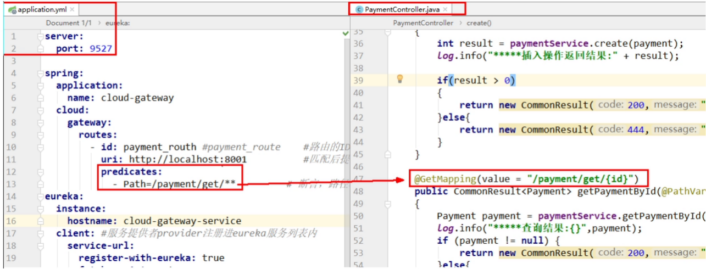

添加网关前： [http://localhost:8001/payment/get/31](http://localhost:8001/payment/get/31 "http://localhost:8001/payment/get/31")

添加网关后： [http://localhost:9527/payment/get/31](http://localhost:9527/payment/get/31 "http://localhost:9527/payment/get/31")

## 通过微服务名实现动态路由

默认情况下Gateway会根据注册中心的服务列表，以注册中心上微服务名为路径创建动态路由进行转发，从而实现动态路由的功能

### 启动

一个eureka7001+两个服务提供者8001/8002

### POM

### YML

| server:&#xA;  port: 9527&#xA;&#xA;spring:&#xA;  application:&#xA;    name: cloud-gateway&#xA;  cloud:&#xA;    gateway:&#xA;      discovery:&#xA;        locator:&#xA;          enabled: true  #开启从注册中心动态创建路由的功能，利用微服务名进行路由&#xA;      routes:&#xA;        \- id: payment\_routh #路由的ID，没有固定规则但要求唯一，建议配合服务名&#xA;          \#uri: [http://localhost:8001](http://localhost:8001 "http://localhost:8001")   #匹配后提供服务的路由地址&#xA;          uri: lb://cloud-payment-service&#xA;          predicates:&#xA;            \- Path=/payment/get/\*\*   #断言,路径相匹配的进行路由&#xA; &#xA;        \- id: payment\_routh2&#xA;          \#uri: [http://localhost:8001](http://localhost:8001 "http://localhost:8001")   #匹配后提供服务的路由地址&#xA;          uri: lb://cloud-payment-service&#xA;          predicates:&#xA;            \- Path=/payment/lb/\*\*   #断言,路径相匹配的进行路由&#xA;&#xA;eureka:&#xA;  instance:&#xA;    hostname: cloud-gateway-service&#xA;  client:&#xA;    service-url:&#xA;      register-with-eureka: true&#xA;      fetch-registry: true&#xA;      defaultZone: [http://localhost:7001/eureka](http://localhost:7001/eureka "http://localhost:7001/eureka") |
| -------------------------------------------------------------------------------------------------------------------------------------------------------------------------------------------------------------------------------------------------------------------------------------------------------------------------------------------------------------------------------------------------------------------------------------------------------------------------------------------------------------------------------------------------------------------------------------------------------------------------------------------------------------------------------------------------------------------------------------------------------------------------------------------------------------------------------------------------------------------------------------------------------------------------------------------------------------------------------------------------------------------------------------------------------------------------------------------------------------------------------------------------- |

需要注意的是uri的协议为lb，表示启用Gateway的负载均衡功能。

lb://serviceName是spring cloud gateway在微服务中自动为我们创建的负载均衡uri

### 测试

[http://localhost:9527/payment/lb](http://localhost:9527/payment/lb "http://localhost:9527/payment/lb")

8001/8002两个端口切换

## Predicate的使用

### 是什么

启动我们的gatewat9527，查看启动日志

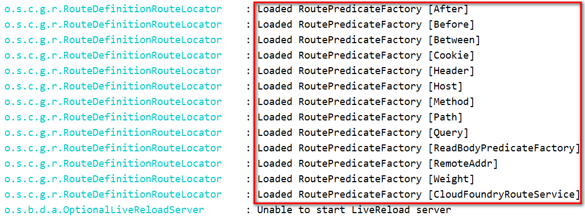

### Route Predicate Factories这个是什么东东？

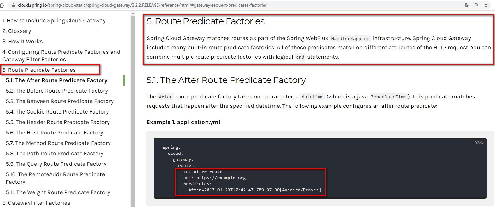

 

Spring Cloud Gateway将路由匹配作为Spring WebFlux HandlerMapper基础框架的一部分。

Spring Cloud Gateway包括许多内置的Route Predicate工厂。所有这些Predicate都与HTTP请求的不同属性匹配。多个Route Predicate工厂可以进行组合

Spring Cloud Gateway创建Route对象时，使用RoutePredicateFactory创建Predicate对象，Predicate对象可以赋值给 Route。Spring Cloud Gateway包含许

多内置的Route Predicate Factories。

 

所有这些谓词都匹配HTTP请求的不同属性。多种谓词工厂可以组合，并通过逻辑and 。

### 常用的Route Predicate

#### 1.After Route Predicate

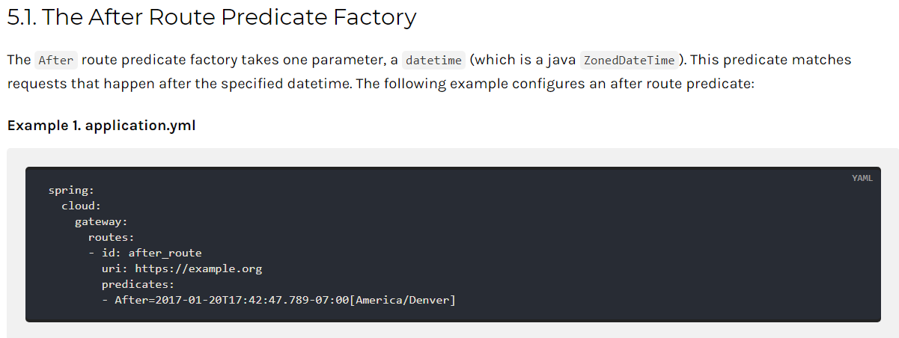

ZonedDateTime zonedDateTime = ZonedDateTime.now();

System.out.println(zonedDateTime);

-   \- After=2020-03-08T10:59:34.102+08:00\[Asia/Shanghai]
-   测试：没到时间进行测试报错

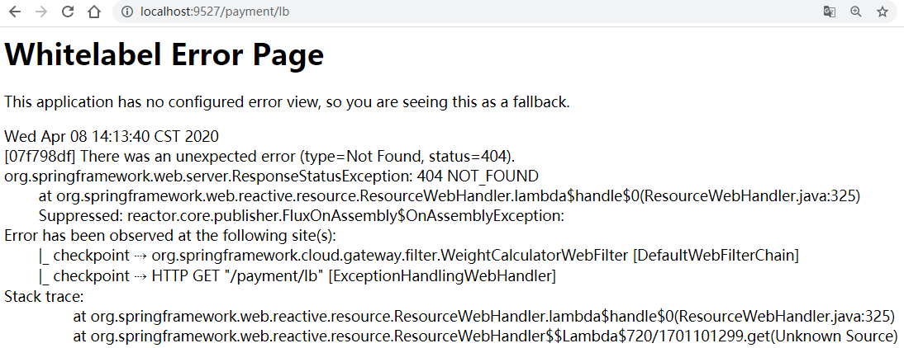

#### 2.Before Route Predicate

-   YML
    -   \- Before=2020-03-08T10:59:34.102+08:00\[Asia/Shanghai]

#### 3.Between Route Predicate

-   YML
    -   \- Between=2020-03-08T10:59:34.102+08:00\[Asia/Shanghai] ,  2020-03-08T10:59:34.102+08:00\[Asia/Shanghai]

#### 4.Cookie Route Predicate

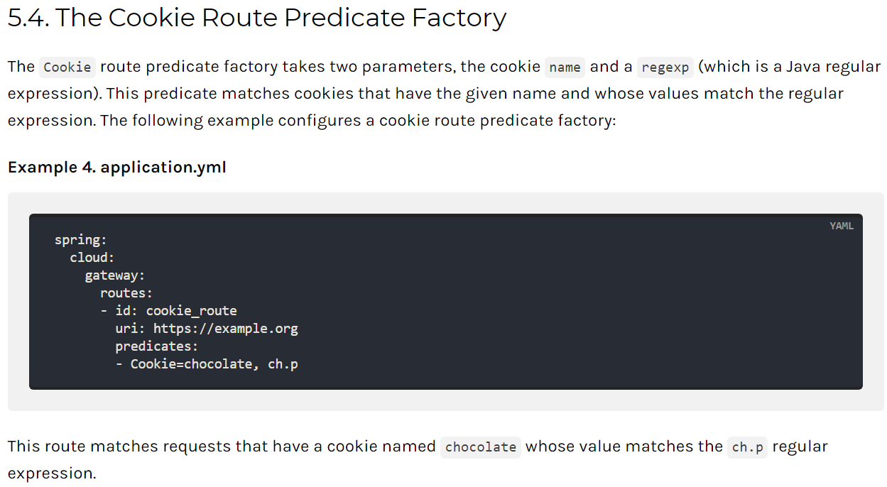

-   YML
    -   &#x20; \- Cookie=username,atguigu    #并且Cookie是username=zhangshuai才能访问
-   不带cookies访问

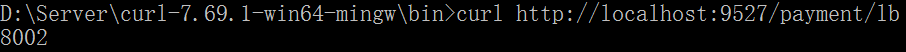

-   带上cookies访问
    -   curl下载地址：[https://curl.haxx.se/download.html](https://curl.haxx.se/download.html "https://curl.haxx.se/download.html")

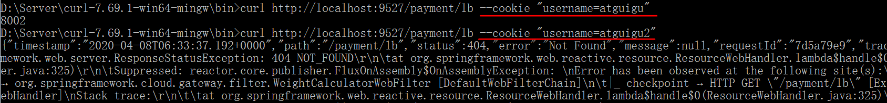

-   加入curl返回中文乱码（帖子）： [https://blog.csdn.net/leedee/article/details/82685636](https://blog.csdn.net/leedee/article/details/82685636 "https://blog.csdn.net/leedee/article/details/82685636")

#### 5.Header Route Predicate

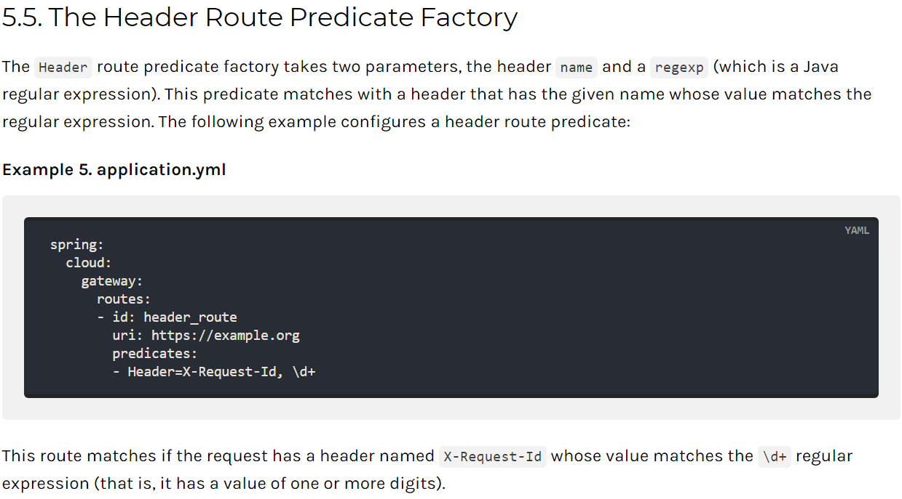

-   YML

\- Header=X-Request-Id, \d+   #请求头中要有X-Request-Id属性并且值为整数的正则表达式

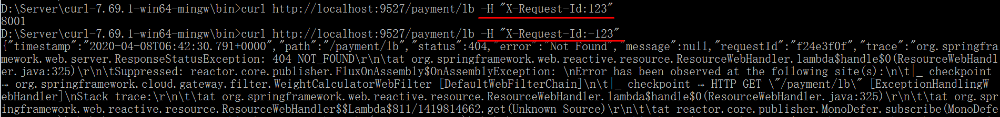

#### 6.Host Route Predicate

YML：  - Host= \*\*.atguigu.com

#### 7.Method Route Predicate

YML：- Method=GET

#### 8.Path Route Predicate

YML：

#### 9. Query Route Predicate

YML：  - Query=username, \d+ #要有参数名称并且是正整数才能路由

#### 10.小总结

-   All

| server:&#xA;  port: 9527&#xA;&#xA;spring:&#xA;  application:&#xA;    name: cloud-gateway&#xA;  cloud:&#xA;    gateway:&#xA;      discovery:&#xA;        locator:&#xA;          enabled: true  #开启从注册中心动态创建路由的功能，利用微服务名进行路由&#xA;      routes:&#xA;        \- id: payment\_routh #路由的ID，没有固定规则但要求唯一，建议配合服务名&#xA;          \#uri: [http://localhost:8001](http://localhost:8001 "http://localhost:8001")   #匹配后提供服务的路由地址&#xA;          uri: lb://cloud-payment-service&#xA;          predicates:&#xA;            \- Path=/payment/get/\*\*   #断言,路径相匹配的进行路由&#xA;&#xA;        \- id: payment\_routh2&#xA;          \#uri: [http://localhost:8001](http://localhost:8001 "http://localhost:8001")   #匹配后提供服务的路由地址&#xA;          uri: lb://cloud-payment-service&#xA;          predicates:&#xA;            \- Path=/payment/lb/\*\*   #断言,路径相匹配的进行路由&#xA;            \#- After=2020-03-08T10:59:34.102+08:00\[Asia/Shanghai]&#xA;            \#- Cookie=username,zhangshuai #并且Cookie是username=zhangshuai才能访问&#xA;            \#- Header=X-Request-Id, \d+ #请求头中要有X-Request-Id属性并且值为整数的正则表达式&#xA;            \#- Host=\*\*.atguigu.com&#xA;            \#- Method=GET&#xA;            \#- Query=username, \d+ #要有参数名称并且是正整数才能路由&#xA;&#xA;&#xA;eureka:&#xA;  instance:&#xA;    hostname: cloud-gateway-service&#xA;  client:&#xA;    service-url:&#xA;      register-with-eureka: true&#xA;      fetch-registry: true&#xA;      defaultZone: [http://localhost:7001/eureka](http://localhost:7001/eureka "http://localhost:7001/eureka") |
| --------------------------------------------------------------------------------------------------------------------------------------------------------------------------------------------------------------------------------------------------------------------------------------------------------------------------------------------------------------------------------------------------------------------------------------------------------------------------------------------------------------------------------------------------------------------------------------------------------------------------------------------------------------------------------------------------------------------------------------------------------------------------------------------------------------------------------------------------------------------------------------------------------------------------------------------------------------------------------------------------------------------------------------------------------------------------------------------------------------------------------------------------------------------------------------------------------------------------------------------------------------------------------------------------------------------------------------------------------------------------------------------------------------------------------------------------------------------------------------------------------------------------------- |

说白了，Predicate就是为了实现一组匹配规则，让请求过来找到对应的Route进行处理

## Filter的使用

### 是什么

路由过滤器可用于修改进入的HTTP请求和返回的HTTP响应，路由过滤器只能指定路由进行使用。

SpringCloud Gateway内置了多种路由过滤器，他们都由GatewayFilter的工厂类来产生。

### Spring Cloud Gateway的Filter&#x20;

#### 生命周期，Only Two

-   pre
    -   在业务逻辑之前
-   post
    -   在业务逻辑之后

#### 种类，Only Two

[https://docs.spring.io/spring-cloud-gateway/docs/2.2.6.RELEASE/reference/html/](https://docs.spring.io/spring-cloud-gateway/docs/2.2.6.RELEASE/reference/html/ "https://docs.spring.io/spring-cloud-gateway/docs/2.2.6.RELEASE/reference/html/")&#x20;

#### GatewayFilter（31种之多）

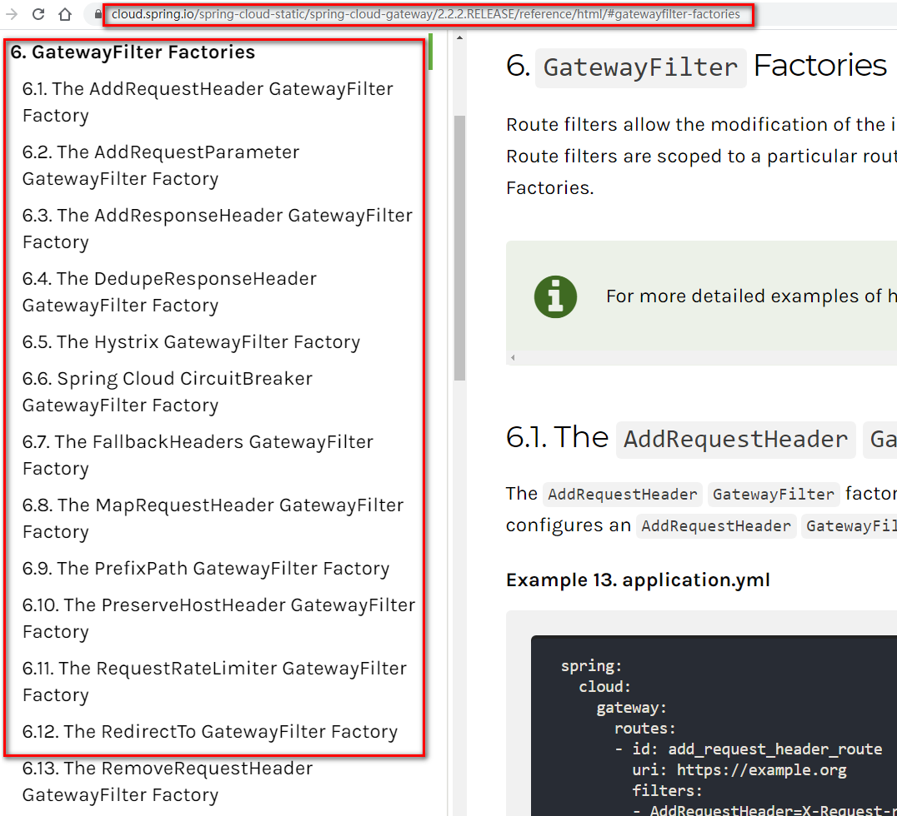

#### GlobalFilter

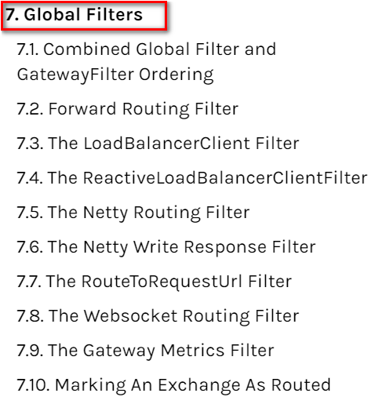

### 常用的GatewayFilter

AddRequestParameter

YML

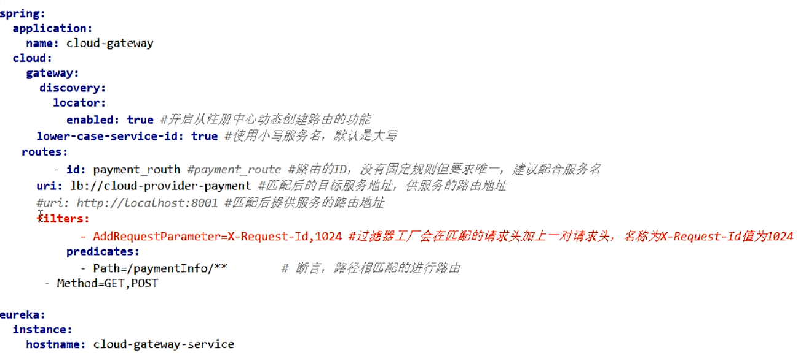

省略

…

### 自定义过滤器

#### 自定义全局GlobalFilter

两个主要接口介绍

impiemerts   GlobalFilter ，Ordered

#### 能干嘛

全局日志记录

统一网关鉴权

。。。。。。

#### 案例代码

| package com.atguigu.springcloud.filter;&#xA;&#xA;import lombok.extern.slf4j.Slf4j;&#xA;import org.springframework.cloud.gateway.filter.GatewayFilterChain;&#xA;import org.springframework.cloud.gateway.filter.GlobalFilter;&#xA;import org.springframework.core.Ordered;&#xA;import org.springframework.http.HttpStatus;&#xA;import org.springframework.stereotype.Component;&#xA;import org.springframework.util.StringUtils;&#xA;import org.springframework.web.server.ServerWebExchange;&#xA;import reactor.core.publisher.Mono;&#xA;import java.util.Date;&#xA;&#xA;@Component&#xA;@Slf4j&#xA;public class **MyLogGateWayFilter**implements GlobalFilter,Ordered {&#xA;@Override&#xA;public Mono<Void>filter(ServerWebExchange exchange, GatewayFilterChain chain) {&#xA;log.info("\*come in MyLogGateWayFilter: "+new Date());&#xA;String uname = exchange.getRequest().getQueryParams().getFirst("**username**");&#xA;if(StringUtils.isEmpty(username)){&#xA;log.info("\*用户名为Null 非法用户,(┬＿┬)");&#xA;exchange.getResponse().setStatusCode(HttpStatus.NOT\_ACCEPTABLE);&#xA;return exchange.getResponse().setComplete();&#xA;}&#xA;return chain.filter(exchange);&#xA;} |
| ---------------------------------------------------------------------------------------------------------------------------------------------------------------------------------------------------------------------------------------------------------------------------------------------------------------------------------------------------------------------------------------------------------------------------------------------------------------------------------------------------------------------------------------------------------------------------------------------------------------------------------------------------------------------------------------------------------------------------------------------------------------------------------------------------------------------------------------------------------------------------------------------------------------------------------------------------------------------------------------------------------------------------------------------------------------------------------------------------------------------------------------------------------------------------- |

#### 测试

启动&#x20;

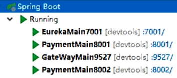

正确：[http://localhost:9527/payment/lb?username=z3](http://localhost:9527/payment/lb?username=z3 "http://localhost:9527/payment/lb?username=z3")

错误：[http://localhost:9527/payment/lb?uname=z3](http://localhost:9527/payment/lb?uname=z3 "http://localhost:9527/payment/lb?uname=z3")

