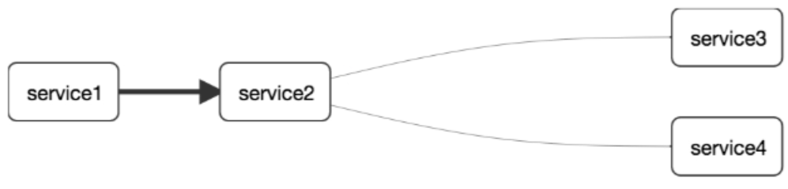

# 第九章SpringCloud Sleuth分布式链路请求跟踪

## 概述

### 为什么会出现这个技术？需要解决哪些问题？

问题

在微服务框架中，一个由客户端发起的请求在后端系统中会经过多个不同的服务节点调用来协同产生最后的请求结果，每一个前端请求都会形成一个复杂的分布式服务调用链路，链路中的任何一环出现高延时或错误都会引起整个请求最后的失败。

### 是什么

Spring Cloud Sleuth提供了一套完整的服务跟踪的解决方案

在分布式系统中提供追踪解决方案并且兼容支持了zipkin(负责展现) 

[https://docs.spring.io/spring-cloud-sleuth/docs/2.2.6.RELEASE/reference/html/](https://docs.spring.io/spring-cloud-sleuth/docs/2.2.6.RELEASE/reference/html/ "https://docs.spring.io/spring-cloud-sleuth/docs/2.2.6.RELEASE/reference/html/")

[https://zipkin.io/](https://zipkin.io/ "https://zipkin.io/") &#x20;

## 搭建链路监控步骤

Spring Cloud Sleuth和OpenZipkin（也称为Zipkin）集成。Zipkin是一个分布式跟踪平台，可用于跟踪跨多个服务调用的事务。Zipkin允许开发人员以图形方式查看事务占用的时间量，并分解在调用中涉及的每个微服务所用的时间。在微服务架构中，Zipkin是识别性能问题的宝贵工具。

    建立Spring Cloud Sleuth和Zipkin涉及4项操作：

-   将Spring Cloud Sleuth和Zipkin JAR文件添加到捕获跟踪数据的服务中；
-   在每个服务中配置Spring属性以指向收集跟踪数据的Zipkin服务器；
-   安装和配置Zipkin服务器以收集数据；
-   定义每个客户端所使用的采样策略，便于向Zipkin发送跟踪信息。

### zipkin

下载：[https://github.com/openzipkin/zipkin](https://github.com/openzipkin/zipkin "https://github.com/openzipkin/zipkin") &#x20;

| curl -sSL <https://zipkin.io/quickstart.sh> \| bash -s&#xA;java -jar zipkin.jar&#xA; |
| ------------------------------------------------------------------------------------ |

| 运行控制台&#xA;[http://your\_host:9411/zipkin/](http://your_host:9411/zipkin/ "http://your_host:9411/zipkin/") &#xA; |
| --------------------------------------------------------------------------------------------------------------- |

术语

完整的调用链路

表示一请求链路，一条链路通过Trace Id唯一标识，Span标识发起的请求信息，各span通过parent id 关联起来。

 

上图what

一条链路通过Trace Id唯一标识，Span标识发起的请求信息，各span通过parent id 关联起来。

整个链路的依赖关系如下：

名词解释

Trace:类似于树结构的Span集合，表示一条调用链路，存在唯一标识

span:表示调用链路来源，通俗的理解span就是一次请求信息

### 服务提供者

#### 修改：cloud\_provider\_payment8001

#### POM

| \<!--包含了sleuth+zipkin-->&#xA;\<dependency>&#xA;            \<groupId>org.springframework.cloud\</groupId>&#xA;            \<artifactId>spring-cloud-starter-zipkin\</artifactId>&#xA;\</dependency>&#xA; |
| -------------------------------------------------------------------------------------------------------------------------------------------------------------------------------------------------------- |

#### YML

| server:&#xA;  port: 8001&#xA;&#xA;spring:&#xA;  application:&#xA;    name: cloud-payment-service&#xA;  zipkin:&#xA;    base-url: [http://localhost:9411](http://localhost:9411 "http://localhost:9411")sleuth:&#xA;sampler:&#xA;#采样率值介于0\~1之间，1表示全部采样&#xA;probability: 1&#xA;datasource:&#xA;type: com.alibaba.druid.pool.DruidDataSource&#xA;driver-class-name: com.mysql.jdbc.Driver&#xA;url: jdbc:mysql://localhost:3306/cloud2021?useUnicode=true\&characterEncoding=utf-8\&useSSL=false&#xA;username: root&#xA;password: root[http://localhost:7001/eureka](http://localhost:7001/eureka "http://localhost:7001/eureka") |
| ----------------------------------------------------------------------------------------------------------------------------------------------------------------------------------------------------------------------------------------------------------------------------------------------------------------------------------------------------------------------------------------------------------------------------------------------------------------------------------------------------------------------------------------------------------------------------------------------------------------------------- |

#### 业务类PaymentController

| @GetMapping("/payment/zipkin")&#xA;public String paymentZipkin(){&#xA;        return "hi ,i'am paymentzipkin server，welcome to atguigu，O(∩\_∩)O哈哈\~";&#xA;}&#xA; |
| ---------------------------------------------------------------------------------------------------------------------------------------------------------------- |

### 服务消费者（调用方）

#### 修改：cloud-consumer-order80

#### POM

| \<!--包含了sleuth+zipkin-->&#xA;\<dependency>&#xA;            \<groupId>org.springframework.cloud\</groupId>&#xA;            \<artifactId>spring-cloud-starter-zipkin\</artifactId>&#xA;\</dependency>&#xA; |
| -------------------------------------------------------------------------------------------------------------------------------------------------------------------------------------------------------- |

#### YML

| server:&#xA;  port: 80&#xA;&#xA;spring:&#xA;    application:&#xA;        name: cloud-order-service&#xA;    zipkin:&#xA;      base-url: [http://localhost:9411](http://localhost:9411 "http://localhost:9411")&#xA;    sleuth:&#xA;      sampler:&#xA;        probability: 1&#xA;&#xA;eureka:&#xA;  client:&#xA;    \#表示是否将自己注册进EurekaServer默认为true。&#xA;    register-with-eureka: false&#xA;    \#是否从EurekaServer抓取已有的注册信息，默认为true。单节点无所谓，集群必须设置为true才能配合ribbon使用负载均衡&#xA;    fetchRegistry: true&#xA;    service-url:&#xA;      \#单机&#xA;      defaultZone: [http://localhost:7001/eureka](http://localhost:7001/eureka "http://localhost:7001/eureka")&#xA;      \#集群&#xA;      \#defaultZone: [http://eureka7001.com:7001/eureka,http://eureka7002.com:7002/eureka](http://eureka7001.com:7001/eureka,http:/eureka7002.com:7002/eureka "http://eureka7001.com:7001/eureka,http://eureka7002.com:7002/eureka")  # 集群版&#xA; |
| ---------------------------------------------------------------------------------------------------------------------------------------------------------------------------------------------------------------------------------------------------------------------------------------------------------------------------------------------------------------------------------------------------------------------------------------------------------------------------------------------------------------------------------------------------------------------------------------------------------------------------------------------------------------------------------------------------------------------------------------------------------------------------------------------------------------------------------------------------------------------------------------------------------------------------- |

#### 业务类PaymentController

| //==> zipkin+sleuth&#xA;@GetMapping("/consumer/payment/zipkin")&#xA;public String paymentZipkin(){&#xA;        String result = restTemplate.getForObject("http\://localhost:8001"+"/payment/zipkin/", String.class);&#xA;        return result;&#xA;}&#xA; |
| ---------------------------------------------------------------------------------------------------------------------------------------------------------------------------------------------------------------------------------------------------------- |

### 依次启动eureka7001/8001/80

80调用8001几次测试下

### 打开浏览器访问： http\://localhost:9411

会出现以下界面

查看

 

点击【SHOW】按钮，查看依赖关系。

