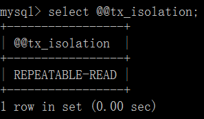

# 第一章 事务回顾

## 1.1 什么是事务

**提供一种“要么什么都不做，要么做全套（All or Nothing）”机制。**

## 1.2 事务的作用

**保证数据一致性**

## 1.3 事务ACID四大特性

**A：原子性(Atomicity)**

一个事务(transaction)中的所有操作，要么全部完成，要么全部不完成，不会结束在中间某个环节。事务在执行过程中发生错误，会被回滚（Rollback）到事务开始前的状态，就像这个事务从来没有执行过一样。

**C：一致性(Consistency)**

事务的一致性指的是在一个事务执行之前和执行之后数据库都必须处于一致性状态。

如果事务成功地完成，那么系统中所有变化将正确地应用，系统处于有效状态。

如果在事务中出现错误，那么系统中的所有变化将自动地回滚，系统返回到原始状态。

**I：隔离性(Isolation)**

指的是在并发环境中，当不同的事务同时操纵相同的数据时，每个事务都有各自的完整数据空间。由并发事务所做的修改必须与任何其他并发事务所做的修改隔离。事务查看数据更新时，数据所处的状态要么是另一事务修改它之前的状态，要么是另一事务修改它之后的状态，事务不会查看到中间状态的数据。

**D：持久性(Durability)**

指的是只要事务成功结束，它对数据库所做的更新就必须保存下来。即使发生系统崩溃，重新启动数据库系统后，数据库还能恢复到事务成功结束时的状态。

## 1.4 事务的并发问题

**脏读****：** ​

事务A读取了事务B更新的数据，事务B未提交并回滚数据，那么A读取到的数据是脏数据

**不可重复读****：** ​

事务 A 多次读取同一数据，事务 B 在事务A多次读取的过程中，对数据作了更新并提交，导致事务A多次读取同一数据时，结果 不一致。

**幻读****：** ​

系统管理员A将数据库中所有学生的成绩从具体分数改为ABCDE等级，但是系统管理员B就在这个时候插入了一条具体分数的记录，当系统管理员A更改结束后发现还有一条记录没有改过来，就好像发生了幻觉一样，这就叫幻读。

　　小结：不可重复读的和幻读很容易混淆，不可重复读侧重于修改，幻读侧重于新增或删除。解决不可重复读的问题只需锁住满足条件的行，解决幻读需要锁表。

## 1.5 MySQL事务隔离级别

| 事务隔离级别&#xA;                 | 脏读&#xA; | 不可重复读&#xA; | 幻读&#xA; |
| --------------------------- | ------- | ---------- | ------- |
| 读未提交（read-uncommitted）&#xA; | √&#xA;  | √&#xA;     | √&#xA;  |
| 读已提交（read-committed）&#xA;   | ×&#xA;  | √&#xA;     | √&#xA;  |
| 可重复读（repeatable-read）&#xA;  | ×&#xA;  | ×&#xA;     | √&#xA;  |
| 串行化（serializable）&#xA;      | ×&#xA;  | ×&#xA;     | ×&#xA;  |

mysql默认的事务隔离级别为repeatable-read

## 1.6 事务传播行为（propagation behavior）

指的就是当一个事务方法被另一个事务方法调用时，这个事务方法应该如何进行。 
例如：methodA事务方法调用methodB事务方法时，methodB是继续在调用者methodA的事务中运行呢，还是为自己开启一个新事务运行，这就是由methodB的事务传播行为决定的。

Spring定义了七种传播行为：参考 TransactionDefinition类

| **事务传播行为类型**                     | **说明**                                                                                                 |
| -------------------------------- | ------------------------------------------------------------------------------------------------------ |
| PROPAGATION\_REQUIRED&#xA;       | 如果当前没有事务，就新建一个事务，如果已经存在一个事务中，加入到这个事务中。默认&#xA;                                                          |
| PROPAGATION\_SUPPORTS&#xA;       | 支持当前事务，如果当前没有事务，就以非事务方式执行&#xA;                                                                         |
| PROPAGATION\_MANDATORY&#xA;      | 使用当前的事务，如果当前没有事务，就抛出异常。&#xA;                                                                           |
| PROPAGATION\_REQUIRES\_NEW&#xA;  | 新建事务，如果当前存在事务，把当前事务挂起。（一个新的事务将启动，而且如果有一个现有的事务在运行的话，则这个方法将在运行期被挂起，直到新的事务提交或者回滚才恢复执行）&#xA;               |
| PROPAGATION\_NOT\_SUPPORTED&#xA; | 以非事务方式执行操作，如果当前存在事务，就把当前事务挂起。&#xA;                                                                     |
| PROPAGATION\_NEVER&#xA;          | 以非事务方式执行，如果当前存在事务，则抛出异常。&#xA;                                                                          |
| PROPAGATION\_NESTED&#xA;         | 如果当前存在事务，则在嵌套事务内执行。如果当前没有事务，则执行与PROPAGATION\_REQUIRED类似的操作。（外层事务抛出异常回滚，那么内层事务必须回滚，反之内层事务并不影响外层事务）&#xA; |

## 1.7本地事务

本地事务也称为\*数据库事务\*或\*传统事务\*（相对于分布式事务而言）。它的执行模式就是常见的：

| **1. transaction begin****2. insert/delete/update****3. insert/delete/update****4. ...****5. transaction commit/rollback** |
| -------------------------------------------------------------------------------------------------------------------------- |

-   本地事务有这么几个特征:
    -   一次事务只连接一个支持事务的数据库（一般来说都是关系型数据库）
    -   事务的执行结果保证ACID
    -   会用到数据库锁
-   起初，事务仅限于对单一数据库资源的访问控制，架构服务化以后，事务的概念延伸到了服务中。倘若将一个单一的服务操作作为一个事务，那么整个服务操作只能涉及一个单一的数据库资源，这类**基于****单个服务单一数据库****资源访问的事务，被称为本地事务(Local Transaction)**。

