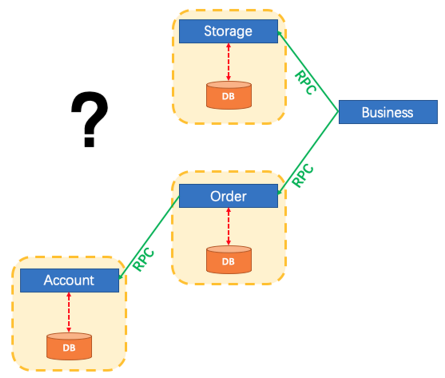
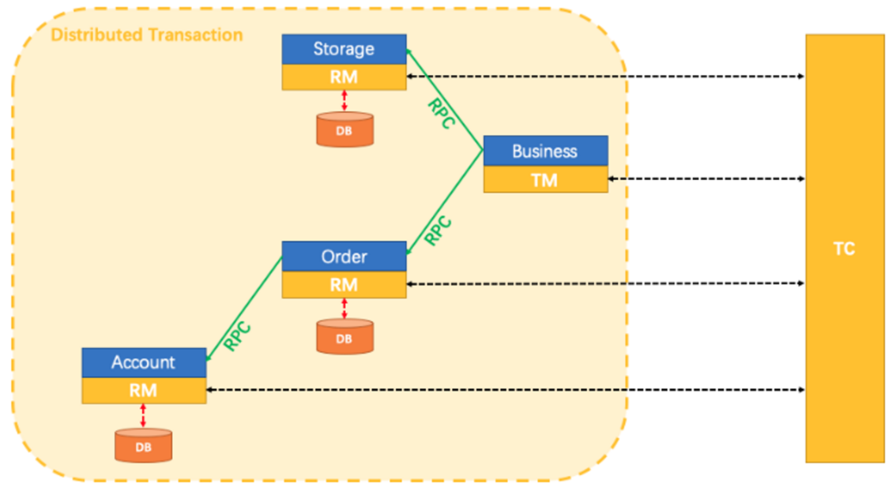

# 第二章 分布式事务

## 2.1 微服务分布式事务问题

-   首先，传统的**单体应用（Monolithic App）**，通过 3 个 Module，在同一个数据源上更新数据来完成一项业务。很自然的，整个业务过程的**数据一致性**由**本地事务**来保证。

-   随着业务需求和架构的变化，**单体应用被拆分为微服务**：原来的 3 个 Module 被拆分为 3 个独立的服务，分别使用独立的数据源。业务过程将由 3 个服务的调用来完成。

-   此时，每一个服务内部的数据一致性仍由本地事务来保证。而整个业务层面的全局数据一致性要如何保障呢？这就是微服务架构下面临的，典型的分布式事务需求：我们需要一个分布式事务的解决方案保障业务全局的数据一致性。

## 2.2 什么是分布式事务

分布式事务指事务的参与者、支持事务的服务器、资源服务器以及事务管理器分别位于不同的分布式系统的不同节点之上。

指一次大的操作由不同的小操作组成的，这些小的操作分布在不同的服务器上，分布式事务需要保证这些小操作要么全部成功，要么全部失败。

本质上来说，分布式事务就是为了保证不同数据库的数据一致性。

## 2.3 什么是分布式系统

-   部署在不同节点上的系统通过网络交互来完成协同工作的系统。
-   比如：
    -   充值加积分的业务，用户在充值系统向自己的账户充钱，在积分系统中自己积分相应的增加。
    -   充值系统和积分系统是两个不同的系统，一次充值加积分的业务就需要这两个系统协同工作来完成。

## 2.4 分布式事务应用在哪些场景

-   电商系统中的下单扣库存

电商系统中，**订单系统**和**库存系统**是两个系统，一次下单的操作由两个系统协同完成

-   金融系统中的银行卡充值

在金融系统中通过银行卡向平台充值需要通过**银行系统**和**金融系统**协同完成。

-   教育系统中下单选课业务

在线教育系统中，用户购买课程，下单支付成功后学生选课成功，此事务由**订单系统**和**选课系统**协同完成。

-   SNS系统的消息发送

在社交系统中发送站内消息同时发送手机短信，一次消息发送由**站内消息系统**和**手机通信系统**协同完成。

## 2.5 跨多服务多数据库的分布式事务

一个服务操作调用另一个服务，这时事务需要跨越多个服务。在这种情况下，起始服务的事务在调用另外一个服务的时候，需要以某种机制流转到另外一个服务，从而使被调用的服务访问的资源也自动加入到该事务当中来。这就需要跨服务跨数据库的全局事务进行数据一致性的保证。

较之基于单一数据库资源访问的本地事务，分布式事务的应用架构更为复杂。在不同的分布式应用架构下，实现一个分布式事务要考虑的问题并不完全一样，比如对多资源的协调、事务的跨服务传播等，实现机制也是复杂多变。

