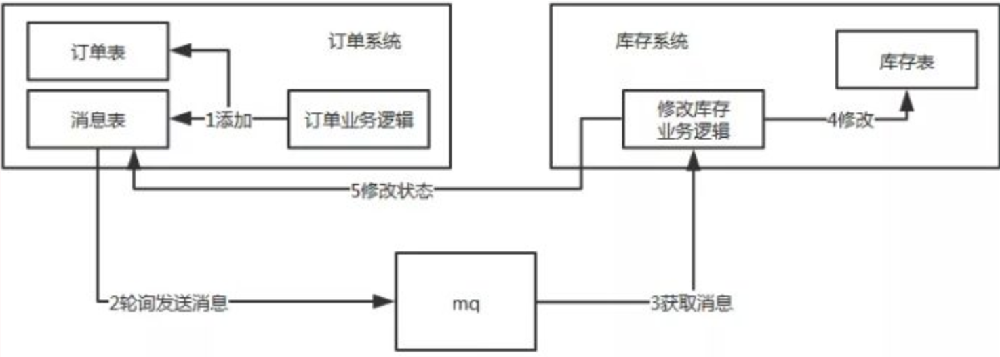
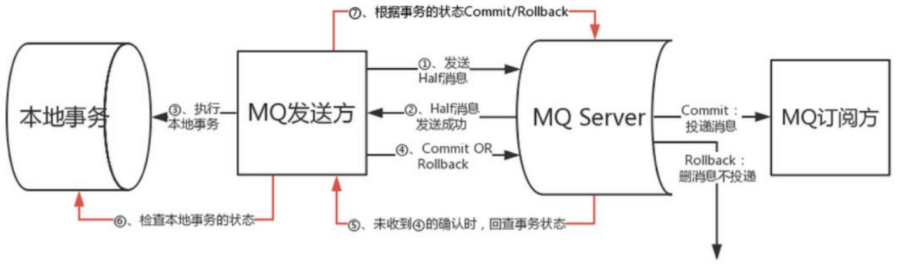
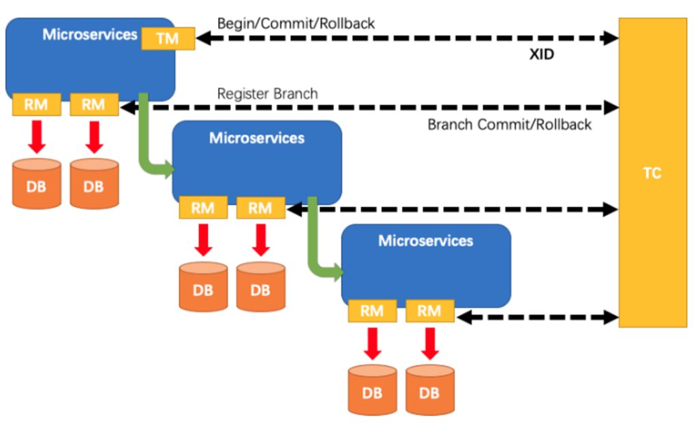

# 第三章 分布式事务解决方案

1.XA两段提交(低效率)-分布式事务解决方案

2.TCC三段提交(2段,高效率\[不推荐(补偿代码)])

3.本地消息(MQ+Table)

4.事务消息(RocketMQ\[alibaba])

5.Seata(alibaba)

## 3.1 基于XA协议的两阶段提交(2PC)

X/Open 组织（即现在的 Open Group ）定义了分布式事务处理模型

XA协议：XA是一个分布式事务协议。XA中大致分为两部分：**事务管理器**和**本地资源管理器**。其中本地资源管理器往往由数据库实现，比如Oracle、DB2这些商业数据库都实现了XA接口，而事务管理器作为全局的调度者，负责各个本地资源的提交和回滚。

### 3.1.1 概念

二阶段提交2PC（Two phase Commit）是指，在分布式系统里，为了保证所有节点在进行事务提交时保持一致性的一种算法。

### 3.1.2 背景

在分布式系统里，\*\*每个节点都可以知晓自己操作的成功或者失败，却无法知道其他节点操作的成功或失败。\*\*

当一个事务跨多个节点时，为了保持事务的原子性与一致性，需要引入一个\*\*协调者\*\*（Coordinator）来统一掌控所有\*\*参与者\*\*（Participant）的操作结果，并指示它们是否要把操作结果进行真正的提交（commit）或者回滚（rollback）。

### 3.1.3 思路

2PC顾名思义分为两个阶段，其实施思路可概括为：

（1）投票阶段（voting phase）：参与者将操作结果通知协调者；

（2）提交阶段（commit phase）：收到参与者的通知后，协调者再向参与者发出通知，根据反馈情况决定各参与者是否要提交还是回滚；

### 3.1.4 缺陷

算法执行过程中，\*\*所有节点都处于阻塞状态，所有节点所持有的资源（例如数据库数据，本地文件等）都处于封锁状态。\*\*

典型场景为：

（1）某一个参与者发出通知之前，所有参与者以及协调者都处于阻塞状态；

（2）在协调者发出通知之前，所有参与者都处于阻塞状态；

另外，如有协调者或者某个参与者出现了崩溃，为了避免整个算法处于一个完全阻塞状态，往往需要借助超时机制来将算法继续向前推进，故此时算法的效率比较低。

总的来说，\*\*2PC是一种比较保守的算法\*\*。

### 3.1.5 举例

甲乙丙丁四人要组织一个会议，需要确定会议时间，不妨设甲是协调者，乙丙丁是参与者。

**投票阶段：**

（1）甲发邮件给乙丙丁，周二十点开会是否有时间；

（2）甲回复有时间；

（3）乙回复有时间；

（4）丙迟迟不回复，此时对于这个活动，甲乙丙均处于阻塞状态，算法无法继续进行；

（5）丙回复有时间（或者没有时间）；

**提交阶段：**

（1）协调者甲将收集到的结果反馈给乙丙丁（什么时候反馈，以及反馈结果如何，在此例中取决与丙的时间与决定）；

（2）乙收到；

（3）丙收到；

（4）丁收到；

### 3.1.6 结论

2PC效率很低，分布式事务很难做

### 3.1.7 实际应用交互流程

#### 2PC两阶段提交的正向流程

**第一阶段：**

2PC中包含着两个角色：\*\*事务协调者\*\*和\*\*事务参与者\*\*。让我们来看一看他们之间的交互流程：

在分布式事务的第一阶段，作为事务协调者的节点会首先向所有的参与者节点发送Prepare请求。

在接到Prepare请求之后，每一个参与者节点会各自执行与事务有关的数据更新，写入Undo Log和Redo Log。如果参与者执行成功，暂时不提交事务，而是向事务协调节点返回“完成”消息。

当事务协调者接到了所有参与者的返回消息，整个分布式事务将会进入第二阶段。

**第二阶段：**

在2PC分布式事务的第二阶段，如果事务协调节点在之前所收到都是正向返回，那么它将会向所有事务参与者发出Commit请求。

接到Commit请求之后，事务参与者节点会各自进行本地的事务提交，并释放锁资源。当本地事务完成提交后，将会向事务协调者返回“完成”消息。

当事务协调者接收到所有事务参与者的“完成”反馈，整个分布式事务完成。

#### 失败情况的处理流程

**第一阶段：**

**第二阶段：**

在2PC的第一阶段，如果某个事务参与者反馈失败消息，说明该节点的本地事务执行不成功，必须回滚。

于是在第二阶段，事务协调节点向所有的事务参与者发送Abort(中止)请求。接收到Abort请求之后，各个事务参与者节点需要在本地进行事务的回滚操作，回滚操作依照Undo Log来进行。

以上就是2PC两阶段提交协议的详细过程。

#### 2PC两阶段提交究竟有哪些不足呢？

1.  **性能问题**

2PC遵循强一致性。在事务执行过程中，各个节点占用着数据库资源，只有当所有节点准备完毕，事务协调者才会通知提交，参与者提交后释放资源。这样的过程有着非常明显的性能问题。

1.  **协调者单点故障问题**

2PC模型的核心，一旦事务协调者节点挂掉，参与者收不到提交或是回滚通知，参与者会一直处于中间状态无法完成事务。

1.  **丢失消息导致的不一致问题。**

第二个阶段，如果发生局部网络问题，一部分事务参与者收到了提交消息，另一部分事务参与者没收到提交消息，那么就导致了节点之间数据的不一致。

## 3.2 代码补偿事务(TCC）

TCC的作用主要是解决跨服务调用场景下的分布式事务问题

### 3.2.1 场景案例

以航班预定的案例，来介绍TCC要解决的事务场景。在这里笔者虚构一个场景，把自己当做航班预定的主人公，来介绍这个案例。从合肥 –> 昆明 –> 大理。

准备从合肥出发，到云南大理去游玩，然后使用美团App(机票代理商)来订机票。发现没有从合肥直达大理的航班，需要到昆明进行中转。如下图：

从图中我们可以看出来，从合肥到昆明乘坐的是四川航空，从昆明到大理乘坐的是东方航空。

 由于使用的是美团App预定，当我选择了这种航班预定方案后，美团App要去四川航空和东方航空各帮我购买一张票。如下图：

考虑最简单的情况：美团先去川航帮我买票，如果买不到，那么东航也没必要买了。如果川航购买成功，再去东航购买另一张票。

 现在问题来了：假设美团先从川航成功买到了票，然后去东航买票的时候，因为天气问题，东航航班被取消了。那么此时，美团必须取消川航的票，因为只有一张票是没用的，不取消就是浪费我的钱。那么如果取消会怎样呢？如果读者有取消机票经历的话，非正常退票，肯定要扣手续费的。在这里，川航本来已经购买成功，现在因为东航的原因要退川航的票，川航应该是要扣代理商的钱的。

 那么美团就要保证，如果任一航班购买失败，都不能扣钱，怎么做呢？

 两个航空公司都为美团提供以下3个接口：**机票预留接口、确认接口、取消接口**。美团App分2个阶段进行调用，如下所示：

**在第1阶段：**

美团分别请求两个航空公司预留机票，两个航空公司分别告诉美团预留成功还是失败。航空公司需要保证，机票预留成功的话，之后一定能购买到。

**在第2阶段：**

如果两个航空公司都预留成功，则分别向两个公司发送确认购买请求。

如果两个航空公司任意一个预留失败，则对于预留成功的航空公司也要取消预留。这种情况下，对于之前预留成功机票的航班取消，也不会扣用户的钱，因为购买并没实际发生，之前只是请求预留机票而已。

通过这种方案，可以保证两个航空公司购买机票的一致性，要不都成功，要不都失败，即使失败也不会扣用户的钱。如果在两个航班都已经已经确认购买后，再退票，那肯定还是要扣钱的。

当然，实际情况肯定这里提到的肯定要复杂，通常航空公司在第一阶段，对于预留的机票，会要求在指定的时间必须确认购买(支付成功)，如果没有及时确认购买，会自动取消。假设川航要求10分钟内支付成功，东航要求30分钟内支付成功。以较短的时间算，如果用户在10分钟内支付成功的话，那么美团会向两个航空公司都发送确认购买的请求，如果超过10分钟(以较短的时间为准)，那么就不能进行支付。

这个方案提供给我们一种跨服务保证事务一致性的一种解决思路，可以把这种方案当做TCC的雏形。

具体流程：

TCC是Try ( 尝试 ) — Confirm(确认) — Cancel ( 取消 ) 的简称:

| **操作方法**     | **含义**                                                                                            |
| ------------ | ------------------------------------------------------------------------------------------------- |
| Try&#xA;     | 完成所有业务检查（一致性），预留业务资源(准隔离性) 回顾上面航班预定案例的阶段1，机票就是业务资源，所有的资源提供者(航空公司)预留都成功，try阶段才算成功&#xA;             |
| Confirm&#xA; | 确认执行业务操作，不做任何业务检查， 只使用Try阶段预留的业务资源。回顾上面航班预定案例的阶段2，美团APP确认两个航空公司机票都预留成功，因此向两个航空公司分别发送确认购买的请求。&#xA; |
| Cancel&#xA;  | 取消Try阶段预留的业务资源。回顾上面航班预定案例的阶段2，如果某个业务方的业务资源没有预留成功，则取消所有业务资源预留请求。&#xA;                              |

### 3.2.2 TCC两阶段提交与XA两阶段提交的区别

 XA是资源层面的分布式事务，强一致性，在两阶段提交的整个过程中，一直会持有资源的锁。

TCC是业务层面的分布式事务，最终一致性，不会一直持有资源的锁。

其核心在于将业务分为两个操作步骤完成。不依赖 RM 对分布式事务的支持，而是通过对业务逻辑的分解来实现分布式事务。

## 3.3 本地消息表（异步确保）- 事务最终一致性

这种实现方式的思路，其实是源于 ebay，后来通过支付宝等公司的布道，在业内广泛使用。\*\*其基本的设计思想是将远程分布式事务拆分成一系列的本地事务\*\*。如果不考虑性能及设计优雅，借助关系型数据库中的表即可实现。

-   订单系统新增一条消息表，将新增订单和新增消息放到一个事务里完成，然后通过轮询的方式去查询消息表，将消息推送到 MQ，库存系统去消费 MQ。

-   执行流程：
    -   订单系统，添加一条订单和一条消息，在一个事务里提交。
    -   订单系统，使用定时任务轮询查询状态为未同步的消息表，发送到 MQ，如果发送失败，就重试发送。
    -   库存系统，接收 MQ 消息，修改库存表，需要保证幂等操作。
    -   如果修改成功，调用 RPC 接口修改订单系统消息表的状态为已完成或者直接删除这条消息。
    -   如果修改失败，可以不做处理，等待重试。
-   订单系统中的消息有可能由于业务问题会一直重复发送，所以为了避免这种情况可以记录一下发送次数，当达到次数限制之后报警，人工接入处理；库存系统需要保证幂等，避免同一条消息被多次消费造成数据一致。
-   本地消息表这种方案实现了最终一致性，需要在业务系统里增加消息表，业务逻辑中多一次插入的 DB 操作，所以性能会有损耗，而且最终一致性的间隔主要由定时任务的间隔时间决定。
-   优点： 一种非常经典的实现，避免了分布式事务，实现了最终一致性。
-   缺点： 消息表会耦合到业务系统中，如果没有封装好的解决方案，会有很多杂活需要处理。

## 3.4 MQ 事务消息

有一些第三方的MQ是支持事务消息的，比如RocketMQ，他们支持事务消息的方式也是类似于采用的二阶段提交，但是市面上一些主流的MQ都是不支持事务消息的，比如 RabbitMQ 和 Kafka 都不支持。

以阿里的 RocketMQ 中间件为例，其思路大致为：

1.  RocketMQ提供了类似X/Open XA的分布事务功能，通过MQ的事务消息能达到分布式事务的最终一致。
2.  发送方在业务执行开始会先向消息服务器中投递 “ **半消息** ” ，半消息即暂时不会真正投递的消息，当发送方（即生产者）将消息成功发送给了MQ服务端且并未将该消息的二次确认结果返回，此时消息状态是“ 暂时不可投递 ” 状态（可以认为是状态未知）。该状态下的消息即半消息。
3.  如果出现网络闪断、生产者应用重启等原因导致事务消息二次确认丢失，MQ服务端会通过扫描发现某条消息长期处于 “ 半消息 ” 状态，MQ服务端会主动向生产者查询该消息的最终状态是处于Commit(消息提交)还是Rollback(消息回滚)。这个过程称为**消息回查**。

在业务方法内要想消息队列提交两次请求，一次发送消息和一次确认消息。如果确认消息发送失败了RocketMQ会定期扫描消息集群中的事务消息，这时候发现了Prepared消息，它会向消息发送者确认，所以生产方需要实现一个check接口，RocketMQ会根据发送端设置的**策略来决定是回滚还是继续发送确认消息**。这样就保证了消息发送与本地事务同时成功或同时失败。

**总体而言RocketMQ事务消息分为两条主线**

-   **定时任务发送流程：** 发送half message(半消息)，执行本地事务，发送事务执行结果
-   **定时任务回查流程：** MQ服务器回查本地事务，发送事务执行结果

**具体流程如下**

1、Producer 向 MQ 服务器 发送消息 , MQ Server 将消息状态标记为 Prepared（预备状态），注意此时这条消息消费者（MQ订阅方）是无法消费到的。

2、MQ 服务器收到消息并持久化成功之后，会向Producer 确认首次消息发送成功，此时消息处于 half message(半消息) 状态，并未发送给对应的 Consumer 。

3、Producer 开始执行本地事务逻辑 , 通过本地数据库事务控制。

4、根据事务执行结果，Producer 向 MQ 服务器提交二次确认 ( commit 或者 rollback) 。MQ Server 收到 Commit 状态则将半消息标记为可投递，Consumer 最终将收到该消息；MQ Server 收到 Rollback 状态则删除半消息，Consumer 将不会接受该消息。

5、在断网或者应用重启的情况下，二次确认未成功的发给 MQ Server，MQ Server 会主动向 Producer 启动消息回查

6、Producer 根据事务执行结果，对消息回查返回对应的结果。

7、Mq Server根据返回结果，决定继续投递消息或者丢弃消息(重复第4步操作)。

注意 1-4 为事务消息的发送过程， 5-6 为事务消息的回查过程。

**优点：** 实现了最终一致性，不需要依赖本地数据库事务。

**缺点：** 目前主流MQ中只有RocketMQ支持事务消息。

## 3.5 Seata介绍

[http://seata.io/zh-cn/](http://seata.io/zh-cn/ "http://seata.io/zh-cn/")

**Seata**是阿里开源的一个分布式事务框架，能够让大家在操作分布式事务时，像操作本地事务一样简单。一个注解搞定分布式事务。

**解决分布式事务问题，有两个设计初衷**

-   **对业务无侵入**：即减少技术架构上的微服务化所带来的分布式事务问题对业务的侵入
-   **高性能**：减少分布式事务解决方案所带来的性能消耗

**Seata中有两种分布式事务实现方案，AT及TCC**

-   AT模式主要关注多 DB 访问的数据一致性，当然也包括多服务下的多 DB 数据访问一致性问题 2PC-改进
-   TCC 模式主要关注业务拆分，在按照业务横向扩展资源时，解决微服务间调用的一致性问题

**那 Seata 是怎么做到的呢？下面说说它的各个模块之间的关系。**

Seata 的设计思路是将一个分布式事务可以理解成一个全局事务，下面挂了若干个分支事务，而一个分支事务是一个满足 ACID 的本地事务，因此我们可以操作分布式事务像操作本地事务一样。

2019 年 1 月，**阿里**巴巴中间件团队发起了开源项目 [*Fescar*](https://www.oschina.net/p/fescar "Fescar")（Fast & EaSy Commit And Rollback），和社区一起共建开源分布式事务解决方案。Fescar 的愿景是让分布式事务的使用像本地事务的使用一样，简单和高效，并逐步解决开发者们遇到的分布式事务方面的所有难题。

Seata全称：Simple Extensible Autonomous Transaction Architecture,简单可扩展自治事务框架。

### 3.5.1 AT模式（Automatic (Branch) Transaction Mode）

-   **Transaction Coordinator （TC）：** 事务协调器，**维护全局事务的运行状态**，负责协调并决定全局事务的提交或回滚。
-   **Transaction Manager（TM）：** 控制全局事务的边界，负责开启一个全局事务，并最终发起**全局提交**或**全局回滚**的决议。
-   **Resource Manager （RM）：**资源管理器，负责本地事务的注册，本地事务状态的汇报(投票)，并且**负责本地事务的提交和回滚**。
-   **XID：** 一个全局事务的唯一标识

其中，TM是一个分布式事务的发起者和终结者，TC负责维护分布式事务的运行状态，而RM则负责本地事务的运行。

如下图所示：

下面是一个分布式事务在Seata中的执行流程：

1.  TM 向 TC 申请开启一个全局事务，全局事务创建成功并生成一个全局唯一的 XID
2.  XID 在微服务调用链路的上下文中传播。
3.  RM 向 TC 注册分支事务，接着执行这个分支事务并提交（重点：RM在第一阶段就已经执行了本地事务的提交/回滚），最后将执行结果汇报给TC
4.  TM 根据 TC 中所有的分支事务的执行情况，发起全局提交或回滚决议。
5.  TC 调度 XID 下管辖的全部分支事务完成提交或回滚请求。

Seata 中有三大模块，分别是 TM、RM 和 TC。 其中 TM 和 RM 是作为 Seata 的客户端与业务系统集成在一起，TC 作为 Seata 的服务端独立部署。

阿里云GTS，商业付费版。

#### ①整体机制

两阶段提交协议的演变：

-   一阶段：业务数据和回滚日志记录在同一个本地事务中提交，释放本地锁和连接资源。
-   二阶段：
    -   提交异步化，非常快速地完成。
    -   回滚通过一阶段的回滚日志进行反向补偿。

#### ②写隔离

-   一阶段本地事务提交前，需要确保先拿到 **全局锁** 。
-   拿不到 **全局锁** ，不能提交本地事务。
-   拿 **全局锁** 的尝试被限制在一定范围内，超出范围将放弃，并回滚本地事务，释放本地锁。

以一个示例来说明：

两个全局事务 tx1 和 tx2，分别对 a 表的 m 字段进行更新操作，m 的初始值 1000。

tx1 先开始，开启本地事务，拿到本地锁，更新操作 m = 1000 - 100 = 900。本地事务提交前，先拿到该记录的 **全局锁** ，本地提交释放本地锁。 tx2 后开始，开启本地事务，拿到本地锁，更新操作 m = 900 - 100 = 800。本地事务提交前，尝试拿该记录的 **全局锁** ，tx1 全局提交前，该记录的全局锁被 tx1 持有，tx2 需要重试等待 **全局锁** 。

tx1 二阶段全局提交，释放 **全局锁** 。tx2 拿到 **全局锁** 提交本地事务。

如果 tx1 的二阶段全局回滚，则 tx1 需要重新获取该数据的本地锁，进行反向补偿的更新操作，实现分支的回滚。

此时，如果 tx2 仍在等待该数据的 **全局锁**，同时持有本地锁，则 tx1 的分支回滚会失败。分支的回滚会一直重试，直到 tx2 的 **全局锁** 等锁超时，放弃 **全局锁** 并回滚本地事务释放本地锁，tx1 的分支回滚最终成功。

因为整个过程 **全局锁** 在 tx1 结束前一直是被 tx1 持有的，所以不会发生 **脏写** 的问题。

#### ③读隔离

在数据库本地事务隔离级别 **读已提交（Read Committed）** 或以上的基础上，Seata（AT 模式）的默认全局隔离级别是 **读未提交（Read Uncommitted）** 。

如果应用在特定场景下，必需要求全局的 **读已提交** ，目前 Seata 的方式是通过 SELECT FOR UPDATE 语句的代理。

SELECT FOR UPDATE 语句的执行会申请 **全局锁** ，如果 **全局锁** 被其他事务持有，则释放本地锁（回滚 SELECT FOR UPDATE 语句的本地执行）并重试。这个过程中，查询是被 block 住的，直到 **全局锁** 拿到，即读取的相关数据是 **已提交** 的，才返回。

出于总体性能上的考虑，Seata 目前的方案并没有对所有 SELECT 语句都进行代理，仅针对 FOR UPDATE 的 SELECT 语句。

#### ④工作机制

以一个示例来说明整个 AT 分支的工作过程。

业务表：product

| **Field**  | **Type**          | **Key**  |
| ---------- | ----------------- | -------- |
| id&#xA;    | bigint(20)&#xA;   | PRI&#xA; |
| name&#xA;  | varchar(100)&#xA; |          |
| since&#xA; | varchar(100)&#xA; |          |

AT 分支事务的业务逻辑：

update product set name = 'GTS' where name = 'TXC';

#### 一阶段

过程：

1.  解析 SQL：得到 SQL 的类型（UPDATE），表（product），条件（where name = 'TXC'）等相关的信息。
2.  查询前镜像：根据解析得到的条件信息，生成查询语句，定位数据。

select id, name, since from product where name = 'TXC';

得到前镜像：

| **id** | **name** | **since** |
| ------ | -------- | --------- |
| 1&#xA; | TXC&#xA; | 2014&#xA; |

1.  执行业务 SQL：更新这条记录的 name 为 'GTS'。
2.  查询后镜像：根据前镜像的结果，通过 **主键** 定位数据。

select id, name, since from product where id = 1;

得到后镜像：

| **id** | **name** | **since** |
| ------ | -------- | --------- |
| 1&#xA; | GTS&#xA; | 2014&#xA; |

1.  插入回滚日志：把前后镜像数据以及业务 SQL 相关的信息组成一条回滚日志记录，插入到 UNDO\_LOG 表中。

{
"branchId": 641789253,
"undoItems": \[{
"afterImage": {
"rows": \[{
"fields": \[{
"name": "id",
"type": 4,
"value": 1
}, {
"name": "name",
"type": 12,
"value": "GTS"
}, {
"name": "since",
"type": 12,
"value": "2014"
}]
}],
"tableName": "product"
},
"beforeImage": {
"rows": \[{
"fields": \[{
"name": "id",
"type": 4,
"value": 1
}, {
"name": "name",
"type": 12,
"value": "TXC"
}, {
"name": "since",
"type": 12,
"value": "2014"
}]
}],
"tableName": "product"
},
"sqlType": "UPDATE"
}],
"xid": "xid:xxx"
}

1.  提交前，向 TC 注册分支：申请 product 表中，主键值等于 1 的记录的 **全局锁** 。
2.  本地事务提交：业务数据的更新和前面步骤中生成的 UNDO LOG 一并提交。
3.  将本地事务提交的结果上报给 TC。

#### 二阶段-回滚

1.  收到 TC 的分支回滚请求，开启一个本地事务，执行如下操作。
2.  通过 XID 和 Branch ID 查找到相应的 UNDO LOG 记录。
3.  数据校验：拿 UNDO LOG 中的后镜与当前数据进行比较，如果有不同，说明数据被当前全局事务之外的动作做了修改。这种情况，需要根据配置策略来做处理，详细的说明在另外的文档中介绍。
4.  根据 UNDO LOG 中的前镜像和业务 SQL 的相关信息生成并执行回滚的语句：

update product set name = 'TXC' where id = 1;

1.  提交本地事务。并把本地事务的执行结果（即分支事务回滚的结果）上报给 TC。

#### 二阶段-提交

1.  收到 TC 的分支提交请求，把请求放入一个异步任务的队列中，马上返回提交成功的结果给 TC。
2.  异步任务阶段的分支提交请求，将异步和批量地删除相应 UNDO LOG 记录。

