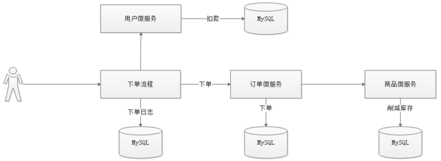

# 第四章 Seata案例初始化

## 4.1 需求分析

完成一个案例，用户下单的时候记录下单日志，完成订单添加，完成商品库存削减功能，完成用户账户扣款，可以在扣款时制造异常，测试全局分布式事务一致性。

## 4.2 案例实现

Fescar：全称fast easy commit and rollback

导入课件中fescar-parent-none.rar案例项目。修改自己的数据库连接信息。接下来直接集成Seata框架。

