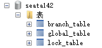
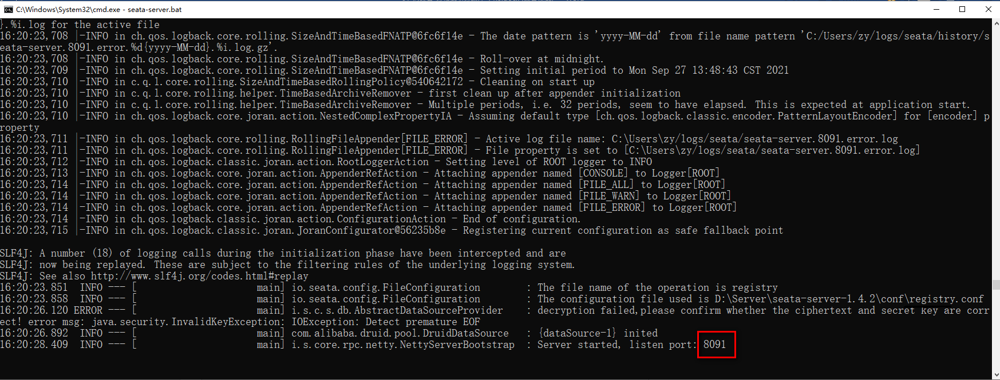
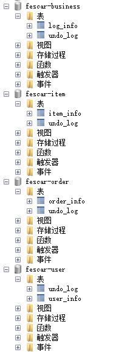

# 第五章 Seata集成

版本声明：

nacos-server-1.4.2 + seata-server-1.4.2 + MySQL5.7 + Hoxton.SR9 + Alibaba2.2.6.RELEASE + SpringBoot2.3.2.RELEASE

[https://hub.fastgit.org/alibaba/spring-cloud-alibaba/wiki/%E7%89%88%E6%9C%AC%E8%AF%B4%E6%98%8E](https://hub.fastgit.org/alibaba/spring-cloud-alibaba/wiki/%E7%89%88%E6%9C%AC%E8%AF%B4%E6%98%8E "https://hub.fastgit.org/alibaba/spring-cloud-alibaba/wiki/%E7%89%88%E6%9C%AC%E8%AF%B4%E6%98%8E")

## 5.1 搭建注册中心和配置中心Nacos

1.  下载地址：[https://nacos.io/zh-cn/](https://nacos.io/zh-cn/ "https://nacos.io/zh-cn/")&#x20;

解压nacos-server-1.4.2.zip安装，修改D:\Server\nacos-server-1.4.2\conf\application.properties在最后增加配置持久化，这里使用MySQL作为持久化。默认：Derby

| spring.datasource.platform=mysql&#xA;&#xA;db.num=1&#xA;db.url.0=jdbc:mysql://localhost:3306/nacos\_config?serverTimezone=GMT%2B8\&characterEncoding=utf8\&connectTimeout=1000\&socketTimeout=3000\&autoReconnect=true&#xA;db.user=root&#xA;db.password=root&#xA; |
| ---------------------------------------------------------------------------------------------------------------------------------------------------------------------------------------------------------------------------------------------------------------- |

1.  创建数据库：nacos\_config，导入表：D:\Server\nacos-server-1.4.2\conf\nacos-mysql.sql
2.  启动服务器：D:\Server\nacos-server-1.4.2\bin\startup.cmd -m standalone

## 5.2 在配置中心增加配置

1.  新建dataId为seataServer.properties的配置，内容如下:

重点关注

-   虚拟组配置，所有的微服务需要加入名称为：my\_test\_tx\_group的事务组中
-   设置TC进行全局事务控制的数据存储方式：store.mode有file,db,redis三种类型。这里选择db,设置mysql连接信息

| transport.type=TCP&#xA;transport.server=NIO&#xA;transport.heartbeat=true&#xA;transport.enableClientBatchSendRequest=true&#xA;transport.threadFactory.bossThreadPrefix=NettyBoss&#xA;transport.threadFactory.workerThreadPrefix=NettyServerNIOWorker&#xA;transport.threadFactory.serverExecutorThreadPrefix=NettyServerBizHandler&#xA;transport.threadFactory.shareBossWorker=false&#xA;transport.threadFactory.clientSelectorThreadPrefix=NettyClientSelector&#xA;transport.threadFactory.clientSelectorThreadSize=1&#xA;transport.threadFactory.clientWorkerThreadPrefix=NettyClientWorkerThread&#xA;transport.threadFactory.bossThreadSize=1&#xA;transport.threadFactory.workerThreadSize=default&#xA;transport.shutdown.wait=3&#xA;service.vgroupMapping.**my\_test\_tx\_group**=default&#xA;service.default.grouplist=127.0.0.1:8091&#xA;service.enableDegrade=false&#xA;service.disableGlobalTransaction=false&#xA;client.rm.asyncCommitBufferLimit=10000&#xA;client.rm.lock.retryInterval=10&#xA;client.rm.lock.retryTimes=30&#xA;client.rm.lock.retryPolicyBranchRollbackOnConflict=true&#xA;client.rm.reportRetryCount=5&#xA;client.rm.tableMetaCheckEnable=false&#xA;client.rm.tableMetaCheckerInterval=60000&#xA;client.rm.sqlParserType=druid&#xA;client.rm.reportSuccessEnable=false&#xA;client.rm.sagaBranchRegisterEnable=false&#xA;client.rm.tccActionInterceptorOrder=-2147482648&#xA;client.tm.commitRetryCount=5&#xA;client.tm.rollbackRetryCount=5&#xA;client.tm.defaultGlobalTransactionTimeout=60000&#xA;client.tm.degradeCheck=false&#xA;client.tm.degradeCheckAllowTimes=10&#xA;client.tm.degradeCheckPeriod=2000&#xA;client.tm.interceptorOrder=-2147482648&#xA;&#xA;store.mode=db&#xA;store.db.datasource=druid&#xA;store.db.dbType=mysql&#xA;store.db.driverClassName=com.mysql.cj.jdbc.Driver&#xA;store.db.url=jdbc:mysql://localhost:3306/seata142?characterEncoding=UTF-8\&serverTimezone=Asia/Shanghai&#xA;store.db.user=root&#xA;store.db.password=root&#xA;store.db.minConn=5&#xA;store.db.maxConn=30&#xA;store.db.globalTable=global\_table&#xA;store.db.branchTable=branch\_table&#xA;store.db.queryLimit=100&#xA;store.db.lockTable=lock\_table&#xA;&#xA;store.lock.mode=file&#xA;store.session.mode=file&#xA;store.publicKey=123&#xA;server.recovery.committingRetryPeriod=1000&#xA;server.recovery.asynCommittingRetryPeriod=1000&#xA;server.recovery.rollbackingRetryPeriod=1000&#xA;server.recovery.timeoutRetryPeriod=1000&#xA;server.maxCommitRetryTimeout=-1&#xA;server.maxRollbackRetryTimeout=-1&#xA;server.rollbackRetryTimeoutUnlockEnable=false&#xA;server.distributedLockExpireTime=10000&#xA;client.undo.dataValidation=true&#xA;client.undo.logSerialization=jackson&#xA;client.undo.onlyCareUpdateColumns=true&#xA;server.undo.logSaveDays=7&#xA;server.undo.logDeletePeriod=86400000&#xA;client.undo.logTable=undo\_log&#xA;client.undo.compress.enable=true&#xA;client.undo.compress.type=zip&#xA;client.undo.compress.threshold=64k&#xA;log.exceptionRate=100&#xA;transport.serialization=seata&#xA;transport.compressor=none&#xA;metrics.enabled=false&#xA;metrics.registryType=compact&#xA;metrics.exporterList=prometheus&#xA;metrics.exporterPrometheusPort=9898&#xA; |
| ------------------------------------------------------------------------------------------------------------------------------------------------------------------------------------------------------------------------------------------------------------------------------------------------------------------------------------------------------------------------------------------------------------------------------------------------------------------------------------------------------------------------------------------------------------------------------------------------------------------------------------------------------------------------------------------------------------------------------------------------------------------------------------------------------------------------------------------------------------------------------------------------------------------------------------------------------------------------------------------------------------------------------------------------------------------------------------------------------------------------------------------------------------------------------------------------------------------------------------------------------------------------------------------------------------------------------------------------------------------------------------------------------------------------------------------------------------------------------------------------------------------------------------------------------------------------------------------------------------------------------------------------------------------------------------------------------------------------------------------------------------------------------------------------------------------------------------------------------------------------------------------------------------------------------------------------------------------------------------------------------------------------------------------------------------------------------------------------------------------------------------------------------------------------------------------------------------------------------------------------------------------------------------------------------------------------------------------------------------------------------------------------------------------------------------------------------------------------------------------------------------------------------------------------------------------------------------------------------------------------------------------------------------------------------------------------------------------------------------------------------------------------------------------------------------------------------------------------------------------------------------------------------------------------------------------------------------------------------------------------------------------------------------------------------------------------------------------------------------------------------------------------------------------------------------------------------------------------------- |

在seata142数据库中导入表：global\_table、branch\_table、lock\_table，脚本参考课件：\dbsql\mysql\_global\_table.sql

1.  新建dataId为common.yml配置，内容如下: 所有微服务共享这个配置。

| seata: &#xA;  tx-service-group: my\_test\_tx\_group&#xA; |
| -------------------------------------------------------- |

在fescar-api项目bootstrap.yml文件中引入common.yml配置，共享给其他服务使用。

| spring:&#xA;  cloud:&#xA;    nacos:&#xA;      discovery:&#xA;        server-addr: localhost:8848&#xA;        group: SEATA\_GROUP&#xA;      config:&#xA;        server-addr: localhost:8848&#xA;        file-extension: yml&#xA;        group: SEATA\_GROUP&#xA;        shared-configs\[0]:&#xA;          data-id: common.yml&#xA;          refresh: true&#xA;          group: SEATA\_GROUP&#xA; |
| ----------------------------------------------------------------------------------------------------------------------------------------------------------------------------------------------------------------------------------------------------------------------------------------------------------------------------------------------------------------------------------------------- |

1.  查看配置中心

## 5.3 搭建TC服务器

1.  下载地址：[https://seata.io/zh-cn/index.html](https://seata.io/zh-cn/index.html "https://seata.io/zh-cn/index.html")&#x20;
2.  解压seata-server-1.4.2.zip安装，修改D:\Server\seata-server-1.4.2\conf\registry.conf设置TC 服务对应的注册中心和配置中心。 这里选择Nacos，

注意：dataId = "seataServer.properties"，从nacos配置中心拉取配置。

| registry {&#xA;  \# file 、nacos 、eureka、redis、zk、consul、etcd3、sofa&#xA;  type = "nacos"&#xA;  nacos {&#xA;    application = "seata-server"&#xA;    serverAddr = "127.0.0.1:8848"&#xA;    group = "SEATA\_GROUP"&#xA;    namespace = ""&#xA;    cluster = "default"&#xA;    username = "nacos"&#xA;    password = "nacos"&#xA;  }&#xA;}&#xA;config {&#xA;  \# file、nacos 、apollo、zk、consul、etcd3&#xA;  type = "nacos"&#xA;  nacos {&#xA;    serverAddr = "127.0.0.1:8848"&#xA;    namespace = ""&#xA;    group = "SEATA\_GROUP"&#xA;    username = "nacos"&#xA;    password = "nacos"&#xA;    dataId = "seataServer.properties"&#xA;  }&#xA;}&#xA; |
| ------------------------------------------------------------------------------------------------------------------------------------------------------------------------------------------------------------------------------------------------------------------------------------------------------------------------------------------------------------------------------------------------------------------------------------------------------------------------------------------------------------------------------------------------------------------------------------------------------------------------------------------------- |

1.  进入到D:\Server\seata-server-1.4.2\bin目录运行seata-server.bat

## 5.4 创建项目表结构

-   执行脚本：

&#x9;

-   查看数据库：

&#x9;

-   注意：脚本中undo\_log表，每个业务数据库都需要有这张表，用于数据的rollback。这个表必须有独立的id主键，否则，保存日志报错。

| -- 注意此处0.7.0+ 增加字段 context&#xA;CREATE TABLE \`undo\_log\` (&#xA;  \`id\` bigint(20) NOT NULL AUTO\_INCREMENT,&#xA;  \`branch\_id\` bigint(20) NOT NULL,&#xA;  \`xid\` varchar(100) NOT NULL,&#xA;  \`context\` varchar(128) NOT NULL,&#xA;  \`rollback\_info\` longblob NOT NULL,&#xA;  \`log\_status\` int(11) NOT NULL,&#xA;  \`log\_created\` datetime NOT NULL,&#xA;  \`log\_modified\` datetime NOT NULL,&#xA;  \`ext\` varchar(100) DEFAULT NULL,&#xA;  PRIMARY KEY (\`id\`),&#xA;  UNIQUE KEY \`ux\_undo\_log\` (\`xid\`,\`branch\_id\`)&#xA;) ENGINE=InnoDB DEFAULT CHARSET=utf8;&#xA; |
| ---------------------------------------------------------------------------------------------------------------------------------------------------------------------------------------------------------------------------------------------------------------------------------------------------------------------------------------------------------------------------------------------------------------------------------------------------------------------------------------------------------------------------------------------------------------------------------------------- |

## 5.5 引入seata依赖

在fescar-api项目中引入依赖，排除低版本依赖，重新引入1.4.2；传递给其他微服务项目使用。

| \<!--Seata依赖-->&#xA;\<dependency>&#xA;    \<groupId>com.alibaba.cloud\</groupId>&#xA;    \<artifactId>spring-cloud-starter-alibaba-seata\</artifactId>&#xA;    \<exclusions>&#xA;        \<exclusion>&#xA;            \<groupId>io.seata\</groupId>&#xA;            \<artifactId>seata-spring-boot-starter\</artifactId>&#xA;        \</exclusion>&#xA;    \</exclusions>&#xA;\</dependency>&#xA;\<dependency>&#xA;    \<groupId>io.seata\</groupId>&#xA;    \<artifactId>seata-spring-boot-starter\</artifactId>&#xA;    \<version>1.4.2\</version>&#xA;\</dependency>&#xA; |
| ---------------------------------------------------------------------------------------------------------------------------------------------------------------------------------------------------------------------------------------------------------------------------------------------------------------------------------------------------------------------------------------------------------------------------------------------------------------------------------------------------------------------------------------------------------------------------- |

## 5.6 在 fescar-api 工程下面新建配置类

| **package** com.atguigu.config;&#xA;**import** com.alibaba.druid.pool.DruidDataSource;&#xA;**import** io.seata.rm.datasource.DataSourceProxy;&#xA;**import** org.apache.ibatis.session.SqlSessionFactory;&#xA;**import** org.mybatis.spring.SqlSessionFactoryBean;&#xA;**import** org.springframework.boot.context.properties.ConfigurationProperties;&#xA;**import** org.springframework.context.annotation.Bean;&#xA;**import** org.springframework.context.annotation.Configuration;&#xA;**import** javax.sql.DataSource;&#xA;@Configuration&#xA;\*\*public class \*\***DataSourceProxyConfig** {&#xA;    /\*\*&#xA;     \* 普通数据源&#xA;     \* @return&#xA;     \*/&#xA;    @Bean&#xA;    @ConfigurationProperties(prefix = "spring.datasource")&#xA;    **public** DataSource **dataSource**() {&#xA;        \*\*return new \*\***DruidDataSource**();&#xA;    }&#xA;    /\*\*&#xA;     \* 代理数据源绑定DataSourceProxy ---> undo\_log的操作&#xA;     \* @param dataSource&#xA;     \* @return&#xA;     \*/&#xA;    @Bean&#xA;    **public** DataSourceProxy **dataSourceProxy**(DataSource dataSource) {&#xA;        \*\*return new \*\***DataSourceProxy**(dataSource);&#xA;    }&#xA;    /\*\*&#xA;     \* mybatis--->手动指定sqlSessionFactory所使用的代理数据源&#xA;     \* @param dataSourceProxy&#xA;     \* @return&#xA;     \* @throws Exception&#xA;     \*/&#xA;    @Bean&#xA;    **public** SqlSessionFactory **sqlSessionFactoryBean**(DataSourceProxy dataSourceProxy) **throws** Exception {&#xA;        SqlSessionFactoryBean sqlSessionFactoryBean = **new** SqlSessionFactoryBean();&#xA;        // 换成代理数据源&#xA;        sqlSessionFactoryBean.setDataSource(dataSourceProxy);&#xA;        **return** sqlSessionFactoryBean.getObject();&#xA;    }&#xA;}&#xA; |
| ----------------------------------------------------------------------------------------------------------------------------------------------------------------------------------------------------------------------------------------------------------------------------------------------------------------------------------------------------------------------------------------------------------------------------------------------------------------------------------------------------------------------------------------------------------------------------------------------------------------------------------------------------------------------------------------------------------------------------------------------------------------------------------------------------------------------------------------------------------------------------------------------------------------------------------------------------------------------------------------------------------------------------------------------------------------------------------------------------------------------------------------------------------------------------------------------------------------------------------------------------------------------------------------------------------------------------------------------------------------------------------------------------------------------------------------------------------------------------------------------------------------------------------------------------------------------------------------------------------------------------------------------------------------------------------------------------------------------------------------------------------- |

## 5.7 入口方法上添加@GlobalTransactional开启全局事务

其他微服务的业务方法增加@Transactional注解；在fescar-user的UserInfoServiceImpl中模拟异常，验证全局事务回滚。

## 5.8 启动四个微服务，观察控制台日志，查看注册中心

## 5.9 测试：http\://localhost:18081/business/addorder&#x20;

