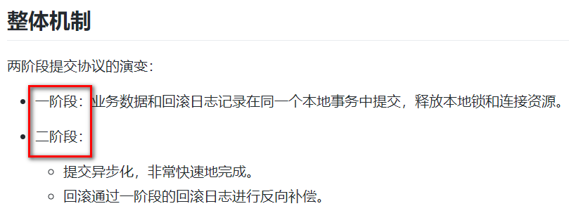

# 第六章 Seata之原理简介

## 6.1 再看TC/TM/RM三大组件

## 6.2 分布式事务的执行流程

-   TM开启分布式事务(TM向TC注册全局事务记录)
-   换业务场景，编排数据库，服务等事务内资源（RM向TC汇报资源准备状态）
-   TM结束分布式事务，事务一阶段结束（TM通知TC提交/回滚分布式事务）
-   TC汇总事务信息，决定分布式事务是提交还是回滚
-   TC通知所有RM提交/回滚资源，事务二阶段结束。

## 6.3 AT模式如何做到对业务的无侵入

### 6.3.1 一阶段加载

-   在一阶段，Seata会拦截"业务SQL"
    -   1.解析SQL语义，找到“业务SQL”要更新的业务数据，在业务数据被更新前，将其保存成“before image”
    -   2.执行"业务SQL"更新业务数据，在业务数据更新之后，
    -   3.其保存成“after image”，最后生成行锁。
-   以上操作全部在一个数据库事务内完成，这样保证了一阶段操作的原子性。

### 6.3.2 二阶段提交

-   二阶段如果顺利提交的话，因为“业务SQL”在一阶段已经提交至数据库，所以Seata框架只需将一阶段保存的快照数据和行锁删掉，完成数据清理即可。

### 6.3.3 二阶段回滚

二阶段如果是回滚的话，Seata就需要回滚一阶段执行的“业务SQL”,还原业务数据。

回滚方式便是用“before image”还原业务数据；但在还原前要首先校验脏写，对比“数据库当前业务数据”和“after image”,如果两份数据完全一致就说明没有脏写，可以还原业务数据，如果不一致就说明有脏写，出现脏写就需要转人工处理。

