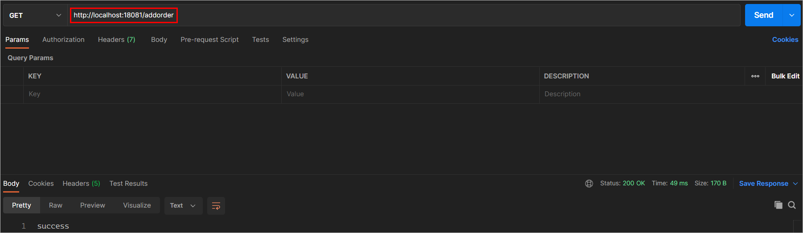

# 分布式事务解决方案-Seata

# 1 事务回顾

## 1.1 事务概述

概述：就是由多个操作组成的一个逻辑单元，组成这个逻辑单元的多个操作要么都成功要么都失败。

作用：保证数据的一致性

举例：转账

A 1000

B 1000

需求：A需要给B转账100

A - 100 = 900

B + 100 = 1100

## 1.2 ACID四大特性

**A：原子性(Atomicity)**

一个事务(transaction)中的所有操作，要么全部完成，要么全部不完成，不会结束在中间某个环节。事务在执行过程中发生错误，会被回滚

（Rollback）到事务开始前的状态，就像这个事务从来没有执行过一样。

**C：一致性(Consistency)**

事务的一致性指的是在一个事务执行之前和执行之后数据库都必须处于一致性状态。

如果事务成功地完成，那么系统中所有变化将正确地应用，系统处于有效状态。

如果在事务中出现错误，那么系统中的所有变化将自动地回滚，系统返回到原始状态。

**I：隔离性(Isolation)**

指的是在并发环境中，当不同的事务同时操纵相同的数据时，每个事务都有各自的完整数据空间。由并发事务所做的修改必须与任何其他并发事务所做

的修改隔离。

事务查看数据更新时，数据所处的状态要么是另一事务修改它之前的状态，要么是另一事务修改它之后的状态，事务不会查看到中间状态的数据。

**D：持久性(Durability)**

指的是只要事务成功结束，它对数据库所做的更新就必须保存下来。即使发生系统崩溃，重新启动数据库系统后，数据库还能恢复到事务成功结束时的

状态。

## 1.3 事务的并发问题

**脏读**：事务A读取了事务B更新的数据，事务B未提交并回滚数据，那么A读取到的数据是脏数据

**不可重复读**：事务 A 多次读取同一数据，事务 B 在事务A多次读取的过程中，对数据作了**更新并提交**，导致事务A多次读取同一数据时，结果不一

致。

**幻读**：一个事务读取到了另外一个事务插入的数据，就好像发生了幻觉一样，这就叫幻读。

小结：不可重复读的和幻读很容易混淆，不可重复读侧重于修改，幻读侧重于新增或删除。

## 1.4 事务隔离级别

针对并发事务所带来的问题，要想解决就需要使用到事务的隔离级别。

常见的事务隔离级别和解决的问题的对应关系表如下所示：


Mysql默认的事务隔离级别为**repeatable-read**，可以通过如下的语句进行查询：

```sql
select @@tx_isolation ;
```

## 1.5 事务传播行为

概述：指的就是当一个方法被另一个方法调用时，这个方法对事务的态度。

例如：methodA事务方法调用methodB事务方法时，methodB是继续在调用者methodA的事务中运行呢，还是为自己开启一个新事务运行，这就是由

methodB的事务传播行为决定的。

Spring定义了七种传播行为：


# 2 分布式事务概述

## 2.1 本地事务简介

本地事务也称为**数据库事务**或**传统事务**（相对于分布式事务而言）。这一类事务是基于**单个服务单一数据库**访问的事务。

举例：电商系统的下单业务(生成订单、扣减库存、扣减余额)


对应的伪代码：

 

## 2.2 分布式事务简介

概述：分布式事务指的是组成业务逻辑单元的多个操作位于**不同的服务**上或者访问**不同的数据库节点**，分布式事务需要保证这些操作要么全部成功，

要么全部失败。

如下图所示：

 

简单的说：分布式事务就是为了保证不同数据库的数据一致性。

对应的伪代码：

 

## 2.3 分布式事务问题

我们通过一个案例来演示分布式事务的问题：

> 1、数据准备

导入课程资料中的如下数据库脚本：

 

> 2、导入课前资料提供的微服务

01-不添加Seata\fescar-parent

 

导入完毕以后的微服务结果如下所示：

 

工程介绍：

fescar-parent： 父工程，负责管理项目依赖

* fescar-business：业务服务，提供整个业务操作的入口接口
* fescar-item：库存微服务
* fescar-order：订单微服务
* fescar-user：账户微服务
* fescar-api：提供fegin接口，用于实现远程调用

服务之间的调用流程说明：

 

**注意：**

1、更改每一个服务对应的数据库连接地址

2、每一个微服务都需要注册到注册中心中，在fescar-api的bootstrap.yml文件中更改注册中心地址

3、数据库中的undo_log表不要删除，后期seat框架的AT模式需要进行使用

> 3、nacos环境准备

nacos的配置做持久化处理：

1、nacos-server-1.4.2\nacos\conf目录下找到sql脚本**nacos-mysql.sql**执行脚本

2、nacos-server-1.4.2\nacos\conf目录下找到application.properties

```properties
spring.datasource.platform=mysql

db.num=1
db.url.0=jdbc:mysql://localhost:3306/nacos_config?characterEncoding=utf8&connectTimeout=1000&socketTimeout=3000&autoReconnect=true
db.user=root
db.password=1234
```

4、启动测试nacos、启动微服务进行测试

通过postman进行测试，测试地址：http://localhost:18081/addorder

**正常测试**：



查看数据库表变化：订单生成、库存扣减、账户余额扣减、business日志数据记录


**异常测试**：

将fescar-user服务中的UserInfoServiceImpl#decrMoney方法中的如下注释放开，手动模拟异常。


查询数据库表变化：订单生成、库存扣减但是账户余额没有扣减并且business日志数据没有记录。

## 2.4 常见应用场景

1、电商系统中的下单扣库存

电商系统中，***\*订单系统\****和***\*库存系统\****是两个系统，一次下单的操作由两个系统协同完成

2、金融系统中的银行卡充值

在金融系统中通过银行卡向平台充值需要通过***\*银行系统\****和***\*金融系统\****协同完成。

3、教育系统中下单选课业务

在线教育系统中，用户购买课程，下单支付成功后学生选课成功，此事务由***\*订单系统\****和***\*选课系统\****协同完成。

# 3 理论基础

解决分布式事务问题，需要一些分布式系统的基础知识作为理论指导。

## 3.1 CAP定理

### 3.1.1 CAP定理结论

1998年，加州大学的计算机科学家 Eric Brewer 提出，分布式系统有三个指标。

1、Consistency（一致性）

2、Availability（可用性）

3、Partition tolerance （分区容错性）

  

它们的第一个字母分别是 C、A、P。

Eric Brewer 说，**这三个指标不可能同时做到**。这个结论就叫做 CAP 定理。

### 3.1.2 一致性

Consistency（一致性）：用户访问分布式系统中的任意节点，得到的数据必须一致。

比如现在包含两个节点，其中的初始数据是一致的：

 

当我们修改其中一个节点的数据时，两者的数据产生了差异：

 

要想保住一致性，就必须实现node01 到 node02的数据同步：

 

### 3.1.2 可用性

Availability （可用性）：用户访问集群中的任意健康节点，必须能得到响应，而不是超时或拒绝。

如图，有三个节点的集群，访问任何一个都可以及时得到响应：

 

当有部分节点因为网络故障或其它原因无法访问时，代表节点不可用：

 

### 3.1.3 分区容错

**Partition（分区）**：因为网络故障或其它原因导致分布式系统中的部分节点与其它节点失去连接，形成独立分区。

 

**Tolerance（容错）**：在集群出现分区时，整个系统也要持续对外提供服务


在分布式系统中，系统间的网络不能100%保证健康，一定会有故障的时候，而服务有必须对外保证服务。因此Partition Tolerance不可避免。当**节点**

**接收到新的数据变更时**，就会出现问题了：

 

如果此时要保证**一致性**，就必须等待网络恢复，完成数据同步后，整个集群才对外提供服务，服务处于阻塞状态，不可用。

如果此时要保证**可用性**，就不能等待网络恢复，那node01、node02与node03之间就会出现数据不一致。

也就是说，在P一定会出现的情况下，A和C之间只能实现一个。

**注意：**在CAP定理中一致性强调的是**强一致性**

## 3.2 BASE理论

BASE理论是对CAP的一种补充，包含三个思想：

1、**Basically Available** **（基本可用）**：分布式系统在出现故障时，允许损失部分可用性，即保证核心可用。

2、**Soft State（软状态）：**在一定时间内，允许出现中间状态，比如临时的不一致状态。

3、**Eventually Consistent（最终一致性）**：虽然无法保证强一致性，但是在软状态结束后，最终达到数据一致。

# 4 初识Seata

## 4.1 Seata简介

Seata是 2019 年 1 月份蚂蚁金服和阿里巴巴共同开源的分布式事务解决方案。致力于提供高性能和简单易用的分布式事务服务，为用户打造一站式的

分布式解决方案。

官网地址：http://seata.io/，其中的文档、播客中提供了大量的使用说明、源码分析。

 

## 4.2 Seata架构

基础概念：

分支事务：每一个业务系统的事务

全局事务：多个有关联的各个分支事务组成在一起


Seata事务管理中有三个重要的角色：

1、**TC (Transaction Coordinator) -** **事务协调者：**维护全局和分支事务的状态，协调全局事务提交或回滚。

2、**TM (Transaction Manager) -** **事务管理器：**定义全局事务的范围、开始全局事务、提交或回滚全局事务。

3、**RM (Resource Manager) -** **资源管理器：**管理分支事务处理的资源，与TC交谈以注册分支事务和报告分支事务的状态，并驱动分支事务提交或

回滚。


工作流程如下图所示：

 

基本流程介绍：

1、由TM注册全局事务到TC服务器

2、TC服务器会返回xid(本次全局事务的id)，这个xid会随着微服务的调用一并传递下去

3、执行分支事务，此时就需要通过RM服务器注册分支事务到TC服务器

4、执行业务SQL，并有RM服务器报告每一个分支事务的执行状态到TC服务器

5、当全局事务结束以后，TC会进行分支事务状态的统计，然后在通过RM服务器进行分支事务的回滚或者提交


Seata基于上述架构提供了四种不同的分布式事务解决方案：

**1、XA模式：强一致性分阶段事务模式，牺牲了一定的可用性，无业务侵入**

**2、AT模式：最终一致的分阶段事务模式，无业务侵入，也是Seata的默认模式**

**3、TCC模式：最终一致的分阶段事务模式，有业务侵入**

4、SAGA模式：长事务模式，有业务侵入

无论哪种方案，都离不开TC，也就是事务的协调者。


# 5 XA模式

## 5.1 部署TC服务

具体步骤如下所示：

### 5.1.1 下载

首先我们要下载seata-server包，地址在[http](http://seata.io/zh-cn/blog/download.html)[://seata.io/zh-cn/blog/download](http://seata.io/zh-cn/blog/download.html)[.](http://seata.io/zh-cn/blog/download.html)[html](http://seata.io/zh-cn/blog/download.html) 

当然，课程资料也准备好了：

 

### 5.1.2 安装

在非中文目录解压缩这个zip包，其目录结构如下：

 

### 5.1.3 修改配置

这个TC服务在运行的时候需要一些配置信息，我们可以将这些配置信息交由Nacos进行统一管理。并且需要将TC服务注册到Nacos，后期微服务就可

以从Nacos中获取TC服务器的地址信息完成事务的控制。


修改conf目录下的registry.conf文件：

 


内容如下：

```json
registry {
    
  # tc服务的注册中心类，这里选择nacos，也可以是eureka、zookeeper等
  type = "nacos"

  nacos {
    # seata tc 服务注册到 nacos的服务名称，可以自定义
    application = "seata-tc-server"
    serverAddr = "127.0.0.1:8848"
    group = "SEATA_GROUP"
    namespace = ""
    cluster = "default"
    username = "nacos"
    password = "nacos"
  }
  
}

config {
  # 读取tc服务端的配置文件的方式，这里是从nacos配置中心读取，这样如果tc是集群，可以共享配置
  type = "nacos"
  # 配置nacos地址等信息
  nacos {
    serverAddr = "127.0.0.1:8848"
    namespace = ""
    group = "SEATA_GROUP"
    username = "nacos"
    password = "nacos"
    dataId = "seataServer.properties"
  }

}
```

### 5.1.4 Nacos添加配置

在Nacos中添加TC服务所需要的配置文件seataServer.properties。

格式如下：

 

配置内容如下：

```properties
# 指定一个事务组
service.vgroupMapping.my_test_tx_group=default

# 数据存储方式，db代表数据库
store.mode=db
store.db.datasource=druid
store.db.dbType=mysql
store.db.driverClassName=com.mysql.jdbc.Driver
store.db.url=jdbc:mysql://127.0.0.1:3306/seata?useUnicode=true&rewriteBatchedStatements=true
store.db.user=root
store.db.password=1234
store.db.minConn=5
store.db.maxConn=30
store.db.globalTable=global_table
store.db.branchTable=branch_table
store.db.queryLimit=100
store.db.lockTable=lock_table
store.db.maxWait=5000

# 事务、日志等配置
server.recovery.committingRetryPeriod=1000
server.recovery.asynCommittingRetryPeriod=1000
server.recovery.rollbackingRetryPeriod=1000
server.recovery.timeoutRetryPeriod=1000
server.maxCommitRetryTimeout=-1
server.maxRollbackRetryTimeout=-1
server.rollbackRetryTimeoutUnlockEnable=false
server.undo.logSaveDays=7
server.undo.logDeletePeriod=86400000

# 客户端与服务端传输方式
transport.serialization=seata
transport.compressor=none

# 关闭metrics功能，提高性能
metrics.enabled=false
metrics.registryType=compact
metrics.exporterList=prometheus
metrics.exporterPrometheusPort=9898
```

注意：其中的数据库地址、用户名、密码都需要修改成你自己的数据库信息。

### 5.1.5 创建数据库表

特别注意：tc服务在管理分布式事务时，需要记录事务相关数据到数据库中，你需要提前创建好这些表。

新建一个名为seata的数据库，运行课程资料提供的sql文件：

 

### 5.1.6 启动TC服务

进入bin目录，运行其中的seata-server.bat即可：

 

启动成功后，seata-server应该已经注册到nacos注册中心了。


打开浏览器，访问nacos地址：http://localhost:8848，然后进入服务列表页面，可以看到seata-tc-server的信息：

 

## 5.2 微服务集成seata

### 5.2.1 引入依赖

首先，我们需要在微服务(fescar-api)中引入seata依赖：

```xml
<dependency>
    <groupId>com.alibaba.cloud</groupId>
    <artifactId>spring-cloud-starter-alibaba-seata</artifactId>
    <exclusions>
        <!--版本较低，1.3.0，因此排除-->
        <exclusion>
            <artifactId>seata-spring-boot-starter</artifactId>
            <groupId>io.seata</groupId>
        </exclusion>
    </exclusions>
</dependency>
<!--seata starter 采用1.4.2版本-->
<dependency>
    <groupId>io.seata</groupId>
    <artifactId>seata-spring-boot-starter</artifactId>
    <version>${seata.version}</version>
</dependency>
```

### 5.2.2 添加配置信息

在fescar-api服务的bootstrap.yml文件中添加如下配置信息：

```yaml
seata:
  registry:   # TC服务注册中心的配置，微服务根据这些信息去注册中心获取tc服务地址
    type: nacos
    nacos:    # tc配置
      server-addr: 127.0.0.1:8848
      namespace: ""
      group: SEATA_GROUP
      application: seata-server       # tc服务在nacos中的服务名称
  tx-service-group: my_test_tx_group  # 配置的事务组
  service:
    vgroup-mapping:
      my_test_tx_group: default       # 配置事务组所对应的值
  data-source-proxy-mode: XA          # 使用Seata框架的XA模式，默认是AT模式    
```

### 5.2.3 @GlobalTransactional

在BusinessServiceImpl的add方法上添加**@GlobalTransactional**注解，声明当前方法是一个全局事务方法。

### 5.2.4 重启微服务测试

重启微服务，观察TC服务器控制台日志输出：


4个微服务已经集成到TC服务器中了。

## 5.4 XA原理

### 5.4.1 XA简介

XA 规范 是 X/Open 组织定义的分布式事务处理（DTP，Distributed Transaction Processing）标准。

XA 规范 描述了**全局的事务管理器与局部的资源管理器之间的接口**。 XA规范的目的是允许的多个资源（如数据库，应用服务器，消息队列等）在

同一事务中访问，这样可以使 ACID 属性跨越应用程序而保持有效。


XA 规范 使用**两阶段提交**（2PC，Two-Phase Commit）来保证所有资源同时提交或回滚任何特定的事务。

XA 规范 在上世纪 90 年代初就被提出。目前，几乎所有主流的数据库(MySQL、Oracle)都对 XA 规范 提供了支持。

### 5.4.2 工作原理

在 Seata 定义的分布式事务框架内，利用事务资源（数据库、消息服务等）对 XA 协议的支持，以 XA 协议的机制来管理分支事务的一种 事务模式。

 

工作流程如下所示：

RM一阶段的工作：

​	① 注册分支事务到TC

​	② **执行分支业务sql但不提交**

​	③ 报告执行状态到TC

TC二阶段的工作：

- TC检测各分支事务执行状态

  a.如果都成功，通知所有RM提交事务

  b.如果有失败，通知所有RM回滚事务

RM二阶段的工作：

- 接收TC指令，提交或回滚事务

### 5.4.3 优缺点

XA模式的优点是什么？

- 事务的强一致性，满足ACID原则。
- 常用数据库都支持，实现简单，并且没有代码侵入

XA模式的缺点是什么？

- 因为一阶段需要锁定数据库资源，等待二阶段结束才释放，性能较差
- 依赖关系型数据库实现事务

# 6 AT模式

AT模式同样是分阶段提交的事务模型，不过缺弥补了XA模型中资源锁定周期过长的缺陷。

## 6.1 AT实战

更改fescar-api项目中的bootstrap.yml文件，如下所示：

```yml
seata:
  data-source-proxy-mode: AT          # 使用Seata框架的AT模式，默认是AT模式
```

重启服务进行测试。

## 6.2 原理介绍

AT模式的工作流程如下图所示：

 

工作流程如下所示：

阶段一RM的工作：

- 注册分支事务
- 记录undo-log（数据快照：记录某一时刻数据的状态）
- **执行业务sql并提交**
- 报告事务状态

阶段二提交时RM的工作：

- 删除undo-log即可

阶段二回滚时RM的工作：

- 根据undo-log恢复数据到更新前


## 6.3 流程梳理

我们用一个真实的业务来梳理下AT模式的原理。

比如，现在有一个数据库表，记录用户余额：

| **id** | **money** |
| ------ | --------- |
| 1      | 100       |

其中一个分支业务要执行的SQL为：

```sql
update tb_account set money = money - 10 where id = 1
```


AT模式下，当前分支事务执行流程如下：

一阶段：

1）TM发起并注册全局事务到TC

2）TM调用分支事务

3）分支事务准备执行业务SQL

4）RM拦截业务SQL，根据where条件查询原始数据，形成快照。

```json
{
    "id": 1, "money": 100
}
```

5）RM执行业务SQL，提交本地事务，释放数据库锁。此时 `money = 90`

6）RM报告本地事务状态给TC


二阶段：

1）TM通知TC事务结束

2）TC检查分支事务状态

​	 a）如果都成功，则立即删除快照

​	 b）如果有分支事务失败，需要回滚。读取快照数据（`{"id": 1, "money": 100}`），将快照恢复到数据库。此时数据库再次恢复为100

## 6.4 AT与XA的区别

简述AT模式与XA模式最大的区别是什么？

1、XA模式一阶段不提交事务，锁定资源；AT模式一阶段直接提交，不锁定资源。

2、XA模式依赖数据库机制实现回滚；AT模式利用数据快照实现数据回滚。

3、XA模式强一致；AT模式最终一致

## 6.5 丢失更新问题

### 6.5.1 问题介绍

在多线程并发访问AT模式的分布式事务时，有可能出现丢失更新问题，如图：


### 6.5.2 全局锁

解决思路就是引入了**全局锁**的概念。在释放DB锁之前，先拿到全局锁。避免同一时刻有另外一个事务来操作当前数据。

 

**思考问题**：每一个微服务中所提供的undo_log表的作用、以及seata数据库中所对应的三张表的作用分表是什么?

# 7 TCC模式

## 7.1 TCC模式概述

TCC模式与AT模式非常相似，每阶段都是独立事务，不同的是TCC通过**人工编码**来实现数据恢复。需要实现三个方法：

1、Try：资源的检测和预留； 

2、Confirm：完成资源操作业务；要求 Try 成功 Confirm 一定要能成功。

3、Cancel：预留资源释放，可以理解为try的反向操作。

## 7.2 流程分析

举例，一个扣减用户余额的业务。假设账户A原来余额是100，需要余额扣减30元。

**阶段一（ Try ）**：检查余额是否充足，如果充足则冻结金额增加30元，可用余额扣除30

初识余额：

  

余额充足，可以冻结：

 

此时，总金额 = 冻结金额 + 可用金额，数量依然是100不变。事务直接提交无需等待其它事务。


**阶段二（Confirm)**：假如要提交（Confirm），则冻结金额扣减30

确认可以提交，不过之前可用金额已经扣减过了，这里只要清除冻结金额就好了：


此时，总金额 = 冻结金额 + 可用金额 = 0 + 70  = 70元


**阶段二(Canncel)**：如果要回滚（Cancel），则冻结金额扣减30，可用余额增加30

需要回滚，那么就要释放冻结金额，恢复可用金额：

 

## 7.3 原理介绍

工作模式如下图所示：

 

## 7.4 优缺点

TCC模式的每个阶段是做什么的？

- Try：资源检查和预留
- Confirm：业务执行和提交
- Cancel：预留资源的释放

TCC的优点是什么？

- 一阶段完成直接提交事务，释放数据库资源，性能好
- 相比AT模型，无需生成快照，无需使用全局锁，**性能最强**
- **不依赖数据库事务**，而是依赖补偿操作，可以用于非事务型数据库

TCC的缺点是什么？

- 有代码侵入，需要人为编写try、Confirm和Cancel接口，太麻烦
- 软状态，事务是最终一致
- 需要考虑Confirm和Cancel的失败情况，做好幂等处理

## 7.5 代码实现

### 7.5.1 数据库表创建

在fescar-user数据库中定义一张用于进行资源预留的表：

```SQL
CREATE TABLE `account_freeze_info` (
  `xid` varchar(128) NOT NULL,
  `userId` varchar(255) DEFAULT NULL COMMENT '用户id',
  `freezeMoney` int(11) DEFAULT NULL COMMENT '冻结金额',
  `state` int(1) DEFAULT NULL COMMENT '事务状态，0:try，1:confirm，2:cancel',
  PRIMARY KEY (`xid`)
) ENGINE=InnoDB DEFAULT CHARSET=utf8;
```

字段说明：

1、xid：是全局事务id

2、freeze_money：用来记录用户冻结金额

3、state：用来记录事务状态

### 7.5.2 创建实体类

```java
@Data
@Table(name="account_freeze_info")
public class AccountFreeze {

    @Id
    @Column(name = "xid")
    private String xid ;

    @Column(name = "userId")
    private String userId ;

    @Column(name = "freezeMoney")
    private Integer freezeMoney ;

    @Column(name = "state")
    private Integer state ;

}
```

### 7.5.3 编写Mapper接口

```java
public interface AccountFreezeMapper extends Mapper<AccountFreeze> {
    
}
```

### 7.5.4 TCC接口

```java
@LocalTCC
public interface AccountTCCService {

    // 指定try方法以及confirm方法和cancel方法名称   @BusinessActionContextParameter用于将try方法参数传递给其他两个方法
    @TwoPhaseBusinessAction(name = "deduct", commitMethod = "confirm", rollbackMethod = "cancel")
    void deduct(@BusinessActionContextParameter(paramName = "account") String account,
                @BusinessActionContextParameter(paramName = "money")int money);

    boolean confirm(BusinessActionContext ctx);
    boolean cancel(BusinessActionContext ctx);

}
```

### 7.5.5 TCC接口实现类

```java
@Service
public class AccountTCCServiceImpl implements AccountTCCService {

    @Autowired
    private AccountFreezeMapper accountFreezeMapper ;

    @Autowired
    private UserInfoMapper userInfoMapper ;

    @Override
    public void deduct(String account, int money) {

        // 可用余额进行校验
        UserInfo userInfo = userInfoMapper.selectByPrimaryKey(account);
        if(userInfo.getMoney() < money) {
            throw new RuntimeException("账户余额不足") ;
        }

        // 扣减可用余额
        userInfo.setMoney(userInfo.getMoney() - money);
        userInfoMapper.updateByPrimaryKey(userInfo);

        // 记录冻结金额
        AccountFreeze accountFreeze = new AccountFreeze() ;
        accountFreeze.setFreezeMoney(money);
        accountFreeze.setState(0);
        accountFreeze.setUserId(account);

        // 获取事务id
        String xid = RootContext.getXID();
        accountFreeze.setXid(xid);
        accountFreezeMapper.insert(accountFreeze) ;

    }

    @Override
    public boolean confirm(BusinessActionContext ctx) {
        String xid = ctx.getXid();                                  // 获取事务的id
        int count = accountFreezeMapper.deleteByPrimaryKey(xid);    // 删除冻结记录
        return count == 1;
    }

    @Override
    public boolean cancel(BusinessActionContext ctx) {

        // 查询冻结记录
        String xid = ctx.getXid();
        AccountFreeze accountFreeze = accountFreezeMapper.selectByPrimaryKey(xid);
        
        if(accountFreeze == null) {         // 如果账户余额不足，那么此时没有执行try操作，就不用进行回滚
            return true ;
        }

        // 恢复可用余额
        String userId = accountFreeze.getUserId();
        UserInfo userInfo = userInfoMapper.selectByPrimaryKey(userId);
        userInfo.setMoney(userInfo.getMoney() + accountFreeze.getFreezeMoney());
        userInfoMapper.updateByPrimaryKey(userInfo) ;

        // 将冻结金额清零，状态更改为cancel
        accountFreeze.setFreezeMoney(0);
        accountFreeze.setState(2);
        int count = accountFreezeMapper.updateByPrimaryKey(accountFreeze);
        return count == 1;
        
    }

}
```

### 7.5.6 修改UserInfoController

在UserInfoController中注入AccountTCCService接口，完成业务处理：

 

# 8 其他解决方案

## 8.1 本地消息表

本地消息表这个方案最初是ebay架构师 Dan Pritchett 在 2008 年发表给 ACM 的文章。设计核心是将需要分布式处理的任务通过消息的方式来异步

确保执行。

如下所示：


**执行流程**：

1、订单系统，添加一条订单和一条消息(订单id、商品id、状态)，**在一个事务里提交**

2、订单系统，使用定时任务轮询查询状态为**未同步**的消息表，发送到 MQ，如果发送失败，就重试发送

3、库存系统，接收 MQ 消息，修改库存表，需要**保证幂等**操作

4、如果修改成功，调用 RPC 接口修改订单系统消息表的状态为已完成或者直接删除这条消息

5、如果修改失败，可以不做处理，等待重试


其他说明：

1、订单系统中的消息有可能由于业务问题会一直**重复发送**，所以为了避免这种情况可以记录一下发送次数，**当达到次数限制之后报警**，人工接入处理；库存系统需要保证幂等，避免同一条消息被多次消费造成数据一致。

2、本地消息表这种方案实现了**最终一致性**，需要在业务系统里增加消息表，业务逻辑中多一次插入的 DB 操作，所以性能会有损耗，而且最终一致性的间隔主要由定时任务的间隔时间决定。

优缺点：

优点： 一种非常经典的实现，避免了分布式事务，实现了最终一致性。

缺点： 

1、消息表会耦合到业务系统中，如果没有封装好的解决方案，会有很多杂活需要处理

2、本地消息表方案需要写入消息表中，如果在高并发的场景下会进行大量的磁盘IO，因此该方案不适用于高并发场景。


## 8.2 MQ事务消息

该方案基于本地消息表进行优化，不使用本地消息表，而是基于MQ，比如阿里的RocketMQ就支持消息事务。具体架构如下所示：


**具体流程如下**

1、Producer 向 MQ 服务器发送消息 , MQ Server 将消息状态标记为 Prepared（预备状态），注意此时这条消息消费者（MQ订阅方）是无法消费到的。

2、MQ 服务器收到消息并持久化成功之后，会向Producer 确认首次消息发送成功，此时消息处于 half message(半消息) 状态，**并未发送给对应的** 

**Consumer** 。

3、Producer 开始执行本地事务逻辑 , 通过本地数据库事务控制。

4、根据事务执行结果，Producer 向 MQ 服务器提交二次确认 ( commit 或者 rollback) 。MQ Server 收到 Commit 状态则将半消息标记为可投递，

Consumer 最终将收到该消息；MQ Server 收到 Rollback 状态则删除半消息，Consumer 将不会接受该消息。

5、在断网或者应用重启的情况下，二次确认未成功的发给 MQ Server，MQ Server 会主动向 Producer 启动消息回查

6、Producer 根据事务执行结果，对消息回查返回对应的结果。

7、Mq Server根据返回结果，决定继续投递消息或者丢弃消息(重复第4步操作)。

注意 1-4 为事务消息的发送过程， 5-6 为事务消息的回查过程。


优缺点：

**优点：** 实现了最终一致性，不需要依赖本地数据库事务。

**缺点：** 目前主流MQ中只有RocketMQ支持事务消息。


